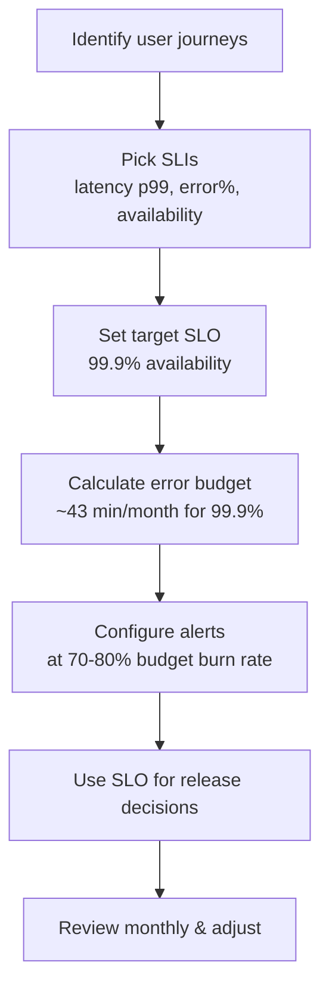

# SRE Fundamentals & Core Concepts

> Reference sources: Google SRE Book, industry SRE standards, public best practices

---

## What is SRE?

Site Reliability Engineering (SRE) is a discipline that treats operations as a software engineering problem. It combines systems engineering, software engineering, and operations practices to build and maintain large-scale, reliable systems with high velocity.

**Core principle**: Reliability is a feature, not an afterthought. SRE explicitly balances development velocity with system stability.

## What is it used for?

- **Scaling reliability at scale**: Managing systems with millions of users/transactions
- **Reducing operational toil**: Automating repetitive manual work (runbooks, escalations, deployments)
- **Defining reliability targets**: Quantifying what "reliable" means via SLOs/SLIs
- **Incident response framework**: Structured, blameless incident management
- **Continuous improvement**: Using postmortems and observability to evolve reliability

## Why is it important?

- Large systems have inherent failures; SRE provides a disciplined approach to managing them
- Manual operations become bottlenecks at scale; SRE prioritizes automation
- Developers and operations teams often have conflicting incentives; SRE bridges the gap
- Unplanned downtime costs millions; SRE practices measurably reduce MTTR and outage frequency
- Culture: SRE teams often establish blameless postmortem culture across organizations

---

## Core SRE Philosophy

### 1) Embrace Risk
- **Perfect reliability is impossible and uneconomical.**
- Not all outages are bad; some risks enable faster feature development.
- Use error budgets to quantify acceptable risk.

### 2) Error Budgets (from SLOs)
- Once you define an SLO (e.g., 99.9% uptime), the error budget = acceptable downtime.
- $\text{Error Budget} = (1 - \text{SLO}) \times \text{time period}$
- Example: 99.9% SLO for 1 month ≈ 43 minutes of acceptable downtime
- If error budget remains, deployment pace can accelerate; if depleted, focus on stability

### 3) Eliminate Toil
- **Toil**: Manual, repetitive, reactive operational work (tickets, escalations, redeploying the same config).
- SRE goal: Keep toil < 50% of time; invest the rest in automation and capability-building.
- Every hours spent on toil is an hour not spent improving reliability.

### 4) Measure & Monitor
- Reliability is only achievable if you can observe it.
- Measure what matters: SLOs, golden signals (latency, traffic, errors, saturation).
- Avoid vanity metrics; focus on customer-visible reliability.

### 5) Blameless Incident Culture
- Incidents are learning opportunities, not failures to punish.
- Focus postmortems on systems and processes, not individuals.
- Psychological safety → faster incident reporting → quicker mitigation.

---

## SLO, SLI, SLA Framework

### SLI (Service Level Indicator)
**Metric** that measures a specific aspect of reliability.
- Examples: HTTP success rate, query latency p99, data freshness
- Derived from user-visible behavior (request completion, error rate, etc.)

### SLO (Service Level Objective)
**Target** for an SLI over a time window.
- Example: 99.9% of requests complete in < 200ms
- Example: 99.95% successful HTTP responses over 1 month
- Negotiated between product/business and SRE teams

### SLA (Service Level Agreement)
**Contract** with consequences (refunds, penalties) if SLO is missed.
- Not all systems need SLAs; internal services often use SLOs only.
- SLA is usually stricter than SLO (buffer for headroom).

### Workflow: Defining SLOs



---

## Toil Measurement & Automation

### Toil Classification
| Type | Example | Automatable? |
|---|---|---|
| Repetitive manual escalation | "Restart service when X metric spikes" | Yes |
| Reactive firefighting | Unplanned incident response | Partially |
| No learning value | Redeploying the same config | Yes |
| Predictable operations | Weekly capacity review | Yes |
| Complex troubleshooting | Debugging novel prod issue | No |

### Toil Reduction Process
1. **Track**: Log all operational work for 1-2 weeks.
2. **Categorize**: Identify top toil contributors.
3. **Automate**: Build tooling to eliminate or reduce toil.
4. **Monitor**: Measure automation effectiveness.

---

## SRE vs DevOps vs Platform Engineering

| Aspect | SRE | DevOps | Platform Engineering |
|---|---|---|---|
| **Focus** | Reliability of live services | Culture + tooling for dev velocity | Building developer platforms |
| **Scope** | Incident response, monitoring, capacity | CI/CD, infra-as-code, automation | Self-service infra, internal tools |
| **Goal** | SLO achievement | Reduce deployment friction | Developer experience |
| **Time allocation** | Toil reduction, on-call | Bridging dev-ops gap | Platform adoption, usability |

---

## Monitoring Philosophy in SRE

### The Four Golden Signals
Track these to understand system health:

1. **Latency**: Request completion time (measure p50, p99, p99.9)
2. **Traffic**: Request volume (RPS, concurrent connections, throughput)
3. **Errors**: Request failure rate (HTTP 5xx, failed RPC calls, timeouts)
4. **Saturation**: Resource utilization (CPU %, memory %, disk %, queue length)

### RED vs USE Metrics

**RED** (Request-driven services):
- Rate: requests per second
- Errors: failed request rate
- Duration: request latency (p99)

**USE** (Resources):
- Utilization: % of resource in use
- Saturation: queue depth, wait time
- Errors: error count on resource

---

## Incident Classification (Severity Levels)

| Severity | Impact | Response Time | Example |
|---|---|---|---|
| **SEV-1** | Critical, customer-facing | Immediate (15 min) | Complete service outage, major data loss |
| **SEV-2** | Major degradation | 30 min | 50% error rate, significant latency increase |
| **SEV-3** | Minor issue | 2-4 hours | Single feature broken, non-urgent fix |
| **SEV-4** | Trivial | Next business day | Documentation typo, minor perf issue |

---

## SRE Team Structure

### Typical SRE Team Roles
- **On-Call Engineer**: Responds to incidents; owns SLO achievement
- **SRE Manager**: Staffing, postmortem culture, escalations
- **Platform/Infrastructure SRE**: Builds internal tools, improves deployment velocity
- **SRE Lead/Principal**: Strategy, SLO targets, cross-team reliability culture

### On-Call Rotation
- Typical: 1 primary on-call, 1 backup
- Duration: 1 week at a time
- Handoff at fixed time (e.g., Monday 9am)
- Primary handles all alerts; backup escalates if needed

---

## Blameless Postmortem Template

```markdown
# Postmortem: [Service] Outage on [Date]

## Summary
Brief description of what happened and user impact.

## Timeline
- HH:MM: First alert fired
- HH:MM: On-call acknowledged, started investigation
- HH:MM: Root cause identified
- HH:MM: Mitigation deployed
- HH:MM: Service recovered

## Root Cause
Why the system failed. Focus on conditions, not individual mistakes.

## Impact
Duration, user count affected, financial impact estimate.

## Contributing Factors
System design choices, missing monitoring, runbook gaps.

## Action Items
- [ ] Fix #1 (Technical improvement)
- [ ] Monitoring gap fix (Alert when X)
- [ ] Runbook update (Clarify troubleshooting step)

## What Went Well
What helped us recover quickly?

## What Could Have Gone Better
What slowed us down? What info was missing?
```

---

## Key Metrics Dashboard (Proposed)

| Metric | Target | Cadence |
|---|---|---|
| SLO Achievement (availability) | 99.9%+ | Monthly |
| MTTR (Mean Time to Recovery) | < 15 min for SEV-2 | Weekly |
| Toil % | < 50% | Quarterly |
| Incident count | Trend downward | Monthly |
| On-call burnout survey | Score > 3.5/5 | Quarterly |
| Post-incident action item closure | 100% | Ongoing |

---

## Quick Checklist: Building SRE Culture

- [ ] Define SLOs for critical services (involve product + engineering)
- [ ] Set up monitoring for the four golden signals
- [ ] Establish on-call rotation and escalation policy
- [ ] Run blameless postmortems for every SEV-1/2 incident
- [ ] Measure toil; prioritize automation of top contributors
- [ ] Publish SLO dashboards (visibility for entire team)
- [ ] Conduct quarterly reliability reviews (trend analysis)
- [ ] Train team on incident response playbooks

---

## Summary

SRE fundamentals provide a framework for building and operating reliable systems at scale. By defining clear SLOs, embracing error budgets, automating toil, measuring reliability, and fostering a blameless culture, organizations achieve both velocity and stability.

The remaining documents in this knowledge base detail how to operationalize these principles.
