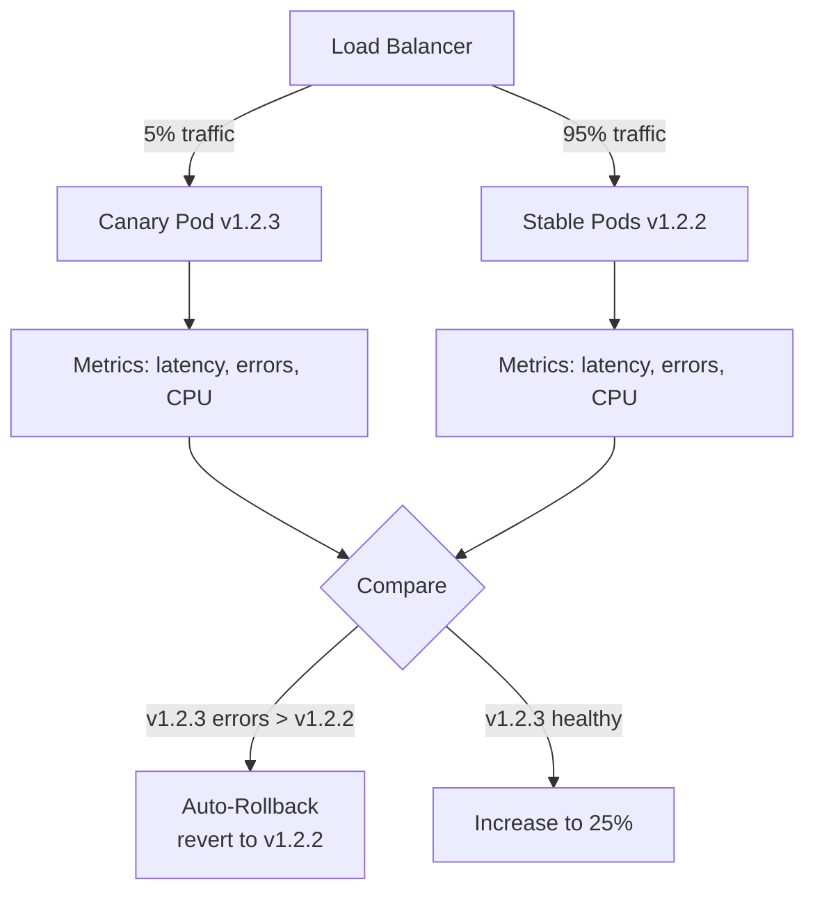
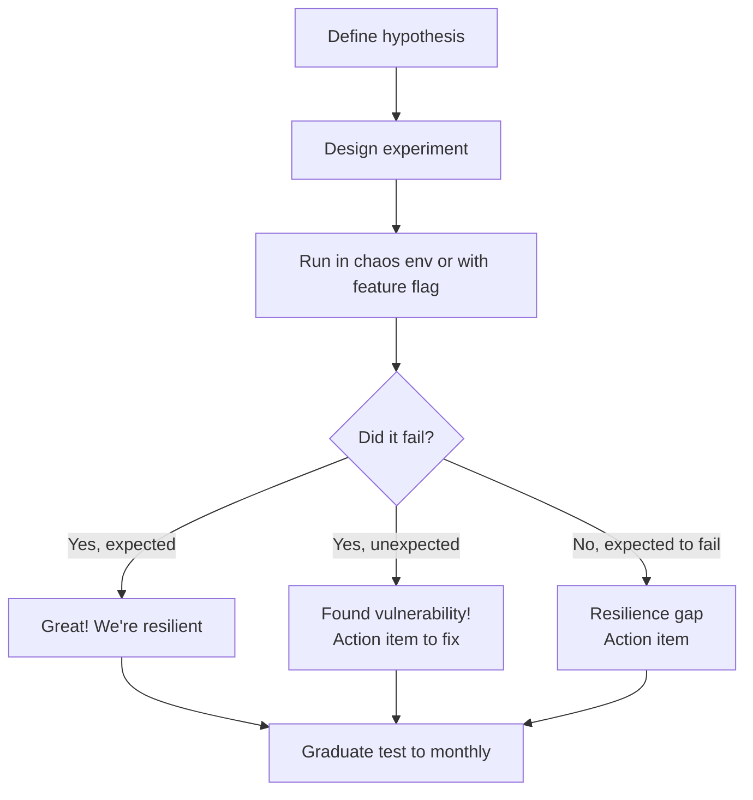

# Deployment & Reliability

> Reference sources: Google SRE Book, continuous deployment best practices, chaos engineering

---

## What is it?

Deployment & Reliability practices are techniques to safely release code changes to production with minimal risk of downtime or service degradation. This includes canary deployments, blue-green strategies, feature flags, load testing, and chaos engineering.

## What is it used for?

- **Reduce deployment risk**: Ship faster with confidence that bad changes are caught early
- **Minimize blast radius**: If something breaks, affect only a small subset of users
- **Quick rollback**: Revert bad changes in seconds without full redeployment
- **Validate reliability**: Use load/chaos tests to find issues before users do
- **Maintain SLO**: Safe deployment practices keep error budgets healthy

## Why is it important?

- 10-30% of production incidents are caused by deployments
- Fast, frequent deployments reduce risk better than rare, large deployments
- Without safe deployment practices, on-call becomes reactive firefighting
- Users trust services that deploy confidently; too many outages = churn
- Automation + monitoring = humans make better decisions, not more decisions

---

## Deployment Safety Culture

### Key Principle: Deployments Should Be Boring

**Culture expectation**: Deploying to production is routine, not stressful.

This requires:
1. **Automated testing** (unit, integration, end-to-end)
2. **Automated validation** (health checks, smoke tests post-deploy)
3. **Safe rollout strategies** (canary, blue-green)
4. **Quick rollback capability** (revert in < 2 minutes)
5. **Monitoring guardrails** (auto-rollback on error spike)

### Deployment Checklist

Before deploying:
- [ ] All tests passing (CI/CD green)
- [ ] Code reviewed and approved
- [ ] No ongoing incidents (error budget healthy)
- [ ] Team aware (Slack/calendar notification)
- [ ] Runbook prepared (if new feature/config)
- [ ] Rollback plan documented

During deployment:
- [ ] Monitoring dashboards open
- [ ] Team available for 30 min post-deploy
- [ ] Alert for anomalies enabled

After deployment:
- [ ] Metrics normal (latency, errors, traffic)
- [ ] No new Slack alerts
- [ ] Celebrate if successful!

---

## Canary Deployments

### Concept: Release to Small Percentage First

Instead of deploying to 100% of users instantly, roll out gradually:

```
T+0:00   Deploy canary: 5% of traffic → v1.2.3
T+5:00   Monitor: latency, errors, CPU same as v1.2.2?
T+15:00  Still good? Increase to 25%
T+30:00  Still good? Increase to 50%
T+45:00  Still good? Increase to 100%
T+60:00  Fully deployed. Rollback plan: Ready for 24 hours
```

### Canary Architecture



### Metrics to Watch During Canary

```
Baseline (v1.2.2):
- Latency p99: 150ms
- Error rate: 0.05%
- CPU: 45%

Canary (v1.2.3):
- Latency p99: 152ms (2% increase, acceptable)
- Error rate: 0.08% (60% increase, but low volume, investigate)
- CPU: 46%

Decision: Continue canary; monitor error rate closely
```

### Canary Rollback Trigger

If any of these are true:
- Error rate increase > 2x (e.g., 0.05% → 0.1%)
- Latency p99 increase > 50% (e.g., 150ms → 225ms)
- CPU usage spike > 30% unexpectedly
- Specific user reports or error patterns

Automatic action: **Revert to v1.2.2, drain canary pods**

---

## Blue-Green Deployments

### Concept: Keep Two Full Prod Environments

```
            Traffic Switch
                  ↓
User Traffic → Load Balancer
                  ↓
        ┌─────────┴─────────┐
        ↓                    ↓
    BLUE (v1.2.2)     GREEN (v1.2.3)
    Currently active   New version
    (100% traffic)     (dark, warming up)
```

### Blue-Green Workflow

1. **Pre-deployment**: GREEN environment is offline or running old version
2. **Deploy new code**: Deploy v1.2.3 to GREEN
3. **Validate**: Run smoke tests against GREEN (no user traffic)
4. **Switch**: Move 100% of user traffic from BLUE → GREEN instantly
5. **Monitor**: Watch for 30 min; if problems, instant switch back to BLUE
6. **Cleanup**: BLUE can now be reused for next deployment

### Blue-Green Advantages
- **Instant rollback**: Traffic switch is immediate (no gradual rollout)
- **No downtime**: GREEN is fully warmed before traffic switches
- **Full environment test**: Can run integration tests on full GREEN before cutting over

### Blue-Green Disadvantages
- **2x infrastructure cost**: Need two full prod environments
- **State sync issues**: Databases, caches must stay in sync between BLUE/GREEN
- **Instant switch = no gradual validation**: If error spike happens, you'll see it right away

### Blue-Green vs Canary

| Approach | Time to Full Deploy | Rollback Time | Infrastructure Cost | Validation |
|---|---|---|---|---|
| **Canary** | 45-60 min | Seconds | +5-10% (canary pods) | Gradual, progressive |
| **Blue-Green** | 5 min | Instant | +100% (full env) | All-or-nothing |

---

## Feature Flags (Toggles)

### Concept: Deploy Code Without Turning It On

```java
if (featureFlags.isEnabled("new_payment_flow")) {
    // v2 payment logic (not yet used)
} else {
    // v1 payment logic (current production)
}
```

### Workflow with Feature Flags

1. **Deploy code with flag OFF**: New feature shipped but not active
2. **Validate offline**: Engineers test new code; no user impact
3. **Enable for internal users**: QA/employees test with real environment
4. **Enable 10% of users**: Gradual rollout
5. **Enable 100%**: Full rollout
6. **Keep flag for 1 week**: Safety window for rollback if issues arise
7. **Remove flag code**: After 1 week of stability, delete conditional logic

### Feature Flag Best Practices

- **Name clearly**: `feature_flag_new_payment_system` (not `flag_a` or `test_123`)
- **Document intent**: Why this flag exists, when to remove it
- **Set expiration**: Remove flag code after 2 weeks (don't accumulate legacy flags)
- **Tools**: LaunchDarkly, Split.io, Unleash (open source)

### Feature Flag Example: Gradual Rollout

```
Time     Enabled %   Error Rate    Latency    Action
T+0      0%          0.05%         150ms      Deploy with flag OFF
T+10     5%          0.06%         151ms      ✓ Normal, increment
T+30     25%         0.08%         155ms      ✓ Still normal, increment
T+60     50%         0.12%         180ms      ⚠️  Latency increase, investigate
T+90     50%         0.10%         160ms      ✓ Issue resolved, continue
T+120    100%        0.09%         158ms      ✓ Full rollout complete
```

---

## Load Testing & Capacity Planning

### Load Testing Types

| Type | Purpose | When |
|---|---|---|
| **Baseline test** | Establish current limits | New system, post-deployment |
| **Ramp test** | Identify breaking point | Before major events |
| **Stress test** | How does system behave at 2x load? | Find weak points |
| **Spike test** | Sudden traffic jump (viral moment) | Test auto-scaling |
| **Soak test** | Run at 80% capacity for 8+ hours | Find memory leaks, degradation |

### Load Test Plan

```
Tool: k6, Locust, or JMeter

Scenario: Add to cart + checkout
VUs (virtual users): 100 → 1000
Duration: 10 minutes
Ramp-up: 2 minutes

Expected results:
- p95 latency < 300ms
- Error rate < 0.1%
- No timeouts
```

### Load Test Result Analysis

```
Results:
- VU 100: p95 latency 150ms, errors 0
- VU 500: p95 latency 200ms, errors 0
- VU 800: p95 latency 800ms, errors 0.5% (database CPU maxed)
- VU 1000: p95 latency 2s, errors 5% (saturation)

Finding: System can handle 800 VU. Beyond that, DB is bottleneck.

Action: Scale database (add replicas, optimize query) before handling 1000 VU load
```

### Pre-Event Load Testing (Sports, Sales)

```
Expected event: 50k concurrent users (10x normal)
Load test scenario: Ramp to 50k users over 5 min, maintain for 30 min

Results vs Targets:
- Latency p99: 200ms actual, 500ms acceptable → ✓ Pass
- Error rate: 0.01% actual, 0.1% acceptable → ✓ Pass
- CPU: 75% at peak, 85% threshold → ✓ Pass

Action: Auto-scaling configured. Event readiness: Go.
```

---

## Chaos Engineering

### Concept: Intentionally Break Things to Find Weaknesses

Instead of hoping systems are resilient, test by failing components intentionally.

### Chaos Test Examples

```
Experiment 1: Kill 1 API pod
Expected: Traffic rerouted to remaining pods, no downtime
Result: ✓ Service degraded 5s, then recovered

Experiment 2: Increase API latency to 5s
Expected: Timeouts, circuit breaker trips, fallback engaged
Result: ✗ No fallback! Requests queued indefinitely, adds to postmortem

Experiment 3: Database connection pool drops to 10 (from 500)
Expected: Requests queue, error rate increases, auto-scale responds
Result: ✓ Autoscale triggered, pool recovered in 30s

Experiment 4: Regional network partition (API ↔ Cache)
Expected: Cache misses, origin DB load increases, but service stable
Result: ✗ No cache timeout! Requests hang for 30s, then cascade fail
```

### Chaos Engineering Workflow



### Chaos Experiments for SRE

**Monthly chaos drills** (to maintain readiness):

```
Week 1: Kill 1 pod per service
Week 2: Latency injection (+ 500ms) to critical service
Week 3: Database failover
Week 4: Regional network partition simulation
```

---

## Rollback Procedures

### Red Flags (When to Rollback)

1. **Error rate spike**: Increase > 5x baseline
2. **Latency spike**: p99 > 2x baseline
3. **Known bug report**: Customer-impacting bug confirmed
4. **Cascading failures**: Issue spreading to other services

### Instant Rollback (< 2 min)

```
On-call decision: Error rate 2% (was 0.05%, deployed 5 min ago)

Action:
1. Stop traffic to v1.2.3
2. Route traffic back to v1.2.2 (immediate)
3. Drain v1.2.3 pods
4. Notify team: "Rolled back to v1.2.2 due to error spike"
5. Emergency postmortem: Why did tests pass but prod failed?
```

### Canary Rollback Command

```bash
# Gradual rollback: decrease canary traffic
kubectl patch virtualservice api --type merge -p \
  '{"spec":{"http":[{"match":[...],"route":[{"destination":{"subset":"v1.2.2"},"weight":100}]}]}}'

# Monitor recovery
watch kubectl top pods
```

### Blue-Green Rollback

```bash
# Instant traffic switch back to BLUE
kubectl patch service api -p '{"spec":{"selector":{"version":"blue"}}}'

# Result: Immediate traffic cutover to stable version
```

---

## Deployment & Reliability Metrics

| Metric | Target | Monitor |
|---|---|---|
| **Deployment frequency** | Daily to weekly | Enable velocity |
| **Lead time for changes** | < 1 day | Fast feedback |
| **MTTR** | < 30 min for SEV-2 | Incident recovery |
| **Change failure rate** | < 5% | Deployment safety |
| **Mean time to recovery (MTTR)** | < 30 min | Reliability |

### Example: Measuring Deployment Safety

```
Month: June
Deployments: 250
Incidents caused by deploy: 8
Change failure rate: 8/250 = 3.2% ✓ (target: < 5%)

Trend: 3.2% is stable. Continue current practices.
If it rises to 8%: Review deployment process, add safeguards.
```

---

## Release Checklist

Before shipping any major feature:

- [ ] All tests pass (unit, integration, E2E)
- [ ] Code review approved
- [ ] Feature flag prepared (if needed for gradual rollout)
- [ ] Monitoring dashboards created
- [ ] Runbook written
- [ ] Load test passed (if user-facing)
- [ ] Rollback plan documented
- [ ] On-call informed (Slack #deployments)
- [ ] Documentation updated
- [ ] Runbook link added to deployment ticket

---

## Summary

Safe, reliable deployments require:

1. **Culture**: Deployments should be routine, not stressful
2. **Automation**: Testing, validation, rollback all automated
3. **Gradual rollout**: Canary or feature flags to catch issues early
4. **Monitoring**: Dashboards and alerts watching for anomalies
5. **Quick rollback**: < 2 min to revert bad changes
6. **Validation**: Load testing, chaos drills, and postmortems
7. **Responsibility**: Team (not just on-call) owns deployment success

Organizations that master deployment & reliability practices ship faster, more confidently, and with fewer production incidents.
