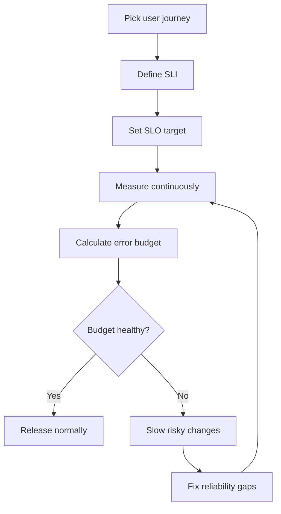

# SLOs, SLIs, and Error Budgets

## What is it?
SLOs, SLIs, and error budgets are the core language of SRE reliability management.

## Why does it matter?
They turn reliability into something measurable and operational, not just subjective.

## AWS services to use
- CloudWatch metrics and alarms
- Route 53 health checks
- CloudWatch Synthetics
- ALB/ELB metrics

## Workflow

## Practical steps in AWS
1. Pick a user-facing journey such as login, checkout, or API request success.
2. Instrument the journey with CloudWatch and synthetic checks.
3. Choose a clear SLI such as success rate or latency.
4. Set an SLO like 99.9% success over 30 days.
5. Create alerts based on budget burn, not only on isolated spikes.
6. Review the SLO monthly and tune it when the product changes.

## Example
- SLI: 99.95% successful requests
- SLO: 99.9% monthly success
- Error budget: 0.1% of requests may fail in the window

## What good looks like
- SLOs are visible to engineering and product teams.
- Releases slow down when reliability drops.
- On-call uses SLOs to decide whether to roll back or continue.
