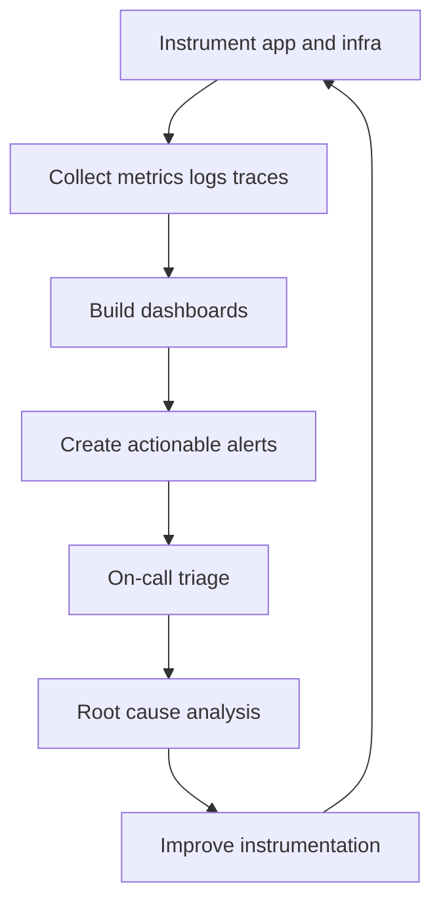
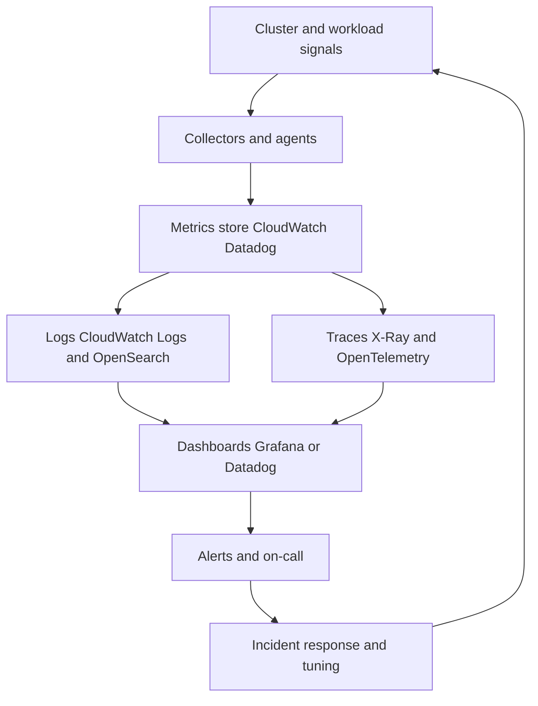

# Observability and Monitoring

## What is it?
Observability is the ability to understand system health from metrics, logs, and traces.

## Why does it matter?
It helps you detect failures early and find root cause faster.

## AWS services to use
- CloudWatch Metrics
- CloudWatch Logs
- AWS X-Ray
- OpenTelemetry
- CloudWatch Synthetics
- Datadog when cross-system correlation is needed

## Workflow

## Practical steps in AWS
1. Instrument application code and AWS infrastructure.
2. Build service, dependency, and platform dashboards.
3. Alert on symptoms that affect users.
4. Keep logs centralized and searchable.
5. Use traces to follow a request across services.
6. Tune alert noise so pages are actionable.

## Core signals
- Latency
- Traffic
- Errors
- Saturation

## Environment guidance
- Dev: lower-noise visibility with faster feedback.
- Staging: near-prod dashboards and alert testing.
- Prod: symptom-based alerts with clear ownership.

## What good looks like
- The team can see what is broken in minutes.
- Alerts point to real user impact.
- Logs and traces shorten debugging time.

---

## Observability for Kubernetes and AI Workloads

### What this covers
- Real-time monitoring of Kubernetes clusters.
- Metrics for scaling, resource utilization, and system health.
- Logging, tracing, and alerting for proactive issue detection.
- Use of CloudWatch, Datadog, Grafana, or similar platforms.

### Why it matters for AI platforms
- Inference latency and GPU saturation directly affect user experience.
- Training jobs can silently fail or waste expensive compute.
- Cluster scaling decisions must be observable, not invisible.
- Without strong observability, AI incidents are detected by customers first.

### Observability pipeline workflow

### Key Kubernetes metrics to monitor
- **Cluster health**: node ready state, control plane latency, API errors.
- **Resource utilization**: CPU, memory, GPU, network, and disk per pod and node.
- **Scaling signals**: HPA target value, replicas, pending pods, scheduling latency.
- **Workload health**: pod restarts, OOMKilled events, probe failures.
- **Ingress health**: 5xx rate, p95 and p99 latency, request volume.
- **AI-specific signals**: model inference latency, queue depth, GPU utilization, batch size.

### Logging, tracing, and alerting strategy
1. Send container logs to **CloudWatch Logs** or a central log store.
2. Use **structured JSON logs** for fast search and dashboards.
3. Enable **distributed tracing** with X-Ray or OpenTelemetry.
4. Alert on **symptoms** customers feel, not on every spike.
5. Use **burn-rate alerts** tied to SLOs.
6. Route alerts based on severity and ownership.

### Tooling examples
- **CloudWatch** for AWS-native metrics, logs, and alarms.
- **Datadog** for cross-platform correlation and APM.
- **Grafana** dashboards on top of CloudWatch or Prometheus.
- **Prometheus** and **kube-state-metrics** inside the cluster.
- **OpenTelemetry** for app-level traces.

### What good looks like for AI platforms
- Operators can see cluster, workload, and AI signals in one place.
- Alerts are actionable and tied to ownership.
- Latency and GPU saturation are visible at all times.
- Incident response starts from the dashboard, not a guess.
