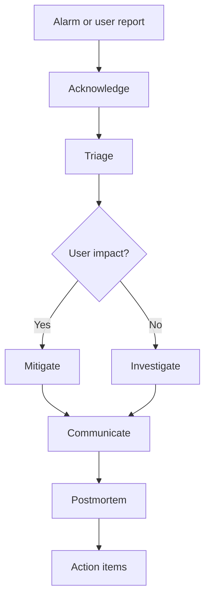

# Incident Response and On-Call

## What is it?
Incident response is the process of acknowledging, triaging, mitigating, and learning from service failures.

## Why does it matter?
It reduces MTTR, improves communication, and prevents repeat incidents.

## AWS services to use
- CloudWatch alarms and dashboards
- AWS Systems Manager Incident Manager
- AWS CloudTrail
- AWS Health Dashboard
- SNS or paging integrations

## Workflow

## Practical steps in AWS
1. Acknowledge quickly and assign an incident lead.
2. Check recent deploys, CloudWatch data, and CloudTrail activity.
3. Mitigate first using rollback, scaling, or failover.
4. Keep stakeholders informed with short status updates.
5. Run a blameless postmortem after recovery.
6. Track action items to completion.

## Triage checklist
- Was there a recent deploy?
- Did latency, CPU, or memory spike?
- Did IAM, DNS, or network settings change?
- Is the issue AWS-service related or application-related?

## What good looks like
- The on-call engineer knows exactly what to do first.
- Communication is fast and calm.
- The incident produces concrete reliability improvements.
