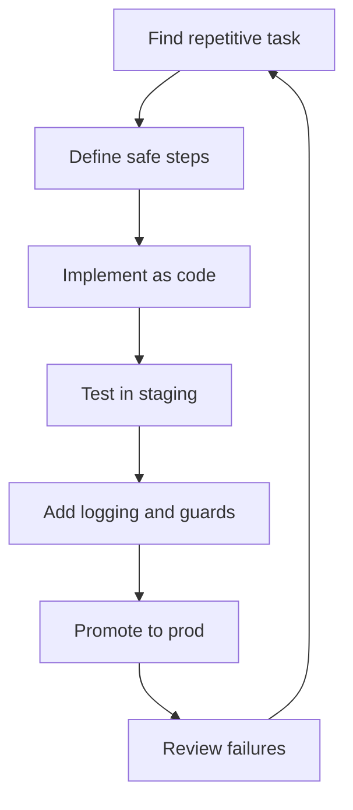
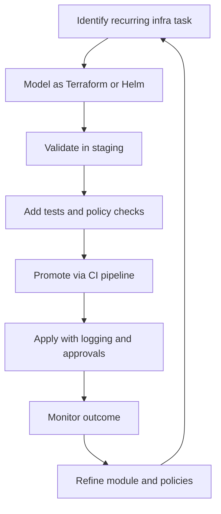
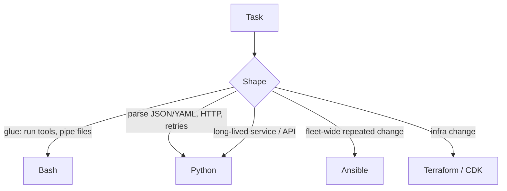
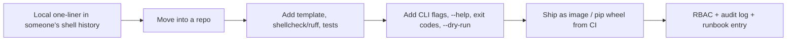
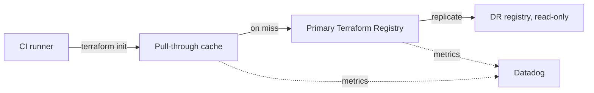
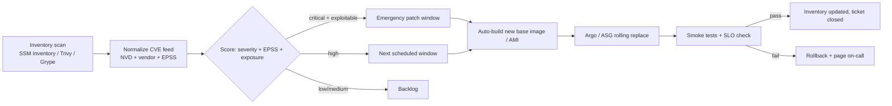

# Automation, IaC, and Runbooks

## What is it?
This topic covers replacing repetitive manual work with code, automation, and repeatable operational steps.

## Why does it matter?
Automation reduces toil, lowers drift, and makes operations safer and faster.

## AWS services to use
- Terraform
- AWS CloudFormation
- AWS Systems Manager Automation
- AWS Lambda
- AWS Step Functions

## Workflow


## Practical steps in AWS
1. Identify tasks done repeatedly during incidents or operations.
2. Turn them into a runbook or an automation script.
3. Test the workflow in staging first.
4. Add approvals if the action is risky.
5. Keep the automation version-controlled in Git.
6. Review failure cases and improve the design.

## Common examples
- Restarting unhealthy services
- Rotating secrets
- Validating backups
- Scaling capacity during spikes
- Running safe configuration changes

## IaC habits
- Prefer declarative infrastructure.
- Separate modules by service or environment.
- Review plans before apply.
- Avoid manual drift.

## What good looks like
- Repeated tasks become predictable and safe.
- Infrastructure changes are auditable.
- Runbooks are easy to execute during incidents.

---

## Automation and Scalability for AI Workloads

### What this covers
- Automating infrastructure tasks for AI services: upgrades, scaling, and provisioning.
- Using Infrastructure as Code with Terraform and Helm.
- Building CI/CD support for automatic scaling and safe change management.

### Why it matters for AI platforms
- AI environments grow fast and need repeatable provisioning.
- Scaling decisions must be reliable, not manual guesses.
- Drift between environments causes hard-to-debug AI incidents.
- IaC keeps platform changes auditable and reversible.

### Automation workflow


### IaC approach
- Use **Terraform** for VPCs, EKS clusters, IAM, RDS, S3, Lambda, and monitoring stacks.
- Use **Helm** for in-cluster Kubernetes workloads, scaling configs, and platform add-ons.
- Keep modules **small and reusable** per service or environment.
- Run **terraform plan** in CI for every change.
- Use **policy-as-code** tools to block risky changes early.
- Store all IaC in Git with reviews and tags.

### Scaling automation
- Automate **EKS cluster autoscaling** with Karpenter or Cluster Autoscaler.
- Automate **HPA** and **VPA** rules for AI workloads.
- Use **Lambda** or **Step Functions** for event-driven remediation.
- Provision new environments through **Terraform pipelines**, not manual clicks.
- Use **Systems Manager Automation** runbooks for safe operational actions.

### Change management practices
- Every infra change goes through a pull request.
- High-impact changes need approvals and clear rollback steps.
- Pipelines log who applied what, when, and where.
- Drift detection runs regularly against production.

### What good looks like for AI platforms
- New environments are created with a single, reviewed pipeline run.
- Scaling and upgrades are automated and observable.
- Risky changes are blocked or gated before they reach production.
- Engineers spend less time on infrastructure toil and more on reliability.


---

## Shell + Python automation patterns

> This section adds the **JD-aligned automation depth** — *Ability to build automation using Shell, Python, or similar scripting languages* — beyond IaC. Use Shell for glue, Python for anything with state, types, or retries.

### 1. When to reach for Bash vs Python



Rule of thumb: if Bash exceeds **300 lines** or uses `eval` / temp files for state, rewrite it in Python.

### 2. Bash — the strict template every script should use

```bash
#!/usr/bin/env bash
# rotate_logs.sh — keep last N days of build logs
# Usage: rotate_logs.sh [-d days] [-r root] [--dry-run]
set -Eeuo pipefail
IFS=$'\n\t'

DAYS=14
ROOT="${LOG_ROOT:-/var/log/builds}"
DRY=false
LOG_TAG="rotate_logs"

log() { logger -t "$LOG_TAG" -- "$*"; printf '%s %s\n' "$(date -Is)" "$*" >&2; }
die() { log "ERROR: $*"; exit "${2:-1}"; }
trap 'die "line $LINENO: $BASH_COMMAND" 1' ERR
trap 'log "received signal; exiting"; exit 130' INT TERM

while (($#)); do
  case "$1" in
    -d|--days)  DAYS="${2:?missing days}"; shift 2 ;;
    -r|--root)  ROOT="${2:?missing root}"; shift 2 ;;
    --dry-run)  DRY=true;                  shift ;;
    -h|--help)  sed -n '2,4p' "$0"; exit 0 ;;
    *) die "unknown arg: $1" 2 ;;
  esac
done

[[ -d $ROOT ]] || die "root not found: $ROOT" 3
[[ "$DAYS" =~ ^[0-9]+$ ]] || die "days must be int" 2

count=0
while IFS= read -r -d '' f; do
  count=$((count + 1))
  $DRY && log "DRY would remove $f" || rm -f -- "$f"
done < <(find "$ROOT" -type f -name 'log' -mtime "+$DAYS" -print0)

log "done: $count files matched"
```

What this gives you:

- `set -Eeuo pipefail` + `trap ... ERR` — fail loud, print the failing line.
- `--dry-run`, `--help`, long-form args, exit codes.
- `find -print0` + `read -d ''` — handles filenames with spaces/newlines.

Lint and test with `shellcheck *.sh` and `bats-core` in CI.

### 3. Python — production scaffold

`pyproject.toml`:

```toml
[project]
name = "platform-tools"
version = "0.4.0"
requires-python = ">=3.11"
dependencies = [
  "click>=8.1",
  "httpx>=0.27",
  "pydantic>=2.7",
  "tenacity>=8.3",
  "kubernetes>=30.1",
  "boto3>=1.34",
  "structlog>=24.1",
]
[project.scripts]
platform-tools = "platform_tools.cli:main"
```

Drain a Kubernetes node, safely, with retries and structured logs:

```python
"""Drain Kubernetes nodes safely, honoring PDBs."""
from __future__ import annotations
import structlog
from kubernetes import client, config
from tenacity import retry, stop_after_attempt, wait_exponential

log = structlog.get_logger(__name__)

def _kube() -> client.CoreV1Api:
    try:
        config.load_incluster_config()
    except config.ConfigException:
        config.load_kube_config()
    return client.CoreV1Api()

@retry(stop=stop_after_attempt(5), wait=wait_exponential(min=1, max=15))
def cordon(node: str) -> None:
    _kube().patch_node(node, {"spec": {"unschedulable": True}})
    log.info("cordoned", node=node)

@retry(stop=stop_after_attempt(3), wait=wait_exponential(min=2, max=30))
def drain(node: str, grace: int = 60, dry_run: bool = False) -> int:
    v1 = _kube()
    pods = v1.list_pod_for_all_namespaces(field_selector=f"spec.nodeName={node}").items
    evicted = 0
    for p in pods:
        if any(o.kind == "DaemonSet" for o in (p.metadata.owner_references or [])):
            continue
        body = client.V1Eviction(
            metadata=client.V1ObjectMeta(name=p.metadata.name, namespace=p.metadata.namespace),
            delete_options=client.V1DeleteOptions(grace_period_seconds=grace),
        )
        if dry_run:
            log.info("would evict", pod=p.metadata.name, ns=p.metadata.namespace)
            continue
        v1.create_namespaced_pod_eviction(name=p.metadata.name, namespace=p.metadata.namespace, body=body)
        evicted += 1
    log.info("drained", node=node, evicted=evicted, dry_run=dry_run)
    return evicted
```

CLI front door using `click`:

```python
import click
from .k8s.drain_nodes import cordon, drain

@click.group()
def main() -> None:
    """Platform SRE automation toolbox."""

@main.command("drain")
@click.argument("node")
@click.option("--grace", default=60, type=int)
@click.option("--dry-run/--apply", default=True)
def drain_cmd(node: str, grace: int, dry_run: bool) -> None:
    cordon(node)
    n = drain(node, grace=grace, dry_run=dry_run)
    click.echo(f"evicted={n}")
```

### 4. Boto3 with retries and paging

```python
import boto3
from botocore.config import Config
from tenacity import retry, wait_exponential, stop_after_attempt

cfg = Config(retries={"max_attempts": 10, "mode": "adaptive"}, region_name="us-east-1")
ec2 = boto3.client("ec2", config=cfg)

@retry(wait=wait_exponential(min=1, max=10), stop=stop_after_attempt(5))
def list_stopped_instances() -> list[str]:
    out: list[str] = []
    for page in ec2.get_paginator("describe_instances").paginate(
        Filters=[{"Name": "instance-state-name", "Values": ["stopped"]}]
    ):
        for r in page["Reservations"]:
            for i in r["Instances"]:
                out.append(i["InstanceId"])
    return out
```

### 5. Promotion workflow — script → platform tool



Discipline: **never let a critical operation live only as someone's shell history.**

### 6. Secrets and observability for your scripts

- Never read secrets via CLI args (`ps aux` shows them) — use env vars, files mounted by the platform, or fetch from SSM/Vault at runtime.
- Mask in logs; never echo a token.
- Treat each script as a tiny service: emit **structured JSON logs**, meaningful **exit codes**, and a **heartbeat ping** to a monitor (Healthchecks.io / Datadog) on success so silence is alarming.

```bash
curl -fsS --retry 3 "https://hc-ping.com/$HEALTHCHECK_UUID" >/dev/null
```

### 7. What good looks like (Shell + Python)

- Every recurring task lives **as a script in Git**, not in shell history.
- Bash scripts pass `shellcheck` and use the strict template.
- Python tools live in **one packaged repo** with type hints, tests, retries, structured logs.
- Critical ops are **wrapped in a CLI/bot** with audit + RBAC; nobody runs raw `aws`/`kubectl` against prod by hand.
- Each tool ships with a **runbook entry**: inputs, outputs, exit codes, rollback.

### 8. Anti-patterns (Shell + Python)

- Bash without `set -e`, swallowing errors silently.
- 1 000-line Bash parsing JSON with `awk` and storing state in temp files.
- Hardcoded creds, tokens passed via CLI args, secrets in `~/.bash_history`.
- `eval` on untrusted input.
- Python "script.py" shipped without `pyproject.toml`, no tests, no retries.
- Tools that print "success" but exit `0` on partial failure.
- No idempotence — running twice doubles the change.

### 9. References (Shell + Python)

- Bash manual — [gnu.org/software/bash/manual](https://www.gnu.org/software/bash/manual/)
- ShellCheck — [shellcheck.net](https://www.shellcheck.net/)
- bats-core — [github.com/bats-core/bats-core](https://github.com/bats-core/bats-core)
- Google Shell Style Guide — [google.github.io/styleguide/shellguide.html](https://google.github.io/styleguide/shellguide.html)
- Python docs — [docs.python.org/3](https://docs.python.org/3/)
- `click` — [click.palletsprojects.com](https://click.palletsprojects.com/)
- `tenacity` — [tenacity.readthedocs.io](https://tenacity.readthedocs.io/)
- `structlog` — [www.structlog.org](https://www.structlog.org/)

---

## Terraform Registry & IaC toolchain governance

> JD line covered: *Maintain and extend the platform's IaC toolchain, including Terraform workflows, deployment pipelines, and registry management.*

### 1. Why a private Terraform Registry

Without a registry, every team copies modules around, pins different versions, and drifts. A **private registry** turns Terraform modules into a versioned, signed product.

```mermaid
flowchart LR
    DEV[Module repo] --> CI[CI: fmt, validate, tflint, checkov, unit tests with terratest]
    CI --> SIGN[Sign + SBOM]
    SIGN --> REG[(Private Terraform Registry<br/>Terraform Cloud / Artifactory / Spacelift / S3 + index.json)]
    REG --> CONSUME[Consumers: terraform { source = "app.tfr/org/vpc/aws" version = "~> 3.2" }]
    CONSUME --> APPLY[Apply pipeline -> state in S3 + DynamoDB lock]
    APPLY --> AUDIT[Audit log + drift detection nightly]
    AUDIT --> ISSUE[Open PR to bump module version]
    ISSUE --> DEV
```

### 2. Module repo layout (the contract every module must follow)

```
terraform-aws-vpc/
├── README.md            # auto-generated by terraform-docs
├── versions.tf          # required_providers + required_version
├── variables.tf         # validated; sensible defaults
├── main.tf
├── outputs.tf
├── examples/
│   └── complete/main.tf
├── test/
│   └── vpc_test.go      # terratest
└── CHANGELOG.md         # semver, auto-bumped by release-please
```

### 3. CI for every module

```yaml
name: module-ci
on: [pull_request, push]
jobs:
  validate:
    runs-on: ubuntu-22.04
    steps:
      - uses: actions/checkout@v4
      - uses: hashicorp/setup-terraform@v3
      - run: terraform fmt -check -recursive
      - run: terraform init -backend=false
      - run: terraform validate
      - uses: terraform-linters/setup-tflint@v4
      - run: tflint --recursive
      - uses: bridgecrewio/checkov-action@v12
        with: { framework: terraform, soft_fail: false }
      - name: terratest
        run: |
          cd test
          go test -v -timeout 30m ./...
      - uses: terraform-docs/gh-actions@v1
        with: { working-dir: ., output-file: README.md, git-push: "true" }
```

### 4. Publishing to the registry

```bash
# Tag, sign, publish
git tag -s v3.2.0 -m "vpc: add IPv6 prefix delegation"
git push --tags

# Auto-publish to Terraform Cloud private registry (webhook) — or for Artifactory:
curl -fsSL -u "$TF_USER:$TF_TOKEN" \
  -T terraform-aws-vpc-3.2.0.tar.gz \
  "https://artifactory.example.com/artifactory/tf-modules/org/vpc/aws/3.2.0/module.tar.gz"
```

Consumers reference it like any registry module:
```hcl
module "vpc" {
  source  = "app.terraform.io/org/vpc/aws"   # private registry hostname
  version = "~> 3.2"
  name    = "prod-east-1"
  cidr    = "10.0.0.0/16"
}
```

### 5. Provider + module governance rules

- **Pinned `required_version`** and `required_providers` in every module.
- **Semver** with `release-please`: `feat:` minor, `fix:` patch, `BREAKING:` major.
- **Deprecation policy:** keep last N-1 minor versions; surface warnings via a `terraform_data` resource + check block.
- **CODEOWNERS** for the module repo — only platform-SRE can merge.
- **Drift detection** nightly via `terraform plan -detailed-exitcode` on prod workspaces; PR opened on drift.
- **State management:** S3 + DynamoDB lock per workspace; SSE-KMS; bucket policy denies non-TLS access.

### 6. Operating the registry itself (Run Engineering)

The registry is now a **tier-1 platform service** — if it's down, nobody can `terraform init`. Treat it like a paved-road production service:

- **SLO**: registry `init` success > 99.9%, p95 < 1 s.
- **Backups**: daily index + module-tarball snapshot to a separate region.
- **Read-only DR mirror** in a second region; DNS failover.
- **Authn/Authz**: OIDC from CI runners (no static tokens), per-team read/write scopes.
- **Cache**: CI runners mirror modules via a pull-through proxy to remove the registry from the build hot path.



---

## Self-healing patching & vulnerability remediation

> JD line covered: *Perform patching, upgrades, and vulnerability remediation, aiming for minimal human intervention on production systems.*

### 1. The end-to-end remediation pipeline



### 2. Concrete OS patching (managed nodes via SSM)

```hcl
resource "aws_ssm_patch_baseline" "linux" {
  name             = "linux-baseline"
  operating_system = "AMAZON_LINUX_2023"
  approved_patches_compliance_level = "HIGH"
  approval_rule {
    approve_after_days = 7
    patch_filter { key = "CLASSIFICATION", values = ["Security", "Bugfix"] }
    patch_filter { key = "SEVERITY",       values = ["Critical", "Important"] }
  }
}

resource "aws_ssm_maintenance_window" "weekly" {
  name     = "weekly-patching"
  schedule = "cron(0 03 ? * SUN *)"   # Sundays 03:00 UTC
  duration = 3
  cutoff   = 1
}

resource "aws_ssm_maintenance_window_target" "by_tag" {
  window_id    = aws_ssm_maintenance_window.weekly.id
  resource_type= "INSTANCE"
  targets { key = "tag:patch-group", values = ["prod-weekly"] }
}

resource "aws_ssm_maintenance_window_task" "patch" {
  window_id        = aws_ssm_maintenance_window.weekly.id
  task_type        = "RUN_COMMAND"
  task_arn         = "AWS-RunPatchBaseline"
  max_concurrency  = "10%"
  max_errors       = "5%"
  task_invocation_parameters {
    run_command_parameters { parameter { name = "Operation", values = ["Install"] } }
  }
}
```

### 3. Container image auto-remediation

```yaml
# .github/workflows/rebuild-on-base-update.yml
name: rebuild-on-base-update
on:
  schedule: [{ cron: "0 2 * * *" }]   # nightly
  workflow_dispatch:
jobs:
  rebuild:
    runs-on: ubuntu-22.04
    steps:
      - uses: actions/checkout@v4
      - id: base
        run: |
          docker pull cgr.dev/chainguard/python:latest
          DIGEST=$(docker inspect --format='{{index .RepoDigests 0}}' cgr.dev/chainguard/python:latest)
          echo "digest=$DIGEST" >> $GITHUB_OUTPUT
      - name: Rebuild + scan + push if base changed
        run: |
          docker build --build-arg BASE=${{ steps.base.outputs.digest }} -t app:cve-rebuild .
          trivy image --severity HIGH,CRITICAL --exit-code 1 app:cve-rebuild
          docker tag app:cve-rebuild registry.example.com/app:$(date +%F)
          docker push registry.example.com/app:$(date +%F)
      - name: Open Helm bump PR
        uses: peter-evans/create-pull-request@v6
        with:
          title: "chore(deps): auto-rebuild for base image CVE"
          branch: chore/auto-rebuild
          commit-message: "chore(deps): rebuild on base image update"
```

Kubernetes side: **Kyverno** can require base-image digests on a deny-by-default allow-list, so a CVE in an old base blocks new admissions:

```yaml
apiVersion: kyverno.io/v1
kind: ClusterPolicy
metadata: { name: pinned-base-images }
spec:
  validationFailureAction: Enforce
  rules:
    - name: only-curated-bases
      match: { any: [{ resources: { kinds: [Pod] } }] }
      validate:
        message: "Use a curated base image from registry.example.com/base/*"
        pattern:
          spec:
            containers:
              - image: "registry.example.com/base/* | registry.example.com/app@sha256:*"
```

### 4. SLOs for the patching pipeline

| Indicator | Target |
| --- | --- |
| Time-to-patch critical CVE (KEV / EPSS > 0.5) | < 7 days |
| Time-to-patch high CVE | < 30 days |
| % fleet on supported OS minor | > 99% |
| Auto-remediation success (no human touch) | > 95% |
| Emergency patch MTTR | < 4 h |

### 5. What good looks like (patching)

- **Inventory is real-time** (SSM Inventory + Trivy DB) — you know every CVE on every node within minutes.
- **Patching is a pipeline**, not a person: golden-image rebuild → ASG roll → smoke → done.
- **Critical CVEs auto-open a PR** to bump the base; CI proves it builds; deploy goes via the same rollout pipeline.
- **Admission control** stops old base images from re-entering production.
- **MTTR for emergency patches is measured and published** as an SLO.

### 6. Anti-patterns (patching)

- "Patch Tuesday" tickets that humans manually execute on hundreds of boxes.
- One-off patches via SSH that never make it into the golden image.
- CVE backlog of unknown size because there's no aggregated inventory.
- Skipping the rolling restart — patches present but old kernel still running.

### 7. References (registry + patching)

- HashiCorp Private Registry — [developer.hashicorp.com/terraform/cloud-docs/registry](https://developer.hashicorp.com/terraform/cloud-docs/registry)
- terraform-docs — [terraform-docs.io](https://terraform-docs.io/)
- terratest — [terratest.gruntwork.io](https://terratest.gruntwork.io/)
- AWS SSM Patch Manager — [docs.aws.amazon.com/systems-manager/latest/userguide/systems-manager-patch.html](https://docs.aws.amazon.com/systems-manager/latest/userguide/systems-manager-patch.html)
- CISA KEV — [cisa.gov/known-exploited-vulnerabilities-catalog](https://www.cisa.gov/known-exploited-vulnerabilities-catalog)
- EPSS — [first.org/epss](https://www.first.org/epss/)
- Trivy DB — [github.com/aquasecurity/trivy-db](https://github.com/aquasecurity/trivy-db)
- Kyverno verify-images — [kyverno.io/docs/writing-policies/verify-images](https://kyverno.io/docs/writing-policies/verify-images/)
