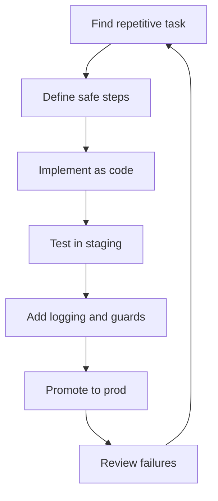
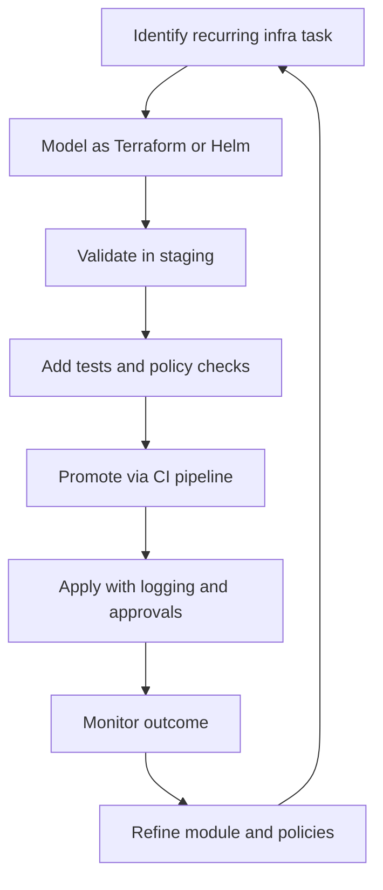

# Automation, IaC, and Runbooks

## What is it?
This topic covers replacing repetitive manual work with code, automation, and repeatable operational steps.

## Why does it matter?
Automation reduces toil, lowers drift, and makes operations safer and faster.

## AWS services to use
- Terraform
- AWS CloudFormation
- AWS Systems Manager Automation
- AWS Lambda
- AWS Step Functions

## Workflow

## Practical steps in AWS
1. Identify tasks done repeatedly during incidents or operations.
2. Turn them into a runbook or an automation script.
3. Test the workflow in staging first.
4. Add approvals if the action is risky.
5. Keep the automation version-controlled in Git.
6. Review failure cases and improve the design.

## Common examples
- Restarting unhealthy services
- Rotating secrets
- Validating backups
- Scaling capacity during spikes
- Running safe configuration changes

## IaC habits
- Prefer declarative infrastructure.
- Separate modules by service or environment.
- Review plans before apply.
- Avoid manual drift.

## What good looks like
- Repeated tasks become predictable and safe.
- Infrastructure changes are auditable.
- Runbooks are easy to execute during incidents.

---

## Automation and Scalability for AI Workloads

### What this covers
- Automating infrastructure tasks for AI services: upgrades, scaling, and provisioning.
- Using Infrastructure as Code with Terraform and Helm.
- Building CI/CD support for automatic scaling and safe change management.

### Why it matters for AI platforms
- AI environments grow fast and need repeatable provisioning.
- Scaling decisions must be reliable, not manual guesses.
- Drift between environments causes hard-to-debug AI incidents.
- IaC keeps platform changes auditable and reversible.

### Automation workflow

### IaC approach
- Use **Terraform** for VPCs, EKS clusters, IAM, RDS, S3, Lambda, and monitoring stacks.
- Use **Helm** for in-cluster Kubernetes workloads, scaling configs, and platform add-ons.
- Keep modules **small and reusable** per service or environment.
- Run **terraform plan** in CI for every change.
- Use **policy-as-code** tools to block risky changes early.
- Store all IaC in Git with reviews and tags.

### Scaling automation
- Automate **EKS cluster autoscaling** with Karpenter or Cluster Autoscaler.
- Automate **HPA** and **VPA** rules for AI workloads.
- Use **Lambda** or **Step Functions** for event-driven remediation.
- Provision new environments through **Terraform pipelines**, not manual clicks.
- Use **Systems Manager Automation** runbooks for safe operational actions.

### Change management practices
- Every infra change goes through a pull request.
- High-impact changes need approvals and clear rollback steps.
- Pipelines log who applied what, when, and where.
- Drift detection runs regularly against production.

### What good looks like for AI platforms
- New environments are created with a single, reviewed pipeline run.
- Scaling and upgrades are automated and observable.
- Risky changes are blocked or gated before they reach production.
- Engineers spend less time on infrastructure toil and more on reliability.
