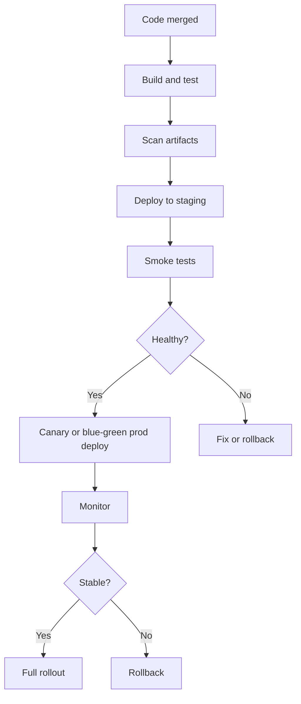
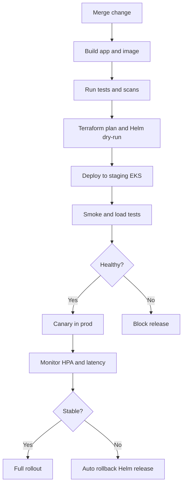

# CI/CD and Release Reliability

## What is it?
CI/CD and release reliability are the practices that let teams ship safely, frequently, and with controlled blast radius.

## Why does it matter?
Bad deployments cause many production incidents, so release safety is a core SRE skill.

## AWS services to use
- AWS CodePipeline
- AWS CodeBuild
- AWS CodeDeploy
- Amazon ECR
- Lambda alias routing

## Workflow

## Practical steps in AWS
1. Build and test every change.
2. Scan artifacts and dependencies.
3. Deploy to staging before production.
4. Use canary or blue-green for risky changes.
5. Watch latency, errors, and saturation during rollout.
6. Roll back quickly if health degrades.

## Release safety patterns
- Canary release
- Blue-green deployment
- Feature flags
- Automatic rollback on health regressions

## What good looks like
- Deployments are routine, not stressful.
- The team can stop or roll back safely.
- Production changes are visible and measurable.

---

## CI/CD for AI Workloads and Auto Scaling

### What this covers
- CI/CD workflows tailored for AI services running on Kubernetes.
- Pipelines that support automatic scaling and safe change management.
- Integration with IaC tools like Terraform and Helm.

### Why it matters for AI platforms
- AI services change often: models, configs, and dependencies.
- Bad releases can break inference for all consumers at once.
- Automated scaling must work hand-in-hand with deploys.
- Change management must be auditable across infra and app.

### CI/CD workflow for AI services

### Pipeline practices for AI workloads
- Run **unit, integration, and load tests** before production.
- Validate **Helm chart values** for resource requests, limits, and HPA.
- Run **Terraform plan** for related infra changes in the same PR.
- Gate production with **manual approval** for risky changes.
- Use **canary or blue-green** for inference services.
- Auto-rollback on **latency or error regressions**.

### Automatic scaling integration
- Pipelines should not disable HPA during deploys.
- New versions must be tested with **realistic load** in staging.
- Use **PodDisruptionBudgets** to keep capacity during rollouts.
- Coordinate **node autoscaling** with deploy timing.

### Change management
- Every change is traceable to a PR, build, and deploy.
- Pipelines record who released what to which cluster.
- Releases are tied to **SLO and error budget** status.
- Postmortems feed back into pipeline guardrails.

### What good looks like for AI platforms
- Releases are predictable across infra and AI workloads.
- Scaling is preserved during deploys and rollbacks.
- Change history is complete and auditable.
- Reliability improves over time through automated guardrails.
