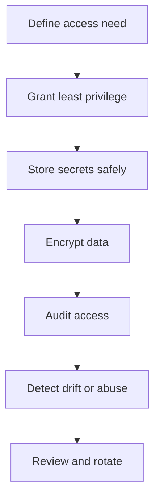

# Security, IAM, KMS, and Secrets

## What is it?
This topic covers access control, encryption, secret handling, and security governance in AWS.

## Why does it matter?
Security issues often turn into reliability issues, especially when permissions or secrets are mismanaged.

## AWS services to use
- IAM
- IAM Identity Center
- KMS
- Secrets Manager
- Systems Manager Parameter Store
- Security Hub, GuardDuty, AWS Config

## Workflow

## Practical steps in AWS
1. Use IAM roles instead of long-lived access keys.
2. Separate admin, deployment, and read-only access.
3. Store secrets outside code in Secrets Manager or Parameter Store.
4. Encrypt data at rest and in transit with KMS where applicable.
5. Monitor access with CloudTrail and governance tools.
6. Rotate sensitive credentials regularly.

## What good looks like
- Least privilege is the default.
- Secret access is auditable.
- Encryption is standard for production systems.
- Security controls support rather than block operations.
