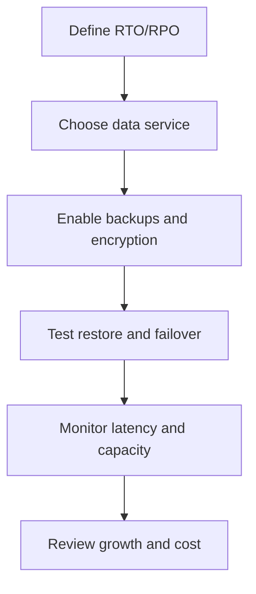

# Databases, Storage, and Reliability

## What is it?
This topic covers the AWS services used to store application data and keep it available.

## Why does it matter?
Many incidents are actually storage, backup, replication, or database availability problems.

## AWS services to use
- Amazon RDS
- Amazon DynamoDB
- Amazon S3
- Amazon EBS

## Workflow

## Practical steps in AWS
1. Decide the recovery needs for the workload.
2. Choose RDS, DynamoDB, S3, or EBS based on access pattern.
3. Enable backups, encryption, and where needed multi-AZ or replication.
4. Test restore procedures before an incident happens.
5. Watch storage growth, connection saturation, and query latency.
6. Revisit retention and cost regularly.

## Data reliability habits
- Backups must be restore-tested.
- Database failover should be practiced.
- S3 should be used for durable object storage, not ad hoc state.
- Data access should be monitored like any other dependency.

## What good looks like
- Recovery objectives are known.
- Restore tests are routine.
- Storage services are visible in dashboards and alarms.
