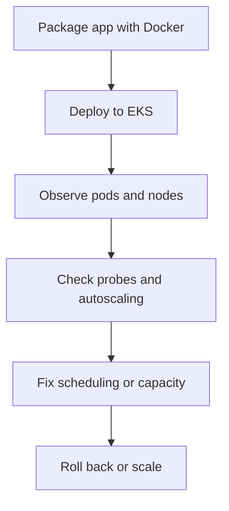
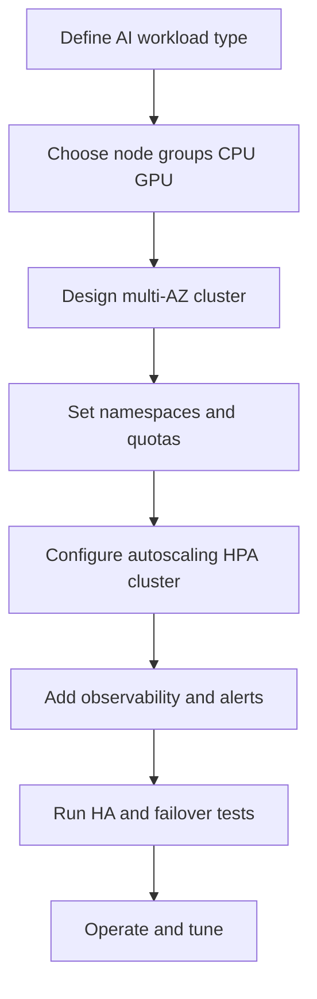
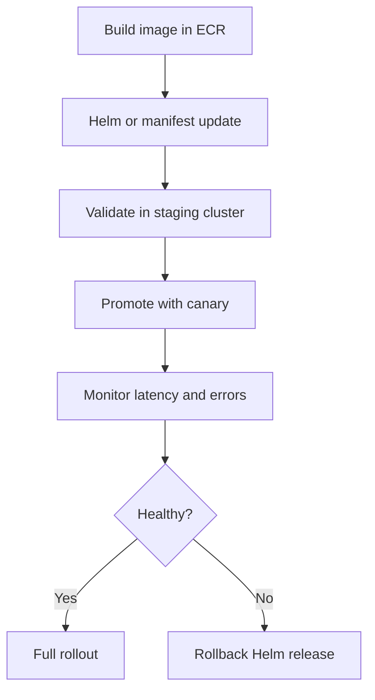

# Kubernetes, EKS, Docker, and Platform Ops

## What is it?
This topic covers container packaging and Kubernetes platform operations in AWS.

## Why does it matter?
Application issues often become platform issues when clusters, nodes, probes, or autoscaling are unhealthy.

## AWS services to use
- Amazon EKS
- EC2 / managed node groups
- CloudWatch Container Insights
- ECR
- ALB Ingress Controller / AWS Load Balancer Controller

## Workflow

## Practical steps in AWS
1. Build container images in ECR.
2. Deploy workloads to EKS with resource requests and limits.
3. Watch pod health, node pressure, and ingress behavior.
4. Use readiness and liveness probes carefully.
5. Review cluster autoscaling and node capacity.
6. Keep namespace and RBAC boundaries clear.

## Key signals
- Pending pods
- Pod restarts
- Node pressure
- Probe failures
- Ingress 5xx and latency

## What good looks like
- The cluster is observable from app to node level.
- Scaling problems are detected early.
- Rollbacks are simple and predictable.

---

## Kubernetes Orchestration and Management for AI Workloads

### What this covers
- Designing, deploying, and managing EKS clusters for AI services.
- Building Kubernetes-based deployment pipelines.
- Optimizing resource allocation while controlling cost.
- Running high-availability and fault-tolerant architectures.

### Why it matters for AI
- AI workloads need predictable compute, GPU access, and stable scaling.
- Inference and training jobs are cost-sensitive and latency-sensitive.
- Outages on shared AI platforms affect many teams at once.
- HA design protects model serving endpoints during failures.

### Cluster design workflow

### Deployment pipeline workflow

### Resource allocation and cost optimization
- Use **requests and limits** on every pod, especially GPU pods.
- Apply **namespace quotas** to prevent runaway workloads.
- Use **node selectors and taints** to keep AI workloads on the right hardware.
- Use **spot or mixed instances** for non-critical inference and training.
- Right-size **HPA**, **VPA**, and **Cluster Autoscaler** together.
- Review utilization dashboards weekly and remove idle workloads.

### High availability and fault tolerance
- Spread nodes across **multiple AZs**.
- Use **PodDisruptionBudgets** for critical inference services.
- Use **topology spread constraints** to avoid co-location.
- Use **managed node groups** or **Karpenter** for self-healing capacity.
- Test **node failure** and **AZ failure** drills regularly.
- Keep **control plane** access scoped and audited.

### Practical AWS tools for AI workloads
- **EKS** with managed node groups
- **Karpenter** for fast, cost-aware scaling
- **EC2 GPU instances** for training and inference
- **ECR** for container artifacts
- **AWS Load Balancer Controller** for ingress
- **CloudWatch Container Insights** for cluster observability

### What good looks like for AI platforms
- AI services run on stable, multi-AZ clusters.
- Scaling is predictable for both burst inference and steady serving.
- Cost is visible and bounded by quotas and node selection.
- Failures in one node or AZ do not take down the platform.
