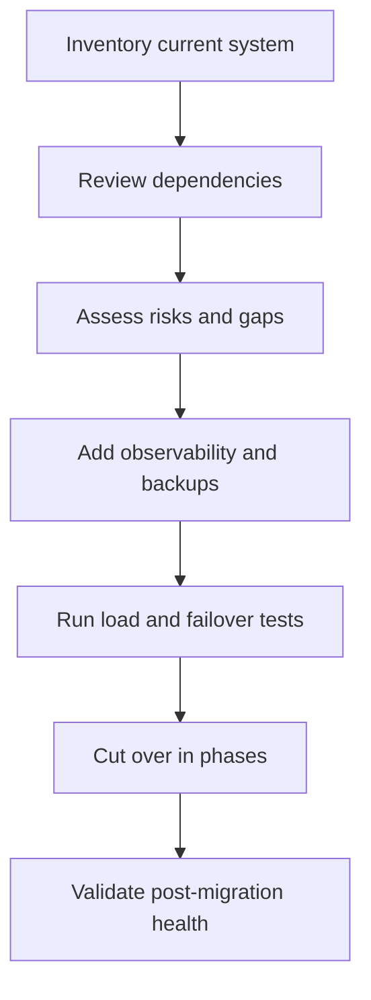

# Migration Readiness and Architecture Review

## What is it?
This topic covers how to prepare AWS services for migration, modernization, or cutover.

## Why does it matter?
Poor readiness planning causes outages, slow cutovers, and hidden dependency failures.

## AWS services to use
- AWS Well-Architected Tool
- CloudWatch
- AWS Config
- Route 53
- Backup and snapshot services

## Workflow

## Practical steps in AWS
1. Map services, databases, network paths, and identities.
2. Review architecture against the AWS Well-Architected pillars.
3. Set up monitoring before the migration.
4. Validate backup and recovery procedures.
5. Test performance and failover with realistic traffic.
6. Cut over in stages and validate after each phase.

## What good looks like
- Risks are known before cutover.
- Dashboards and alarms exist before production traffic moves.
- Failback is possible if the new environment misbehaves.
