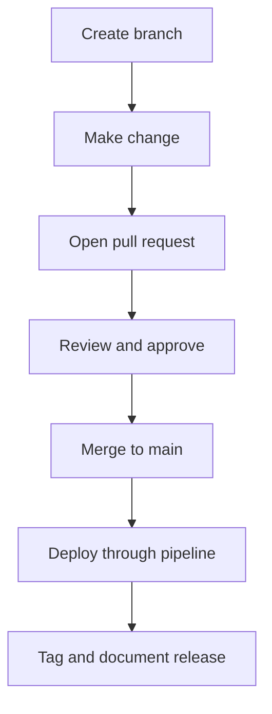

# Git Workflows and Collaboration

## What is it?
This topic covers how SRE teams use Git to keep app code, infrastructure, and runbooks auditable.

## Why does it matter?
Safe operations depend on reviewable change history and clear ownership.

## AWS context
- Git is the source of truth for Terraform, CloudFormation, and deployment scripts.
- The workflow supports CodePipeline, CodeBuild, and operational runbooks.

## Workflow

## Practical steps
1. Branch from main for each change.
2. Keep infra, app, and runbook changes separate when possible.
3. Use pull requests and reviews before merge.
4. Tag releases and keep rollback references clear.
5. Capture operational notes in markdown files near the service.

## Collaboration habits
- Include observability impact in code review.
- Make rollback steps visible.
- Keep operational changes small and traceable.
- Use consistent naming and directory structure.

## What good looks like
- Every change is reviewable.
- Rollbacks are easy to identify.
- Team members can find the right docs quickly.
