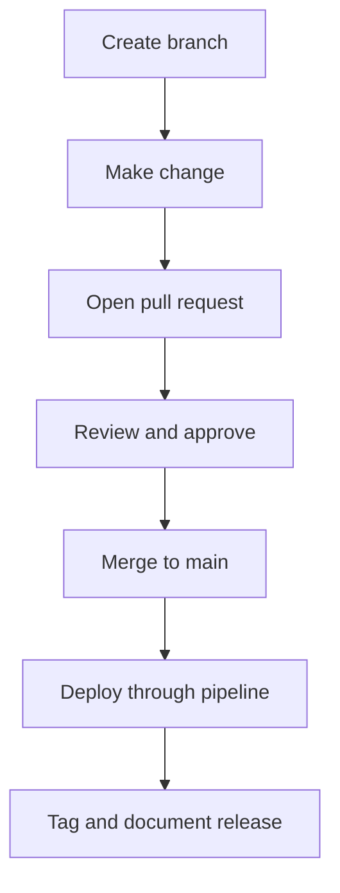
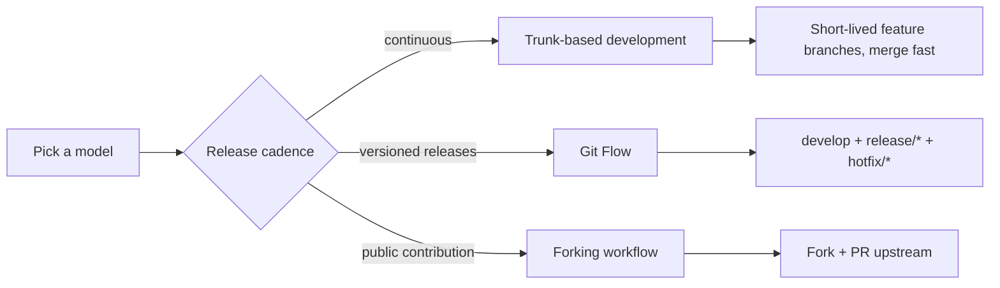
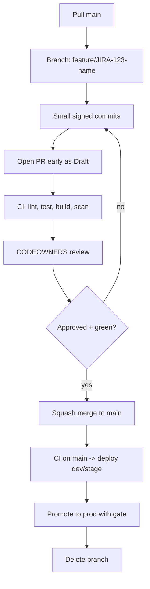
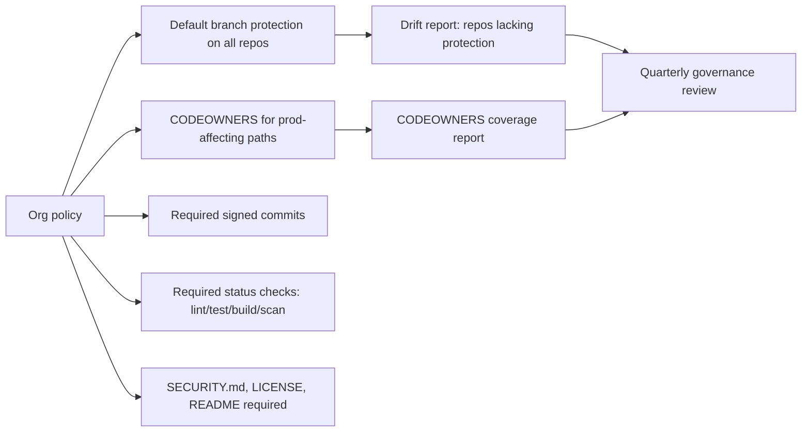
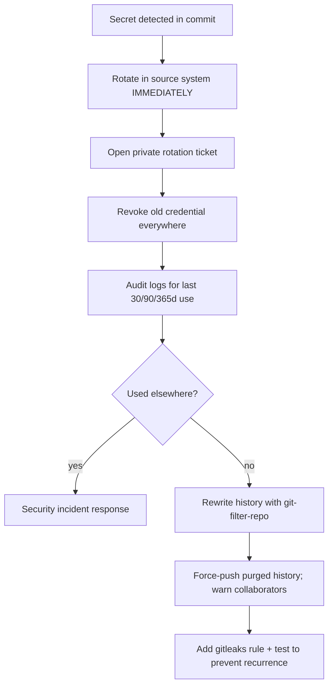
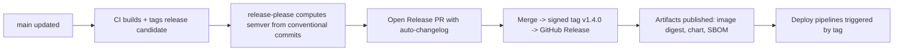

# Git Workflows and Collaboration

## What is it?
This topic covers how SRE teams use Git to keep app code, infrastructure, and runbooks auditable.

## Why does it matter?
Safe operations depend on reviewable change history and clear ownership.

## AWS context
- Git is the source of truth for Terraform, CloudFormation, and deployment scripts.
- The workflow supports CodePipeline, CodeBuild, and operational runbooks.

## Workflow


## Practical steps
1. Branch from main for each change.
2. Keep infra, app, and runbook changes separate when possible.
3. Use pull requests and reviews before merge.
4. Tag releases and keep rollback references clear.
5. Capture operational notes in markdown files near the service.

## Collaboration habits
- Include observability impact in code review.
- Make rollback steps visible.
- Keep operational changes small and traceable.
- Use consistent naming and directory structure.

## What good looks like
- Every change is reviewable.
- Rollbacks are easy to identify.
- Team members can find the right docs quickly.


---

## Repo governance deep dive — branching strategies, branch protection, signed commits

> This section adds the **JD-aligned repo governance depth** — *branching strategies and repository governance* — beyond the high-level workflow above. It is what a Platform SRE rolls out org-wide.

### 1. Picking a branching strategy



| Model | Best for | Risk |
| --- | --- | --- |
| **Trunk-based** | High-velocity SaaS, single deployable | Requires strong CI + feature flags |
| **GitHub Flow** | Web apps, fortnightly-ish releases | Long-lived branches drift |
| **Git Flow** | Versioned products (SDKs, on-prem releases) | Merge complexity |
| **Forking** | OSS / vendor contributions | Reviewer overhead |

Platform-SRE default: **trunk-based** with short-lived branches, squash merges, and feature flags for incomplete work.

### 2. Trunk-based workflow



Rules baked into the platform:

- Branch from `main`, merge into `main` only.
- Names: `feature/`, `fix/`, `chore/`, `hotfix/`, include ticket ID.
- **Squash merge** by default (clean history, easy revert).
- Branch protection on `main`:
  - Linear history.
  - Required status checks (CI green).
  - Required reviewers from CODEOWNERS.
  - Signed commits / signed tags.
  - No force-push, no deletion.

### 3. Branch protection (GitHub API JSON)

```json
{
  "required_status_checks": {
    "strict": true,
    "contexts": ["ci/lint", "ci/test", "ci/build", "ci/scan", "ci/policy"]
  },
  "enforce_admins": true,
  "required_pull_request_reviews": {
    "dismiss_stale_reviews": true,
    "require_code_owner_reviews": true,
    "required_approving_review_count": 2
  },
  "restrictions": null,
  "required_linear_history": true,
  "allow_force_pushes": false,
  "allow_deletions": false,
  "required_signatures": true,
  "required_conversation_resolution": true
}
```

Apply:

```bash
gh api -X PUT repos/$ORG/$REPO/branches/main/protection --input branch-protection.json
```

### 4. `CODEOWNERS` (the most under-used file in Git)

```text
# .github/CODEOWNERS
*                                @org/platform-sre
/terraform/                       @org/platform-sre @org/security
/charts/                          @org/platform-sre
/Jenkinsfile                      @org/platform-sre
/services/payments/               @org/payments-sre @org/payments-dev
/.github/workflows/               @org/platform-sre @org/security
**/Dockerfile                     @org/platform-sre @org/security
**/*.tf                           @org/platform-sre @org/security
**/policy/*.rego                  @org/security
```

### 5. Conventional Commits + signed commits

```text
feat(jenkins): add k8s pod template for kaniko builds
fix(helm): correct chart version bump for api 1.4.0
chore(deps): pin trivy to v0.50.4
docs(platform-sre): add networking troubleshooting playbook
```

Wire it up:

```bash
git config --global commit.template ~/.gitmessage
git config --global commit.gpgsign true
git config --global tag.gpgsign true
git config --global pull.rebase true
git config --global rebase.autosquash true
```

SSH commit signing (modern, no GPG):

```bash
git config --global gpg.format ssh
git config --global user.signingkey ~/.ssh/id_ed25519.pub
git config --global commit.gpgsign true
# Sign a release tag
git tag -s v1.4.0 -m "Release v1.4.0"
git tag --verify v1.4.0
```

Combined with **cosign image signing** in the pipeline, you have end-to-end signed: commit → image → deploy.

### 6. Pre-commit hooks — quality gate at the keyboard

`.pre-commit-config.yaml`:

```yaml
repos:
  - repo: https://github.com/pre-commit/pre-commit-hooks
    rev: v4.6.0
    hooks:
      - id: check-yaml
      - id: check-json
      - id: end-of-file-fixer
      - id: trailing-whitespace
      - id: detect-aws-credentials
      - id: detect-private-key
  - repo: https://github.com/koalaman/shellcheck-precommit
    rev: v0.10.0
    hooks: [{ id: shellcheck }]
  - repo: https://github.com/astral-sh/ruff-pre-commit
    rev: v0.5.0
    hooks: [{ id: ruff }, { id: ruff-format }]
  - repo: https://github.com/antonbabenko/pre-commit-terraform
    rev: v1.92.0
    hooks: [{ id: terraform_fmt }, { id: terraform_validate }, { id: tflint }]
  - repo: https://github.com/zricethezav/gitleaks
    rev: v8.18.4
    hooks: [{ id: gitleaks }]
```

```bash
pip install pre-commit
pre-commit install
pre-commit run --all-files
```

CI enforces the same hooks so people can't push around them.

### 7. Repository governance at scale



Implement using GitHub repository rulesets, [`safe-settings`](https://github.com/github/safe-settings), or the Terraform `github` provider.

### 8. Secrets in Git — prevent and respond

Prevent:

- `gitleaks` in pre-commit + CI.
- `detect-secrets` baseline.
- Repos templates exclude `.env` by default.

Respond (a real secret leaked):



```bash
gitleaks detect --source . --redact -v
git-filter-repo --invert-paths --path path/to/leaked
git-filter-repo --replace-text replacements.txt
```

### 9. Release management with conventional commits



### 10. What good looks like (governance)

- **Trunk-based**, short-lived branches, squash merges, signed commits.
- Every repo has CODEOWNERS, branch protection, required CI, PR template, pre-commit hooks.
- Org-wide governance enforced via rulesets / Terraform — not tribal knowledge.
- **No secrets ever in Git**; if leaked, rotation is instant and audited.
- Releases automatic from conventional commits with changelogs and signed tags.
- Quarterly audit: repo policy coverage, CODEOWNERS coverage, stale branches, dependabot status.

### 11. Anti-patterns (governance)

- Long-lived `develop` / `release` branches that drift; week-long merges.
- Direct pushes to `main` from anyone with admin rights.
- Force-pushing to shared branches.
- "Just merge it, CI will catch it later."
- No CODEOWNERS, so 3 AM PRs to `terraform/` get approved by interns.
- `.env` committed with prod credentials because "we'll rotate later".

### 12. References (governance)

- Pro Git book — [git-scm.com/book](https://git-scm.com/book/en/v2)
- Trunk-Based Development — [trunkbaseddevelopment.com](https://trunkbaseddevelopment.com/)
- Conventional Commits — [conventionalcommits.org](https://www.conventionalcommits.org/)
- GitHub branch protection — [docs.github.com/repositories/configuring-branches-and-merges-in-your-repository/managing-protected-branches](https://docs.github.com/en/repositories/configuring-branches-and-merges-in-your-repository/managing-protected-branches)
- CODEOWNERS — [docs.github.com/repositories/managing-your-repositorys-settings-and-features/customizing-your-repository/about-code-owners](https://docs.github.com/en/repositories/managing-your-repositorys-settings-and-features/customizing-your-repository/about-code-owners)
- pre-commit — [pre-commit.com](https://pre-commit.com/)
- gitleaks — [gitleaks.io](https://gitleaks.io/)
- release-please — [github.com/googleapis/release-please](https://github.com/googleapis/release-please)
- Sigstore — [sigstore.dev](https://www.sigstore.dev/)
