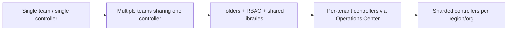
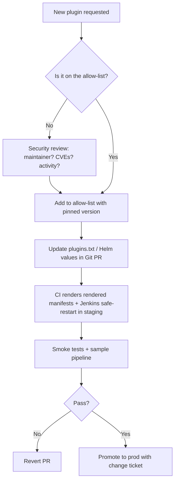
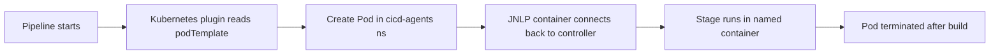
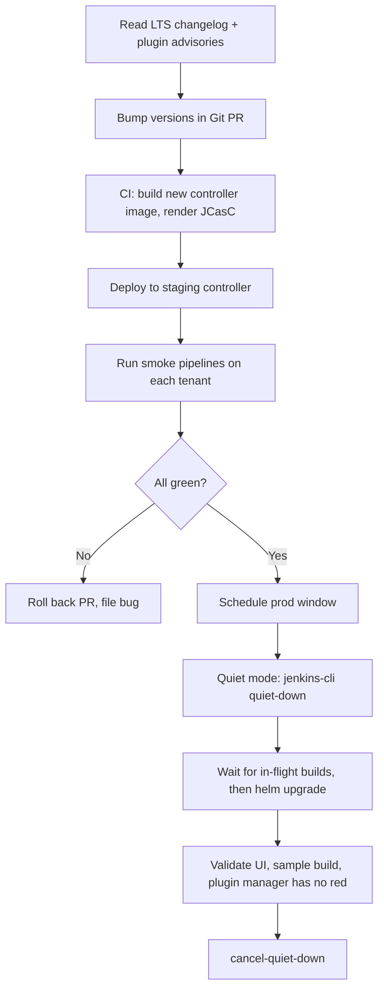
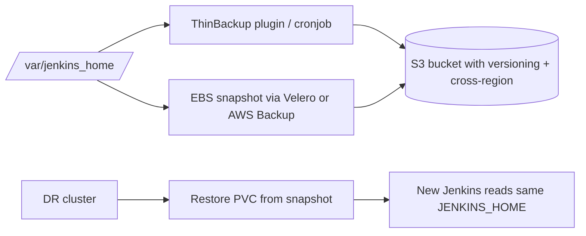

# 04. Jenkins at Scale — Controller, Agents, Plugins, Multi-Tenancy

> **JD line items covered**
> - Jenkins controller and agent architecture
> - Installation, upgrades, plugin governance, configuration management
> - Supporting shared and multi-tenant CI environments
> - Container-based Jenkins agents on Kubernetes

---

## 1. Architecture — the parts and how they fail

```mermaid
flowchart TB
    subgraph CTRL[Jenkins controller]
        UI[Web UI / REST API]
        QUEUE[Build queue + scheduler]
        JCASC[JCasC / casc.yaml config]
        PLUGINS[Plugins<br/>HPI/JPI on classpath]
        CRED[Credentials store<br/>encrypted with master.key]
        JOBS[Job DSL / Pipeline definitions]
        HOME[/var/jenkins_home/<br/>config + builds + plugins]
    end
    subgraph K8S[Kubernetes namespace]
        OP[Kubernetes plugin]
        POD1[Agent pod 1<br/>JNLP + tools]
        POD2[Agent pod 2<br/>kaniko]
    end
    subgraph STATIC[Static agents]
        SA1[SSH agent VM]
        SA2[Windows agent]
    end
    DEV[Developer push] --> SCM[(GitHub / Bitbucket)]
    SCM -- webhook --> UI
    UI --> QUEUE
    QUEUE --> OP
    OP -->|provision via API| POD1 & POD2
    QUEUE --> SA1 & SA2
    PLUGINS --- UI
    JCASC --- UI
    CRED --- UI
    JOBS --- HOME
    POD1 & POD2 -.->|JNLP TCP 50000| CTRL
```

| Failure mode | Symptom | First action |
| --- | --- | --- |
| Controller OOM | UI 504, queue stuck | Heap dump, raise `-Xmx`, profile plugins |
| Plugin conflict after upgrade | Crash on startup | `--httpPort=-1 --enableFutureJava` safe mode, revert plugin |
| `JENKINS_HOME` disk full | Builds hang, "no space" | Prune `builds/`, `workspaces/`; check `casc.yaml` retention |
| Agent provisioning fails | Builds Pending | k8s events, RBAC, image pull, namespace quota |
| Mass build failures after upgrade | "Pipeline script not yet approved" | Approve scripts or relax sandbox; use Configuration-as-Code |

---

## 2. Controller deployment patterns

| Pattern | When to use |
| --- | --- |
| Single controller, static VM | <50 teams, simple |
| Single controller on Kubernetes (StatefulSet + PVC) | Most common today |
| **Operations Center + Managed Controllers** (CloudBees) | Multi-tenant, true isolation |
| **Sharded controllers** (per-org / per-region) | Scale beyond one controller's heap |



---

## 3. Installation — Jenkins on Kubernetes with Helm (the standard path)

```bash
helm repo add jenkins https://charts.jenkins.io
helm repo update

cat > jenkins-values.yaml <<'YAML'
controller:
  image:
    registry: docker.io
    repository: jenkins/jenkins
    tag: "2.452.3-lts-jdk21"
  javaOpts: "-Xms2g -Xmx4g -XX:+UseG1GC -Djenkins.install.runSetupWizard=false"
  resources:
    requests: { cpu: "1",   memory: "4Gi" }
    limits:   { cpu: "4",   memory: "6Gi" }
  serviceType: ClusterIP
  ingress:
    enabled: true
    ingressClassName: nginx
    hostName: jenkins.example.com
    tls:
      - { hosts: [jenkins.example.com], secretName: jenkins-tls }
  installPlugins:
    - kubernetes:4246.v...   # pin every plugin
    - workflow-aggregator:600.vb_57cdd26277b_
    - git:5.4.1
    - configuration-as-code:1810.v9b_c30a_249a_4c
    - job-dsl:1.87
    - blueocean:1.27.13
    - credentials-binding:687.v619cb_15e923f
    - matrix-auth:3.2.2
  JCasC:
    defaultConfig: true
    configScripts:
      casc: |
        jenkins:
          systemMessage: "Platform CI — owned by sre@example.com"
          numExecutors: 0                      # no builds on controller
          mode: EXCLUSIVE
          authorizationStrategy:
            roleBased:
              roles:
                global:
                  - name: "admin"
                    permissions: ["Overall/Administer"]
                    assignments: ["sre-admins"]
                  - name: "read"
                    permissions: ["Overall/Read","Job/Read"]
                    assignments: ["authenticated"]
          securityRealm:
            oic:
              clientId: "${OIDC_CLIENT_ID}"
              clientSecret: "${OIDC_CLIENT_SECRET}"
              wellKnownOpenIDConfigurationUrl: "https://sso.example.com/.well-known/openid-configuration"
        unclassified:
          location:
            url: "https://jenkins.example.com/"
            adminAddress: "sre@example.com"
        jobs:
          - script: >
              folder('platform') { description('Platform team jobs') }
persistence:
  enabled: true
  storageClass: gp3
  size: 100Gi
agent:
  enabled: false   # use Kubernetes Pod Templates declaratively per-job instead
YAML

helm upgrade --install jenkins jenkins/jenkins \
    -n cicd --create-namespace \
    -f jenkins-values.yaml \
    --atomic --timeout 10m
```

Why this works for platform SRE:
- **Config-as-Code (JCasC):** controller config is reproducible from Git, not the UI.
- **Pinned plugin versions:** upgrades are deliberate and reviewable.
- **`numExecutors: 0`:** controller never runs builds — only schedules them.
- **OIDC SSO:** identity comes from your IdP, not local accounts.

---

## 4. Plugin governance — the policy that prevents Friday outages



Concrete rules:
1. Only **LTS** controller version.
2. Pin every plugin to a specific version in `plugins.txt`.
3. Quarterly upgrade window — read changelogs, run in staging, then prod.
4. Track CVEs via Jenkins Security Advisories RSS.
5. Disable plugins instead of uninstalling first (reversible).

`plugins.txt` for `jenkins-plugin-cli`:
```text
kubernetes:4246.v
workflow-aggregator:600.vb_57cdd26277b_
git:5.4.1
configuration-as-code:1810.v9b_c30a_249a_4c
job-dsl:1.87
credentials-binding:687.v619cb_15e923f
matrix-auth:3.2.2
prometheus:783.v
audit-trail:367.v
```

Custom controller image (so plugins come from the image, not from the UI):
```dockerfile
FROM jenkins/jenkins:2.452.3-lts-jdk21
USER root
COPY plugins.txt /usr/share/jenkins/ref/plugins.txt
RUN jenkins-plugin-cli --plugin-file /usr/share/jenkins/ref/plugins.txt \
 && jenkins-plugin-cli --plugin-file /usr/share/jenkins/ref/plugins.txt --no-download --verify
USER jenkins
ENV JAVA_OPTS="-Djenkins.install.runSetupWizard=false"
```

---

## 5. Container-based agents on Kubernetes (declarative)



`Jenkinsfile` declaring an agent pod inline:
```groovy
pipeline {
  agent {
    kubernetes {
      yaml '''
        apiVersion: v1
        kind: Pod
        metadata:
          labels: { app: jenkins-agent }
        spec:
          serviceAccountName: jenkins-agent
          securityContext: { runAsNonRoot: true, runAsUser: 10001, fsGroup: 10001 }
          containers:
            - name: jnlp
              image: jenkins/inbound-agent:3261.v9c670a_4748a_9-1
              resources:
                requests: { cpu: 100m, memory: 256Mi }
                limits:   { cpu: 500m, memory: 512Mi }
            - name: build
              image: registry.example.com/ci/build-toolchain:2.4.0
              command: ["sleep"]
              args:    ["infinity"]
              resources:
                requests: { cpu: 1, memory: 2Gi }
                limits:   { cpu: 4, memory: 8Gi }
              volumeMounts:
                - { name: cache, mountPath: /home/jenkins/.cache }
            - name: kaniko
              image: gcr.io/kaniko-project/executor:v1.23.0-debug
              command: ["sleep"]
              args:    ["infinity"]
              volumeMounts:
                - { name: kaniko-secret, mountPath: /kaniko/.docker }
          volumes:
            - { name: cache, emptyDir: {} }
            - { name: kaniko-secret, secret: { secretName: ecr-creds, items: [{ key: .dockerconfigjson, path: config.json }] } }
      '''
    }
  }
  options {
    buildDiscarder(logRotator(numToKeepStr: '50'))
    timeout(time: 60, unit: 'MINUTES')
    timestamps()
    ansiColor('xterm')
  }
  stages {
    stage('Checkout')   { steps { checkout scm } }
    stage('Test')       { steps { container('build') { sh 'make test' } } }
    stage('Image build'){
      steps {
        container('kaniko') {
          sh '''/kaniko/executor \
                --dockerfile=Dockerfile \
                --context=$WORKSPACE \
                --destination=registry.example.com/example-api:$(git rev-parse --short HEAD) \
                --cache=true --cache-repo=registry.example.com/example-api/cache'''
        }
      }
    }
  }
  post {
    always  { junit allowEmptyResults: true, testResults: '**/junit*.xml' }
    failure { slackSend channel: '#payments-build', color: 'danger', message: "FAILED: ${env.JOB_NAME} #${env.BUILD_NUMBER}" }
  }
}
```

ServiceAccount + RBAC for the agent namespace:
```yaml
apiVersion: v1
kind: ServiceAccount
metadata: { name: jenkins-agent, namespace: cicd-agents }
---
apiVersion: rbac.authorization.k8s.io/v1
kind: Role
metadata: { name: jenkins-agent, namespace: cicd-agents }
rules:
  - apiGroups: [""]
    resources: ["pods","pods/exec","pods/log"]
    verbs: ["get","list","watch","create","delete"]
---
apiVersion: rbac.authorization.k8s.io/v1
kind: RoleBinding
metadata: { name: jenkins-agent, namespace: cicd-agents }
roleRef: { apiGroup: rbac.authorization.k8s.io, kind: Role, name: jenkins-agent }
subjects:
  - { kind: ServiceAccount, name: jenkins-controller, namespace: cicd }
```

---

## 6. Multi-tenant CI patterns

```mermaid
flowchart LR
    subgraph Controller
      F1[/platform]
      F2[/payments]
      F3[/data-eng]
    end
    F1 --> SLib1[Shared Lib: platform]
    F2 --> SLib2[Shared Lib: payments]
    F3 --> SLib3[Shared Lib: data-eng]
    F1 & F2 & F3 -.RBAC.-> Roles
    F2 --> NSp[Agent ns: cicd-payments]
    F3 --> NSd[Agent ns: cicd-data]
```

Tenancy controls:
- **Folders** per team, with **Folder-scoped credentials** so secrets never leak across teams.
- **Role-Based Authorization Strategy** to bind `team-developer`/`team-admin` roles per folder.
- **Per-tenant agent namespace** with ResourceQuota / LimitRange (capacity isolation).
- **Per-tenant Kubernetes Cloud config** (different ServiceAccount, namespace).
- **Per-tenant shared library** (`@Library('team-payments@1.4.0')`) versioned in Git.
- **Quota controls** in Jenkins itself: `agent.idleMinutes`, `slaveAgentPort`, `executors`.

ResourceQuota for an agent namespace:
```yaml
apiVersion: v1
kind: ResourceQuota
metadata: { name: payments-quota, namespace: cicd-payments }
spec:
  hard:
    requests.cpu: "40"
    requests.memory: "120Gi"
    limits.cpu: "80"
    limits.memory: "240Gi"
    pods: "120"
```

---

## 7. Upgrades — controller + plugins



Quiet-mode and safe restart from CLI:
```bash
java -jar jenkins-cli.jar -auth @token -s https://jenkins.example.com/ quiet-down
# wait for queue to drain
java -jar jenkins-cli.jar -auth @token -s https://jenkins.example.com/ safe-restart
java -jar jenkins-cli.jar -auth @token -s https://jenkins.example.com/ cancel-quiet-down
```

Rollback strategy:
- `helm rollback jenkins <previous-revision>`
- `JENKINS_HOME` is on a PVC — restore from EBS snapshot or Velero if config corrupts.

---

## 8. Backup / DR for `JENKINS_HOME`



Minimal nightly backup CronJob:
```yaml
apiVersion: batch/v1
kind: CronJob
metadata: { name: jenkins-backup, namespace: cicd }
spec:
  schedule: "30 2 * * *"
  jobTemplate:
    spec:
      template:
        spec:
          restartPolicy: OnFailure
          containers:
            - name: backup
              image: amazon/aws-cli:2.17.0
              command: ["/bin/sh","-c"]
              args:
                - |
                  set -e
                  cd /var/jenkins_home
                  tar --exclude='./workspace' --exclude='./caches' \
                      -czf /tmp/jenkins-$(date +%F).tgz .
                  aws s3 cp /tmp/jenkins-$(date +%F).tgz \
                      s3://platform-jenkins-backups/$(date +%F)/jenkins.tgz \
                      --storage-class STANDARD_IA
              volumeMounts: [{ name: home, mountPath: /var/jenkins_home }]
          volumes:
            - { name: home, persistentVolumeClaim: { claimName: jenkins } }
```

Don't forget to back up:
- `secrets/` (encrypted — needs `master.key` from the same controller to decrypt!)
- `jobs/`, `users/`, `config.xml`, `plugins/`, `nodes/`
- Skip `workspace/`, `builds/<n>/log` rotations, and `caches/`.

---

## 9. Capacity & reliability

| Lever | What to tune |
| --- | --- |
| Controller heap | Start `-Xmx4g`; profile with `jcmd <pid> GC.heap_info`; bigger heaps need `-XX:+UseG1GC` |
| Agent throughput | Provision more namespace quota; bump Kubernetes cloud `containerCapStr` |
| Build duration | Cache deps (Nexus, Artifactory, BuildKit registry cache); parallel stages |
| Queue starvation | Per-tenant agent labels + `restrict where this project can be run` |
| Disk hot spot | Move `builds/` to a larger PVC; set `numToKeep` aggressively |
| Plugin overhead | Remove unused plugins (each loads classes into the controller JVM) |

SLOs to publish:
- **Build start latency** (queue → agent): p95 < 60s.
- **Build success rate** for "infra causes": > 99.5%.
- **Controller availability**: 99.9% monthly.
- **Plugin upgrade window meets schedule**: 100%.

---

## 10. Observability for Jenkins

- Enable the **Prometheus plugin** → `/prometheus` endpoint → scrape with Datadog Agent or kube-prometheus.
- Forward **JENKINS_HOME/log/jenkins.log** to Splunk (HEC) — see [Splunk + Datadog deep dive](../basic/06-splunk-datadog-deep-dive.md).
- Track build outcomes with the **Audit Trail plugin** for who-did-what.
- Datadog has a Jenkins integration that auto-decorates traces with pipeline IDs.

Sample alert (Datadog monitor query):
```
avg(last_5m):avg:jenkins.queue.size{*} > 50
```

---

## 11. What good looks like

- **Configuration-as-Code** (JCasC) + plugins-in-image — recreating the controller is `helm install`.
- **Per-team folders**, RBAC, shared libraries, and dedicated agent namespaces with quotas.
- **Pinned plugin versions** with quarterly upgrade discipline; CVE feeds reviewed weekly.
- **Container-based ephemeral agents** on Kubernetes; no long-lived agent VMs you SSH into.
- **Backups tested via restore drill** to a sandbox each quarter.
- **SLOs published** for queue latency, success rate, controller availability.

## 12. Anti-patterns

- Configuring Jenkins by clicking in the UI; no Git trail.
- Auto-updating plugins via the UI — instant Friday outage.
- One huge static EC2 agent pool everyone shares with manual janitoring.
- Storing secrets as build params or environment variables in plain text.
- Letting `JENKINS_HOME` grow on the controller's local disk forever.
- Treating Jenkins as a pet ("the build is broken because Jenkins did a thing").
- Running pipelines as `root` on agents; mounting `docker.sock` everywhere.

---

## 13. References

- Jenkins docs — [jenkins.io/doc](https://www.jenkins.io/doc/)
- Jenkins Helm chart — [github.com/jenkinsci/helm-charts](https://github.com/jenkinsci/helm-charts)
- Configuration as Code — [plugins.jenkins.io/configuration-as-code](https://plugins.jenkins.io/configuration-as-code/)
- Kubernetes plugin — [plugins.jenkins.io/kubernetes](https://plugins.jenkins.io/kubernetes/)
- Jenkins LTS upgrade guide — [jenkins.io/doc/upgrade-guide](https://www.jenkins.io/doc/upgrade-guide/)
- Security advisories — [jenkins.io/security/advisories](https://www.jenkins.io/security/advisories/)
- CloudBees CI — [docs.cloudbees.com/docs/cloudbees-ci](https://docs.cloudbees.com/docs/cloudbees-ci/latest/)
