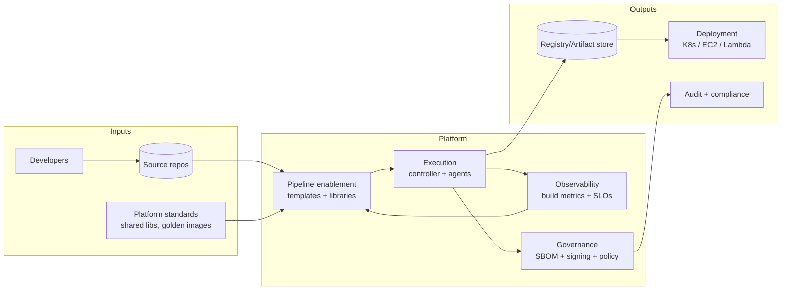
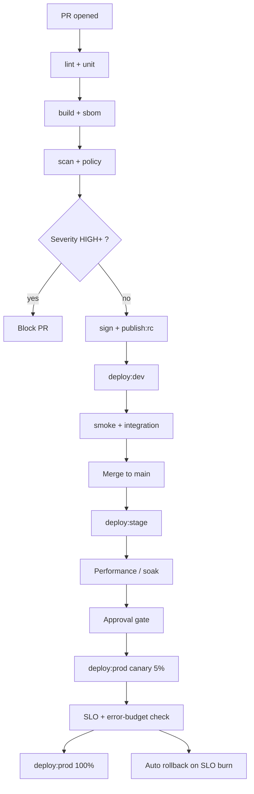
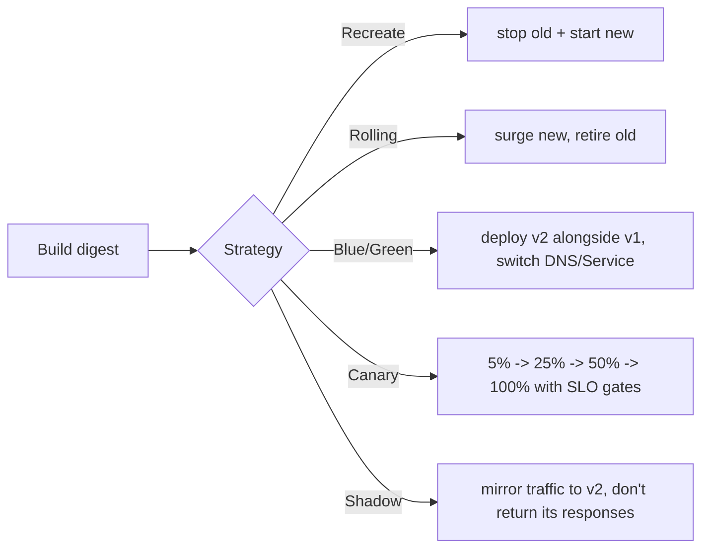
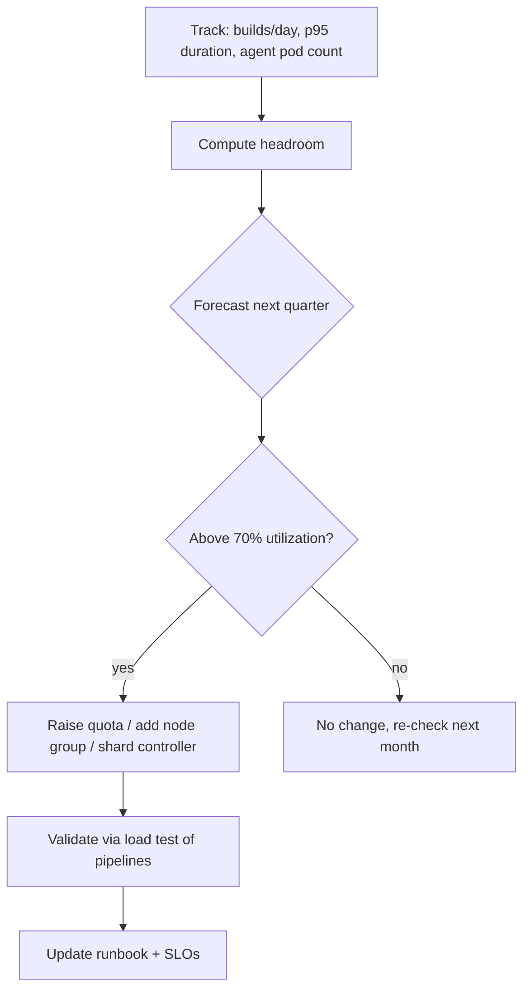
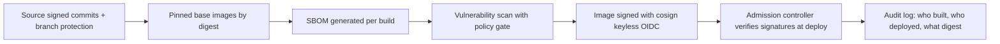
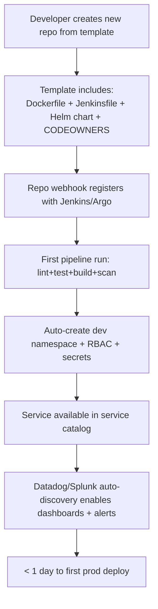

# 05. CI/CD Platform Engineering

> **JD line items covered**
> - Pipeline enablement frameworks and standards
> - Build, test, and deployment automation patterns
> - CI platform reliability and capacity planning

This is the doc you read **after** [11 Jenkins at scale](11-jenkins-at-scale.md) — Jenkins is the *tool*, this doc is the *platform discipline*.

---

## 1. What a CI/CD platform actually delivers



A platform team's job is **not** to write every team's pipelines. It is to provide:

1. **Paved roads** — shared libraries and templates that handle 80% of needs.
2. **Standards** — what "deployable" means, what must pass before prod.
3. **Operational excellence** — capacity, reliability, security of the CI fabric itself.
4. **Self-service onboarding** — a team can ship a new service in < 1 day.

---

## 2. Pipeline enablement framework — the contract

Define a **deployable artifact contract** that every service must satisfy:

| Stage | Required output |
| --- | --- |
| `lint` | Style, format, secret scan, license scan |
| `unit` | Test report (`junit*.xml`), coverage |
| `build` | OCI image (digest), SBOM (`syft`), license report |
| `scan` | Vulnerabilities (`trivy`), policy gate |
| `sign` | `cosign` signature + attestations |
| `publish` | Push to registry, immutable tag + digest |
| `deploy:dev` | Argo/Helm deploys to dev, runs smoke |
| `deploy:stage` | Same, on green only |
| `deploy:prod` | Manual or progressive (canary/blue-green) |

Anything below that, individual teams may extend. Anything *above* that, platform owns.



---

## 3. Shared library — the paved-road implementation (Jenkins example)

Repo layout:
```
shared-library/
├── vars/
│   ├── platformPipeline.groovy
│   ├── platformBuild.groovy
│   ├── platformScan.groovy
│   └── platformDeploy.groovy
├── src/
│   └── com/example/platform/
│       ├── Image.groovy
│       └── Slo.groovy
└── resources/
    └── policies/opa.rego
```

`vars/platformPipeline.groovy`:
```groovy
def call(Map cfg) {
  pipeline {
    agent { kubernetes { yaml libraryResource('agents/default.yaml') } }
    options {
      buildDiscarder(logRotator(numToKeepStr: '50'))
      timeout(time: 60, unit: 'MINUTES')
      timestamps()
      disableConcurrentBuilds()
    }
    environment {
      IMAGE = "${cfg.registry}/${cfg.name}"
      SHA   = "${env.GIT_COMMIT?.take(7)}"
    }
    stages {
      stage('Lint')   { steps { platformLint(cfg) } }
      stage('Unit')   { steps { platformTest(cfg) } }
      stage('Build')  { steps { platformBuild(cfg) } }
      stage('Scan')   { steps { platformScan(cfg) } }
      stage('Sign')   { steps { platformSign(cfg) } }
      stage('Publish'){ steps { platformPublish(cfg) } }
      stage('Deploy: dev')   { when { branch 'main' }; steps { platformDeploy(cfg, 'dev') } }
      stage('Deploy: stage') { when { branch 'main' }; steps { platformDeploy(cfg, 'stage') } }
      stage('Approve prod')  {
        when { branch 'main' }
        steps { input message: "Promote ${IMAGE}:${SHA} to prod?", ok: 'Deploy' }
      }
      stage('Deploy: prod')  { when { branch 'main' }; steps { platformDeploy(cfg, 'prod') } }
    }
    post {
      always  { junit allowEmptyResults: true, testResults: '**/junit*.xml' }
      failure { platformNotify(cfg, 'failure') }
      success { platformNotify(cfg, 'success') }
    }
  }
}
```

Team's `Jenkinsfile` becomes 10 lines:
```groovy
@Library('platform@1.6.0') _
platformPipeline(
  name:     'payments-api',
  registry: 'registry.example.com',
  helmChart:'charts/api',
  slo:      'payments-api-availability',
  owners:   ['payments-sre@example.com']
)
```

---

## 4. Same idea in GitHub Actions / GitLab CI (reusable workflow)

GitHub Actions reusable workflow `.github/workflows/platform-pipeline.yml`:
```yaml
name: platform-pipeline
on:
  workflow_call:
    inputs:
      name:        { required: true,  type: string }
      registry:    { required: true,  type: string }
      helm-chart:  { required: true,  type: string }
      slo:         { required: false, type: string }
jobs:
  ci:
    runs-on: ubuntu-22.04
    permissions:
      contents: read
      id-token: write   # OIDC to AWS, no static keys
      packages: write
    steps:
      - uses: actions/checkout@v4
      - uses: actions/setup-buildx-action@v3
      - name: Trivy fs scan
        uses: aquasecurity/trivy-action@0.20.0
        with: { scan-type: fs, severity: HIGH,CRITICAL, exit-code: '1' }
      - name: Build & push (digest output)
        id: build
        uses: docker/build-push-action@v6
        with:
          push: true
          tags: ${{ inputs.registry }}/${{ inputs.name }}:${{ github.sha }}
      - name: SBOM
        uses: anchore/sbom-action@v0
        with: { image: ${{ inputs.registry }}/${{ inputs.name }}:${{ github.sha }} }
      - name: Cosign sign
        uses: sigstore/cosign-installer@v3
      - run: cosign sign --yes ${{ inputs.registry }}/${{ inputs.name }}@${{ steps.build.outputs.digest }}
      - name: Helm deploy dev
        run: |
          helm upgrade --install ${{ inputs.name }} ${{ inputs.helm-chart }} \
            -n dev --atomic --timeout 5m \
            --set image.digest=${{ steps.build.outputs.digest }}
```

Team's caller:
```yaml
jobs:
  ci:
    uses: org/platform-workflows/.github/workflows/platform-pipeline.yml@v1.6.0
    with: { name: payments-api, registry: ghcr.io/org, helm-chart: ./charts/api, slo: payments-api-availability }
```

---

## 5. Deployment automation patterns



| Pattern | When | Tooling |
| --- | --- | --- |
| Rolling | Stateless web tier, default | K8s `RollingUpdate`, Helm |
| Blue/Green | DB-coupled, fast rollback | Argo Rollouts, ALB target group swap |
| Canary | Progressive rollout with metrics | Argo Rollouts + Datadog/Prometheus checks |
| Shadow | Validate new logic at prod scale | Service mesh (Istio mirror), Diffy |
| Feature flag | Decouple deploy from release | LaunchDarkly, OpenFeature, Unleash |

Argo Rollout (canary) example:
```yaml
apiVersion: argoproj.io/v1alpha1
kind: Rollout
metadata: { name: api, namespace: payments }
spec:
  replicas: 10
  strategy:
    canary:
      canaryService: api-canary
      stableService: api-stable
      trafficRouting:
        nginx: { stableIngress: api }
      steps:
        - setWeight: 5
        - pause:    { duration: 2m }
        - analysis:
            templates: [{ templateName: success-rate }]
        - setWeight: 25
        - pause:    { duration: 5m }
        - analysis:
            templates: [{ templateName: success-rate }]
        - setWeight: 50
        - pause:    { duration: 5m }
        - setWeight: 100
  selector:    { matchLabels: { app: api } }
  template:    { metadata: { labels: { app: api } }, spec: { containers: [{ name: api, image: registry.example.com/api@sha256:... }] } }
---
apiVersion: argoproj.io/v1alpha1
kind: AnalysisTemplate
metadata: { name: success-rate, namespace: payments }
spec:
  metrics:
    - name: success-rate
      interval: 1m
      successCondition: result[0] >= 0.995
      failureLimit: 2
      provider:
        prometheus:
          address: http://prometheus.monitoring:9090
          query: |
            sum(rate(http_requests_total{job="api",code!~"5.."}[1m]))
            / sum(rate(http_requests_total{job="api"}[1m]))
```

---

## 6. Build, test, deploy — the standards

### Build
- **Reproducible:** same source + same digest. Use BuildKit caching, pin base images.
- **Single source of truth for versions:** Git tag → image tag → Helm chart `appVersion`.
- **No "snapshot" tags in prod**, ever.

### Test
- **Test pyramid:** lots of unit, fewer integration, very few E2E.
- **Smoke tests after every deploy** (synthetic + endpoint check).
- **Quality gates fail the build**, not the deploy.

### Deploy
- **Idempotent** — running the deploy twice yields the same state.
- **Atomic** — `helm upgrade --atomic` or `argo rollouts undo`.
- **Auditable** — every deploy ties to a commit, a digest, a deployer identity.

---

## 7. CI platform reliability — SLOs you should run with

| SLO | Target | Why |
| --- | --- | --- |
| Build start latency (queue → agent assigned) | p95 < 60s | Developer productivity |
| Pipeline success rate (excluding test failures) | > 99.5% | Trust in the platform |
| Mean queue length | < 10 | Capacity headroom |
| Plugin/runner CVE remediation | < 14 days | Security |
| Restore-from-backup drill | quarterly success | DR |
| Onboarding time for a new service | < 1 day | Self-service |

Capacity planning loop:


Useful formulas:
- **Concurrent agents** needed = peak builds × avg duration ÷ work hours.
- **Controller heap** = baseline + ~50 MB per 1k active jobs (rule of thumb; measure).
- **Registry storage** = avg image size × tags retained × services.

---

## 8. CI platform security & supply chain



Concrete controls:
- **OIDC to cloud** from CI runners — no static AWS keys.
- **Branch protection** on `main`: required reviews, status checks, signed commits.
- **CODEOWNERS** for `Jenkinsfile`, Helm charts, IaC modules.
- **Allow-listed plugins/actions** only — see [10 Git workflows + governance](10-git-workflows-collaboration.md).
- **SBOM stored alongside image** in registry / OCI artifact.
- **Verify signatures at deploy time** (Kyverno `verifyImages`, sigstore policy controller).

Kyverno verify-image policy:
```yaml
apiVersion: kyverno.io/v1
kind: ClusterPolicy
metadata: { name: verify-platform-images }
spec:
  validationFailureAction: Enforce
  rules:
    - name: verify-signatures
      match: { any: [{ resources: { kinds: [Pod] } }] }
      verifyImages:
        - imageReferences: ["registry.example.com/*"]
          attestors:
            - entries:
                - keyless:
                    issuer:  "https://token.actions.githubusercontent.com"
                    subject: "https://github.com/org/*"
```

---

## 9. Observability of the CI platform itself

Always track these — covered fully in [Splunk + Datadog deep dive](../basic/06-splunk-datadog-deep-dive.md):

- **Datadog dashboard:** build duration p50/p95/p99, queue size, agent provisioning latency, success rate by team.
- **Splunk index:** controller logs, audit log, agent JNLP errors.
- **Synthetic build:** a no-op pipeline runs every 5 minutes to detect platform degradation before users do.
- **Alerts:**
  - Build success rate < 99% for 15m → page platform on-call.
  - Queue > 50 for 5m → page platform on-call.
  - Synthetic build duration > 2× baseline → page.

---

## 10. Onboarding workflow (self-service)



What the template repo provides out of the box:
- Production-grade Dockerfile (see [13 Docker deep dive](13-docker-deep-dive.md)).
- Helm chart with HPA + PDB + NetworkPolicy (see [08 EKS/Docker platform ops](08-eks-docker-platform-ops.md) and the [K8s repo](../../K8s/knowledge/)).
- `Jenkinsfile` calling `platformPipeline()`.
- `CODEOWNERS`, branch protection JSON, PR template.
- README explaining the contract.

---

## 11. What good looks like

- Teams add a new service via a **template + 10-line `Jenkinsfile`**; platform handles the rest.
- Every prod deploy is traceable to **{commit, digest, signature, deployer, change ticket}**.
- The platform itself runs with **published SLOs** and synthetic monitoring.
- **Rollbacks are one command** (or automatic on SLO burn).
- Capacity is planned quarterly; we never page because "Jenkins is full".
- Supply chain is signed, scanned, and verified at admission.

## 12. Anti-patterns

- Every team has its own bespoke `Jenkinsfile` of 500+ lines.
- Deploys are manual scripts in someone's shell history.
- "Snapshot" / `:latest` images deployed to prod.
- No record of what was deployed when, by whom, from what commit.
- Build failures are quietly retried until green.
- CI runs as a privileged service that can write anywhere in cloud.
- Capacity is reactive — pages drive scale-up, not planning.

---

## 13. References

- Continuous Delivery — [continuousdelivery.com](https://continuousdelivery.com/)
- Google "Accelerate" / DORA metrics — [dora.dev](https://dora.dev/)
- SLSA supply chain levels — [slsa.dev](https://slsa.dev/)
- Sigstore — [sigstore.dev](https://www.sigstore.dev/)
- Argo Rollouts — [argo-rollouts.readthedocs.io](https://argo-rollouts.readthedocs.io/)
- GitHub Actions reusable workflows — [docs.github.com/actions/using-workflows/reusing-workflows](https://docs.github.com/en/actions/using-workflows/reusing-workflows)
- Companion: [11-jenkins-at-scale.md](11-jenkins-at-scale.md), [10-git-workflows-collaboration.md](10-git-workflows-collaboration.md)
