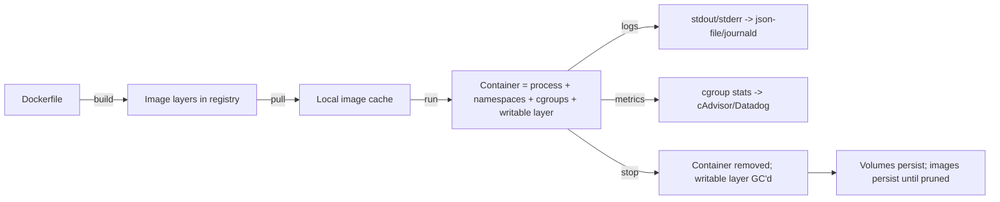
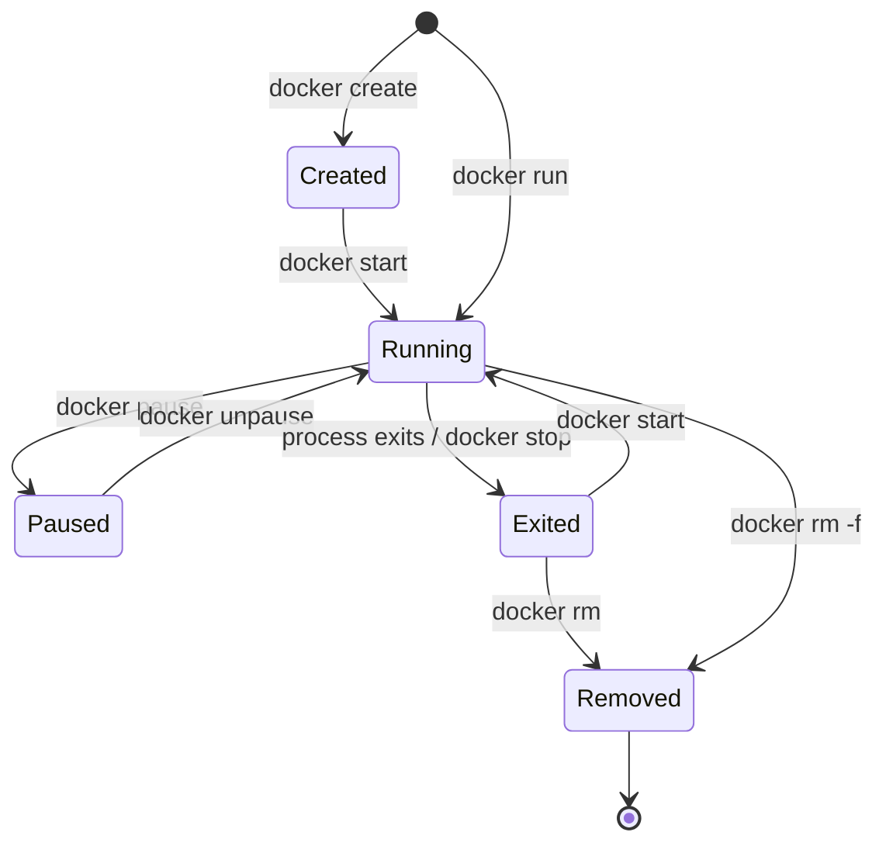
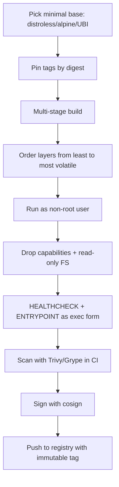
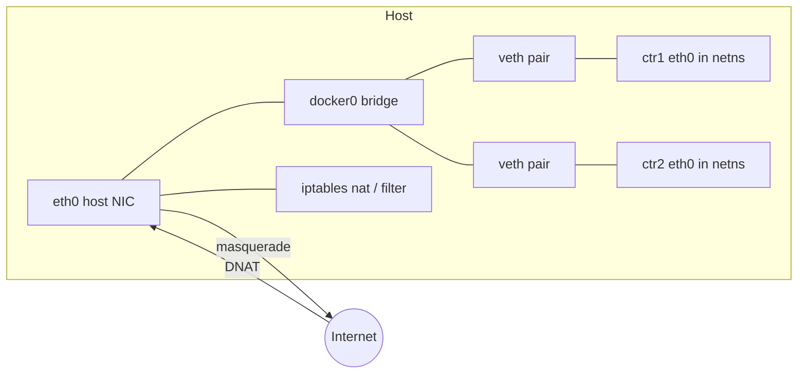

# 02. Docker Deep Dive for Platform SRE

> **JD line items covered**
> - Image and container lifecycle management
> - Dockerfile authoring and image optimization
> - Container networking and runtime troubleshooting

---

## 1. Mental model — what Docker actually is

Docker is a **CLI + daemon** that uses **Linux primitives** to package and run processes:

- **Namespaces** (PID / NET / MNT / UTS / IPC / USER) → isolation
- **cgroups v2** → resource limits (CPU, memory, IO, PIDs)
- **OverlayFS** → layered, copy-on-write filesystems
- **Capabilities + seccomp + AppArmor/SELinux** → privilege reduction

An image is a **stack of read-only layers**. A container is a **writable layer + a process** running with those namespaces and cgroups applied.



---

## 2. Lifecycle — every state and the command that moves between them



**Lifecycle cheat sheet:**
```bash
docker pull alpine:3.20                 # fetch image
docker create --name a alpine:3.20 sleep 600
docker start a                          # Created -> Running
docker pause a && docker unpause a      # SIGSTOP / SIGCONT via cgroups freezer
docker stop a                           # SIGTERM, then SIGKILL after --time (10s)
docker kill --signal=SIGHUP a           # send arbitrary signal
docker rm a                             # remove the container record
docker image prune -af                  # remove unreferenced images
docker system df                        # see what's eating disk
docker system prune -af --volumes       # full cleanup (CAREFUL)
```

---

## 3. Dockerfile authoring — the production rules



### Anti-pattern Dockerfile (do NOT do this)
```dockerfile
FROM ubuntu:latest
RUN apt-get update && apt-get install -y python3 python3-pip curl git
COPY . /app
RUN pip3 install -r /app/requirements.txt
EXPOSE 8080
CMD python3 /app/server.py
```
Problems: `:latest` tag, runs as root, copies everything (including `.git`), reinstalls toolchain on every code change, no healthcheck, shell-form CMD swallows signals, no scan/sign.

### Production-grade Dockerfile (Python web app)
```dockerfile
# syntax=docker/dockerfile:1.7

# ---------- Stage 1: build ----------
FROM python:3.12-slim AS builder
ENV PIP_NO_CACHE_DIR=1 \
    PYTHONDONTWRITEBYTECODE=1 \
    PYTHONUNBUFFERED=1
WORKDIR /build

# Install build deps only here
RUN apt-get update && apt-get install -y --no-install-recommends \
        build-essential gcc \
    && rm -rf /var/lib/apt/lists/*

COPY requirements.txt .
RUN pip install --prefix=/install -r requirements.txt

# ---------- Stage 2: runtime ----------
FROM python:3.12-slim AS runtime
LABEL org.opencontainers.image.source="https://github.com/example/app" \
      org.opencontainers.image.title="example-api" \
      org.opencontainers.image.licenses="Apache-2.0"

ENV PATH=/install/bin:$PATH \
    PYTHONPATH=/install/lib/python3.12/site-packages \
    PYTHONUNBUFFERED=1 \
    APP_PORT=8080

# Create non-root user
RUN groupadd --system app && useradd --system --gid app --home /app app
WORKDIR /app

# Copy only what's needed at runtime
COPY --from=builder /install /install
COPY --chown=app:app app/ /app/

USER app
EXPOSE 8080
HEALTHCHECK --interval=10s --timeout=2s --start-period=15s --retries=3 \
    CMD python -c "import urllib.request,sys; \
        sys.exit(0 if urllib.request.urlopen('http://127.0.0.1:8080/healthz').status==200 else 1)"

ENTRYPOINT ["python", "-m", "uvicorn"]
CMD ["app.main:app", "--host", "0.0.0.0", "--port", "8080"]
```

### `.dockerignore` (always ship one)
```
.git
.gitignore
.venv
__pycache__/
*.pyc
node_modules
tests/
*.md
.env*
Dockerfile*
docker-compose*.yml
```

### Build with BuildKit cache mounts (CI-friendly)
```dockerfile
RUN --mount=type=cache,target=/root/.cache/pip \
    pip install --prefix=/install -r requirements.txt
```

```bash
DOCKER_BUILDKIT=1 docker build \
  --build-arg BUILDKIT_INLINE_CACHE=1 \
  --cache-from registry.example.com/example-api:cache \
  --tag registry.example.com/example-api:$(git rev-parse --short HEAD) \
  --tag registry.example.com/example-api:cache \
  --push .
```

---

## 4. Image optimization — practical wins

| Technique | Typical savings |
| --- | --- |
| Multi-stage build (drop toolchain) | 200-500 MB |
| Alpine / distroless base | 100-300 MB |
| `--no-install-recommends` + `rm -rf /var/lib/apt/lists/*` | 50-150 MB |
| Combine `RUN` steps (reduce layers) | 10-50 MB |
| `.dockerignore` to skip `.git`, `node_modules`, `tests/` | varies, often huge |
| BuildKit cache mounts | rebuild time, not size |
| Strip binaries (`strip /usr/local/bin/myapp`) | 5-30 MB for Go/C |

### Concrete before/after
```bash
docker images example-api
# REPOSITORY     TAG       SIZE
# example-api    naive     1.05GB
# example-api    multi     124MB
# example-api    distroless 78MB
```

Inspect what's inside a layer:
```bash
docker history --no-trunc example-api:multi
# Or with dive (https://github.com/wagoodman/dive)
dive example-api:multi
```

---

## 5. Container networking — what you must know



### Default network drivers
| Driver | Use case |
| --- | --- |
| `bridge` (default) | Single-host containers, isolated subnet, NAT to host |
| `host` | Container shares host network namespace (no NAT, fastest, no isolation) |
| `none` | No network at all (security-sensitive sidecars) |
| `overlay` | Multi-host (Swarm / external); Kubernetes uses its own CNI instead |
| `macvlan` | Container gets a real MAC/IP on the L2 segment (rare in cloud) |

### Hands-on: inspect what Docker actually did
```bash
# Create two containers on a user-defined bridge (DNS resolution works between them)
docker network create --driver bridge --subnet 172.30.0.0/24 demo-net

docker run -d --name web    --network demo-net nginx:alpine
docker run -it --rm --name client --network demo-net alpine:3.20 \
    sh -c 'apk add --no-cache curl && curl -s http://web && echo OK'

# Inspect Linux side
ip -br link | grep -E 'docker|veth'         # bridges + veth pairs
sudo iptables -t nat -L DOCKER -n           # DNAT rules per published port
docker network inspect demo-net | jq '.[0].Containers'
sudo nsenter -t $(docker inspect -f '{{.State.Pid}}' web) -n ip a
```

### Publish a port — what `-p 8080:80` actually does
```bash
docker run -d --name nginx -p 8080:80 nginx:alpine

# Under the hood
sudo iptables -t nat -L DOCKER -n | grep 8080
# DNAT       tcp  --  0.0.0.0/0   0.0.0.0/0  tcp dpt:8080 to:172.17.0.x:80
```

### Custom DNS (e.g., your corporate resolver)
```bash
docker run --dns 10.0.0.2 --dns-search corp.example.com alpine:3.20 nslookup ldap.corp.example.com
```

---

## 6. Runtime troubleshooting — the playbook

```mermaid
flowchart TD
    A[Container failing] --> B[docker ps -a | grep <name>]
    B --> C{Exit code?}
    C -- 0 --> D[Process exited cleanly; CMD probably wrong]
    C -- 137 --> E[SIGKILL: OOM or docker kill]
    C -- 139 --> F[SIGSEGV: app bug]
    C -- 143 --> G[SIGTERM: graceful stop]
    C -- other --> H[docker logs --tail 200]
    E --> I[dmesg -T | grep -i oom; check --memory limit]
    H --> J[Reproduce: docker run -it --entrypoint sh image:tag]
    J --> K[docker exec into a running ctr; strace/tcpdump]
    K --> L[docker inspect for mounts/env/network]
    L --> M[Capture, then fix Dockerfile or runtime args]
```

### Toolkit
```bash
# Logs (driver = json-file by default)
docker logs --tail 200 -f <ctr>

# Live resource usage
docker stats --no-stream

# Inside a running container (no shell? use a debug sidecar)
docker exec -it <ctr> sh
docker run -it --rm --pid=container:<ctr> --net=container:<ctr> \
    --cap-add SYS_PTRACE nicolaka/netshoot

# Process tree from host
ps -ef --forest | grep -A2 containerd-shim

# Inspect everything
docker inspect <ctr> | jq '.[0] | {Mounts,NetworkSettings,State,HostConfig}'

# Disk explosion?
docker system df -v
du -sh /var/lib/docker/* | sort -h | tail
```

### Common failures and fixes

| Symptom | Root cause | Fix |
| --- | --- | --- |
| Exit 137, dmesg shows oom-killer | Memory limit too low / leak | Raise `--memory`, fix leak, set GC envs (Java `-Xmx`, Node `--max-old-space-size`) |
| `connection refused` from sibling container | On default bridge — no DNS | Use a user-defined network |
| Container slow disk | Default overlay2 + heavy writes | Mount a volume, or use `--storage-opt size=` (ext4 base) |
| Signals ignored, slow shutdown | Shell-form CMD or PID 1 doesn't reap | Use exec-form CMD/ENTRYPOINT; `--init` or `tini` |
| Image too big | Single-stage, full toolchain in runtime | Multi-stage + slim/distroless base |
| Image pull 429 | Docker Hub rate limit | Use auth or mirror through ECR/registry |

---

## 7. Security baseline

```bash
# Run as non-root, read-only FS, drop caps, no new privs
docker run -d --name api \
  --read-only \
  --tmpfs /tmp:rw,size=64m,mode=1777 \
  --cap-drop ALL --cap-add NET_BIND_SERVICE \
  --security-opt no-new-privileges:true \
  --pids-limit 200 \
  --memory 512m --cpus 0.5 \
  --user 10001:10001 \
  example-api:1.4.0
```

Scan images in CI:
```bash
trivy image --severity HIGH,CRITICAL --exit-code 1 \
    registry.example.com/example-api:1.4.0
```

Sign and verify (Sigstore cosign):
```bash
cosign sign --key cosign.key registry.example.com/example-api:1.4.0
cosign verify --key cosign.pub registry.example.com/example-api:1.4.0
```

---

## 8. Workflow — full local-to-prod path for a service

```mermaid
flowchart LR
    A[Dev: docker build + run on laptop] --> B[Commit Dockerfile to Git]
    B --> C[Jenkins pipeline: lint + test + build]
    C --> D[Trivy scan + cosign sign]
    D --> E[Push immutable tag to ECR/registry]
    E --> F[Helm chart references digest]
    F --> G[Argo/Jenkins deploys to staging]
    G --> H[Datadog dashboards + smoke tests]
    H --> I[Promote to prod with same digest]
```



### Example Compose for local dev
```yaml
# docker-compose.yml
services:
  api:
    build:
      context: .
      target: runtime
    image: example-api:dev
    ports: ["8080:8080"]
    environment:
      DATABASE_URL: postgres://app:app@db:5432/app
    depends_on:
      db:
        condition: service_healthy
    read_only: true
    tmpfs: ["/tmp"]
    healthcheck:
      test: ["CMD", "wget", "-qO-", "http://localhost:8080/healthz"]
      interval: 10s
      timeout: 2s
      retries: 3
  db:
    image: postgres:16-alpine
    environment:
      POSTGRES_USER: app
      POSTGRES_PASSWORD: app
      POSTGRES_DB: app
    volumes: ["pgdata:/var/lib/postgresql/data"]
    healthcheck:
      test: ["CMD", "pg_isready", "-U", "app"]
      interval: 5s
      retries: 10
volumes:
  pgdata:
```

```bash
docker compose up -d
docker compose ps
docker compose logs -f api
docker compose down -v        # tear it all down
```

---

## 9. What good looks like

- **Every image is built in CI** from a pinned base, multi-stage, non-root, with `HEALTHCHECK` and exec-form `ENTRYPOINT`.
- Images are **scanned, signed, and referenced by digest** in Helm/manifests.
- Containers run with **resource limits, dropped caps, read-only root FS, and no-new-privileges**.
- Registry has **immutable tags + retention policy**; no `:latest` in deployments.
- Engineers can **reproduce a prod failure locally** with `docker run` using the same digest.

## 10. Anti-patterns

- `FROM ubuntu:latest`, root user, `RUN apt-get install` salad.
- Shell-form `CMD` that swallows signals and never gracefully shuts down.
- Pushing to `:latest` and relying on tag mutation for rollouts.
- Mounting the Docker socket (`/var/run/docker.sock`) into containers without a hardened reason.
- Ignoring `docker system df` until disk fills and the daemon crashes.
- No `HEALTHCHECK`, so orchestrators can't detect a wedged container.

---

## 11. References

- Docker docs — [docs.docker.com](https://docs.docker.com/)
- BuildKit — [docs.docker.com/build/buildkit](https://docs.docker.com/build/buildkit/)
- Distroless images — [github.com/GoogleContainerTools/distroless](https://github.com/GoogleContainerTools/distroless)
- OCI Image Spec — [github.com/opencontainers/image-spec](https://github.com/opencontainers/image-spec)
- CIS Docker Benchmark — [cisecurity.org](https://www.cisecurity.org/benchmark/docker)
- Trivy — [aquasecurity.github.io/trivy](https://aquasecurity.github.io/trivy/)
- Sigstore cosign — [docs.sigstore.dev/cosign/overview](https://docs.sigstore.dev/cosign/overview/)
