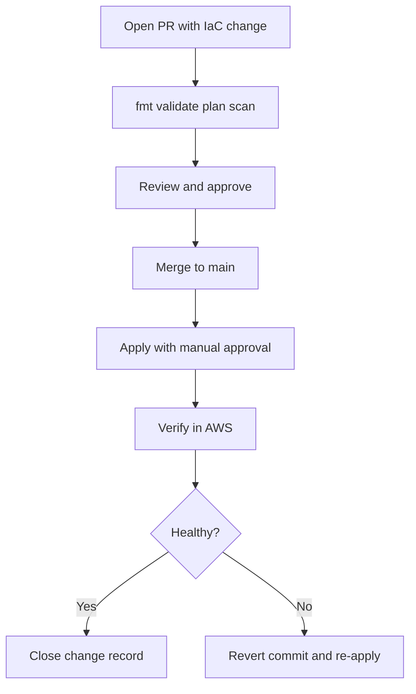
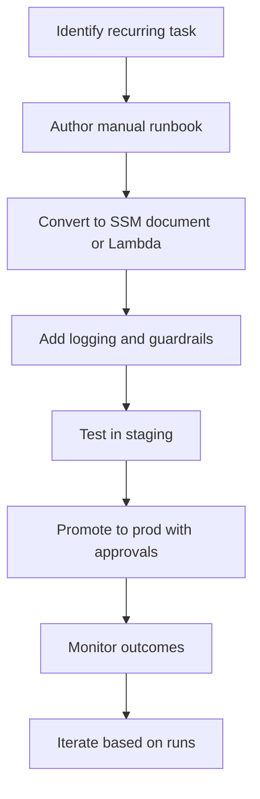
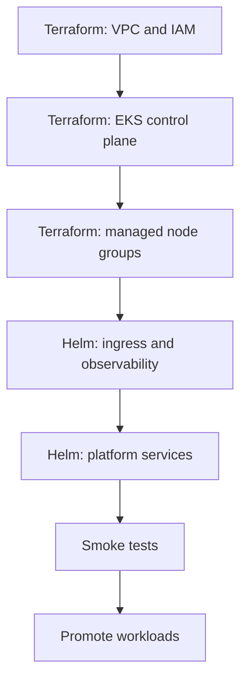

# Q&A: Automation, IaC, and Runbooks (Deep Dive)

Pairs with: [04-automation-iac.md](../04-automation-iac.md)

> 10 interview-grade questions on Infrastructure as Code and automation in AWS. Answers are deeper than the other topics, since IaC and automation are core SRE skills. All content is from public sources: AWS docs, AWS Well-Architected Framework, public Terraform and Helm docs, and general SRE practice.

---

## Q1. What is Infrastructure as Code, and why is it critical for SRE on AWS?
**Answer:**  
- IaC is the practice of defining infrastructure (VPCs, EKS, RDS, IAM, S3, etc.) in version-controlled files and applying them through pipelines instead of clicking in the AWS Console.  
- It is critical for SRE because it:
  - Eliminates configuration drift across environments.
  - Makes every change reviewable as a Git pull request.
  - Provides an audit trail of who changed what and when.
  - Enables fast disaster recovery: re-apply the code to rebuild.
  - Aligns with the **Operational Excellence** pillar of the AWS Well-Architected Framework.
- In an interview, link IaC to specific outcomes: faster MTTR, lower change failure rate, repeatable environments, and safer scaling.

## Q2. Compare Terraform, AWS CloudFormation, and AWS CDK. When would you choose each?
**Answer:**  
- **Terraform (HashiCorp)**
  - Multi-cloud, huge provider ecosystem, mature module pattern.
  - Best when you need consistency across AWS, Azure, GCP, and SaaS providers (Datadog, GitHub, etc.).
  - Requires you to manage state yourself (S3 + DynamoDB lock is the common pattern).
- **AWS CloudFormation**
  - Native AWS service, state is managed by AWS, supports StackSets across accounts/regions.
  - Tight integration with Service Catalog, drift detection, and rollback on stack failure.
  - Best when the org is AWS-only and wants AWS-managed state and governance.
- **AWS CDK**
  - You write infrastructure in Python, TypeScript, Java, or Go. CDK synthesizes CloudFormation under the hood.
  - Best when developers want code abstractions (loops, conditions, OO patterns) and unit tests over YAML/HCL.
- A common pattern: use Terraform for the AWS foundation (accounts, networking, IAM, EKS) and Helm for in-cluster apps.

## Q3. How do you manage Terraform state safely at scale across multiple teams and accounts?
**Answer:**  
- Store state remotely, never locally:
  - **S3 backend** with server-side encryption (KMS) and **versioning enabled**.
  - **DynamoDB table** for state locking to prevent concurrent applies.
- Use **one state file per stack** (per environment, per component). Avoid one giant state.
- Restrict access using IAM policies; only the CI role can write state.
- Never commit `terraform.tfstate` or `*.tfvars` with secrets to Git.
- For multi-account setups, store each account's state in a central tooling account or per-account, depending on blast-radius preference.
- Use `terraform state` commands carefully; treat state mutation as a privileged operation.
- Back up state regularly (S3 versioning gives you this automatically).

## Q4. How do you organize Terraform code for multiple environments and AWS accounts?
**Answer:**  
- **Modules** for reusable components: `modules/vpc`, `modules/eks`, `modules/rds`.
- **Root configurations** per environment: `envs/dev`, `envs/staging`, `envs/prod`, each calling the modules with different inputs.
- Keep environments in **separate AWS accounts** (Control Tower / Organizations) for blast-radius isolation.
- Use **remote state data sources** to share outputs across stacks (e.g., the network stack outputs the VPC ID, which the EKS stack consumes).
- Pin module versions (Git tags or Terraform Registry versions) so prod doesn't drift just because main moved.
- Common anti-patterns to avoid:
  - One mono-state for everything.
  - Copy-pasting the same resources per environment.
  - Manual edits in the AWS Console that bypass IaC.

## Q5. How do you detect and remediate infrastructure drift on AWS?
**Answer:**  
- **Detection options:**
  - Run `terraform plan` on a schedule in CI. If the plan is non-empty in an environment that should be stable, you have drift.
  - CloudFormation has built-in **drift detection** per stack.
  - **AWS Config** can detect resource-level changes and non-compliant configurations.
- **Common causes of drift:**
  - Engineers clicking in the Console for "quick fixes".
  - Auto-scaling or AWS-managed updates changing attributes Terraform tracks.
  - Out-of-band scripts.
- **Remediation:**
  - If the change is desired, port it into IaC and re-apply.
  - If undesired, run `terraform apply` to revert.
  - Use **IAM policies** to restrict write access in prod accounts so only CI roles can change infrastructure.
  - Track recurring drift sources and fix the root cause (training, permissions, or automation).

## Q6. Walk me through a safe IaC CI/CD pipeline for Terraform on AWS, including rollback.
**Answer:**  
- A common public pattern:
  1. **PR opened** with infra change.
  2. CI runs `terraform fmt -check`, `terraform validate`, `tflint`, and security scanners like `tfsec` or `checkov`.
  3. CI runs `terraform plan` and posts the plan as a PR comment for human review.
  4. **Reviewer approves** the PR. Branch protection requires this.
  5. Merge to `main` triggers `terraform apply` in a CI environment with an OIDC-assumed IAM role (no static keys).
  6. Production apply requires a **manual approval gate** in CodePipeline / GitHub Actions environments.
  7. Pipeline logs the outcome and notifies a chat channel.
- **Rollback strategy:**
  - For most resources: revert the Git commit and re-apply. Git is the source of truth.
  - For destructive changes (e.g., RDS): take snapshots **before** apply, and have a tested restore runbook.
  - Use `prevent_destroy` lifecycle rules on critical resources.
- **Guardrails:** Service Control Policies, IAM permission boundaries, and tagging policies stop bad applies from causing org-wide damage.

## Q7. How do you handle secrets and sensitive values in Terraform and Helm?
**Answer:**  
- **Never** hardcode secrets in `.tf`, `.tfvars`, or `values.yaml` files committed to Git.
- **Terraform options:**
  - Read secrets at runtime from **AWS Secrets Manager** or **SSM Parameter Store** using data sources.
  - Mark sensitive variables with `sensitive = true` so they don't leak into logs.
  - Use environment variables (`TF_VAR_*`) populated by the CI secret store.
- **Helm options:**
  - Use **External Secrets Operator** to sync Secrets Manager / Parameter Store into Kubernetes Secrets.
  - Use **AWS Secrets and Configuration Provider (ASCP)** for the Kubernetes Secrets Store CSI driver to mount secrets directly into pods.
  - Encrypt files at rest with **SOPS** + KMS if secrets must live in Git.
- **State files contain secrets too:** that is why state must be encrypted in S3 with KMS and access-controlled.
- Rotate secrets on a schedule; Secrets Manager supports automated rotation for many AWS services.

## Q8. When would you use AWS Systems Manager Automation, Lambda, or Step Functions for operational automation?
**Answer:**  
- **Systems Manager Automation**
  - Best for documented, repeatable operational runbooks: patching, AMI updates, restarting services, instance remediation.
  - Has built-in approval steps, parameter inputs, and audit history.
  - Run via API, CloudWatch events, or Incident Manager.
- **AWS Lambda**
  - Best for short, event-driven remediations: respond to a CloudWatch alarm, S3 event, or EventBridge schedule.
  - Use it when the logic is < 15 minutes and stateless.
  - Pair with EventBridge rules for scheduled jobs (better than cron on an EC2).
- **AWS Step Functions**
  - Best for multi-step workflows with branching, retries, and human approval.
  - Use it when you need an explicit state machine (e.g., DR failover, multi-service deployment, complex tenant provisioning).
  - It can call Lambda, SSM, ECS tasks, and other AWS services natively.
- Decision shortcut:
  - Single quick action? → Lambda.
  - Documented operational runbook? → SSM Automation.
  - Multi-step workflow with state? → Step Functions.

## Q9. How do you automate the EKS cluster lifecycle and autoscaling for AI workloads?
**Answer:**  
- **Cluster lifecycle (Terraform-driven):**
  - One Terraform stack creates VPC, IAM (including IRSA OIDC provider), the EKS control plane, and managed node groups.
  - Helm (or Argo CD / Flux) installs platform add-ons: AWS Load Balancer Controller, Cluster Autoscaler or **Karpenter**, External DNS, External Secrets, observability stack.
  - Cluster and node AMI versions are pinned in code so upgrades are reviewed.
  - Use **blue-green node groups** when upgrading the data plane to allow safe rollback.
- **Autoscaling layers:**
  - **HPA** scales pod replicas based on CPU, memory, or custom metrics (queue depth, GPU utilization via Prometheus Adapter).
  - **VPA** right-sizes pod requests over time.
  - **Karpenter** scales nodes in seconds and picks the cheapest instance type that fits pending pods, including GPU and Spot.
  - Use **PodDisruptionBudgets** to prevent voluntary disruptions from breaking AI inference availability.
- **AI workload specifics:**
  - Use GPU-enabled node pools (e.g., `g5`, `p4d`) selected via Karpenter requirements.
  - Define resource requests/limits accurately so HPA and scheduler behave well.
  - Set up dashboards for inference latency, queue depth, and GPU utilization; alert on SLO burn, not raw CPU.
  - Pre-warm capacity for predictable traffic patterns to avoid cold-start latency.

## Q10. What does a production-grade operational runbook look like, and how does it tie to automation?
**Answer:**  
- A good runbook has:
  - **Title and scope:** what scenario it handles, what it does not.
  - **Pre-checks:** required permissions, environment, on-call status.
  - **Step-by-step actions:** copy-pasteable commands or links to automation.
  - **Validation steps:** how to confirm the action worked.
  - **Rollback steps:** what to do if it goes wrong.
  - **Owner and last-reviewed date.**
- **How it ties to automation:**
  - Manual runbook → automated SSM document → fully automated Step Function or Lambda triggered by an alarm.
  - Each manual run is a chance to identify automation opportunities.
  - Store runbooks in Git next to the service they support, so they evolve with the system.
  - Link runbooks directly from CloudWatch alarms and dashboards so on-call engineers find them in seconds.
- **Quality signals:** the runbook was used in the last 3 months, has a known owner, has been rehearsed in a game day, and updates are part of "definition of done" after every incident.

---

## Reference Workflow Diagrams

### IaC change workflow

### Automation rollout workflow

### EKS cluster lifecycle automation

