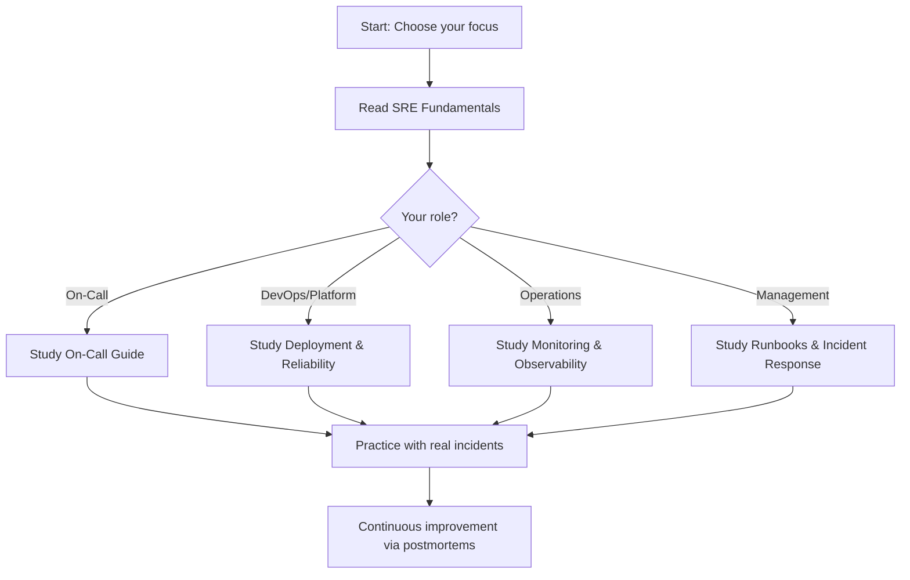

# Site Reliability Engineering (SRE) Knowledge Base

> A comprehensive guide to SRE fundamentals, incident management, observability, on-call operations, and deployment reliability.

---

## Overview

Site Reliability Engineering (SRE) is a discipline that combines software engineering and systems operations to build and maintain large-scale, reliable, and efficient systems. This knowledge base covers the core SRE practices used in production environments.

### Key Philosophy
**Reliability is a feature, not an afterthought.** SRE bridges the gap between development velocity and system stability through measured risk-taking and disciplined incident response.

---

## Contents

### 1. [SRE Fundamentals & Core Concepts](01-sre-fundamentals.md)
Core SRE principles, SLOs/SLIs/error budgets, toil measurement, and building reliable systems.
- What is SRE?
- Key principles and philosophy
- SLO/SLI/error budget framework
- Toil and automation
- Monitoring philosophy

### 2. [Runbooks & Incident Response](02-runbooks-incident-response.md)
Structured incident management, classification, escalation, and playbook design.
- Incident definition and classification
- Escalation procedures
- Postmortem culture
- Runbook creation and maintenance
- Blameless incident review process

### 3. [Monitoring & Observability](03-monitoring-observability.md)
Metrics, logs, tracing, alerting strategies, and observability stack design.
- The three pillars: metrics, logs, traces
- Key metrics and golden signals
- Alerting best practices
- Log aggregation strategy
- Distributed tracing fundamentals
- On-call alerting optimization

### 4. [On-Call Guide](04-on-call-guide.md)
On-call rotation management, handoffs, incident triage, and paging strategies.
- On-call rotation design
- Pre-shift handoff checklist
- Alert triage and severity levels
- Incident commander responsibilities
- Communication protocols
- Post-shift debriefs and learning

### 5. [Deployment & Reliability](05-deployment-reliability.md)
Safe deployment practices, canary/blue-green strategies, rollback procedures, and reliability testing.
- Deployment safety culture
- Canary deployments
- Blue-green deployments
- Feature flags and rollback
- Load testing and chaos engineering
- Blast radius limitation

---

## Quick Start

1. **New to SRE?** Start with [SRE Fundamentals](01-sre-fundamentals.md).
2. **Building on-call processes?** Read [On-Call Guide](04-on-call-guide.md).
3. **Setting up monitoring?** Review [Monitoring & Observability](03-monitoring-observability.md).
4. **Improving deployments?** Check [Deployment & Reliability](05-deployment-reliability.md).
5. **Handling incidents?** Study [Runbooks & Incident Response](02-runbooks-incident-response.md).

---

## SRE Principles at a Glance

| Principle | Description |
|---|---|
| **Embrace Risk** | Controlled risk-taking improves velocity; perfect reliability is not the goal |
| **Error Budgets** | Use SLO as foundation to determine acceptable downtime and deployment pace |
| **Automate Toil** | Eliminate manual, repetitive work; invest in tooling and processes |
| **Measure & Monitor** | If you can't measure it, you can't improve it |
| **Blameless Culture** | Focus on systems and processes, not individual blame in incidents |
| **Continuous Improvement** | Postmortems, load testing, and chaos drills drive reliability evolution |

---

## Documentation Standards

- **Public knowledge only**: No proprietary secrets, internal configs, or hardcoded credentials
- **Source**: Derived from public SRE best practices, Google SRE Book, industry standards
- **Format**: Structured sections (What is it?, Used for?, Why important?, Workflow, Diagrams)
- **Practical**: Examples, templates, and actionable guidance included

---

## Learning Workflow

---

## Recommended Reading Order

1. **Foundation**: Start with [SRE Fundamentals](01-sre-fundamentals.md) for concepts and language.
2. **Operations**: Then [Monitoring & Observability](03-monitoring-observability.md) to understand measurement.
3. **Response**: Study [Runbooks & Incident Response](02-runbooks-incident-response.md) for incident handling.
4. **On-Call**: Learn [On-Call Guide](04-on-call-guide.md) for day-to-day operations.
5. **Deployment**: Finally, [Deployment & Reliability](05-deployment-reliability.md) for safe releases.

---

## Summary

SRE is a proven approach to building and operating reliable systems at scale. By defining clear SLOs, automating repetitive work, measuring everything, and fostering a blameless culture, organizations can improve both reliability and velocity.

The documents in this knowledge base provide actionable frameworks, workflows, and best practices for adopting SRE in your team.