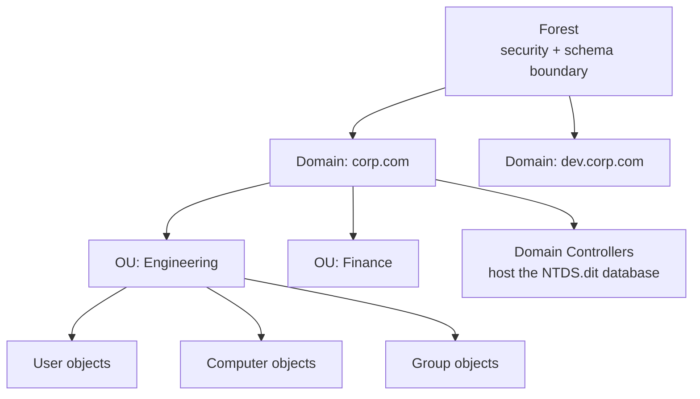
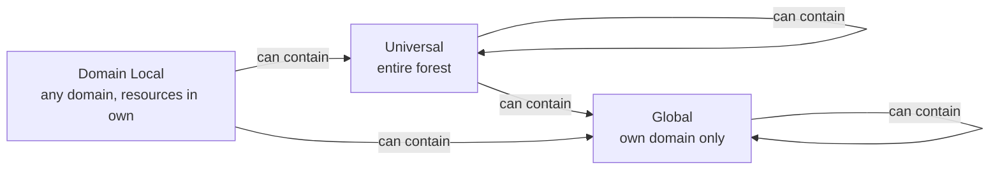
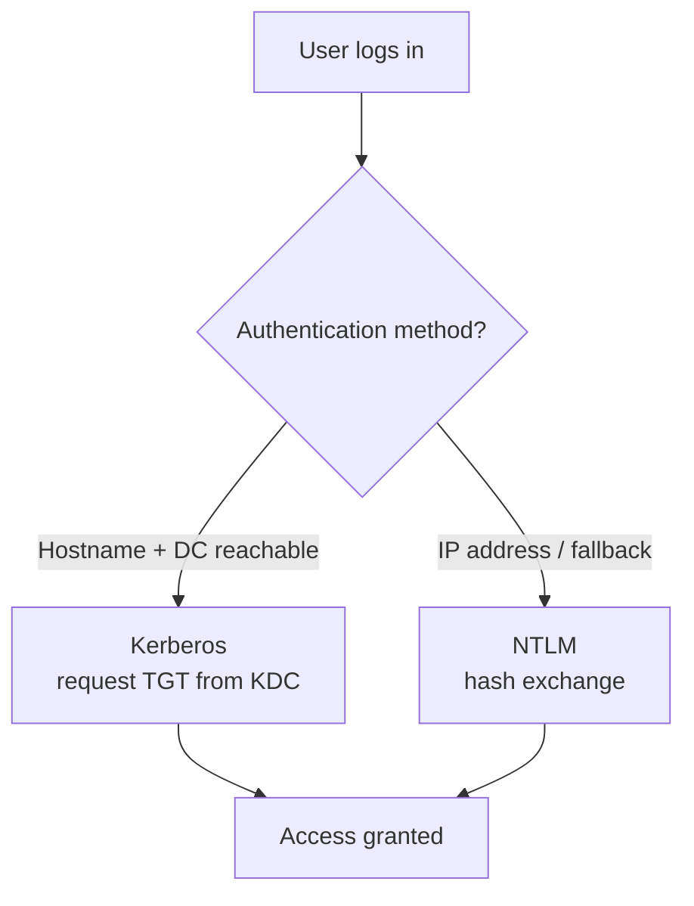
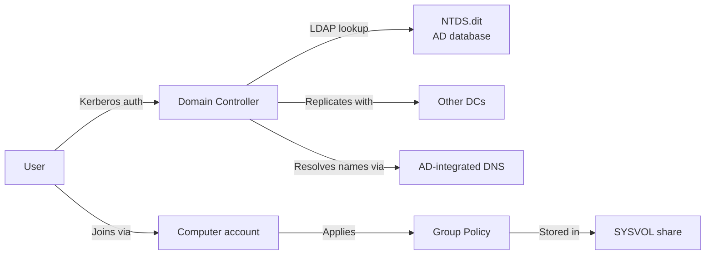
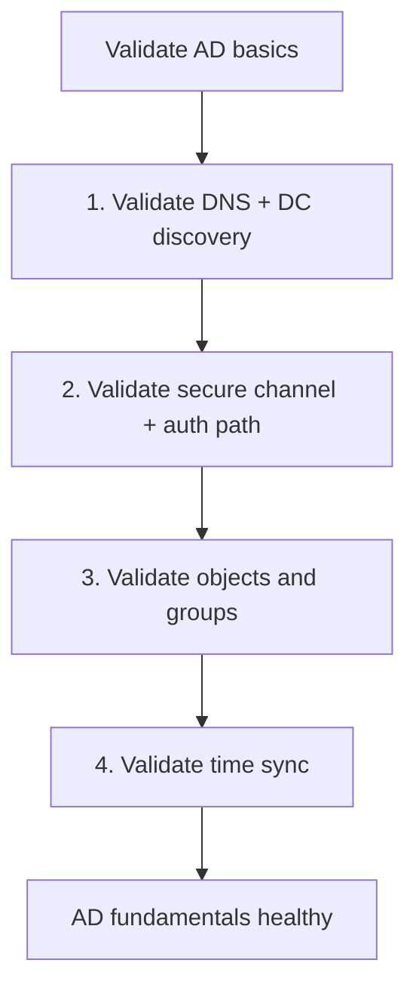

# 01. Active Directory Fundamentals

> What AD is, why it exists, and the building blocks every engineer must know.

---

## What is Active Directory?

**Active Directory Domain Services (AD DS)** is Microsoft's directory service — a centralized database of identities (users, computers, groups) and a framework for **authentication**, **authorization**, and **policy enforcement** across an enterprise network.

Think of it as:
- A **phonebook** (who exists, where)
- A **bouncer** (authentication: are you who you say?)
- A **rulebook** (authorization + group policy: what can you do?)

---

## Core Building Blocks



| Concept | Definition |
|---|---|
| **Forest** | Top-level container; security and schema boundary |
| **Domain** | Administrative partition within a forest |
| **Tree** | Domains sharing a contiguous DNS namespace |
| **OU (Organizational Unit)** | Container for delegated admin and GPO scope |
| **Domain Controller (DC)** | Server holding AD database + serving auth |
| **NTDS.dit** | The AD database file (on every DC) |
| **Schema** | Definition of object classes and attributes |
| **Global Catalog (GC)** | Forest-wide searchable index (subset of attributes) |

---

## AD Object Types

| Object | Purpose |
|---|---|
| **User** | Person/account with credentials |
| **Computer** | Domain-joined machine (has its own account) |
| **Group** | Container for users/computers (security or distribution) |
| **OU** | Container for delegation + GPO |
| **GPO** | Group Policy Object — settings to apply |
| **Service Account** | Identity for services (gMSA preferred) |
| **Trust** | Authentication link between domains |

---

## Group Types and Scopes



**AGDLP rule** (best practice):
- **A**ccounts → **G**lobal groups → **D**omain **L**ocal groups → **P**ermissions

Example:
- Add users (`A`) to a Global group (`G`) — e.g., `GG-Engineers`
- Add Global group to a Domain Local group (`DL`) — e.g., `DL-FileShare-RW`
- Assign Domain Local group to NTFS permissions (`P`) on a share

---

## LDAP — The Query Protocol

AD speaks **LDAP** (Lightweight Directory Access Protocol):
- Port 389 (LDAP) / 636 (LDAPS) / 3268 (GC) / 3269 (GC over SSL)
- Hierarchical naming (DN — Distinguished Name)

### Example LDAP DN
```
CN=John Doe,OU=Engineering,DC=corp,DC=com
```

| Component | Meaning |
|---|---|
| CN | Common Name |
| OU | Organizational Unit |
| DC | Domain Component |

### Common LDAP Filters
```ldap
(objectClass=user)
(&(objectClass=user)(memberOf=CN=Admins,OU=Groups,DC=corp,DC=com))
(sAMAccountName=jdoe)
(userAccountControl:1.2.840.113556.1.4.803:=2)   # disabled accounts
```

### Quick PowerShell Queries
```powershell
# All users
Get-ADUser -Filter *

# Specific user
Get-ADUser jdoe -Properties *

# All members of a group
Get-ADGroupMember -Identity "Domain Admins"

# Stale accounts (no login in 90 days)
Search-ADAccount -AccountInactive -TimeSpan 90.00:00:00 -UsersOnly
```

---

## Authentication Basics

AD supports two main protocols:

### 1. Kerberos (Preferred)
- Ticket-based, mutual authentication
- No password sent over network
- Default for Windows 2000+ domain authentication
- See [03-ad-authentication-kerberos.md](03-ad-authentication-kerberos.md) for deep dive

### 2. NTLM (Legacy)
- Challenge-response, hash-based
- Vulnerable to relay attacks, pass-the-hash
- Used as fallback when Kerberos can't be used (e.g., access by IP)
- **Goal: disable wherever possible**



---

## Domain Controller Roles

Every DC hosts:
- A read/write copy of the AD database (NTDS.dit)
- KDC (Kerberos Key Distribution Center)
- LDAP server
- (Usually) AD-integrated DNS

**Read-Only Domain Controllers (RODC)** exist for branch offices — no writes, cached credentials only.

---

## Where AD Stores Data

```
C:\Windows\NTDS\NTDS.dit       <- the AD database
C:\Windows\NTDS\edb.log         <- transaction logs (ESE database engine)
C:\Windows\SYSVOL\              <- replicated policy + scripts
```

The database is divided into **partitions** (naming contexts):
- **Domain partition** — users, computers, groups (per-domain)
- **Configuration partition** — forest-wide config (sites, services)
- **Schema partition** — class/attribute definitions (forest-wide)
- **Application partitions** — e.g., DNS zones

---

## Common Misconceptions

| Myth | Reality |
|---|---|
| "AD is just a user database" | It's also auth, policy, DNS, PKI integration |
| "DCs are interchangeable" | FSMO roles + GC make some unique |
| "More DCs = always better" | More replication overhead; needs proper site design |
| "AD is going away with cloud" | Hybrid AD will exist for years; Entra ≠ AD DS |

---

## Mental Model



---

## Fundamentals Validation Workflow (PowerShell + CMD)



### 1) DNS + DC Discovery

**PowerShell**
```powershell
Resolve-DnsName -Type SRV _ldap._tcp.dc._msdcs.corp.com
Get-ADDomainController -Discover -DomainName corp.com
Get-ADDomainController -Filter * | Select-Object HostName,Site,IPv4Address
```

**CMD**
```cmd
nslookup -type=SRV _ldap._tcp.dc._msdcs.corp.com
nltest /dsgetdc:corp.com
nltest /dclist:corp.com
```

### 2) Secure Channel / Domain Join Health

**PowerShell**
```powershell
Test-ComputerSecureChannel -Verbose
Test-ComputerSecureChannel -Repair -Credential (Get-Credential)
```

**CMD**
```cmd
nltest /sc_query:corp.com
nltest /sc_verify:corp.com
```

### 3) Identity + Group Checks

**PowerShell**
```powershell
Get-ADUser jdoe -Properties Enabled,LastLogonDate,MemberOf
Get-ADGroupMember -Identity "Domain Admins"
Search-ADAccount -LockedOut -UsersOnly
```

**CMD**
```cmd
whoami /fqdn
whoami /groups
net user jdoe /domain
net group "Domain Admins" /domain
```

### 4) Time Sync (Kerberos Prerequisite)

**PowerShell**
```powershell
Get-Date
Get-Service w32time
w32tm /query /status
```

**CMD**
```cmd
time /t
w32tm /query /status
w32tm /query /source
```

---

## Key Takeaways

- AD = identity + authentication + authorization + policy
- Built on **LDAP** (queries) + **Kerberos** (auth) + **DNS** (location)
- Hierarchy: Forest → Domain → OU → Object
- Every DC holds a copy of NTDS.dit; some hold special FSMO roles
- AGDLP is the canonical group strategy
- Prefer Kerberos over NTLM, gMSA over plain service accounts
- AD has its own database engine (ESE), its own replication protocol, and tight DNS coupling

**Next**: Architecture deep dive — forests, trusts, replication, FSMO → [02-ad-architecture.md](02-ad-architecture.md)
