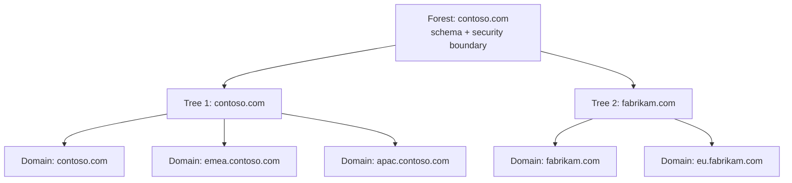
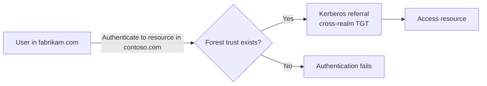
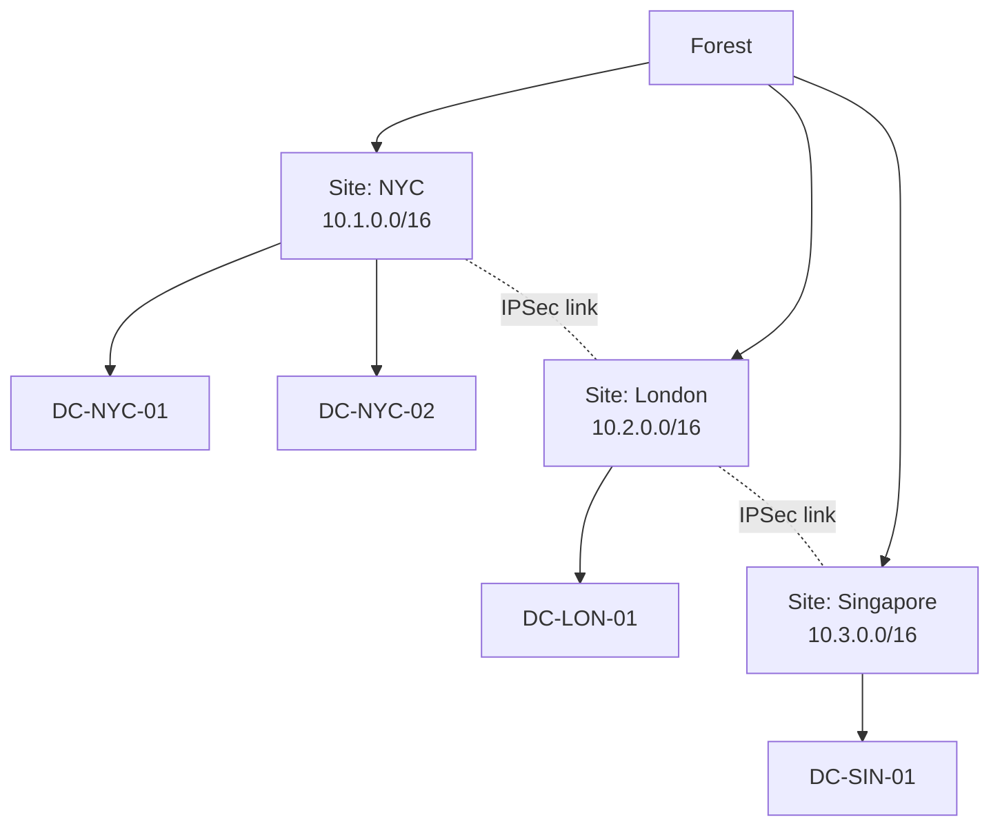
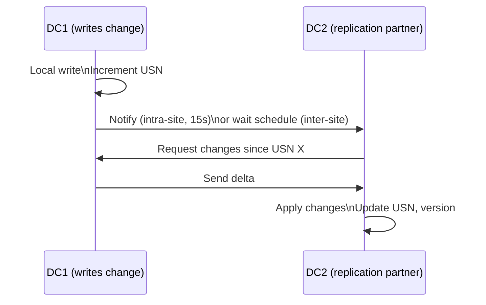
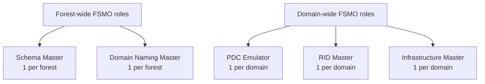
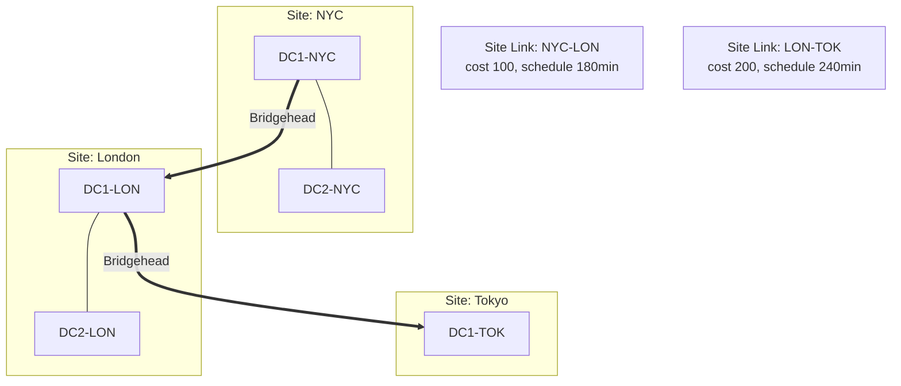
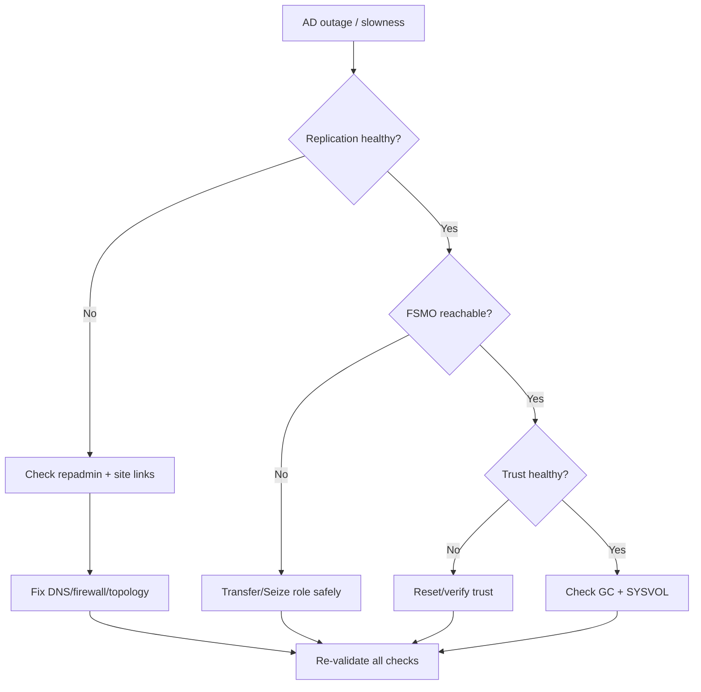

# 02. Active Directory Architecture

> Forests, domains, trusts, sites, replication, FSMO — the structural blueprint of AD.

---

## Forest, Tree, Domain — The Hierarchy



| Concept | Boundary |
|---|---|
| Forest | Security + schema |
| Tree | DNS namespace |
| Domain | Replication + admin |
| OU | Delegation + GPO |

**Rule**: A forest is the **ultimate security boundary** in AD. Cross-forest = trust required.

---

## Trusts

Trust = an authentication path between domains/forests.

### Trust Types

| Trust | Direction | Transitive | Use Case |
|---|---|---|---|
| **Parent-Child** | Two-way | Yes | Automatic within a tree |
| **Tree-Root** | Two-way | Yes | Between tree roots in a forest |
| **External** | One/Two-way | No | To a domain in another forest (legacy) |
| **Forest** | One/Two-way | Yes | Between two forests |
| **Realm** | One/Two-way | Configurable | To non-Windows Kerberos (MIT/Linux) |
| **Shortcut** | One/Two-way | Yes | Optimize auth path within forest |

### Trust Flow Example


### Trust Security Features
- **SID Filtering** — drops SIDs from other forest (prevents SID injection)
- **Selective Authentication** — only allow specific users from trusted forest
- **Name Suffix Routing** — control which DNS suffixes route over trust

```powershell
# Verify trust
Get-ADTrust -Filter *
nltest /domain_trusts /v

# Test trust password
netdom trust contoso.com /Domain:fabrikam.com /verify
```

---

## Sites and Subnets

A **site** = a collection of well-connected (LAN-speed) subnets.



Why sites matter:
- Clients authenticate to **closest DC** (via DNS SRV records weighted by site)
- Replication is **frequent intra-site** (every 15s default) vs **scheduled inter-site** (default every 180 min, configurable)
- GPO and SYSVOL replication respects site topology

### Define a Site
```powershell
New-ADReplicationSite -Name "NYC"
New-ADReplicationSubnet -Name "10.1.0.0/16" -Site "NYC"
```

---

## Replication

AD uses **multi-master replication** — any DC can accept writes (except RODCs).

### Mechanism
- Built on **USN (Update Sequence Numbers)** — monotonically increasing per object
- Uses **vector clocks** (up-to-dateness vector) to track what each DC has seen
- **KCC (Knowledge Consistency Checker)** auto-generates replication topology
- **ISTG (Inter-Site Topology Generator)** picks bridgehead servers per site



### Conflict Resolution
- **Last Writer Wins** by attribute version + timestamp
- For deletions: tombstones replicate for 180 days

### Replication Commands
```powershell
# Show replication status
repadmin /showrepl

# Force replication
repadmin /syncall /AdeP

# Show replication queue
repadmin /queue

# Check replication errors
repadmin /replsummary

# Show outbound replication
repadmin /showconn

# Compare DC contents
repadmin /showobjmeta DC1 "CN=jdoe,OU=Users,DC=corp,DC=com"
```

---

## FSMO Roles (Flexible Single Master Operations)

Despite multi-master, **5 special operations** are single-master. These roles are called **FSMO** (or **Operations Master**).



| Role | Scope | Purpose |
|---|---|---|
| **Schema Master** | Forest | Updates the AD schema |
| **Domain Naming Master** | Forest | Adds/removes domains in the forest |
| **PDC Emulator** | Domain | Time source, password changes, GPO writes |
| **RID Master** | Domain | Allocates RID pools to DCs for new SIDs |
| **Infrastructure Master** | Domain | Cross-domain object references (skip if all DCs are GC) |

### Critical Role: PDC Emulator
- **Authoritative time source** for the domain (syncs from external NTP)
- Receives **password change notifications** first (so other DCs can verify recent changes)
- **GPO editing** happens against the PDC by default
- Acts as **fallback** for legacy NTLM auth

> If PDC Emulator fails: clocks drift → Kerberos breaks → mass auth outage. **Most important FSMO role to monitor.**

### Find FSMO Holders
```powershell
netdom query fsmo

# Or via PowerShell
Get-ADDomain | Select-Object PDCEmulator, RIDMaster, InfrastructureMaster
Get-ADForest | Select-Object SchemaMaster, DomainNamingMaster
```

### Transfer vs Seize
- **Transfer** = graceful, source DC is alive
- **Seize** = forceful, source DC is dead/unrecoverable
- **NEVER** bring the old holder back online after a seize (will cause corruption)

```powershell
# Transfer (graceful)
Move-ADDirectoryServerOperationMasterRole -Identity "DC02" -OperationMasterRole PDCEmulator

# Seize (force — only when source is dead)
Move-ADDirectoryServerOperationMasterRole -Identity "DC02" -OperationMasterRole PDCEmulator -Force
```

---

## Global Catalog (GC)

A **GC** is a DC that holds a partial replica of **all** domain partitions in the forest.

- Enables **forest-wide LDAP searches** without referrals
- Required for **Universal Group membership** evaluation at login
- Required for **Exchange** address lookups

```powershell
# Promote DC to GC
Set-ADObject -Identity (Get-ADDomainController DC02).NTDSSettingsObjectDN -Replace @{options=1}
```

**Rule**: In multi-domain forests, run GC on most DCs. In single-domain forests, every DC is essentially a GC.

---

## Replication Topology



- **Intra-site**: full mesh, change notification, no compression (15s)
- **Inter-site**: bridgehead-only, scheduled, compressed
- **Site link cost** influences path selection
- **Site link bridging** allows transitive replication

---

## SYSVOL Replication

SYSVOL = the replicated share holding:
- Group Policy templates
- Logon scripts
- Domain DFS namespaces

Replicated by:
- **DFSR** (Distributed File System Replication) — modern, since 2008
- ~~FRS~~ (File Replication Service) — deprecated, must migrate

### Check Replication Health
```powershell
# DFSR backlog
dfsrdiag Backlog /ReceivingMember:DC02 /SendingMember:DC01 /RGName:"Domain System Volume" /RFName:SYSVOL Share

# DFSR health report
dfsrdiag ReplicationState
```

---

## Architecture Decision Matrix

| Question | Answer |
|---|---|
| Single forest or multiple? | Single, unless you need schema/security isolation |
| Single domain or multiple? | Single, unless replication or political boundaries demand |
| How many DCs per site? | At least 2 for redundancy |
| Where to put PDC Emulator? | Most reliable site, closest to NTP |
| RODC in branch office? | Yes — if you don't trust physical security |
| Site link cost | Lower cost = preferred path |
| GC placement | Every DC, unless infrastructure master conflict |

---

## Validation Commands

```powershell
# Comprehensive health check
dcdiag /v /c /e

# Specific tests
dcdiag /test:Replications
dcdiag /test:Advertising
dcdiag /test:FSMOCheck
dcdiag /test:DNS

# Replication summary
repadmin /replsummary

# Show all DCs in domain
Get-ADDomainController -Filter *

# Show forest mode and DCs
Get-ADForest | fl Name,ForestMode,RootDomain,Domains,SchemaMaster,DomainNamingMaster
```

---

## Architecture Health Runbook (PowerShell + CMD)



### Replication Health

**PowerShell**
```powershell
Get-ADReplicationFailure -Scope Forest | Format-Table Server,FirstFailureTime,FailureCount -Auto
Get-ADReplicationPartnerMetadata -Target * -Scope Forest |
    Select-Object Server,Partner,LastReplicationSuccess
```

**CMD**
```cmd
repadmin /replsummary
repadmin /showrepl * /csv
repadmin /queue
```

### FSMO Health

**PowerShell**
```powershell
Get-ADForest | Select-Object SchemaMaster,DomainNamingMaster
Get-ADDomain | Select-Object PDCEmulator,RIDMaster,InfrastructureMaster
```

**CMD**
```cmd
netdom query fsmo
dcdiag /test:FSMOCheck
```

### Trust Health

**PowerShell**
```powershell
Get-ADTrust -Filter * | Select-Object Name,TrustType,TrustDirection,TrustAttributes
```

**CMD**
```cmd
nltest /domain_trusts /v
netdom trust contoso.com /domain:fabrikam.com /verify
```

### Site + GC + SYSVOL Health

**PowerShell**
```powershell
Get-ADDomainController -Filter * | Select-Object HostName,Site,IsGlobalCatalog
Get-Service DFSR
```

**CMD**
```cmd
nltest /dsgetsite
dfsrdiag ReplicationState
dcdiag /test:Advertising /test:DNS
```

---

## Key Takeaways

- **Forest** = security + schema boundary (cross-forest = trust)
- **Domains** = replication + admin units; OUs = delegation + GPO
- **5 FSMO roles** — most critical is PDC Emulator (time, passwords, GPO)
- **Multi-master replication** with USNs + vector clocks
- **Sites** define replication topology and DC discovery
- **Global Catalog** enables forest-wide queries + Universal Group eval
- **SYSVOL** = replicated share (DFSR), not part of AD database
- **Trust types** must be chosen based on direction + transitivity needs

**Next**: Kerberos authentication deep dive → [03-ad-authentication-kerberos.md](03-ad-authentication-kerberos.md)
