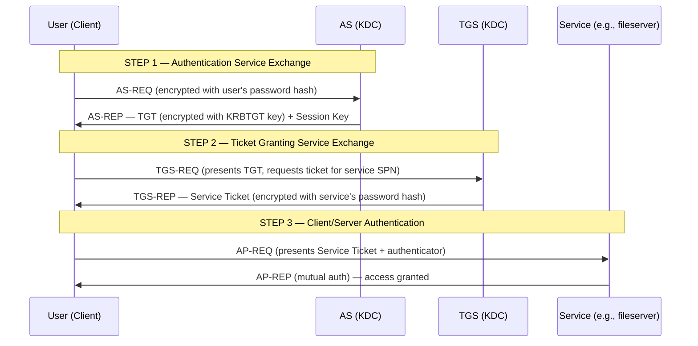
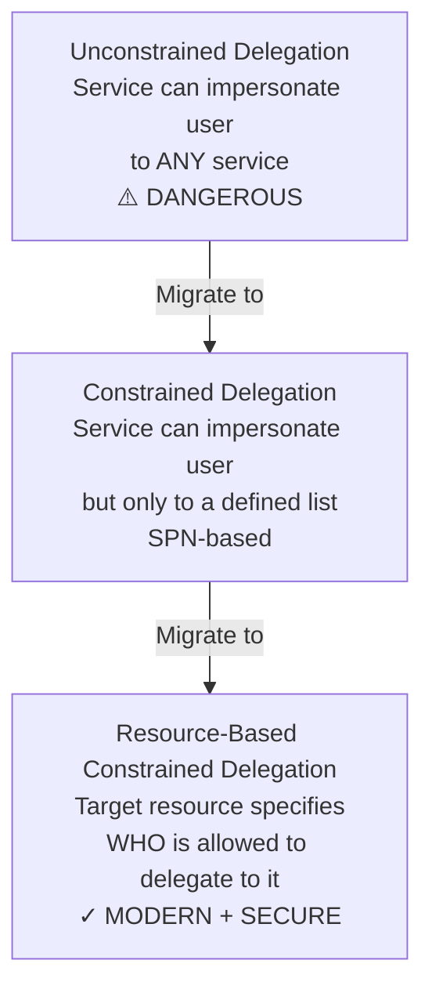
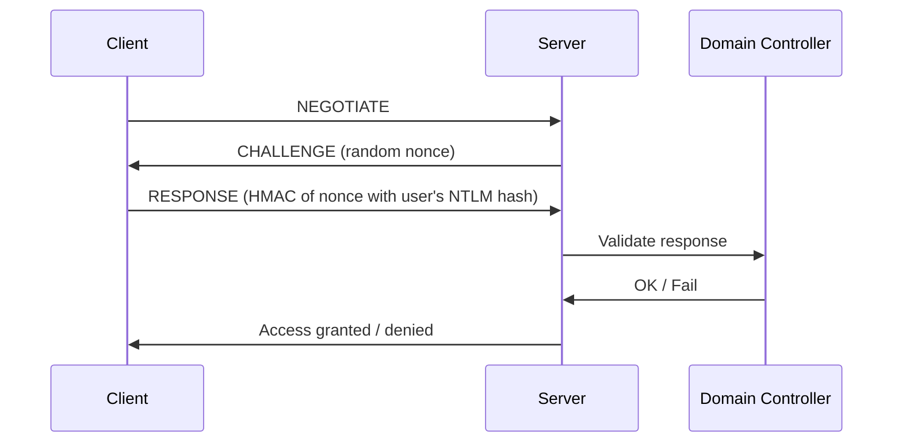
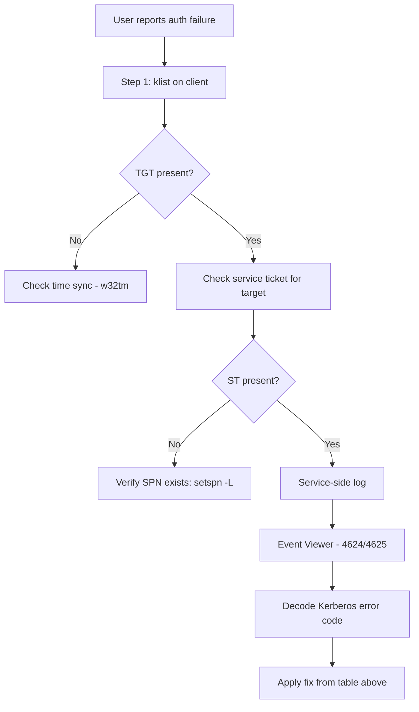
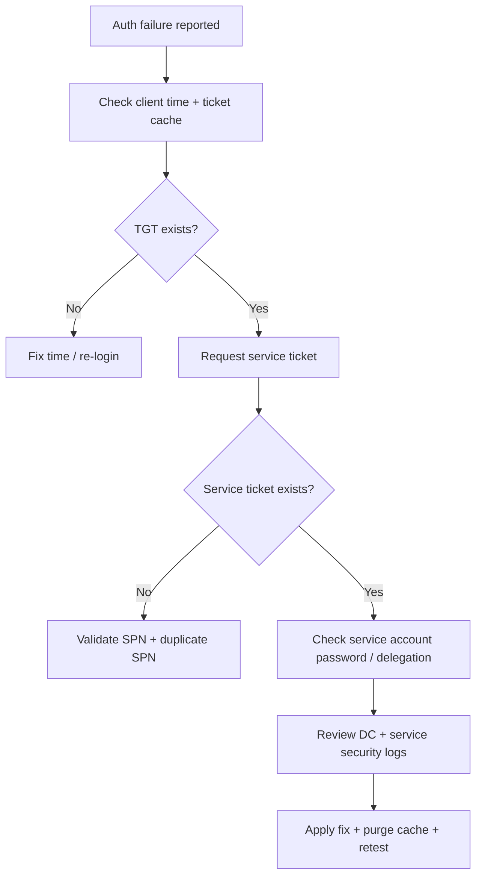

# 03. Authentication: Kerberos Deep Dive

> Kerberos is the heart of AD authentication. Understand it deeply or stay forever in firefighting mode.

---

## Why Kerberos?

| Pain | Kerberos Solves |
|---|---|
| Sending passwords over network | Never sent — uses tickets |
| Trusting the server | Mutual authentication |
| Replay attacks | Timestamps + ticket lifetimes |
| Re-authenticating per service | Single TGT, multiple service tickets |

**Three actors**:
- **Client** (user)
- **Service** (resource being accessed)
- **KDC** (Key Distribution Center — runs on every DC)

The KDC has two parts:
- **AS** (Authentication Service) — issues TGTs
- **TGS** (Ticket Granting Service) — issues Service Tickets

---

## The Full Kerberos Flow



### Step-by-Step Explained

**Step 1: AS Exchange (Login)**
- User sends username + timestamp encrypted with their password hash
- KDC decrypts with stored password hash → if it works, user is authenticated
- KDC returns a **TGT** (Ticket Granting Ticket):
  - Encrypted with the **KRBTGT account's** password hash (only KDCs know this)
  - Contains user's PAC (Privilege Attribute Certificate) — group memberships
  - Default lifetime: 10 hours

**Step 2: TGS Exchange (Request Service Access)**
- User presents TGT to KDC and asks for a ticket for a specific **SPN** (Service Principal Name) like `cifs/fileserver.corp.com`
- KDC validates TGT → returns a **Service Ticket** encrypted with that service's account password hash

**Step 3: AP Exchange (Use the Service)**
- User presents Service Ticket to the service
- Service decrypts with its own password hash → trusts the user
- Optional: mutual auth (service proves itself to user)

---

## SPNs (Service Principal Names)

An SPN is a **unique identifier** for a service instance, registered against the account that runs the service.

```
<service class>/<host>[:<port>]/[<service name>]

Examples:
  HTTP/webapp.corp.com
  MSSQLSvc/sqlserver01.corp.com:1433
  cifs/fileserver.corp.com
  HOST/dc01.corp.com
```

### Why SPNs matter
- Kerberos needs the SPN to know **which account's key** to use to encrypt the service ticket
- If SPN is **missing**: client falls back to NTLM (or fails)
- If SPN is **duplicated**: Kerberos fails (KDC doesn't know which account to use)

### SPN Commands
```powershell
# Find SPNs for an account
setspn -L svc-sql01

# Search for an SPN
setspn -Q HTTP/webapp.corp.com

# Find DUPLICATE SPNs (very common cause of auth failures!)
setspn -X

# Add an SPN
setspn -S HTTP/webapp.corp.com CORP\svc-web

# Delete an SPN
setspn -D HTTP/webapp.corp.com CORP\svc-web
```

---

## Tickets and Caches

```powershell
# Show current Kerberos tickets on a client
klist

# Purge all tickets (force re-auth)
klist purge

# Show TGT specifically
klist tgt

# Show sessions and tickets per session
klist sessions
```

---

## Delegation — Where It Gets Dangerous

Delegation = a service can request tickets **on behalf of a user** to access another back-end service.

### Three Types



### Why Unconstrained Delegation Is Dangerous
- The TGT of every user who connects is **stored in memory** on the delegating server
- An attacker compromising that server can steal **every user's TGT** — including domain admins
- **Find and disable** all unconstrained delegation:

```powershell
# Find accounts with unconstrained delegation
Get-ADComputer -Filter {TrustedForDelegation -eq $true -and PrimaryGroupID -eq 515}
Get-ADUser -Filter {TrustedForDelegation -eq $true}
```

### Constrained Delegation Example
```powershell
# Configure: webapp can delegate user identity ONLY to sql01
Set-ADComputer -Identity webapp -Add @{"msDS-AllowedToDelegateTo"="MSSQLSvc/sql01.corp.com:1433"}
```

### Resource-Based Constrained Delegation (RBCD)
```powershell
# On sql01: allow webapp$ to delegate to me
Set-ADComputer sql01 -PrincipalsAllowedToDelegateToAccount (Get-ADComputer webapp)
```

---

## NTLM — The Legacy Fallback



### When NTLM Is Used
- Authenticating via IP address (no SPN possible)
- Cross-forest without proper trust
- Legacy applications
- Workgroup machines

### Why It's Dangerous
- **Pass-the-Hash**: stolen hash = stolen identity (no need for plaintext password)
- **Relay attacks**: NTLMv1/v2 can be relayed to other services
- **No mutual auth** (NTLMv1) or weak (NTLMv2)

### Hardening NTLM
```
Group Policy:
- "Network security: LAN Manager authentication level" = "Send NTLMv2 response only. Refuse LM & NTLM"
- "Network security: Restrict NTLM: NTLM authentication in this domain" = "Deny all"  (after audit phase)
- Enable "Network security: Restrict NTLM: Audit Incoming NTLM Traffic" first to find usage
```

---

## Common Kerberos Errors (Decoder Ring)

| Error | Meaning | Fix |
|---|---|---|
| **KRB_AP_ERR_SKEW** | Clock skew > 5 min | Fix NTP / time sync |
| **KDC_ERR_S_PRINCIPAL_UNKNOWN** | SPN doesn't exist | Register SPN |
| **KDC_ERR_PRINCIPAL_NOT_UNIQUE** | Duplicate SPN | `setspn -X`, remove duplicate |
| **KRB_AP_ERR_MODIFIED** | Service ticket encrypted with wrong key (password mismatch) | Reset service account password OR fix SPN registration |
| **KDC_ERR_PREAUTH_FAILED** | Wrong password | User typed wrong password OR account locked |
| **KDC_ERR_C_PRINCIPAL_UNKNOWN** | User doesn't exist | Check spelling, domain |
| **KRB_AP_ERR_TKT_EXPIRED** | Ticket expired | Will auto-renew; check max ticket lifetime |

---

## Kerberos-Related Attack Vectors

### 1. Kerberoasting
- Request a Service Ticket for any SPN-enabled account
- Crack the ticket **offline** to recover the service account password
- **Defense**: long random passwords for service accounts, prefer **gMSA**

```powershell
# Find SPN-enabled user accounts (kerberoasting targets)
Get-ADUser -Filter {ServicePrincipalName -ne "$null"} -Properties ServicePrincipalName
```

### 2. AS-REP Roasting
- For users with **"Do not require Kerberos pre-authentication"** enabled
- Request AS-REP without proving identity → crack offline
- **Defense**: don't enable this flag

```powershell
Get-ADUser -Filter {DoesNotRequirePreAuth -eq $true}
```

### 3. Golden Ticket
- Attacker has the **KRBTGT password hash**
- Forges any TGT for any user (including non-existent ones)
- Valid for 10 years by default
- **Defense**: **rotate KRBTGT password twice** (every 6-12 months)

```powershell
# Rotate KRBTGT password (run TWICE with 10+ hour gap between)
# Use Microsoft's official script:
# https://github.com/microsoft/New-KrbtgtKeys.ps1
```

### 4. Silver Ticket
- Attacker has a **service account's password hash**
- Forges Service Tickets for that service only
- **Defense**: gMSA (auto-rotated passwords), strong passwords

### 5. DCSync
- Attacker with **Replicating Directory Changes** permission requests all password hashes from the DC
- **Defense**: audit who has this permission (should be only DCs)

```powershell
# Find non-DC accounts with DCSync rights
Get-ADUser -Filter * -Properties msDS-ReplAttributeMetaData
# Better: use BloodHound to map exposure
```

---

## Kerberos Best Practices

1. **Sync time** across the domain — Kerberos won't tolerate >5 min skew
2. **No unconstrained delegation** — migrate to constrained or RBCD
3. **Use gMSA** for service accounts (auto-rotated 30-day passwords)
4. **Rotate KRBTGT** twice a year
5. **Disable AS-REP roasting flag** on all accounts
6. **Audit NTLM usage**, then disable
7. **Strong passwords** for SPN-enabled accounts (defense vs Kerberoasting)
8. **AES encryption** — disable RC4 where possible
9. **Monitor TGT lifetime anomalies** (Golden Ticket detection)

---

## Quick Diagnostic Workflow



---

## Kerberos Incident Runbook (PowerShell + CMD)



### A) Client Ticket + Time Checks

**PowerShell**
```powershell
Get-Date
w32tm /query /status
klist
klist tgt
```

**CMD**
```cmd
time /t
w32tm /query /status
klist
klist purge
```

### B) SPN and Duplicate SPN Checks

**PowerShell**
```powershell
Get-ADUser -Filter {ServicePrincipalName -like "*"} -Properties ServicePrincipalName |
  Select-Object SamAccountName,ServicePrincipalName
Get-ADComputer -Filter {ServicePrincipalName -like "*"} -Properties ServicePrincipalName |
  Select-Object Name,ServicePrincipalName
```

**CMD**
```cmd
setspn -Q HTTP/webapp.corp.com
setspn -X
setspn -L CORP\svc-web
```

### C) Domain Controller / KDC Checks

**PowerShell**
```powershell
Get-WinEvent -LogName Security -MaxEvents 100 |
  Where-Object { $_.Id -in 4768,4769,4771,4625 } |
  Select-Object TimeCreated,Id,Message
Get-ADDomainController -Discover
```

**CMD**
```cmd
nltest /dsgetdc:corp.com
dcdiag /test:Kdc
wevtutil qe Security /q:"*[System[(EventID=4768 or EventID=4769 or EventID=4771)]]" /f:text /c:20
```

### D) Delegation and Crypto Hygiene Checks

**PowerShell**
```powershell
Get-ADComputer -Filter {TrustedForDelegation -eq $true} -Properties TrustedForDelegation
Get-ADUser -Filter {TrustedForDelegation -eq $true} -Properties TrustedForDelegation
Get-ADUser -Filter * -Properties msDS-SupportedEncryptionTypes |
  Select-Object SamAccountName,msDS-SupportedEncryptionTypes
```

**CMD**
```cmd
setspn -L webapp$
nltest /sc_query:corp.com
```

---

## Key Takeaways

- Kerberos = 3-step protocol: AS → TGS → AP
- TGT = ticket to get tickets; Service Ticket = ticket for one service
- SPNs must be unique and registered against the correct account
- Delegation is powerful and dangerous — always use **RBCD** in modern setups
- NTLM is the fallback you want to retire
- Top attacks: Kerberoasting, AS-REP roasting, Golden/Silver Ticket, DCSync
- **Time sync + correct SPNs** solve 80% of Kerberos issues

**Next**: Group Policy architecture and troubleshooting → [04-ad-group-policy.md](04-ad-group-policy.md)
