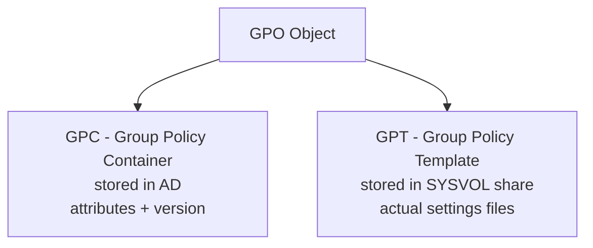
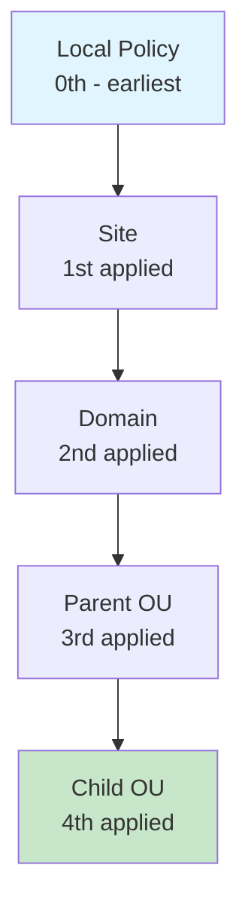
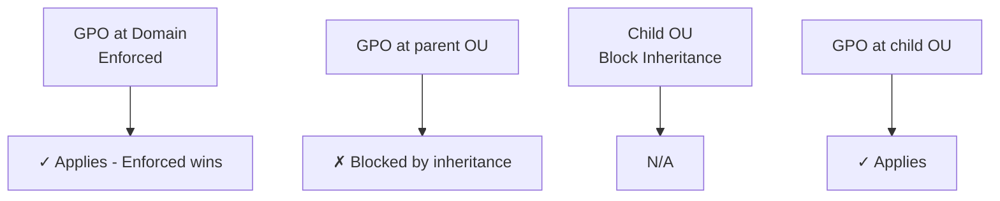
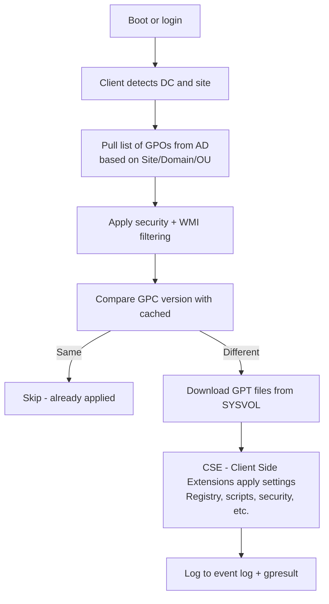
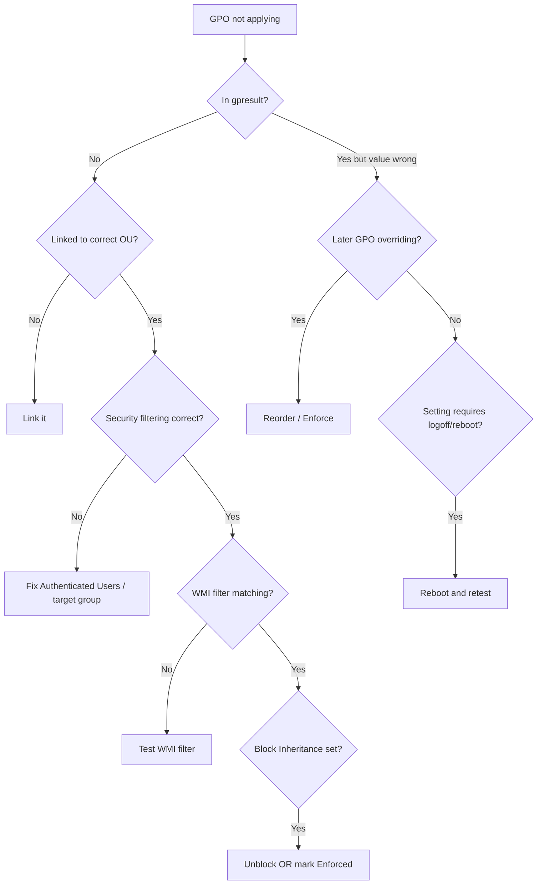
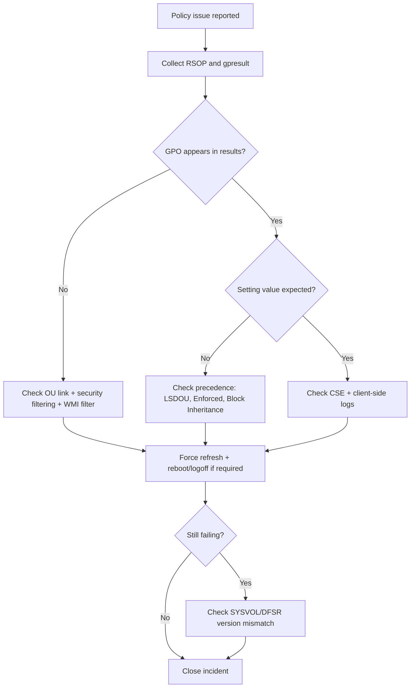

# 04. Group Policy (GPO) — Architecture & Troubleshooting

> Group Policy is how AD enforces configuration at scale. Master it or live with mystery outages.

---

## What is Group Policy?

GPO = a collection of settings applied to **users** or **computers** based on their location in AD.

Used for:
- Security settings (password policy, audit policy, firewall)
- Software deployment
- Login scripts
- Mapped drives, printers
- Registry tweaks
- Group Policy Preferences (GPP) for files, environment vars

---

## GPO Anatomy

A GPO has two parts:



- **GPC**: small metadata object in AD (version number, links)
- **GPT**: actual files (`.adml`, `.admx`, `Registry.pol`) in `\\domain\SYSVOL\domain\Policies\{GUID}`

These **must stay in sync** — version mismatch = GPO won't apply.

---

## How GPOs Are Linked

GPOs aren't applied directly — they're **linked** to a **scope**:



**LSDOU**: Local → Site → Domain → OU (last wins by default, unless "Enforced")

---

## Processing Order & Precedence

### Default Rule
**Last applied wins** — settings from child OUs override parents.

### Exceptions
- **Enforced** (formerly "No Override"): a GPO marked Enforced **wins over later GPOs**
- **Block Inheritance**: an OU can block higher-level GPOs (but NOT Enforced ones)
- **Loopback Processing**: applies User settings based on the **computer's** OU (e.g., kiosk/RDS servers)



---

## Scoping a GPO

Beyond just linking, you can further filter:

| Filter | Purpose |
|---|---|
| **Security filtering** | Apply only to specific users/groups (default: Authenticated Users) |
| **WMI filter** | Apply based on hardware/OS condition (e.g., only Windows 11) |
| **Item-level targeting (GPP only)** | Per-preference targeting |

### Security Filtering Example
```powershell
# Remove default "Authenticated Users", add specific group
Set-GPPermission -Name "Block USB" -TargetName "Authenticated Users" -PermissionLevel None -TargetType Group
Set-GPPermission -Name "Block USB" -TargetName "USB-Blocked-Computers" -PermissionLevel GpoApply -TargetType Group
```

> **⚠️ MS16-072 Patch**: After 2016, you also need to give the group **Read** permission (not just Apply) or GPO won't be retrieved.

### WMI Filter Example
```wql
-- Only Windows 11 machines
SELECT * FROM Win32_OperatingSystem WHERE Version LIKE "10.0.22%" AND ProductType="1"

-- Only laptops
SELECT * FROM Win32_SystemEnclosure WHERE ChassisTypes="9" OR ChassisTypes="10" OR ChassisTypes="14"
```

---

## When GPOs Apply

| Trigger | Computer Policy | User Policy |
|---|---|---|
| Boot | ✓ | — |
| Login | — | ✓ |
| Background refresh | every 90 min (±30 min) | every 90 min (±30 min) |
| DCs background | every 5 min | — |
| Manual | `gpupdate /force` | `gpupdate /force` |

**Note**: Some settings need a logoff/reboot to take effect (drive maps, folder redirection, software install).

---

## GPO Processing Pipeline (Client Side)



---

## Diagnostic Tools

### `gpresult` — What Applied to This User/Computer?
```powershell
# Verbose report
gpresult /h C:\gpresult.html
gpresult /r            # Console summary
gpresult /v            # Verbose
gpresult /scope:computer
gpresult /scope:user
```

### `gpupdate` — Force Refresh
```powershell
gpupdate /force        # All settings
gpupdate /force /boot  # Reboot if needed (software install)
gpupdate /force /logoff # Logoff if needed (drive maps)
```

### Event Log — Where to Look
- **Applications and Services Logs → Microsoft → Windows → GroupPolicy → Operational**
- Event ID **4016** = processing start
- Event ID **5016** = processing end
- Event ID **8194** = COM/security error
- Event ID **1129** = network failure (no DC found)

### `Get-GPOReport` — Audit a Specific GPO
```powershell
Get-GPOReport -Name "Default Domain Policy" -ReportType HTML -Path C:\report.html
Get-GPOReport -All -ReportType XML -Path C:\all-gpos.xml
```

---

## Top GPO Troubleshooting Scenarios

### Scenario 1: GPO Not Applying



### Scenario 2: GPO Version Mismatch (GPC ≠ GPT)
**Symptom**: GPO appears in console but doesn't apply

```powershell
# Check GPC version
(Get-GPO -Name "MyPolicy").Computer.DSVersion
(Get-GPO -Name "MyPolicy").User.DSVersion

# Compare with SYSVOL GPT version
# Path: \\domain\SYSVOL\domain\Policies\{GUID}\GPT.INI
# [General]
# Version=65537  <- must match GPC version
```

**Fix**: usually a SYSVOL replication issue (DFSR).

### Scenario 3: Slow Logons
**Common causes**:
- Too many GPOs (>20)
- Synchronous processing (Folder Redirection, Software Install)
- Slow link detection — `Group Policy slow link detection` setting
- Heavy login scripts

```powershell
# Measure with gpresult
gpresult /h C:\result.html
# Look at "Total GPO processing time"

# Or with PolicyAnalyzer / Microsoft Group Policy Search
```

### Scenario 4: Loopback Processing Confusion
**Use case**: kiosk/RDS — apply *user* settings based on the *computer* OU.

**Modes**:
- **Replace** — Use only computer-OU user settings (ignore user's own)
- **Merge** — Apply user's settings, then computer-OU user settings (last wins)

```
Location: Computer Config → Admin Templates → System → Group Policy
"Configure user Group Policy loopback processing mode"
```

### Scenario 5: GPO Works on Some Machines, Not Others
**Likely causes**:
- WMI filter not matching (different OS version)
- Security filtering — group membership wrong (and remember user/computer login cache)
- DC the machine talked to hasn't replicated the GPO yet
- Local admin removed Authenticated Users from GPO ACL

---

## Best Practices

### 1. Use a Standardized GPO Hierarchy
```
OU=Corp
├── OU=Servers
│   ├── OU=Web
│   ├── OU=Database
│   └── OU=Domain Controllers
├── OU=Workstations
│   ├── OU=Engineering
│   ├── OU=Finance
│   └── OU=Kiosks (loopback)
└── OU=Users
    ├── OU=Standard
    └── OU=PrivilegedAccounts
```

### 2. Naming Convention
```
[Scope]-[Type]-[Description]
Examples:
  DOM-SEC-PasswordPolicy
  OU-WS-DriveMapping
  OU-SVR-FirewallRules
```

### 3. Avoid Defaults
- **Never edit Default Domain Policy** (use it only for password policy)
- **Never edit Default Domain Controllers Policy** (use it only for required DC settings)
- Create new GPOs for everything else

### 4. Use GPO Backups
```powershell
# Backup all GPOs
Backup-GPO -All -Path C:\GPOBackups

# Restore
Restore-GPO -Name "MyPolicy" -Path C:\GPOBackups
```

### 5. Test in a Pilot OU
Create `OU=Pilot` → link GPO there first → verify → then move to production.

### 6. Document with comments
```powershell
Set-GPRegistryValue -Name "MyGPO" `
  -Key "HKLM\Software\Policies\Microsoft\Windows\WindowsUpdate" `
  -ValueName "DeferFeatureUpdates" -Type DWord -Value 1
```

### 7. Monitor GPO drift
- Use SCM (Security Compliance Manager) baselines
- Compare current GPOs to baseline regularly

---

## Performance Tuning

| Symptom | Fix |
|---|---|
| Slow boot | Reduce computer-side GPOs, async startup, faster scripts |
| Slow login | Reduce user-side GPOs, async login, defer Folder Redirection |
| Too many GPOs | Consolidate; aim for <15 per user/computer scope |
| GPO bloat | Remove unused GPOs; audit with `Get-GPOReport -All` |
| Slow link detection delays | Set "Group Policy slow link detection" threshold properly |

---

## Group Policy Preferences (GPP) vs GPO Policies

| Aspect | GPO Policies | GPP |
|---|---|---|
| Tattooed (sticks if GPO removed) | No | Yes |
| Item-level targeting | No | Yes |
| Examples | Security, Admin Templates | Drive maps, printers, scheduled tasks |
| Reversion | Automatic | Manual cleanup needed |

> **Warning**: Old GPP "Passwords in XML" feature is a known security risk — Microsoft patched it; never store passwords in GPP.

---

## Quick Reference Commands

```powershell
# List all GPOs
Get-GPO -All

# Show GPO links
Get-GPInheritance -Target "OU=Engineering,DC=corp,DC=com"

# Show GPO permissions
Get-GPPermission -Name "MyPolicy" -All

# Find unlinked GPOs (orphans)
Get-GPO -All | Where-Object { $_ | Get-GPOReport -ReportType XML | Select-String -NotMatch "<LinksTo>" }

# Force gpupdate on remote machine
Invoke-GPUpdate -Computer PC01 -Force

# Modeling — predict what will apply
Get-GPResultantSetOfPolicy -ReportType HTML -Path C:\rsop.html -User "CORP\jdoe" -Computer PC01
```

---

## GPO Troubleshooting Workflow (PowerShell + CMD)



### 1) Policy Scope & Link Validation

**PowerShell**
```powershell
Get-GPInheritance -Target "OU=Engineering,DC=corp,DC=com"
Get-GPO -All | Select-Object DisplayName,Id,GpoStatus
Get-GPPermission -Name "MyPolicy" -All
```

**CMD**
```cmd
gpresult /r
gpresult /scope:computer /v
gpresult /scope:user /v
```

### 2) Refresh + RSOP Validation

**PowerShell**
```powershell
Invoke-GPUpdate -Computer PC01 -Force
Get-GPResultantSetOfPolicy -ReportType Html -Path C:\rsop.html -Computer PC01 -User CORP\jdoe
```

**CMD**
```cmd
gpupdate /force
gpupdate /force /boot
gpresult /h C:\gpresult.html
```

### 3) SYSVOL / Version Consistency

**PowerShell**
```powershell
Get-GPO -Name "MyPolicy" | Select-Object DisplayName,@{N='ComputerDSVersion';E={$_.Computer.DSVersion}},@{N='UserDSVersion';E={$_.User.DSVersion}}
Get-Service DFSR
```

**CMD**
```cmd
dfsrdiag Backlog /ReceivingMember:DC02 /SendingMember:DC01 /RGName:"Domain System Volume" /RFName:"SYSVOL Share"
dir \\corp.com\SYSVOL\corp.com\Policies
```

### 4) Event Log Triaging

**PowerShell**
```powershell
Get-WinEvent -LogName "Microsoft-Windows-GroupPolicy/Operational" -MaxEvents 100 |
    Select-Object TimeCreated,Id,LevelDisplayName,Message
```

**CMD**
```cmd
wevtutil qe Microsoft-Windows-GroupPolicy/Operational /f:text /c:30
```

---

## Key Takeaways

- GPO = GPC (AD object) + GPT (SYSVOL files); both must sync
- Processing: **L → S → D → OU**, last wins (unless Enforced/Block)
- Scoping = link + security filter + WMI filter
- Apply triggers: boot, login, every 90 min (±30)
- **Top 5 troubleshooting tools**: `gpresult`, `gpupdate`, Event Viewer, `Get-GPOReport`, `Get-GPInheritance`
- **MS16-072 patch** requires "Authenticated Users — Read" on every GPO
- Don't edit Default Domain Policy except for password rules
- Use **loopback processing** for shared computers (kiosks, RDS)
- Watch for SYSVOL replication issues (DFSR backlog) breaking GPOs silently

**Next**: AD-integrated DNS → [05-ad-dns-integration.md](05-ad-dns-integration.md)
