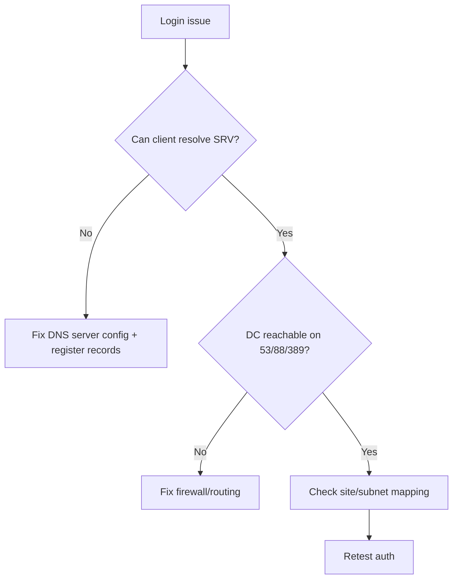

# 05. AD-Integrated DNS

> AD works because DNS works. If DNS is wrong, AD is down.

---

## Why DNS is Critical for AD

AD clients discover services via SRV records:
- `_ldap._tcp.dc._msdcs.<domain>`
- `_kerberos._tcp.<domain>`
- `_gc._tcp.<forest>`


---

## Core DNS Health Checks (PowerShell + CMD)

### SRV and A/PTR resolution

**PowerShell**
```powershell
Resolve-DnsName -Type SRV _ldap._tcp.dc._msdcs.corp.com
Resolve-DnsName dc01.corp.com
Resolve-DnsName 10.1.0.10 -Type PTR
```

**CMD**
```cmd
nslookup -type=SRV _ldap._tcp.dc._msdcs.corp.com
nslookup dc01.corp.com
nslookup 10.1.0.10
```

### Zone + replication visibility

**PowerShell**
```powershell
Get-DnsServerZone
Get-DnsServerResourceRecord -ZoneName "corp.com" -RRType SRV
Get-ADReplicationPartnerMetadata -Target * -Scope Forest | Select Server,LastReplicationSuccess
```

**CMD**
```cmd
dcdiag /test:DNS /v
repadmin /replsummary
repadmin /showrepl
```

---

## Common Scenarios

1. **Clients cannot find DC**
   - Wrong DNS server configured on NIC
   - Missing SRV records
2. **Login slow/fails in one site**
   - Subnet-to-site mapping missing
   - Clients selecting remote DC
3. **Records stale**
   - Aging/scavenging too aggressive
4. **Split-brain DNS**
   - Public and private zones conflicting



---

## Troubleshooting Playbook

### Re-register DNS records on DC

**PowerShell**
```powershell
Restart-Service netlogon
ipconfig /registerdns
```

**CMD**
```cmd
net stop netlogon && net start netlogon
ipconfig /registerdns
nltest /dsregdns
```

### Validate client DNS settings

**PowerShell**
```powershell
Get-DnsClientServerAddress -AddressFamily IPv4
```

**CMD**
```cmd
ipconfig /all
```

### Check DNS event logs

**PowerShell**
```powershell
Get-WinEvent -LogName "DNS Server" -MaxEvents 50 | Select TimeCreated,Id,LevelDisplayName,Message
```

**CMD**
```cmd
wevtutil qe "DNS Server" /f:text /c:20
```

---

## Best Practices

- AD clients should use **only AD DNS servers**
- At least 2 DNS/DC per major site
- Configure reverse lookup zones
- Validate scavenging windows before enabling
- Monitor SRV record count and DNS query failures

**Next**: Security hardening → [06-ad-security-hardening.md](06-ad-security-hardening.md)
