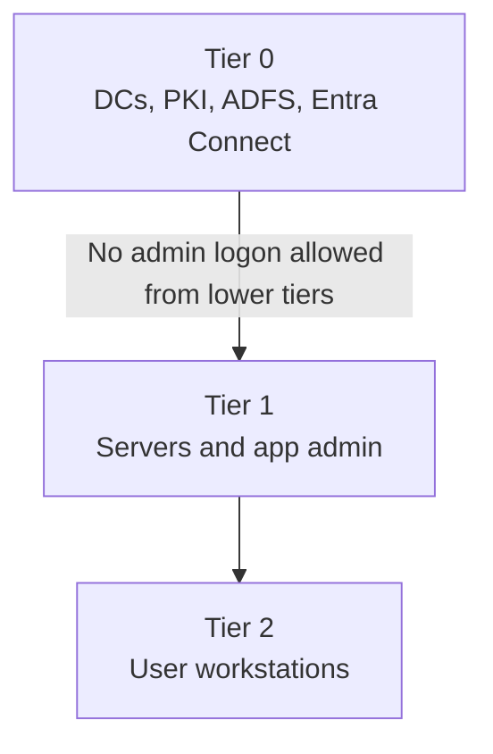

# 06. AD Security Hardening

> AD compromise = enterprise compromise. Harden Tier 0 first.

---

## Tiered Administration Model



Rules:
- Tier 0 admins log in only to Tier 0 assets
- Separate admin accounts from user accounts
- Block internet + email on privileged workstations

---

## Security Baseline Checks (PowerShell + CMD)

### Privileged group exposure

**PowerShell**
```powershell
Get-ADGroupMember "Domain Admins" -Recursive
Get-ADGroupMember "Enterprise Admins" -Recursive
Get-ADGroupMember "Administrators" -Recursive
```

**CMD**
```cmd
net group "Domain Admins" /domain
net group "Enterprise Admins" /domain
```

### Delegation / attack surface

**PowerShell**
```powershell
Get-ADComputer -Filter {TrustedForDelegation -eq $true}
Get-ADUser -Filter {DoesNotRequirePreAuth -eq $true}
Get-ADUser -Filter {ServicePrincipalName -like "*"} -Properties ServicePrincipalName
```

**CMD**
```cmd
setspn -X
setspn -Q */*
```

### Audit policy and log volume

**PowerShell**
```powershell
Get-WinEvent -LogName Security -MaxEvents 200 | Select TimeCreated,Id,Message
```

**CMD**
```cmd
auditpol /get /category:*
wevtutil qe Security /f:text /c:20
```

---

## Hardening Controls

- Enforce LDAP signing and channel binding
- Disable NTLM where possible (audit first)
- Deploy LAPS / Windows LAPS
- Use gMSA for service accounts
- Rotate KRBTGT twice during incident recovery
- Remove unconstrained delegation
- Enable Protected Users group for privileged identities
- Enable Authentication Policies/Silos for admin accounts


---

## Incident: Suspected Credential Theft

1. Isolate affected hosts
2. Reset privileged credentials in order
3. Rotate KRBTGT twice
4. Reissue service account secrets
5. Hunt for persistence (ACL backdoors, SIDHistory abuse)

**PowerShell**
```powershell
Get-ADObject -LDAPFilter "(adminCount=1)" -Properties adminCount,ntSecurityDescriptor
```

**CMD**
```cmd
nltest /dclist:corp.com
dcdiag /test:SecurityError
```

**Next**: Troubleshooting scenarios → [07-ad-troubleshooting-playbook.md](07-ad-troubleshooting-playbook.md)
