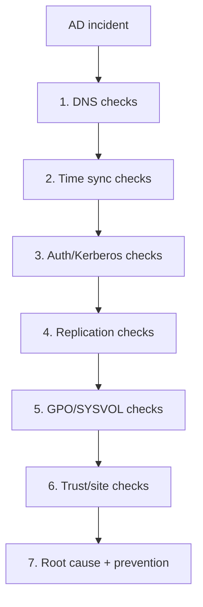

# 07. AD Troubleshooting Playbook (Pro)

> Real incident patterns with deterministic checks.

---

## Master Troubleshooting Workflow



---

## Scenario 1: Users cannot log in

**PowerShell**
```powershell
Resolve-DnsName -Type SRV _ldap._tcp.dc._msdcs.corp.com
w32tm /query /status
Get-ADDomainController -Discover
```

**CMD**
```cmd
nslookup -type=SRV _ldap._tcp.dc._msdcs.corp.com
nltest /dsgetdc:corp.com
klist
```

---

## Scenario 2: Replication failing

**PowerShell**
```powershell
Get-ADReplicationFailure -Scope Forest
Get-ADReplicationPartnerMetadata -Target * -Scope Forest
```

**CMD**
```cmd
repadmin /replsummary
repadmin /showrepl
repadmin /syncall /AdeP
```

---

## Scenario 3: Kerberos errors (`KRB_AP_ERR_MODIFIED`)

**PowerShell**
```powershell
Get-WinEvent -LogName Security -MaxEvents 100 | ? Id -in 4768,4769,4771
```

**CMD**
```cmd
setspn -X
setspn -Q HTTP/app.corp.com
klist purge
```

---

## Scenario 4: GPO not applying

**PowerShell**
```powershell
Get-GPInheritance -Target "OU=Workstations,DC=corp,DC=com"
Get-GPOReport -Name "MyPolicy" -ReportType Html -Path C:\gpo.html
```

**CMD**
```cmd
gpresult /h C:\gp.html
gpupdate /force
```

---

## Scenario 5: Trust broken

**PowerShell**
```powershell
Get-ADTrust -Filter *
```

**CMD**
```cmd
nltest /domain_trusts /v
netdom trust contoso.com /domain:fabrikam.com /verify
```

---

## Scenario 6: FSMO holder unavailable

**PowerShell**
```powershell
Get-ADDomain | Select PDCEmulator,RIDMaster,InfrastructureMaster
Get-ADForest | Select SchemaMaster,DomainNamingMaster
```

**CMD**
```cmd
netdom query fsmo
dcdiag /test:FSMOCheck
```

---

## High-Value Event IDs

- 4624 / 4625 — logon success/failure
- 4768 / 4769 / 4771 — Kerberos auth lifecycle
- 4740 — account lockout
- 4016 / 5016 — Group Policy processing

**PowerShell**
```powershell
Get-WinEvent -FilterHashtable @{LogName='Security'; Id=4625,4768,4769,4771,4740} -MaxEvents 200
```

**CMD**
```cmd
wevtutil qe Security /q:"*[System[(EventID=4625 or EventID=4768 or EventID=4769 or EventID=4771 or EventID=4740)]]" /f:text /c:40
```

**Next**: Hybrid AD + Entra integration → [08-ad-hybrid-azure-entra.md](08-ad-hybrid-azure-entra.md)
