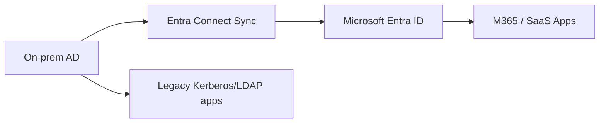
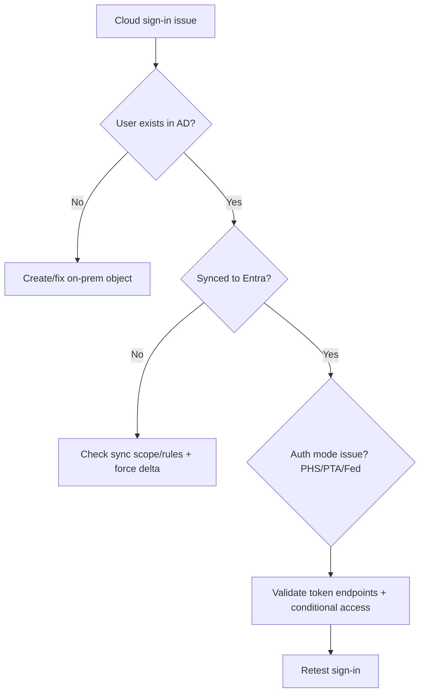

# 08. Hybrid AD + Microsoft Entra ID

> Most enterprises run hybrid identity. AD and Entra must be operated as one system.

---

## Identity Topologies



Modes:
- Password Hash Sync (PHS)
- Pass-through Authentication (PTA)
- Federation (AD FS)

---

## Hybrid Health Checks (PowerShell + CMD)

### Entra Connect / sync server checks

**PowerShell**
```powershell
Get-Service ADSync
Get-ADSyncScheduler
Start-ADSyncSyncCycle -PolicyType Delta
```

**CMD**
```cmd
sc query ADSync
dsregcmd /status
```

### UPN, ImmutableID, and login checks

**PowerShell**
```powershell
Get-ADUser jdoe -Properties UserPrincipalName,ObjectGUID
```

**CMD**
```cmd
whoami /upn
nltest /sc_query:corp.com
```

---

## Hybrid Troubleshooting Workflow



---

## Common Hybrid Failure Scenarios

1. **Object not syncing**
   - Out of OU scope
   - Attribute filtering issue
2. **Password changed on-prem but cloud login fails**
   - Sync delay / scheduler disabled
3. **UPN mismatch**
   - Non-routable suffix in AD (`.local`)
4. **Federation outage**
   - AD FS cert expired or endpoint down

---

## Best Practices

- Keep AD clean; cloud identity quality depends on on-prem data quality
- Use routable UPN suffixes
- Monitor sync cycle and error queues
- Protect Entra Connect server as Tier 0 asset
- Prefer PHS + Seamless SSO unless strict requirements mandate federation

**Next**: Interview scenarios → [09-ad-interview-scenarios.md](09-ad-interview-scenarios.md)
