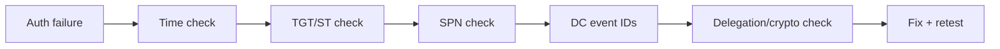

# 10. Kerberos Authentication — Interview Q&A (AD)

> Focused interview bank for AD Kerberos troubleshooting, design, and security.

---

## Quick Kerberos Debug Workflow



---

## 1) What are the 3 Kerberos exchanges in AD?

- **AS-REQ/AS-REP**: user gets TGT from KDC.
- **TGS-REQ/TGS-REP**: user requests Service Ticket for SPN.
- **AP-REQ/AP-REP**: user presents Service Ticket to app/service.

---

## 2) Why is time synchronization critical for Kerberos?

Kerberos uses timestamps to prevent replay. Default skew tolerance is ~5 minutes. Beyond that, auth fails with `KRB_AP_ERR_SKEW`.

**Checks**

PowerShell:
```powershell
w32tm /query /status
Get-Date
```

CMD:
```cmd
w32tm /query /status
time /t
```

---

## 3) What is an SPN and why does duplicate SPN break auth?

SPN maps a service instance to a security principal. If duplicate SPNs exist, KDC cannot deterministically encrypt the service ticket for the right account.

**Checks**

PowerShell:
```powershell
Get-ADUser -Filter {ServicePrincipalName -like "*"} -Properties ServicePrincipalName
```

CMD:
```cmd
setspn -Q HTTP/app.corp.com
setspn -X
```

---

## 4) Explain `KRB_AP_ERR_MODIFIED` in one line.

Ticket was encrypted for one key, but service tried to decrypt with another key (usually wrong SPN mapping or stale service account password).

---

## 5) Kerberos vs NTLM — when does NTLM still appear?

- Access by IP (no SPN)
- Missing SPN
- Legacy apps/protocols
- Broken trust or negotiation fallback

Goal in mature AD: audit and minimize NTLM.

---

## 6) What is TGT vs Service Ticket?

- **TGT**: "ticket to ask for tickets" from KDC.
- **Service Ticket**: ticket for one target SPN (e.g., `MSSQLSvc/sql01`).

**Checks**

PowerShell:
```powershell
klist
klist tgt
```

CMD:
```cmd
klist
klist sessions
```

---

## 7) What is Kerberoasting and how do you reduce risk?

Attacker requests service tickets for SPN accounts and cracks them offline.
Mitigation:
- gMSA for services
- long random passwords
- monitor abnormal TGS requests (4769)

---

## 8) What is AS-REP roasting?

Attack against users with "Do not require Kerberos pre-authentication" enabled. Attacker requests AS-REP and cracks offline.

PowerShell check:
```powershell
Get-ADUser -Filter {DoesNotRequirePreAuth -eq $true}
```

---

## 9) Golden Ticket vs Silver Ticket?

- **Golden Ticket**: forged TGT using KRBTGT hash (domain-wide impact).
- **Silver Ticket**: forged service ticket using service account hash (service-scoped impact).

Recovery priority for Golden Ticket includes KRBTGT double reset.

---

## 10) Why is KRBTGT reset done twice?

To invalidate both current and previous KRBTGT keys retained for compatibility during ticket validation windows.

---

## 11) What is delegation in Kerberos and safest model?

Delegation allows a service to act on behalf of user to back-end service.
- Avoid unconstrained delegation.
- Prefer **Resource-Based Constrained Delegation (RBCD)** in modern AD.

---

## 12) How do you triage "user can log in but cannot access SQL"?

1. Validate SQL SPN exists and unique.
2. Confirm service account password/key not stale.
3. Check ticket for `MSSQLSvc/...` in `klist`.
4. Review event IDs 4769/4771 on DC and SQL host.

**Checks**

PowerShell:
```powershell
Get-ADUser svc-sql -Properties ServicePrincipalName
Get-WinEvent -LogName Security -MaxEvents 100 | ? Id -in 4769,4771
```

CMD:
```cmd
setspn -L CORP\svc-sql
klist
wevtutil qe Security /q:"*[System[(EventID=4769 or EventID=4771)]]" /f:text /c:20
```

---

## 13) What event IDs matter most for Kerberos?

- `4768` TGT requested
- `4769` Service Ticket requested
- `4771` Kerberos pre-auth failed
- `4625` Generic failed logon

Use them together for timeline correlation.

---

## 14) Why does DNS directly impact Kerberos?

KDC discovery is DNS SRV-based. If `_kerberos._tcp` / `_ldap._tcp.dc._msdcs` resolution fails, Kerberos path fails before ticket issuance.

CMD quick check:
```cmd
nslookup -type=SRV _kerberos._tcp.corp.com
nltest /dsgetdc:corp.com
```

---

## 15) Interview whiteboard: "Intermittent Kerberos failures only in one site"

Expected root-cause paths:
- Site subnet mapping wrong → clients pick remote/unstable DC
- Time sync issue on one DC
- Replication lag causing stale SPN/password metadata
- DNS SRV inconsistency in that site

Best answer includes site-scoped checks + replication + time + SPN validation.
