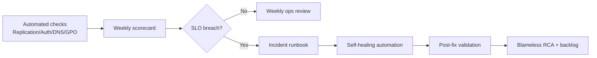
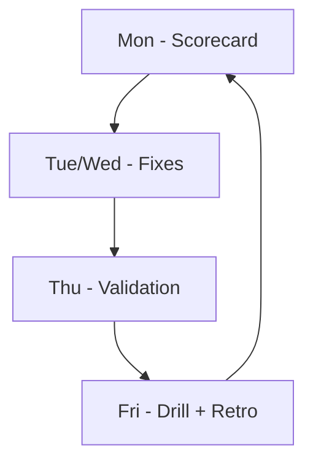

# 11. Automation & SRE Integration for AD

> Turn AD operations into measurable reliability engineering.

---

## Objectives

1. Automated health checks + safe self-healing
2. Weekly reliability scorecard
3. Incident runbooks with SLI/SLO and error budget thinking

---

## Operating Model

---

## Delivered Artifacts

- PowerShell module: [automation/ADReliability.psm1](automation/ADReliability.psm1)
- Weekly scorecard script: [automation/Invoke-ADWeeklyScorecard.ps1](automation/Invoke-ADWeeklyScorecard.ps1)
- SLI/SLO incident runbook: [automation/identity-incident-runbook-sli-slo.md](automation/identity-incident-runbook-sli-slo.md)

---

## Suggested Weekly Cadence

- Monday: generate scorecard and trend review
- Mid-week: close top 3 reliability risks
- Friday: run self-healing dry run + runbook drill

---

## Minimum Production Setup

- Run from a management host with RSAT and required privileges
- Schedule weekly script with Task Scheduler
- Archive reports in Git or object storage
- Alert when any critical SLO is breached two weeks in a row

---

## Next

Use this with:
- [07-ad-troubleshooting-playbook.md](07-ad-troubleshooting-playbook.md)
- [03-ad-authentication-kerberos.md](03-ad-authentication-kerberos.md)
- [05-ad-dns-integration.md](05-ad-dns-integration.md)
