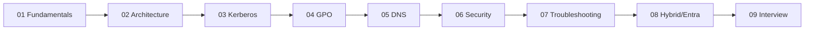
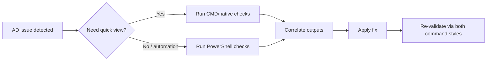

# Active Directory — Pro-Level Knowledge Base

> Complete Active Directory learning track for SREs, Platform Engineers, and Cloud Architects.
> Covers fundamentals → architecture → operations → troubleshooting → hybrid/cloud integration.

---

## Files in this Folder

| # | File | Focus |
|---|---|---|
| 1 | [01-ad-fundamentals.md](01-ad-fundamentals.md) | What AD is, core objects, LDAP, Kerberos basics |
| 2 | [02-ad-architecture.md](02-ad-architecture.md) | Forests, domains, trusts, sites, replication, FSMO |
| 3 | [03-ad-authentication-kerberos.md](03-ad-authentication-kerberos.md) | Kerberos deep dive, NTLM, SPNs, delegation |
| 4 | [04-ad-group-policy.md](04-ad-group-policy.md) | GPO architecture, processing order, troubleshooting |
| 5 | [05-ad-dns-integration.md](05-ad-dns-integration.md) | AD-integrated DNS, SRV records, replication |
| 6 | [06-ad-security-hardening.md](06-ad-security-hardening.md) | Tiered admin, LAPS, attack paths, golden ticket |
| 7 | [07-ad-troubleshooting-playbook.md](07-ad-troubleshooting-playbook.md) | 15+ real-world scenarios with commands |
| 8 | [08-ad-hybrid-azure-entra.md](08-ad-hybrid-azure-entra.md) | AD Connect, Entra ID hybrid, SSO, federation |
| 9 | [09-ad-interview-scenarios.md](09-ad-interview-scenarios.md) | Hard SRE interview questions with pro answers |

---

## Why SREs Should Learn AD

Even in cloud-native environments, AD is **everywhere**:
- Authentication backbone for Windows/Linux enterprises
- Federated to Entra ID, Okta, AWS SSO
- Hybrid cloud identity foundation
- Critical for app authentication (SQL Server, SharePoint, file shares)
- Common source of cascading outages (DNS, time sync, replication)

---

## Recommended Learning Order

**Time investment**: ~15 hours to read, ~30 hours hands-on lab.

---

## Lab Setup Recommendation

Build a small AD lab to practice:
- **VirtualBox/Hyper-V** with 3 VMs:
  - DC01 (Windows Server 2022) — primary domain controller
  - DC02 (Windows Server 2022) — second DC (replication, FSMO transfer)
  - CLIENT01 (Windows 11 / Ubuntu) — joined client for testing
- Or use **Azure free tier** with 2 VMs + AD DS role
- Tools: `dcdiag`, `repadmin`, `nltest`, `klist`, `Get-ADUser`, RSAT

---

## Core Topics Covered

- AD database (NTDS.dit), schema, partitions
- Forest, tree, domain, OU hierarchy
- Trusts (forest, external, realm, shortcut)
- Replication (intra-site, inter-site, KCC, ISTG)
- FSMO roles (5 roles, transfer, seizure)
- Sites and subnets
- Kerberos (TGT, ST, SPN, delegation: constrained, unconstrained, RBCD)
- NTLM (and why to disable it)
- LDAP queries, signing, channel binding
- Group Policy (GPP, GPO, scoping, WMI filters)
- AD-integrated DNS, SRV records, scavenging
- Tiered administration model (Tier 0/1/2)
- LAPS (Local Administrator Password Solution)
- ACL hardening, ACL backdoors
- Common attacks: Pass-the-Hash, Kerberoasting, Golden Ticket, DCSync
- Hybrid identity: Entra Connect, password hash sync, pass-through auth, federation
- Cloud-only vs hybrid vs federated

---

## Command Style in This Knowledge Base

Each chapter includes checks in **both**:
- **PowerShell** (automation, scripting, object output)
- **CMD / legacy tools** (rapid incident triage, parity with older runbooks)

Common tool families used:
- PowerShell: `Get-ADUser`, `Get-ADDomainController`, `Get-GPOReport`, `Get-WinEvent`
- CMD/native: `dcdiag`, `repadmin`, `nltest`, `klist`, `setspn`, `gpresult`, `w32tm`

---

## Common AD Failure Modes (Covered in Troubleshooting)

| Symptom | Likely Cause |
|---|---|
| Users can't log in | DC replication / time skew / DNS |
| GPO not applying | Slow link / WMI filter / loopback |
| Authentication failures | Kerberos SPN duplicate / clock drift |
| Replication broken | DNS, firewall, USN rollback |
| FSMO holder down | Need seizure, not transfer |
| AD-integrated DNS empty | Aging / scavenging misconfig |
| Slow logon | Roaming profile / GPO / scripts |
| Trust broken | Password mismatch / SID filtering |

---

## Reference Documentation

- Microsoft Learn — Active Directory Domain Services
- Microsoft Learn — Kerberos Authentication Overview
- Microsoft Learn — Group Policy Processing
- ADSecurity.org (Sean Metcalf) — security deep dives
- "Active Directory" by O'Reilly (Brian Desmond)
