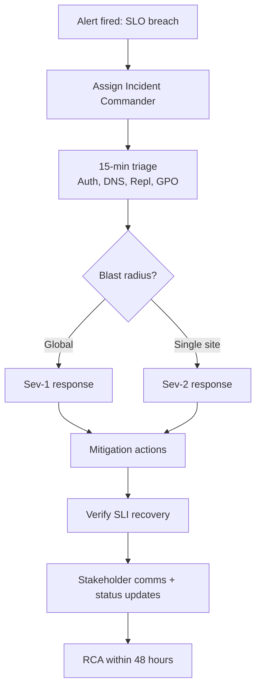

# Identity Incident Runbook with SLI/SLO (AD)

> For SRE operation of Active Directory as a reliability-critical platform.

---

## Service Definition

**Identity Service** includes:
- AD authentication (Kerberos/NTLM fallback)
- AD-integrated DNS discovery for DC/KDC/GC
- Replication and SYSVOL/GPO policy distribution

---

## SLI and SLO Targets

| SLI | Definition | SLO Target | Severity Trigger |
|---|---|---|---|
| Auth Success Rate | Successful logons / total logons | >= 99.95% (30d) | Sev-1 if < 99.5% for 15m |
| Kerberos Pre-auth Failure Rate | Event 4771 / (4768 + 4771) | < 1.0% (rolling 1h) | Sev-2 if >= 2% for 30m |
| Replication Health | Failed partners count | 0 failed partners | Sev-1 if > 0 for > 30m in core sites |
| DNS Discovery Success | SRV lookup success for LDAP/Kerberos | >= 99.99% | Sev-1 if regional failure |
| GPO Success | Event 5016 success ratio | >= 99.5% | Sev-2 if < 98.5% 1h |
| Account Lockout Noise | 4740 per 1k users per hour | < 5 | Sev-3 trend issue |

---

## Error Budget Policy

- Monthly error budget for auth success: $100 - 99.95 = 0.05\%$
- If budget burn > 50% in first 2 weeks:
  - freeze risky identity changes
  - require reliability approval for GPO/security changes

---

## Detection Queries (Minimum)

PowerShell:
```powershell
Get-WinEvent -FilterHashtable @{LogName='Security'; Id=4625,4768,4769,4771,4740; StartTime=(Get-Date).AddMinutes(-15)}
Get-ADReplicationFailure -Scope Forest
Resolve-DnsName -Type SRV _ldap._tcp.dc._msdcs.corp.com
Get-WinEvent -FilterHashtable @{LogName='Microsoft-Windows-GroupPolicy/Operational'; Id=5016,1129,8194; StartTime=(Get-Date).AddMinutes(-15)}
```

CMD:
```cmd
wevtutil qe Security /q:"*[System[(EventID=4625 or EventID=4768 or EventID=4769 or EventID=4771 or EventID=4740)]]" /f:text /c:100
repadmin /replsummary
nslookup -type=SRV _ldap._tcp.dc._msdcs.corp.com
wevtutil qe Microsoft-Windows-GroupPolicy/Operational /f:text /c:50
```

---

## Incident Workflow



---

## Mitigation Catalog (Safe First)

1. DNS re-registration on affected DC/client
2. Restart Netlogon on unhealthy nodes
3. Force replication (`repadmin /syncall /AdeP`) if queue stuck
4. Purge Kerberos cache on impacted jump hosts/app hosts
5. Roll back last risky GPO if policy-induced outage

Use module helper:

```powershell
Import-Module .\ADReliability.psm1
Invoke-ADSelfHealing -DomainFqdn corp.com -ReregisterDns -RestartNetlogon -WhatIf
Invoke-ADSelfHealing -DomainFqdn corp.com -ReregisterDns -RestartNetlogon
```

---

## Post-Incident Requirements

- SLI timeline attached to RCA
- exact failing component identified (DNS / replication / auth / GPO)
- permanent fix ticket created with owner + due date
- runbook updated in same week

---

## Weekly Review Template

- SLO compliance status (Green/Yellow/Red)
- Top 3 recurring causes
- Open reliability action items
- Drill status for this week (pass/fail)
