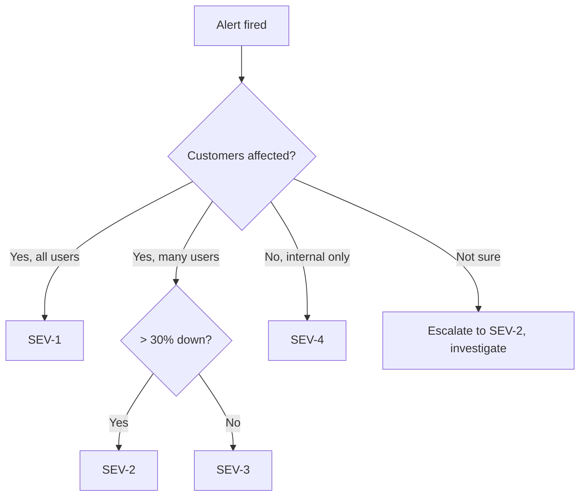
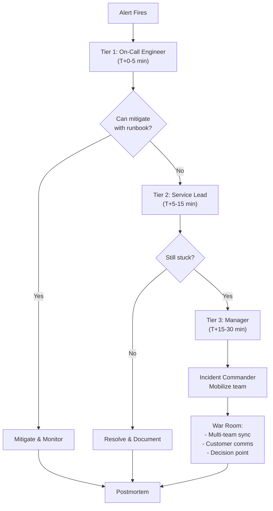
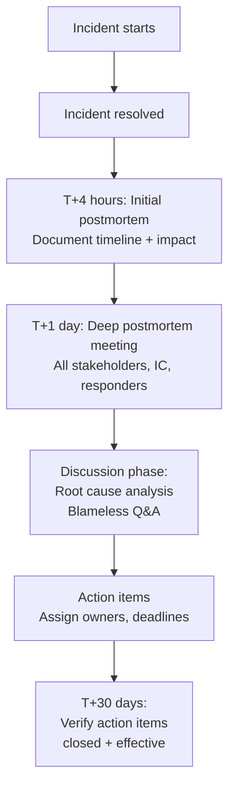

# Runbooks & Incident Response

> Reference sources: Incident Command System (ICS), blameless postmortem best practices, Google SRE Book

---

## What is it?

Incident response is the structured process of identifying, classifying, communicating about, and resolving service failures. A runbook is a documented, step-by-step guide for responding to specific failures.

Blameless incident culture emphasizes learning and system improvement over individual blame.

## What is it used for?

- **Rapid mitigation**: Reducing MTTR (Mean Time To Recovery) from hours to minutes
- **Consistent response**: Ensuring every incident is handled with the same level of professionalism
- **Knowledge capture**: Documenting how to handle recurring problems (runbooks)
- **Post-incident learning**: Identifying systemic improvements via blameless postmortems
- **Team alignment**: Clear roles, communication channels, escalation paths

## Why is it important?

- Unplanned incidents happen; how you respond determines customer impact
- Structured response prevents decision paralysis and cascading failures
- Blameless culture encourages rapid problem reporting (earlier = faster mitigation)
- Each incident is a learning opportunity to improve system design and runbooks
- Runbooks prevent knowledge silos (senior engineer leaving = institutional knowledge lost)

---

## Incident Severity Classification

### Severity Scale

| Level | Definition | Response Time | Example |
|---|---|---|---|
| **SEV-1** | Complete or critical service outage | Page on-call immediately | All users cannot authenticate |
| **SEV-2** | Major service degradation; partial outage | Alert on-call within 5 min | 50%+ error rate, critical API timing out |
| **SEV-3** | Minor issue; feature broken or slow | Alert on-call within 30 min | Single non-critical endpoint slow, low user impact |
| **SEV-4** | Cosmetic or no immediate customer impact | Next business day | Typo in error message, non-critical metric anomaly |

### Classification Flow



---

## Escalation & Communication

### Escalation Policy & Workflow

**On-Call Engineer** → detect incident → classify → page escalation chain

1. **First alert**: On-call engineer acknowledges within 5 minutes
2. **No ack within 5 min**: Secondary on-call or manager alerted
3. **Investigation stalled after 15 min**: Escalate to senior engineer / manager
4. **Unresolved after 30 min**: Engage incident commander (see below)

### Escalation Tree Diagram



### Communication Channels During Incident

| Channel | Purpose | Who |
|---|---|---|
| **#incident** Slack | Real-time updates | Everyone involved |
| **Video call** | Sync discussion if complex | On-call + helpers |
| **Customer status page** | Public communication | Communications/Marketing |
| **Postmortem doc** | After-action review | Engineering team |

### Sample Incident Channel Message Flow

```
T+0:00   [Alert system] SEV-2: API latency p99 > 5s
T+0:02   [On-call]: I'm on it. Checking dashboard.
T+0:05   [On-call]: API service CPU at 95%. Auto-scaler may be lagging.
T+0:07   [On-call]: Triggered manual scale-out (5 → 10 pods).
T+0:12   [On-call]: Latency dropping. p99 now 2.5s. Monitoring recovery.
T+0:18   [On-call]: ✓ Resolved. p99 at < 1s. Root cause: bursty traffic + slow auto-scaler.
T+0:20   [On-call]: Posting postmortem link. Follow-up: tune auto-scaler thresholds.
```

---

## Incident Commander Role

On complex incidents (SEV-1 or multi-team), designate an **Incident Commander** (IC).

### IC Responsibilities
1. **Coordination**: Ensure all teams are aligned (not working in silos)
2. **Decision-making**: Approve major actions (rollback, customer comms, scale limits)
3. **Status updates**: Regular customer/stakeholder comms
4. **Escalation**: Know when to involve management, legal, comms
5. **Mitigation vs Root Cause**: Decide whether to stabilize first or fix root cause immediately

### IC Meeting Agenda
```
Incident: [Service] Outage - [SEV level]
Time: T+0:00 to present

Current Status:
- Impact: X% of users affected, started at T+HH:MM
- Current MTTR estimate: X minutes
- Responders: Team A (DB), Team B (API), Team C (Cache)

Investigation:
- What we know: [findings]
- What we're checking: [hypotheses]

Next Steps:
- Team A: Analyze recent deployment
- Team B: Check queue latency
- IC: Prepare customer comms

ETA to resolution: T+HH:MM
```

---

## Runbook Template & Examples

### Runbook Structure

```markdown
# [Service] - [Problem Title] Runbook

**Severity**: [SEV-1/2/3]
**Responder**: [Primary team]
**Last Updated**: [Date]

## Symptoms
- Alert name: [X exceeded Y threshold]
- User-visible: [Yes/No]
- Common cause: [Most likely root cause]

## Quick Mitigation (0-5 min)
1. Step A: Check dashboard [link]
2. Step B: If metric shows X, run command: `[mitigation command]`
3. Step C: Verify recovery by checking [metric]

## Investigation (5-15 min)
If quick mitigation didn't work:
1. SSH to [server]
2. Run: `[diagnostic command]`
3. Look for: [error pattern]
4. If found: [next step]

## Root Cause Fixes
- Change A: Adjust parameter in config [link]
- Change B: Deploy fix from branch [link]

## Rollback (if needed)
```
git revert [commit]
./deploy.sh --service [service] --env prod
```

## Follow-up
- [ ] Postmortem scheduled
- [ ] Monitoring alert tuned
- [ ] Runbook updated
```

### Example Runbook: Database Connection Pool Exhaustion

```markdown
# Database Connection Pool Exhaustion Runbook

**Severity**: SEV-2
**Responder**: Backend team
**Alert**: "DB connection pool > 90%"

## Symptoms
- Alert fires when active connections > 450 (of 500 max)
- API latency spikes; requests queue waiting for connection
- Visible in `/metrics` endpoint: `db.connection.active`

## Quick Mitigation (0-5 min)
1. Check: `curl -s metrics.service.svc/metrics | grep db.connection`
2. If > 90%:
   a. Increase pool size: `kubectl set env deployment/api POOL_SIZE=750`
   b. Wait 2 min for pods to restart
   c. Verify: `curl -s metrics.service.svc/metrics`

## Investigation (5-15 min)
3. Find slow queries:
   ```sql
   SELECT query, duration FROM slow_log WHERE duration > 5000 LIMIT 10;
   ```
4. Check app logs for connection errors: `grep "connection timeout" app.log | tail -20`
5. Check if a recent deployment introduced connection leak

## Root Cause Fixes
- If slow queries: Optimize index or query
- If connection leak: Deploy code fix [PR #123]
- If sustained high load: Increase permanent pool size

## Rollback
If scaling didn't help:
```
kubectl rollout undo deployment/api
kubectl set env deployment/api POOL_SIZE=500
```

## Follow-up
- [ ] Add slow query alert to monitoring
- [ ] Postmortem to review connection pool sizing
```

---

## Blameless Postmortem Process

### Blameless Postmortem Principles

1. **No blame**: Focus on systems and processes, not individuals
   - WRONG: "Engineer deployed bad config"
   - RIGHT: "Deployment process lacked validation gate for critical parameters"

2. **Psychological safety**: Create environment where people report issues quickly
   - Safe teams detect incidents sooner

3. **Root cause analysis**: Go beyond symptoms
   - WRONG: "High CPU caused outage"
   - RIGHT: "Caching layer was down (reason: deployment bug), causing API to compute everything, causing high CPU"

4. **Action items**: Concrete improvements to prevent recurrence
   - Deploy monitoring for early detection
   - Improve runbook clarity
   - Add deployment validation

### Timeline of a Postmortem



### Sample Postmortem Document

```markdown
# Postmortem: API Service Outage — June 15, 2024

**Timeline**:
- 14:32: Alert "API error rate > 50%"
- 14:34: On-call acknowledged, began investigation
- 14:42: Identified: Redis connection pool exhausted
- 14:47: Scaled Redis connection pool from 100 → 200
- 14:52: Error rate < 1%. Service stable.
- 15:01: All clear. Root cause investigation began.

**Impact**: 
- Duration: 20 minutes
- Users affected: ~5% (cache misses)
- Revenue impact: ~$12k estimated

**Root Cause**: 
A recent deployment added a new logging line that increased Redis queries by 3x. 
The connection pool (sized at 100) was undersized for the new query rate.

**Why we didn't catch this earlier**:
1. Load testing was run with old code; didn't catch 3x increase
2. No monitoring on Redis connection pool utilization
3. Deployment review process didn't flag Redis config changes

**Action Items**:
- [ ] Add Redis connection pool monitoring + alert at 80% (Owner: Bob, Due: June 22)
- [ ] Improve load testing to match 3 peak traffic (Owner: Alice, Due: June 28)
- [ ] Add Redis metrics check to deployment review checklist (Owner: Carol, Due: June 18)

**What Went Well**:
- On-call responded quickly and escalated appropriately
- Scaling Redis fixed the immediate issue
- Good communication in #incident channel

**What Could Be Better**:
- Runbook for Redis pool exhaustion wasn't clear; on-call had to guess scale targets
- Monitoring was too late (error rate alert vs connection pool alert)
- No canary deployment for the logging change
```

---

## Incident Communication Template

### Initial Status (T+5 min)
```
We're investigating increased API error rates affecting [X]% of users. 
Our team is on it. ETA for update: [T+10 min]. 
We'll keep you posted.
```

### Status Update (T+15 min)
```
Root cause identified: Redis connection pool exhaustion. 
We're scaling the pool. ETA for resolution: [T+25 min].
```

### Resolution (T+25 min)
```
✓ Resolved. API error rate is back to normal. 
Root cause: Recent deployment increased Redis queries 3x.
We're investigating to prevent recurrence. 
Postmortem will be shared within 24 hours.
```

---

## On-Call Handoff Checklist

At shift change (e.g., Monday 9am):
- [ ] Outgoing: Brief incoming on recent incidents, any active issues
- [ ] Incoming: Confirm access to all relevant dashboards, runbooks, escalation contacts
- [ ] Both: Verify alert routing is correct
- [ ] Both: Test pager (send test alert)
- [ ] Both: Agree on communication method during incidents

---

## Common Escalation Paths

### Database Performance Issue
```
On-call Engineer
    ↓ (investigate 10 min)
Database Team Lead
    ↓ (investigate 10 min)
Database Team Manager (call war room)
    ↓
VP Engineering (if > 30 min downtime)
```

### Infrastructure Issue
```
On-call Engineer
    ↓
Infrastructure Team Lead
    ↓ (Page datacenter ops if hardware replacement needed)
Cloud Provider Support
```

---

## Postmortem Action Item Tracking

```markdown
# Action Items from Recent Postmortems

| ID | Postmortem | Action | Owner | Due Date | Status |
|---|---|---|---|---|---|
| A1 | API Outage (June 15) | Add Redis pool monitoring | Bob | June 22 | In Progress |
| A2 | API Outage (June 15) | Improve load testing | Alice | June 28 | Not Started |
| A3 | DB Timeout (June 10) | Query optimization PR #567 | Carol | June 18 | ✓ Done |
```

---

## Summary

Effective incident response combines:
1. **Clear classification** (severity, roles, escalation)
2. **Fast communication** (team sync, customer updates)
3. **Structured troubleshooting** (runbooks, investigation steps)
4. **Blameless culture** (learning from systems, not people)
5. **Continuous improvement** (postmortems, action items, runbook updates)

The goal: Minimize MTTR and use incidents as opportunities to improve system design.
