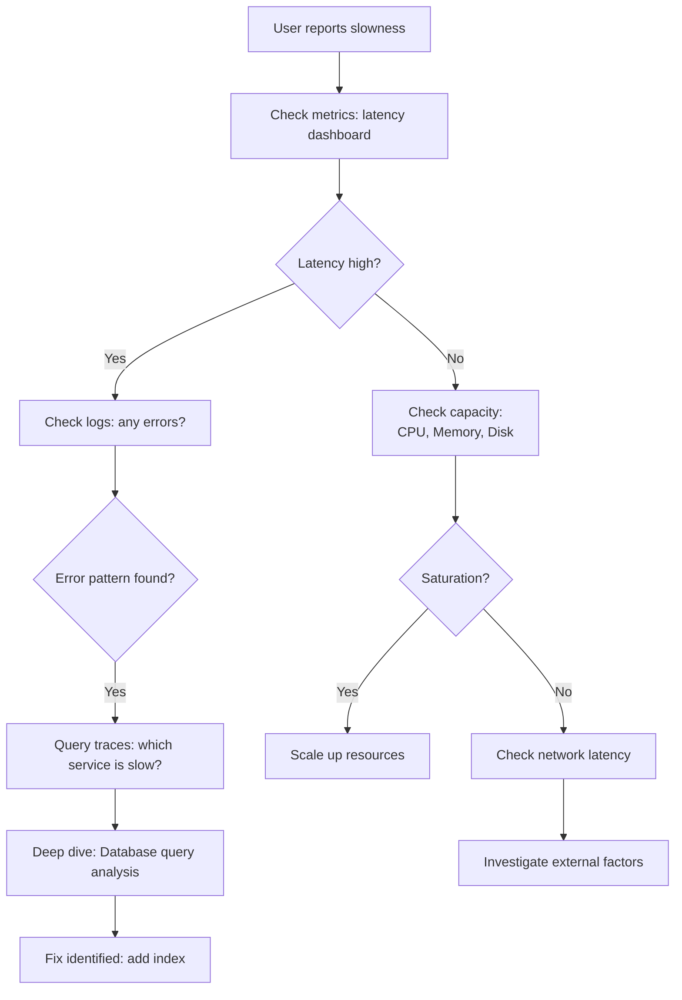
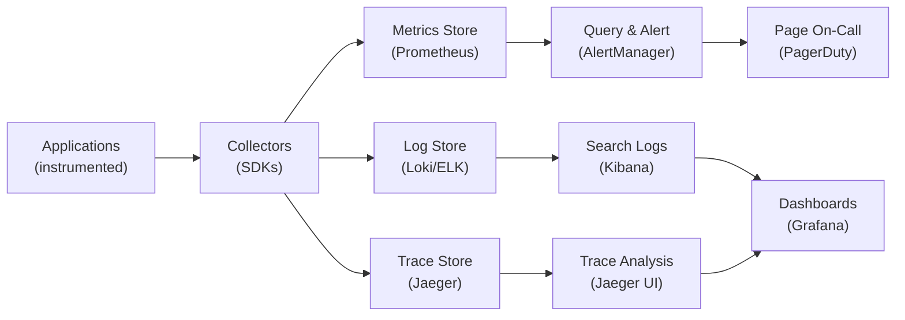
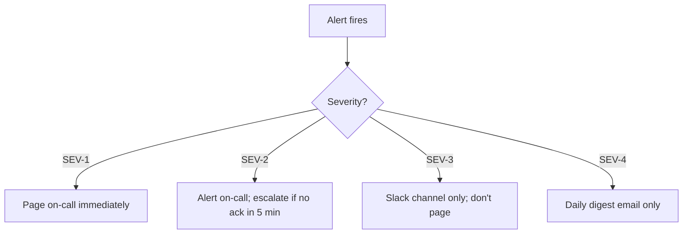

# Monitoring & Observability

> Reference sources: Prometheus best practices, Three Pillars of Observability, SRE monitoring philosophy

---

## What is it?

Observability is the ability to understand system behavior by examining its external outputs (logs, metrics, traces). Monitoring is the practice of collecting, storing, and analyzing these signals to detect anomalies and drive incident response.

**Key difference**: Monitoring tells you *when* something is wrong; observability tells you *why*.

## What is it used for?

- **Early detection**: Identify problems before users notice
- **Incident response**: Quickly find root cause during outages
- **Capacity planning**: Track resource usage trends
- **Performance optimization**: Identify bottlenecks and slowdowns
- **SLO tracking**: Measure whether you're meeting availability targets
- **Debugging**: Deep dive into what happened during an incident

## Why is it important?

- You cannot reliably operate systems you cannot observe
- Poor monitoring leads to slow MTTR (Mean Time To Recovery)
- Observability is foundational to SRE practices (SLO achievement depends on measurement)
- Cost optimization requires visibility into resource utilization
- Security incidents require audit trails (logs) and behavior anomalies (metrics)

---

## The Three Pillars of Observability

### 1) Metrics
**Numeric measurements** of system behavior over time.

**Characteristics**:
- Time-series data (value at each timestamp)
- Aggregated by design (memory efficient)
- Queryable and visualizable
- Good for: Trends, alerting, dashboards

**Examples**:
- HTTP request latency (p50, p99)
- Database query count per second
- Pod CPU utilization
- Cache hit rate

**Tools**: Prometheus, Grafana, CloudWatch, Datadog

### 2) Logs
**Discrete events** with context (timestamp, message, structured fields).

**Characteristics**:
- High volume, detailed
- Searchable and queryable
- Good for: Debugging, audit trails, error investigation
- Can be expensive at scale

**Examples**:
- Application error: `ERROR: connection timeout to db:5432`
- Deployment event: `Deployed v1.2.3 by alice`
- Security event: `Unauthorized access attempt from 1.2.3.4`

**Tools**: ELK (Elasticsearch), Splunk, Loki, Datadog, CloudWatch

### 3) Traces
**Request journeys** across distributed systems.

**Characteristics**:
- Track a single request through multiple services
- Show latency breakdown per service
- Good for: Understanding request flow, finding bottlenecks
- Expensive; typically sampled (e.g., 1% of requests)

**Examples**:
- User login request spans: Auth Service (50ms) → DB (10ms) → Cache (5ms)
- Payment processing: API (100ms) → Payment Service (200ms) → Bank API (500ms)

**Tools**: Jaeger, Zipkin, Datadog, New Relic

### Observability Troubleshooting Workflow



### Complete Observability Pipeline



---

## Four Golden Signals (Metrics-First)

Use these 4 metrics to understand any service:

### 1) Latency
**How long does a request take?**
- Measure: p50, p95, p99, p99.9
- Why: p99 matters more than average for user experience
- Example: "p99 latency < 200ms"
- Alert: p99 > 300ms OR increase > 50% in 5 min

### 2) Traffic
**How many requests?**
- Measure: Requests per second (RPS), Bytes per second
- Why: Baseline for capacity planning
- Example: "Peak traffic: 10k RPS"
- Alert: Traffic spike > 2x baseline (potential attack or viral moment)

### 3) Errors
**What percentage fail?**
- Measure: HTTP 5xx rate, exception rate, failed RPC calls
- Why: User-visible; impact on SLO
- Example: "Error rate < 0.1%"
- Alert: Error rate > 1% OR error count > 100/sec

### 4) Saturation
**How full are resources?**
- Measure: CPU %, memory %, disk %, queue length, connection pool usage
- Why: Predictor of future outages
- Example: "CPU < 70%, memory < 80%"
- Alert: CPU > 85% OR queue depth growing for 5+ minutes

### Dashboard Template: Four Golden Signals

```
┌─────────────────────────────────────────┐
│ Service: API (Prod)                     │
├─────────────────────────────────────────┤
│ Latency (p99)        │ Traffic (RPS)    │
│ 150ms (↓10%)         │ 8.2k (→ stable) │
├──────────────────────┼──────────────────┤
│ Error Rate (5xx)     │ Saturation (CPU) │
│ 0.05% (↑ slight)     │ 42% (↓ trending) │
└─────────────────────────────────────────┘
```

---

## RED vs USE Metrics

### RED (for Request-Driven Services)
- **Rate**: Requests per second (RPS)
- **Errors**: Failed request percentage
- **Duration**: Request latency (p99)

Use for: Web APIs, microservices, front-end backends

### USE (for Resources / Infrastructure)
- **Utilization**: % of resource capacity in use
- **Saturation**: Queue depth, wait time
- **Errors**: Hardware or I/O errors

Use for: Database servers, load balancers, kubernetes nodes

### Typical Monitoring Matrix

| Service Type | Key Metrics | Alert Thresholds |
|---|---|---|
| **API** | Rate, Errors, Latency (p99), CPU, Memory | Errors > 1%, p99 > 300ms, CPU > 80% |
| **Database** | Query latency, connections, replication lag, disk I/O | Replication lag > 5s, connections > 80% of max |
| **Message Queue** | Message rate, queue depth, consumer lag | Consumer lag > 1M messages, queue backing up |
| **Cache** | Hit ratio, eviction rate, memory | Hit ratio < 80%, eviction rate high |

---

## Alerting Strategy

### Principle: Alert on Symptoms, Not Causes

**WRONG** (alert on cause):
```
ALERT: CPU > 85%
ALERT: Memory > 90%
```
User doesn't care about CPU; they care about service availability.

**RIGHT** (alert on symptom / SLO):
```
ALERT: Error Rate > 1% for 5 minutes
ALERT: Latency p99 > 500ms for 5 minutes
ALERT: SLO budget burn rate > 2x
```

### Alert Runbook Requirement
Every alert must link to a runbook.

```yaml
groups:
- name: api-alerts
  rules:
  - alert: HighErrorRate
    expr: rate(http_errors_total[5m]) > 0.01
    for: 5m
    labels:
      severity: SEV-2
      runbook: https://wiki/runbooks/high-error-rate
    annotations:
      summary: "API error rate > 1%"
      description: "Error rate is {{ $value }}"
```

### Alert Fatigue Prevention

| Problem | Solution |
|---|---|
| Too many alerts | Alert only on SLO misses, not every metric |
| Noisy alerts | Use `for: 5m` (wait before alerting) |
| Alert storm | Use **alert aggregation** (batch related alerts) |
| Waking on-call at 3am for non-urgent | Use severity levels; only SEV-1/2 page; SEV-3/4 go to Slack |

### Alert Severity Routing



---

## Log Aggregation & Structured Logging

### Structured Logging (Best Practice)

**WRONG** (unstructured):
```
ERROR: Timeout connecting to db
```

**RIGHT** (structured):
```json
{
  "timestamp": "2024-06-15T14:32:10Z",
  "level": "ERROR",
  "service": "api",
  "message": "Database connection timeout",
  "host": "api-pod-3",
  "db_host": "postgres.default.svc",
  "duration_ms": 5000,
  "user_id": "usr_123"
}
```

### Log Levels
- **DEBUG**: Development only; verbose context
- **INFO**: Operational events (deployment, startup, periodic checks)
- **WARN**: Unexpected but recoverable (retry timeout, stale cache)
- **ERROR**: Service impaired; needs attention (failed request, timeout)
- **FATAL**: Service down; can't continue (unable to start, panic)

### Log Query Examples (Loki/Elasticsearch)

```
# Find all errors in past 5 minutes
{service="api"} | level="ERROR" | last 5m

# Count errors by status code
{service="api"} status_code="500" | stats count()

# Find slow queries
{service="db"} duration_ms > 1000 | last 1h
```

---

## Distributed Tracing Fundamentals

### Trace Structure
```
User Request (Trace ID: abc123)
├── API Service (Span 1): 100ms
│   ├── Auth Service (Span 2): 20ms
│   └── Call DB (Span 3): 50ms (waits for response)
├── Cache Service (Span 4): 5ms
└── Response: 100ms total
```

### Span Attributes
- **Trace ID**: Unique ID for entire request journey
- **Span ID**: Unique ID for this service's portion
- **Parent Span ID**: Links to previous service
- **Latency**: Time spent in this service
- **Tags**: Key-value metadata (user_id, cache_hit, etc.)
- **Logs**: Events within the span (cache miss, retry attempt)

### Sampling Strategy
```
Sample 100% of:
- Error traces
- Slow traces (latency > p99)
- Requests to new services

Sample 1% of:
- Normal successful requests

Result: ~5% of all traces sampled, cost-effective
```

### Trace Query: Find Slow Requests

```
# Show traces where any span > 500ms
service="api" AND latency > 500ms

# Breakdown: which service is slowest?
# Result: 
#  - API Service: 100ms (normal)
#  - Auth Service: 20ms (normal)
#  - DB Service: 350ms (SLOW!)
#  → Index on user_id needed
```

---

## SLO Monitoring

### SLO to Metrics

```
SLO: 99.9% of requests succeed

Metric:
success_rate = (total_requests - failed_requests) / total_requests

Alert:
success_rate < 0.999 for 10 minutes → SEV-2 alert
```

### Error Budget Tracking

```
Monthly SLO: 99.9%
Allowed downtime: 43 minutes
Error budget over 30 days: 43 minutes

Daily burn tracking:
- Monday: Used 5 min (88% budget remaining)
- Tuesday: Used 2 min (86% budget remaining)
- Trend: At this rate, error budget depleted by Friday

Action: Freeze risky deployments; focus on stability
```

### Dashboard: SLO Status

```
┌────────────────────────────────────┐
│ SLO Performance - June 2024         │
├────────────────────────────────────┤
│ Target SLO:          99.9%          │
│ Actual:              99.87%         │
│ Status:              ⚠️  Below SLO   │
│ Error Budget Used:   87% (tight!)   │
│ Days Until Depleted: 3 days         │
├────────────────────────────────────┤
│ Recommend: Stabilize before Friday  │
│            Pause risky features     │
└────────────────────────────────────┘
```

---

## Observability Stack Example (Prometheus + Grafana)

### Architecture
```
Applications
    ↓ (scrape metrics)
Prometheus (time-series database)
    ↓ (query)
Grafana (visualization)
    ↓ (rule evaluation)
Alertmanager (alert routing)
    ↓ (page/email/slack)
On-Call Team
```

### Sample Prometheus Query (PromQL)

```
# P99 latency over last 5 minutes
histogram_quantile(0.99, rate(http_request_duration_seconds_bucket[5m]))

# Error rate over last 5 minutes
rate(http_requests_total{status=~"5.."}[5m])

# CPU utilization
1 - rate(node_cpu_seconds_total{mode="idle"}[5m])
```

---

## On-Call Alerting Best Practices

| Practice | Benefit |
|---|---|
| **Alert runbooks mandatory** | On-call knows what to do |
| **Alert on SLO, not metrics** | Reduces noise |
| **Test alerts weekly** | Catch broken automations early |
| **Alert aggregation** | Prevent storm of related alerts |
| **Severity levels** | Page only critical issues |
| **Dedicated Slack channel** | Team stays informed without noise |
| **Dashboard pre-populated** | On-call can investigate immediately |

---

## Observability Checklist

- [ ] Instrumented all critical paths (latency, errors, rate)
- [ ] Golden signals dashboard (latency, traffic, errors, saturation)
- [ ] Logs aggregated centrally (ELK or Loki)
- [ ] Structured logging in all services (JSON format)
- [ ] Distributed tracing enabled (Jaeger or Zipkin)
- [ ] Alerts link to runbooks
- [ ] Alert routing by severity (page for SEV-1/2 only)
- [ ] SLO dashboard visible to team
- [ ] Monthly observability review (alert tuning, new insights)

---

## Summary

Observability is the foundation of reliable operations. By combining metrics (trending), logs (debugging), and traces (request flow), SRE teams can:
1. Detect problems early
2. Find root causes quickly
3. Measure SLO achievement
4. Optimize system design
5. Reduce MTTR

Effective monitoring alerts on *symptoms* (error rate), not *causes* (high CPU), and ensures every alert has a clear runbook.
