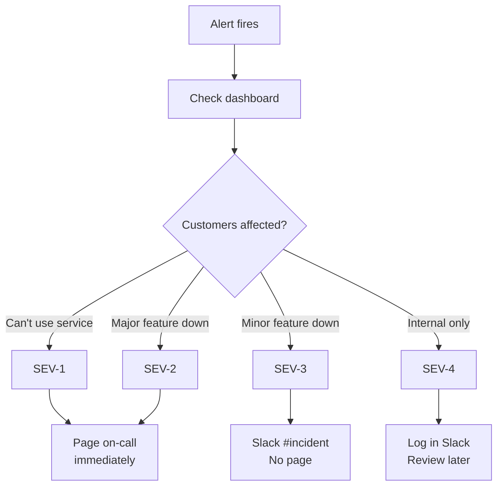
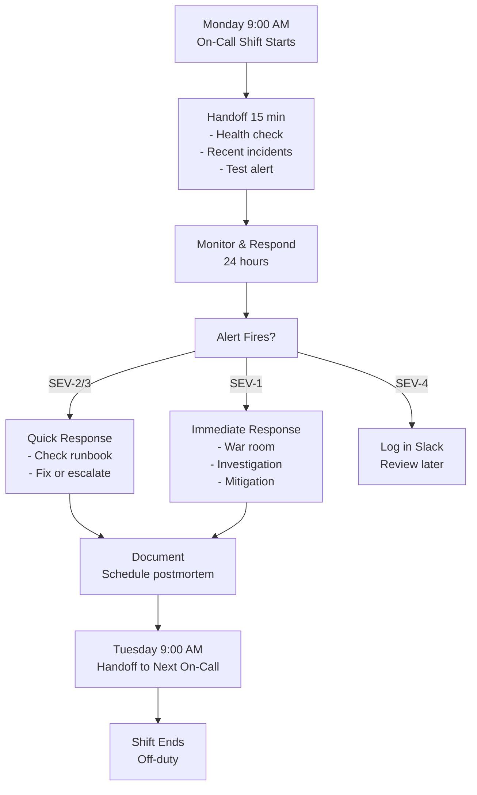
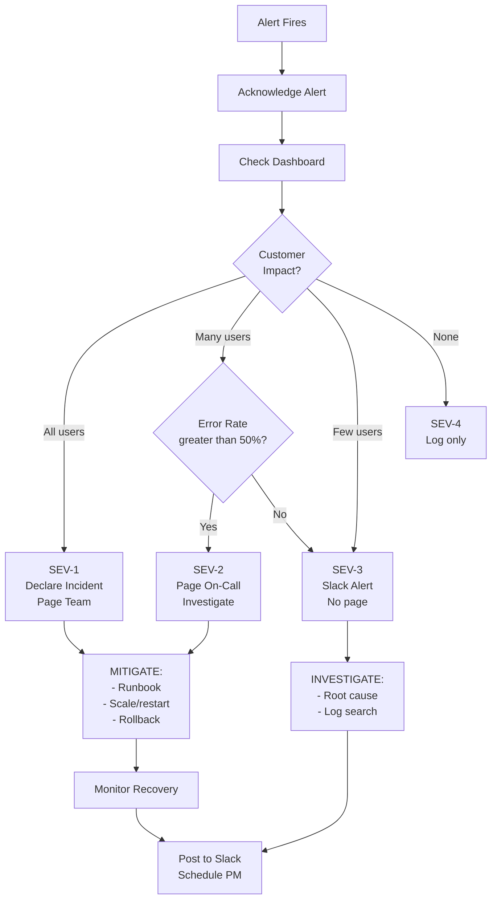

# On-Call Guide

> Reference sources: Incident Command System, industry on-call best practices, blameless culture

---

## What is it?

An on-call program is an organized system where engineers rotate responsibility for responding to production incidents outside normal business hours. On-call engineers are "on the hook" to respond to alerts and page escalations.

## What is it used for?

- **24/7 coverage**: Ensure critical systems have someone monitoring and responding
- **Fast incident response**: Immediate response reduces customer impact
- **Team resilience**: Shared responsibility prevents burnout
- **Skill development**: Junior engineers gain real-world incident experience
- **Service continuity**: Predictable response to emergencies

## Why is it important?

- Production incidents don't respect business hours
- Slow response = extended outages, customer impact, SLO miss
- Shared on-call responsibility is fairer and prevents burnout than ad-hoc firefighting
- Well-designed on-call program is correlate with lower burnout and higher retention
- Regular on-call participation builds reliability culture company-wide

---

## On-Call Rotation Design

### Typical Rotation Structure

```
Team: Backend API (4 engineers)
Schedule:
- Monday 9am - Tuesday 9am: Alice (on-call)
- Tuesday 9am - Wednesday 9am: Bob (on-call)
- Wednesday 9am - Thursday 9am: Carol (on-call)
- Thursday 9am - Friday 9am: Dave (on-call)
- Friday 9am - Monday 9am: Alice (on-call) [covers weekend]
```

### Best Practices for Scheduling

| Practice | Reason |
|---|---|
| **1-week rotations** | Balances coverage and personal time |
| **Handoff at fixed time** (e.g., 9am Monday) | Clarity and consistency |
| **No back-to-back on-call** | Prevents fatigue; on-call needs recovery |
| **Primary + Secondary (shadow)** | Primary handles alerts; secondary escalates if needed |
| **Coverage for vacations** | Plan coverage 2 months ahead |
| **Public calendar** | Team knows who's on-call |

### Rotation Anti-Patterns

| Anti-Pattern | Problem |
|---|---|
| **On-call duties shared vaguely** | No clear owner; incidents response delayed |
| **Senior only on-call** | Blocks junior engineers' learning |
| **Back-to-back weeks** | Engineer exhausted by Monday |
| **Unclear escalation** | On-call unsure when to page manager |
| **On-call during off-hours poorly compensated** | High turnover |

---

## Pre-Shift Handoff Checklist

### Outgoing On-Call Engineer (T-0:30)
- [ ] **Health check**: Is the service stable? Any active issues?
- [ ] **Recent incidents**: Brief incoming on what happened this week
- [ ] **Known issues**: Any ongoing investigations or degradation?
- [ ] **Deployment status**: Is a risky deploy happening soon?
- [ ] **Calendar**: Any scheduled maintenance or events?

### Incoming On-Call Engineer (T+0:00)
- [ ] **Confirm dashboard access**: Can you view all dashboards?
- [ ] **Verify alert routing**: Did the pager switch to you?
- [ ] **Test alert**: Ask system to send test alert; confirm you receive it
- [ ] **Runbooks accessible**: Can you reach wiki/runbooks quickly?
- [ ] **Escalation contacts**: Confirm phone numbers for manager, senior engineers
- [ ] **Communication**: Slack #incident channel visible?

### Handoff Meeting (15 min)
```
Outgoing: "This week was quiet. One SEV-3 on Tuesday (API timeout, 
resolved in 15 min). Database team is investigating slow query 
(might affect us). Usual load. No deploys planned. You're good."

Incoming: "Got it. Dashboards look normal. I can see all alerts. 
Let's do a test page?"

[System pages incoming engineer]

Incoming: "✓ I got the page. I'm ready."
```

---

## Alert Triage & Severity Levels

### Severity Levels (Reminder from Fundamentals)

| Level | Definition | Response | Example |
|---|---|---|---|
| **SEV-1** | Complete outage, critical impact | Page immediately | All users can't authenticate |
| **SEV-2** | Major degradation | Page; on-call acks within 5 min | 50% error rate |
| **SEV-3** | Minor issue | Don't page; Slack only | Single feature broken |
| **SEV-4** | Cosmetic | Daily digest | Typo in message |

### Triage Decision Tree



### Example: Triage in Action

```
Alert: "Database replication lag > 60 seconds"

On-call checks:
1. Dashboard: Replication lag 80s, primary DB healthy
2. Application logs: No errors (reads from secondary, stale OK for this app)
3. Customer impact: Users see stale data (< 2 min old), acceptable
4. Classification: SEV-3 (degrade monitoring alert, but not critical)

Action: Post to #incident, don't page. Investigate in morning.
```

---

## Incident Response Workflow (On-Call)

### Timeline: From Alert to Resolution

```
T+0:00   Alert fires
T+0:05   On-call acknowledges alert
T+0:10   On-call determines severity & classifies
T+0:15   If SEV-1: Gather team, start video call
T+0:20   Begin investigation using runbook
T+0:30   Share findings in #incident channel
T+0:45   Mitigation deployed or escalated
T+1:00   Service recovered
T+1:15   Initial postmortem started; action items assigned
```

### On-Call Shift Day Timeline



### Alert Triage Decision Tree (Detailed)



### Investigation Protocol

1. **Check dashboard first**: Are the affected metrics/services visible?
2. **Review recent changes**: Was there a deployment/config change?
3. **Run diagnostic commands**: Follow runbook steps
4. **Check logs**: Search for error patterns
5. **Page for help if stuck**: Don't spin wheels for 10 minutes
   - After 10 min of investigation without progress → page domain expert

### Communication During Incident

**T+1 min**: Post to #incident
```
🚨 SEV-2: API error rate spike
- Alert: HTTP 5xx > 5%
- Affected: users [region]
- Investigating...
```

**T+10 min**: Update with findings
```
Investigation: Database connection pool may be exhausted.
Checking current pool status...
```

**T+15 min**: Share action
```
Action: Scaling DB connection pool from 100 → 200 connections
ETA to resolution: 5 minutes
```

**T+20 min**: Resolution
```
✓ Resolved. Pool scaled; error rate < 0.1%
Following up: Why wasn't alert triggered earlier?
Postmortem link: [docs.google.com/postmortem/...]
```

---

## On-Call Decision Framework

### When to Page for Help

```
On-call should page escalation if:
1. Cannot reproduce the issue within 10 min
2. Runbook doesn't help
3. Issue requires privileged access (only senior engineer has)
4. Multiple systems affected (need coordination)
5. Unsure of blast radius (don't want to make it worse)
```

### Example: Paging Decision

```
Issue: Cache service latency spike

On-call thinks:
- Checked dashboard: latency p99 increased from 10ms to 500ms
- Checked deployment: no recent changes
- Checked load: traffic normal
- Checked runbook: says "check connection pool"
- Confirmed: connection pool at 80% (normal)
- Stuck: don't know what else to check

Decision: Page cache team lead after 10 min stuck
Result: Cache lead immediately identifies GC pause (needed senior knowledge)
```

---

## Incident Commander Role (On-Call Perspective)

If you're the Incident Commander (IC) during a SEV-1:

### IC Responsibilities
1. **Declare incident open** on #incident channel
2. **Coordinate teams**: "Database team, check replication. API team, check app logs."
3. **Decision point**: "Do we roll back the 9:30 deployment or scale resources?"
4. **Status updates**: Every 5-10 min, brief status to executives/product
5. **Declare resolution**: "Service stable. Reverting to normal ops mode."

### IC Checklist

```
Incident Open?
- [ ] Declared SEV-1 in #incident
- [ ] Created war room video call
- [ ] Assigned roles: Scribe (logs timeline), Comms (customer updates)

Investigation?
- [ ] Each team has clear action item
- [ ] Results shared in #incident
- [ ] No team working in isolation

Mitigation?
- [ ] Proposed fix discussed + approved
- [ ] Rollback plan ready if mitigation fails
- [ ] Customer comms queued

Resolution?
- [ ] Service stable for 5+ minutes
- [ ] IC declares incident closed
- [ ] Postmortem scheduled
```

---

## On-Call Burnout Prevention

### Signs of On-Call Burnout
- Checking Slack at 3am even when not on-call
- Dreading on-call weeks
- Pessimism about incident response
- Skipping postmortems or not engaging
- Considering leaving the team

### Prevention Strategies

| Strategy | How |
|---|---|
| **Compensation** | Pay for on-call hours (e.g., 25% stipend per week on-call) |
| **No back-to-back** | Never schedule engineer on-call two weeks in a row |
| **Reasonable thresholds** | Don't page for non-critical issues |
| **Good runbooks** | Incident should take 20 min, not 2 hours |
| **Clear escalation** | Engineer knows when to hand off (don't carry burden) |
| **Recovery time** | Day off after handling major incident (optional) |
| **Rotation fairness** | All engineers (including managers) participate |
| **Incident postmortems** | Show that incidents lead to improvements |

### Post-Incident Recovery

After handling a major incident (SEV-1 lasting 3+ hours):
- [ ] Offer on-call engineer next day off (optional)
- [ ] Manager check-in: "How are you doing?"
- [ ] Highlight what went well in postmortem
- [ ] Ensure action items address root cause (not just symptoms)

---

## On-Call Tools & Setup

### Essential Tools
1. **Pager system** (PagerDuty, Opsgenie)
   - Routing: Alert → on-call → escalation
   - On-call schedule
   - Mobile app for acknowledgments

2. **Dashboards** (Grafana, Datadog)
   - Pre-configured for rapid investigation
   - Quick links to logs, traces, runbooks

3. **Runbook repository** (Wiki, Notion, Confluence)
   - Searchable, linked from alerts
   - Version-controlled, reviewed

4. **Communication** (Slack, Teams)
   - #incident channel for real-time updates
   - Thread for incident discussion

### Ideal Setup for On-Call

```
Mobile Phone:
├── PagerDuty app (receive alerts)
├── Slack (team communication)
└── Authenticator app (MFA for emergency access)

Laptop (if home):
├── VPN configured
├── Pre-login to dashboards
├── Editor open to runbooks
└── SSH keys for server access
```

---

## On-Call Escalation Hierarchy

### Example Escalation Path

```
Level 1 (First 10 min): On-Call Engineer
  ├─ Check dashboard, review runbook
  ├─ If stuck: Page Level 2

Level 2 (10-30 min): Service Team Lead
  ├─ Dig deeper, possibly run privileged diagnostics
  ├─ If stuck: Page Level 3

Level 3 (30-60 min): Service Manager / Sr. Engineer
  ├─ Strategic decision (rollback, scale out, accept risk)
  ├─ Customer/executive communication

Level 4 (60+ min): VP / Director
  ├─ Major incident (SLA breach, revenue impact)
  ├─ Coordinate across teams
  ├─ Executive decision
```

---

## Post-Shift Debrief

### Outgoing On-Call → Manager (Weekly)

```
Manager: "How was your on-call week?"

Engineer: "Quiet. One SEV-3 Tuesday (resolved in 15 min). 
Runbook for that was out of date; I updated it. 
Otherwise smooth. Ready to hand off."

Manager: "Thanks for the update. Good catch on the runbook. 
How are you feeling about on-call rotation?"

Engineer: "Good. Sleep wasn't too disrupted."
```

### Quarterly On-Call Review (Whole Team)

Agenda:
- [ ] How many SEV-1/2 incidents this quarter?
- [ ] Are runbooks effective?
- [ ] Any on-call burnout?
- [ ] Alert tuning: Reduce false positives?
- [ ] New risks to cover?

---

## On-Call Metrics to Track

| Metric | Ideal | Action |
|---|---|---|
| **Pages per week** | 1-3 | If > 10: alert tuning needed |
| **SEV-1 incidents/quarter** | < 2 | If > 5: reliability focus needed |
| **Avg MTTR for SEV-2** | < 30 min | If > 1 hour: runbook/monitoring gap |
| **On-call satisfaction** | > 3.5/5 | If < 3: burnout risk; adjust compensation/tools |
| **Runbook "save rate"** | > 80% | Runbooks solving most incidents |

---

## On-Call Handoff Template

```markdown
# On-Call Handoff — [Week]

## Outgoing On-Call: [Name]
- Week: [Dates]
- Incidents: [count SEV-1/2/3/4]
- MTTR avg: [X min]
- Service status: Stable / Needs attention
- Notable events: [deployments, updates, issues]

## Key Points for Incoming On-Call:
- [ ] [Issue 1 and what to watch for]
- [ ] [Issue 2 and its status]
- [ ] [Any upcoming events]
- [ ] [Runbook updates made]

## Runbook Changes:
- Updated: [Runbook name] (reason: [...])

## Approved PagerDuty Escalations:
- Level 1: On-call to [service-team-lead@...]
- Level 2: Service lead to [manager@...]

## Dashboard Links:
- [Service Health](dashboard-link)
- [Alert Status](alerts-link)
```

---

## Summary

An effective on-call program requires:
1. **Clear rotation** (1-week, no back-to-back)
2. **Handoff ritual** (ensure incoming engineer is ready)
3. **Fast triage** (severity classification, runbook-driven)
4. **Clear escalation** (know when to page for help)
5. **Burnout prevention** (compensation, recovery, support)
6. **Incident leadership** (IC role during major incidents)
7. **Continuous improvement** (postmortems, runbook updates, metric tracking)

A healthy on-call culture balances *reliability* (systems are stable) with *sustainability* (engineers don't burn out).
