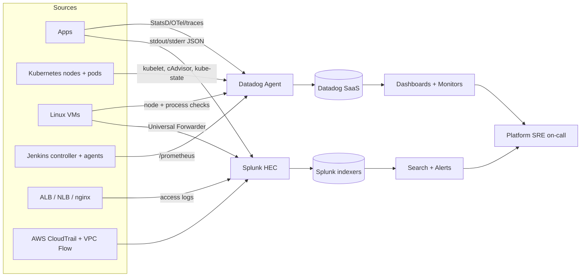
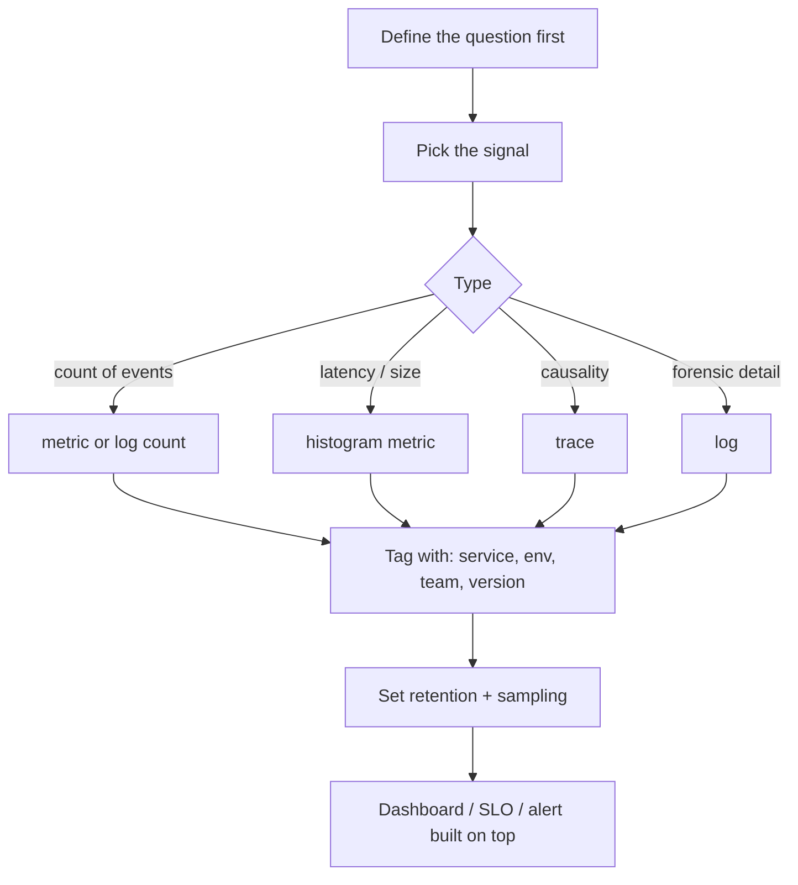
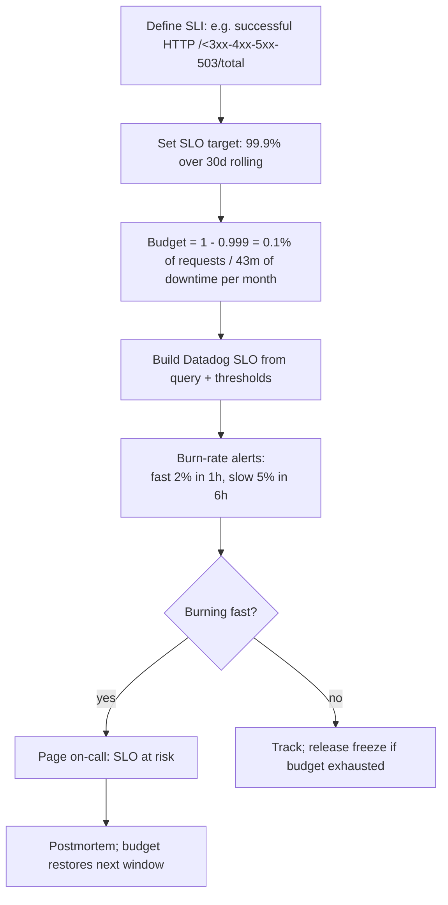
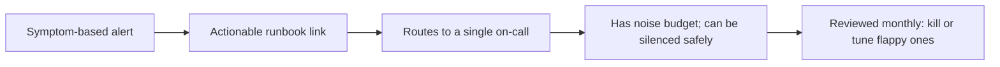
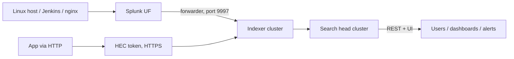
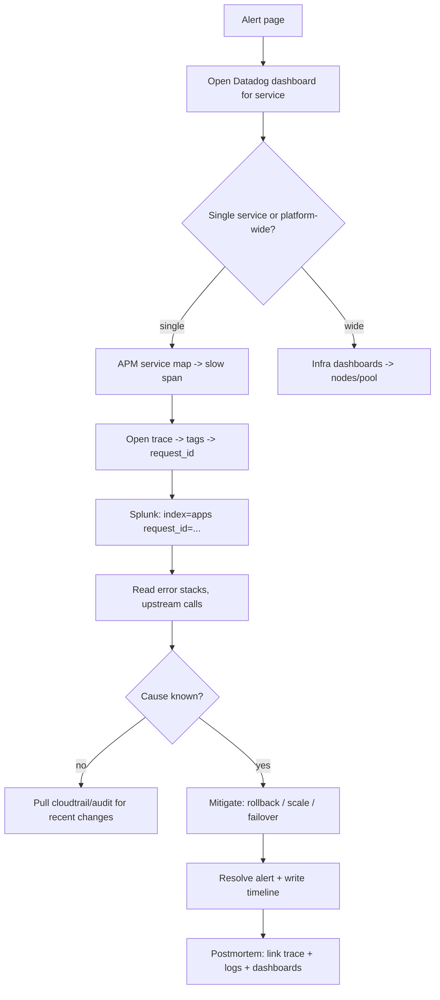
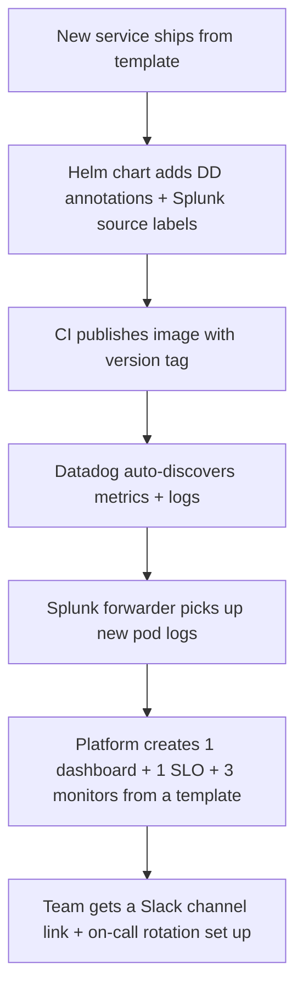
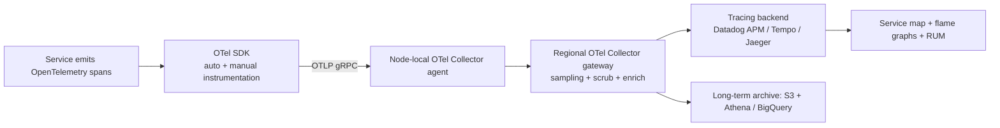
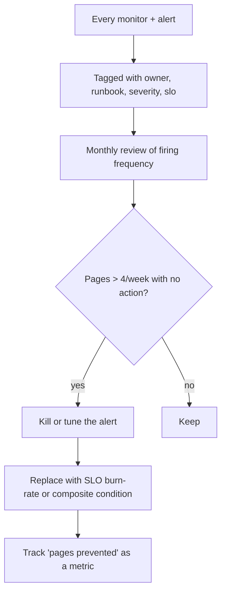
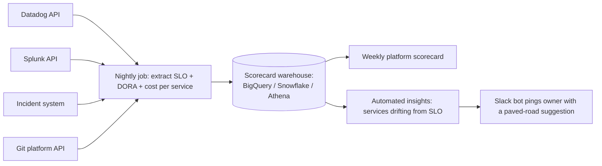

# 06. Observability — Splunk + Datadog for Platform SRE

> **JD line items covered**
> - Platform-level dashboards and alerting
> - SLA/SLO tracking
> - Log analysis and incident troubleshooting
>
> Mental model: **Datadog is your metrics + APM home; Splunk is your log + audit home.** Both can do both, but most orgs land here.

---

## 1. The observability stack — what's actually flowing



| Signal | Best home | Why |
| --- | --- | --- |
| Metrics (CPU, mem, latency, RPS) | Datadog | Low cost per series, fast queries, anomaly + forecast |
| Traces (distributed) | Datadog APM | Service map + flame graphs |
| Application logs | Datadog Logs **or** Splunk | Pick one; don't pay for both |
| Audit logs / security | Splunk | Long retention, role-based access, ES correlation |
| Syslog / syscalls | Splunk | UF + cribbed parsing |
| Cloud control plane logs | Splunk | CloudTrail / VPC Flow / GuardDuty |
| Custom KPIs | Datadog | Math + forecasts in the same query |

---

## 2. Telemetry hygiene — the three pillars done right



Tag taxonomy that scales (use these everywhere):
```
service:payments-api        env:prod
team:payments-sre           region:us-east-1
version:2.10.1              cluster:prod-east-1
owner:payments-sre@example.com
```

If you remember nothing else: **never alert on raw counts — alert on rates and SLOs.**

---

## 3. Datadog Agent on Kubernetes (the canonical install)

```bash
helm repo add datadog https://helm.datadoghq.com
helm repo update

cat > datadog-values.yaml <<'YAML'
datadog:
  apiKeyExistingSecret: datadog-keys
  appKeyExistingSecret: datadog-keys
  site: datadoghq.com
  clusterName: prod-east-1
  tags:
    - "env:prod"
    - "region:us-east-1"
  logs:
    enabled: true
    containerCollectAll: true
    containerCollectUsingFiles: true
  apm:
    portEnabled: true
    socketEnabled: true
  processAgent:
    enabled: true
    processCollection: true
  systemProbe:
    enabled: true
    enableTCPQueueLength: true
    enableOOMKill: true
  networkMonitoring: { enabled: true }
  prometheusScrape:
    enabled: true
    serviceEndpoints: true
clusterAgent:
  enabled: true
  metricsProvider: { enabled: true, useDatadogMetrics: true }
  admissionController: { enabled: true, mutateUnlabelled: false }
agents:
  containers:
    agent:
      resources:
        requests: { cpu: 200m, memory: 256Mi }
        limits:   { cpu: 1,    memory: 512Mi }
YAML

helm upgrade --install datadog datadog/datadog \
  -n monitoring --create-namespace \
  -f datadog-values.yaml --atomic
```

Per-pod opt-in to APM + log parsing:
```yaml
metadata:
  annotations:
    ad.datadoghq.com/api.logs:    '[{"source":"python","service":"payments-api"}]'
    ad.datadoghq.com/api.check_names: '["openmetrics"]'
    ad.datadoghq.com/api.init_configs: '[{}]'
    ad.datadoghq.com/api.instances: '[{"openmetrics_endpoint":"http://%%host%%:9090/metrics","namespace":"payments_api","metrics":[".*"]}]'
  labels:
    tags.datadoghq.com/service: payments-api
    tags.datadoghq.com/env: prod
    tags.datadoghq.com/version: "2.10.1"
```

---

## 4. Datadog dashboards — what every platform service should have

### 4.1 Platform overview dashboard (JSON example)

```json
{
  "title": "Platform — Service Overview",
  "template_variables": [
    {"name": "service", "prefix": "service", "default": "*"},
    {"name": "env",     "prefix": "env",     "default": "prod"}
  ],
  "widgets": [
    {
      "definition": {
        "type": "timeseries",
        "title": "Request rate (RPS)",
        "requests": [{
          "q": "sum:trace.http.request.hits{service:$service.value,env:$env.value}.as_rate()"
        }]
      }
    },
    {
      "definition": {
        "type": "timeseries",
        "title": "Error rate (5xx)",
        "requests": [{
          "q": "sum:trace.http.request.errors{service:$service.value,env:$env.value}.as_rate() / sum:trace.http.request.hits{service:$service.value,env:$env.value}.as_rate()"
        }]
      }
    },
    {
      "definition": {
        "type": "timeseries",
        "title": "Latency p50 / p95 / p99",
        "requests": [
          {"q": "p50:trace.http.request{service:$service.value,env:$env.value}"},
          {"q": "p95:trace.http.request{service:$service.value,env:$env.value}"},
          {"q": "p99:trace.http.request{service:$service.value,env:$env.value}"}
        ]
      }
    },
    {
      "definition": {
        "type": "query_value",
        "title": "Saturation: pod CPU",
        "requests": [{
          "q": "avg:kubernetes.cpu.usage.total{service:$service.value} / avg:kubernetes.cpu.limits{service:$service.value}"
        }]
      }
    }
  ]
}
```

### 4.2 RED / USE templates

- **RED** (request-driven services): **R**ate, **E**rrors, **D**uration
- **USE** (resources): **U**tilization, **S**aturation, **E**rrors

Every service dashboard has both blocks at the top.

---

## 5. SLO/SLA tracking — the workflow



Datadog SLO from metrics (Terraform):
```hcl
resource "datadog_service_level_objective" "payments_availability" {
  name        = "payments-api availability"
  type        = "metric"
  description = "Successful HTTP responses / total over 30d rolling"
  query {
    numerator   = "sum:trace.http.request.hits{service:payments-api,env:prod,!http.status_code:5*}.as_count()"
    denominator = "sum:trace.http.request.hits{service:payments-api,env:prod}.as_count()"
  }
  thresholds { timeframe = "30d"; target = 99.9; warning = 99.95 }
  tags = ["team:payments-sre", "tier:1"]
}
```

Multi-window, multi-burn-rate alert (Google SRE pattern):
```hcl
resource "datadog_monitor" "payments_burn_fast" {
  name    = "[SLO][fast] payments-api burn-rate 14.4× over 1h"
  type    = "query alert"
  query   = "avg(last_1h):( 1 - (sum:trace.http.request.hits{service:payments-api,env:prod,!http.status_code:5*}.as_count() / sum:trace.http.request.hits{service:payments-api,env:prod}.as_count()) ) > 0.0144"
  message = "@pagerduty-payments-sre  SLO burning fast — investigate immediately."
  tags    = ["team:payments-sre", "slo:payments-api-availability"]
}
```

Burn-rate cheat sheet (for a 30-day SLO):

| Window | Burn rate | Alert |
| --- | --- | --- |
| 1h | 14.4× | Page (fast) |
| 6h | 6× | Page (medium) |
| 24h | 3× | Ticket (slow) |
| 72h | 1× | FYI |

---

## 6. Alerting — design rules



Rules:
1. **Alert on symptoms (user pain), not causes** — "5xx rate > 1%" not "CPU > 80%".
2. Every monitor includes **`runbook=...` tag** pointing to a doc/wiki.
3. **No flappy alerts** — require duration windows (`for 5m`).
4. Critical = page. Warning = ticket. Informational = dashboard only.
5. Use **composite monitors** to deduplicate: "page only if availability AND latency both burning".

Monthly review query (Datadog):
```
sum:datadog.monitors.notifications{*} by {monitor_name}.rollup(sum, 2592000)
```
If a monitor fired > 20 times this month with no postmortem — it's noise. Fix it.

---

## 7. Splunk for logs and audit

### 7.1 Onboarding logs — Universal Forwarder pattern



`/opt/splunkforwarder/etc/system/local/inputs.conf`:
```ini
[monitor:///var/log/syslog]
sourcetype = linux_syslog
index = os

[monitor:///var/log/audit/audit.log]
sourcetype = linux_audit
index = security

[monitor:///var/log/nginx/access.log]
sourcetype = nginx:plus:kv
index = web

[monitor:///var/log/jenkins/jenkins.log]
sourcetype = jenkins:controller
index = cicd
```

`outputs.conf` (point to indexers):
```ini
[tcpout]
defaultGroup = primary_indexers
[tcpout:primary_indexers]
server = splunk-idx-1:9997, splunk-idx-2:9997, splunk-idx-3:9997
```

For Kubernetes pods, use the **Splunk OpenTelemetry Collector** DaemonSet, or **fluent-bit → Splunk HEC**. Send to HEC, not UF.

### 7.2 Useful SPL searches — the cheat sheet

```spl
# Latency outliers on the API tier
index=web sourcetype=nginx:plus:kv status>=500
| stats count by uri_path, status
| sort - count

# Jenkins build failures in last 24h with reason
index=cicd sourcetype=jenkins:controller "FINISHED" "FAILURE"
| rex field=_raw "job=(?<job>\S+).*duration=(?<dur>\d+)"
| stats count by job
| sort - count

# Top 5xx by service (from a structured app log)
index=apps sourcetype=app:json status>=500
| timechart count by service span=5m

# Auth failures from a single source — possible brute force
index=security sourcetype=linux_audit type=USER_AUTH res=failed
| stats count by addr, user
| where count > 10

# CloudTrail: unusual IAM events
index=cloudtrail eventName IN (CreateAccessKey, DeleteAccessKey, AttachUserPolicy)
| table _time, userIdentity.arn, eventName, requestParameters.userName
```

### 7.3 SLO from logs (Splunk)
```spl
index=apps service=payments-api earliest=-30d@d latest=now
| eval ok=if(status<500, 1, 0)
| stats sum(ok) AS good, count AS total
| eval availability=good/total*100
| eval slo=99.9, budget_remaining=(availability-slo)/0.1
| table availability slo budget_remaining
```

Schedule it as a saved search, trigger an alert when `budget_remaining < 25`.

---

## 8. Incident troubleshooting workflow — using both



Two muscle memory queries:

- **Datadog** (latest deploy in service):
  ```
  events('tags:"service:payments-api","env:prod","source:deploy"').rollup('count').last('1h')
  ```
- **Splunk** (top error reasons in last 15m):
  ```spl
  index=apps service=payments-api earliest=-15m level=ERROR
  | rex field=message "(?<err>[A-Z][A-Za-z]+Exception)"
  | top err limit=10
  ```

---

## 9. Cost controls (both vendors charge by volume)

| Lever | Datadog | Splunk |
| --- | --- | --- |
| Custom metric cardinality | Drop unused tags; use `metric_pattern_filter` | n/a |
| Log volume | Use **exclusion filters** + indexing rules | Use `props.conf` to drop noisy events at the indexer |
| Retention | Set per-index retention; archive cold to S3 | Hot/warm/cold/frozen lifecycle on S3 |
| Trace sampling | Head-based 100% to ingest, tail-based to retain only interesting | n/a |
| APM hosts | Aggregate small services on shared agents | n/a |
| Dev/test | Lower retention, fewer custom metrics | Send to a separate, cheap index |

Audit monthly:
```
sum:datadog.estimated_usage.logs.ingested_bytes{*} by {service}
sum:datadog.estimated_usage.metrics.custom{*} by {service}
```
```spl
| rest /services/data/indexes splunk_server=*
| eval gb=currentDBSizeMB/1024 | table title gb maxTotalDataSizeMB frozenTimePeriodInSecs
```

---

## 10. Workflow — onboarding a new service to observability



Dashboard-from-template script (Datadog API):
```bash
curl -fsSL https://api.datadoghq.com/api/v1/dashboard \
  -H "DD-API-KEY: $DD_API_KEY" -H "DD-APPLICATION-KEY: $DD_APP_KEY" \
  -H "Content-Type: application/json" \
  -d @templates/service-overview.json | jq .url
```

---

## 11. What good looks like

- Every service has **1 dashboard, 1 SLO, ≤5 actionable alerts** — created from a template at onboarding.
- Tags are **consistent** across Datadog + Splunk + Kubernetes (`service`, `env`, `team`, `version`).
- On-call has **runbooks linked from every alert**; alert noise is reviewed monthly.
- **SLO burn-rate alerts** drive paging, not raw thresholds.
- **Audit logs in Splunk** with > 1 year retention; security can correlate cross-source.
- Cost is reviewed quarterly with **owner-tagged usage**.
- A new service goes from "first build" to "fully observable in prod" in **< 1 day**.

## 12. Anti-patterns

- Dashboards full of CPU charts but no SLO / error budget.
- Alerts on raw CPU > 80% across the fleet — pages on-call every Friday at 5 PM.
- Logs in five different formats (some JSON, some text, some XML) → SPL nightmare.
- Sending everything to Datadog *and* Splunk "just in case" — double bills.
- Trace sampling at 1% so the only request you wanted is gone.
- "Owner: unknown" on monitors. Nobody knows who to wake at 3 AM.
- No retention strategy → cold-storage costs eclipse hot search costs.

---

## 13. References

- Datadog docs — [docs.datadoghq.com](https://docs.datadoghq.com/)
- Splunk docs — [docs.splunk.com](https://docs.splunk.com/Documentation)
- Google SRE Book — Chapters 4 (SLOs) and 6 (Monitoring) — [sre.google/sre-book](https://sre.google/sre-book/table-of-contents/)
- SLO Workbook — [sre.google/workbook/implementing-slos](https://sre.google/workbook/implementing-slos/)
- OpenTelemetry — [opentelemetry.io](https://opentelemetry.io/)
- Splunk Common Information Model — [docs.splunk.com/Documentation/CIM](https://docs.splunk.com/Documentation/CIM/latest/User/Overview)
- Datadog Terraform provider — [registry.terraform.io/providers/DataDog/datadog](https://registry.terraform.io/providers/DataDog/datadog/latest/docs)

---

## Tracing pipelines, anomaly detection & signal quality

> JD lines covered: *Maintain and enhance the cloud platform's observability stack across traces and dashboards. Build automation for alerting, anomaly detection, and platform health insights, improving signal quality and reducing noise.*

### 1. Tracing as a tier-1 platform service

A centralized tracing backend is a paved road for **every** service team — but it's only useful if traces are correctly tagged, sampled, and reach the backend.



Why a **gateway** and not direct-to-backend:
- Apply **tail-based sampling** (keep errors + slow traces, drop healthy ones).
- Inject standard attributes (`env`, `team`, `version`, `region`).
- Redact PII / secrets before egress.
- Buffer during backend outages.
- One config object to change vendor or routes.

### 2. Sample OTel Collector gateway config

```yaml
receivers:
  otlp:
    protocols: { grpc: { endpoint: 0.0.0.0:4317 }, http: { endpoint: 0.0.0.0:4318 } }

processors:
  batch: { send_batch_size: 8192, timeout: 5s }
  memory_limiter: { check_interval: 1s, limit_mib: 1024, spike_limit_mib: 256 }
  attributes/enrich:
    actions:
      - { key: deployment.region, value: ${env:REGION}, action: insert }
      - { key: telemetry.platform, value: paved-road, action: insert }
  redaction:
    allow_all_keys: true
    blocked_values: ["(?i)password", "(?i)secret", "AKIA[0-9A-Z]{16}"]
  tail_sampling:
    decision_wait: 10s
    policies:
      - { name: errors,     type: status_code, status_code: { status_codes: [ERROR] } }
      - { name: slow,       type: latency,     latency: { threshold_ms: 750 } }
      - { name: rate_5pct,  type: probabilistic, probabilistic: { sampling_percentage: 5 } }

exporters:
  datadog:    { api: { key: ${env:DD_API_KEY}, site: datadoghq.com } }
  otlp/archive: { endpoint: archive-collector:4317, tls: { insecure: false } }

service:
  pipelines:
    traces:
      receivers:  [otlp]
      processors: [memory_limiter, attributes/enrich, redaction, tail_sampling, batch]
      exporters:  [datadog, otlp/archive]
```

### 3. SLOs for the tracing pipeline itself

| Indicator | Target |
| --- | --- |
| Span ingest success | > 99.9% |
| Drop rate due to backpressure | < 0.1% |
| End-to-end span latency (emit → visible in UI) | < 60 s p95 |
| Trace coverage (services on paved-road OTel) | > 95% |
| % traces with all required tags (`service`, `env`, `version`) | > 99% |

If the tracing platform is down, every service's debugging capability is down. Page on it.

### 4. Signal quality — the war against noise



Signal-quality KPIs to publish weekly:

| Metric | What it tells you |
| --- | --- |
| **Pages per on-call shift** | Crew sanity — target < 2 |
| **Actionable page %** | Pages that required a non-trivial action — target > 80% |
| **Mean time to acknowledge (MTTA)** | Alert plumbing health |
| **Mean time to resolution (MTTR)** | Pipeline + runbook health |
| **Alert flap rate** | Alerts firing > 5x/day — candidates for kill |
| **Monitors without runbook link** | Process compliance |

Datadog query to find flappy monitors:
```
sum:datadog.monitors.notifications{*} by {monitor_name}.rollup(sum, 604800)
```
Anything > 20 in a week with no postmortem is noise. Fix or delete.

### 5. Anomaly detection — use it surgically, not everywhere

Anomaly detection (Datadog `anomalies()`, Splunk `predict`, Prometheus + holt-winters) is powerful **and** prone to false positives. Use it when:

- The metric has **strong seasonality** you can't easily threshold (DAU, request rate per region).
- You want **trend drift detection** rather than instant alerts (cost, p99 latency drift over a week).
- You're catching the **unknown unknowns** — supplement, never replace, SLO burn-rate alerts.

```
# Datadog anomaly query: alert when p95 deviates 3 sigma over 1h, considering weekly seasonality
avg(last_1h):anomalies(p95:trace.http.request{service:payments-api,env:prod}.rollup(avg, 60), 'agile', 3, direction='above', alert_window='last_15m', interval=60, count_default_zero='true', seasonality='weekly') >= 1
```

Wrap anomaly alerts with **composite conditions** to cut noise:
- *Anomaly AND error-budget burn > 1x* → page.
- *Anomaly AND traffic > 1k req/min* → ticket.
- *Anomaly alone* → dashboard only.

### 6. Platform health insights — automation, not dashboards



A platform-health bot should answer questions like: *"Which services blew through their error budget last week?"*, *"Which tier-1 services have no signed ORR?"*, *"Top 10 monitors firing without runbook links?"* — published automatically, not pulled from a dashboard nobody opens.

### 7. What good looks like (tracing + signal quality)

- Tracing is a **paved road**: drop in the OTel SDK and you appear in the service map.
- The **collector gateway** owns sampling, scrubbing, and enrichment — service teams don't.
- **Tracing pipeline has its own SLO + on-call**; outage pages the platform team.
- **Alert review is monthly**; noise is killed mercilessly.
- **Anomaly detection** is composed with SLO burn for paging, used solo only for dashboards.
- **Platform health insights** are pushed by a bot, not pulled by humans.

### 8. Anti-patterns (tracing + signal quality)

- Every service ships its own trace agent config; nobody enforces sampling or tags.
- 100% sampling at scale — backend costs explode, useful traces drowned in noise.
- "Alert on everything" — on-call fatigue, then real pages get missed.
- Anomaly alerts paging at 3 AM with no SLO context.
- Dashboards that nobody opens replace a daily scorecard nobody can ignore.
- Tracing platform with no SLO — silently degrading, no one notices until a real incident.

### 9. References (tracing + signal quality)

- OpenTelemetry — [opentelemetry.io](https://opentelemetry.io/)
- OTel Collector — [opentelemetry.io/docs/collector](https://opentelemetry.io/docs/collector/)
- Tail-based sampling — [opentelemetry.io/docs/concepts/sampling](https://opentelemetry.io/docs/concepts/sampling/)
- Google SRE Workbook — *Alerting on SLOs* — [sre.google/workbook/alerting-on-slos](https://sre.google/workbook/alerting-on-slos/)
- Datadog anomaly detection — [docs.datadoghq.com/monitors/types/anomaly](https://docs.datadoghq.com/monitors/types/anomaly/)
- Splunk `predict` + `anomalydetection` — [docs.splunk.com/Documentation/Splunk/latest/SearchReference/Predict](https://docs.splunk.com/Documentation/Splunk/latest/SearchReference/Predict)
- *Practical Monitoring* (Mike Julian, O'Reilly)
