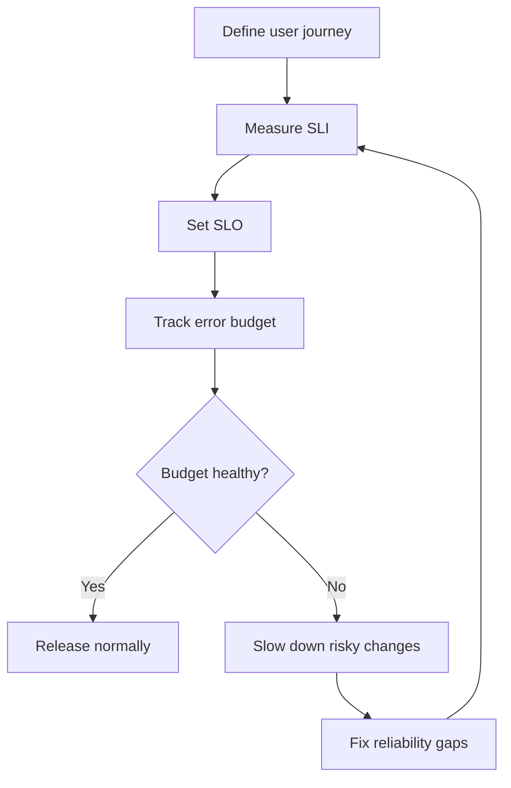
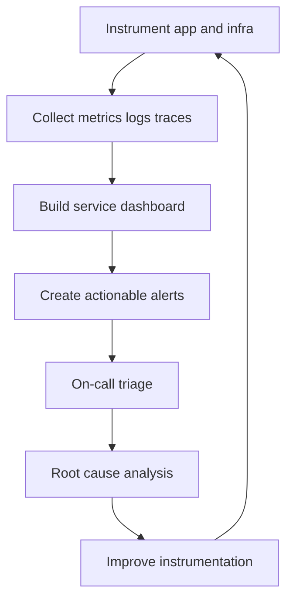
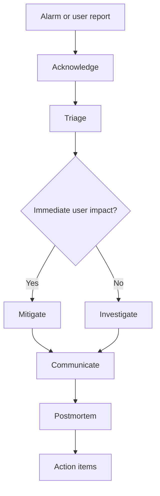
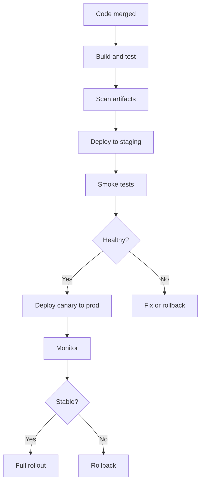

# AWS SRE Core Topics and Workflows

> Reference sources: AWS Well-Architected Framework, AWS operational best practices, Google SRE Book, CNCF guidance, and general multi-cloud reliability patterns

---

## What is this document?

This document captures the additional SRE topics that often appear in real job descriptions and production environments. It is written with an **AWS-first focus**, while also showing how these ideas connect to Azure and broader multi-cloud operations when useful.

It covers:
- SLOs, SLIs, SLAs, and error budgets
- Observability with CloudWatch and Datadog
- Incident response, on-call, and postmortems
- Automation, Infrastructure as Code, and CI/CD
- Security, IAM, encryption, and secrets
- Databases, storage, and platform reliability
- Cloud migration and operational readiness
- Git workflows and engineering collaboration

---

## Why is this important?

- Modern SRE roles are broader than monitoring alone.
- Teams need a repeatable operating model across AWS services and delivery pipelines.
- Production incidents usually involve one or more of: code, config, network, identity, deployment, or dependency failure.
- The right workflows reduce toil, improve recovery time, and make reliability measurable.
- A structured guide helps teams onboard faster and keeps practices consistent across environments.

---

## Topic Map

| Topic | Why it matters | Primary AWS tools |
|---|---|---|
| SLOs / error budgets | Defines reliability targets | CloudWatch, Route 53 Health Checks, Synthetics |
| Observability | Detects and explains failure | CloudWatch, X-Ray, OpenTelemetry, Datadog |
| Incident response | Reduces MTTR | Incident Manager, CloudWatch, CloudTrail |
| On-call operations | Supports production readiness | Pager rotation, dashboards, runbooks |
| Automation / IaC | Removes toil and drift | Terraform, CloudFormation, Lambda, SSM |
| CI/CD | Ships safely and repeatedly | CodePipeline, CodeBuild, CodeDeploy |
| Security | Protects access and data | IAM, KMS, Secrets Manager, Security Hub |
| Databases and storage | Keeps services durable | RDS, DynamoDB, S3, EBS |
| Migration readiness | Makes cutovers safer | CloudWatch, AWS Config, Well-Architected |
| Git workflows | Keeps changes auditable | Git, PRs, branches, tags |

---

## 1. SLO, SLI, SLA, and Error Budgets

### Definitions
- **SLI**: a measured indicator of reliability, such as request success rate or p99 latency.
- **SLO**: a target for an SLI, such as 99.9% successful requests over 30 days.
- **SLA**: a contractual promise with business consequences.
- **Error budget**: the allowed amount of unreliability during the SLO window.

### AWS-first workflow
1. Pick the customer journey that matters most.
2. Instrument the service with CloudWatch metrics and logs.
3. Measure the SLI with a clear numerator and denominator.
4. Set an SLO that is strict enough to protect customers but realistic enough to support delivery.
5. Create alerts based on error-budget burn, not just raw thresholds.
6. Review SLOs monthly and adjust as the product evolves.

### Example SLI set
- Availability: successful requests / total requests
- Latency: p95 or p99 request duration
- Error rate: 5xx responses or failed jobs
- Freshness: data updated within required window

### Error-budget workflow

---

## 2. Observability and Monitoring

### What to monitor
- **Metrics**: CPU, memory, request rate, error rate, latency, saturation
- **Logs**: application, system, audit, and platform logs
- **Traces**: request path across services
- **Events**: deployments, scaling actions, failovers, and configuration changes

### AWS observability stack
- **CloudWatch Metrics** for alarms and dashboards
- **CloudWatch Logs** for centralized log collection
- **AWS X-Ray** or **OpenTelemetry** for tracing
- **CloudWatch Synthetics** for user-path checks
- **Route 53 Health Checks** for endpoint availability
- **Datadog** when cross-service correlation is needed

### Workflow
1. Define what “healthy” looks like.
2. Instrument the app and infrastructure.
3. Create dashboards for the service, dependency, and infrastructure layers.
4. Add alerts for symptoms customers feel.
5. Tune alert noise and remove non-actionable pages.
6. Use traces and logs to speed root cause analysis.

### Golden signals
- Latency
- Traffic
- Errors
- Saturation

### Observability workflow

### Environment guidance
- **Dev**: fast feedback, less strict alerting, but still visible.
- **Staging**: near-production dashboards and alert simulation.
- **Prod**: low-noise, symptom-based alerts with clear ownership.

---

## 3. Incident Response and On-Call

### Incident response flow
1. Alert fires or user reports impact.
2. On-call acknowledges quickly.
3. Triage with logs, metrics, traces, and recent changes.
4. Mitigate first using rollback, scaling, isolation, or failover.
5. Communicate status clearly.
6. Write a blameless postmortem.
7. Track follow-up actions to completion.

### AWS tools
- **AWS Systems Manager Incident Manager**
- **CloudWatch alarms and dashboards**
- **AWS CloudTrail** for change history
- **AWS Health Dashboard** for service issues
- **SNS** or paging integrations for notifications

### On-call workflow

### Postmortem essentials
- What happened?
- Who was impacted?
- What was the root cause?
- What worked well?
- What needs improvement?
- What automation or guardrails will prevent recurrence?

### Practical on-call habits
- Keep dashboards and logs open before making changes.
- Prefer safe rollback paths.
- Document every temporary mitigation.
- Close the loop on action items.

---

## 4. Automation, IaC, and Runbooks

### Why automation matters
Manual operations scale poorly and cause drift. SRE teams should automate repeatable work and keep operational knowledge in code.

### AWS-first automation stack
- **Terraform** for multi-account, multi-service IaC
- **AWS CloudFormation** for native AWS templates
- **AWS Systems Manager Automation** for runbooks
- **AWS Lambda** for event-driven remediation
- **AWS Step Functions** for multi-step orchestration

### Workflow
1. Identify recurring manual tasks.
2. Decide whether it belongs in code, a runbook, or both.
3. Implement automation with logging and guardrails.
4. Test in staging.
5. Promote to production.
6. Track failure modes and improve the automation.

### Common automation examples
- Restarting unhealthy services
- Scaling a service during traffic spikes
- Rotating secrets
- Validating backups
- Executing safe config rollouts

### IaC best practices
- Store all infra changes in Git.
- Use review and approval workflows.
- Keep environments separate.
- Avoid manual drift.
- Use modules for repeatable building blocks.

---

## 5. CI/CD and Release Reliability

### Goal
Ship frequently without creating avoidable production risk.

### AWS delivery toolchain
- **CodePipeline** for orchestration
- **CodeBuild** for build and test
- **CodeDeploy** for controlled rollout
- **ECR** for container images
- **Lambda alias routing** for serverless traffic shifting

### Safe release workflow
1. Build and test on every change.
2. Scan artifacts and dependencies.
3. Deploy to dev or staging.
4. Run smoke tests and health checks.
5. Roll out to production with canary or blue-green.
6. Monitor metrics and rollback if needed.

### Release safety patterns
- Canary deployments
- Blue-green deployments
- Feature flags
- Auto-rollback on health regression

### Release workflow

---

## 6. Security, IAM, KMS, and Secrets

### Why it matters
Reliability depends on security. Misconfigured IAM or leaked secrets often become reliability incidents.

### AWS security building blocks
- **IAM** for identity and permissions
- **IAM Identity Center** for workforce access
- **KMS** for encryption and key management
- **Secrets Manager** or **Systems Manager Parameter Store** for secrets
- **Security Hub**, **GuardDuty**, and **AWS Config** for governance

### Security workflow
1. Grant least privilege.
2. Use roles instead of long-lived keys.
3. Store secrets outside code.
4. Encrypt data at rest and in transit.
5. Log and review access.
6. Detect drift and risky changes.

### Common control examples
- Separate deployment roles from admin roles
- Rotate secrets regularly
- Use KMS encryption for storage and backups
- Review IAM policies for overly broad access

---

## 7. Databases, Storage, and Reliability

### Common AWS services
- **RDS** for relational workloads
- **DynamoDB** for low-latency key-value access
- **S3** for durable object storage
- **EBS** for attached block storage

### Reliability workflow for data services
1. Define backup and restore objectives.
2. Test failover.
3. Validate replication behavior.
4. Observe latency and connection exhaustion.
5. Monitor storage growth and capacity.

### Data protection checklist
- Automated backups enabled
- Restore tests performed regularly
- Encryption enabled
- Multi-AZ or equivalent resilience used where needed
- Access restricted by IAM and network controls

---

## 8. Kubernetes, EKS, Docker, and Platform Operations

### Where these fit
- **Docker** packages the application.
- **EKS** runs Kubernetes in AWS.
- SRE monitors pods, nodes, ingress, and autoscaling.

### Kubernetes workflow
1. Deploy with health checks and resource requests.
2. Observe pod restarts, scheduling, and HPA behavior.
3. Use cluster dashboards and events to understand anomalies.
4. Roll back or scale when needed.

### Key signals
- Pod restarts
- Node pressure
- Pending pods
- Failed readiness probes
- Ingress latency and 5xx rate

### Environment guidance
- Use separate namespaces or clusters per environment.
- Keep cluster access role-based and auditable.
- Prefer managed node groups where possible.

---

## 9. Migration Readiness and Architecture Review

### What SRE checks before migration
- Dependencies and service map
- Network path and DNS design
- Identity and access model
- Observability coverage
- Backup and restore plan
- Rollback and failover plan
- Cost and scaling assumptions

### AWS workflow
1. Review current architecture.
2. Identify reliability risks.
3. Establish monitoring before migration.
4. Run load and failover tests.
5. Cut over in phases.
6. Validate post-migration behavior.

### AWS Well-Architected alignment
- Operational Excellence
- Security
- Reliability
- Performance Efficiency
- Cost Optimization
- Sustainability

---

## 10. Git Workflows and Engineering Collaboration

### Why it matters
Git is the source of truth for app code, infra code, and runbooks.

### Recommended workflow
- Branch from main.
- Open pull requests.
- Review changes before merging.
- Tag releases.
- Keep rollbacks traceable.

### Collaboration habits
- Add observability and rollback requirements to code reviews.
- Write runbooks next to the service when practical.
- Make reliability work visible in the same planning system as features.

---

## 11. Multi-Cloud Mapping for Team Awareness

Even with an AWS-first focus, SRE teams often need to understand Azure equivalents.

| AWS | Azure |
|---|---|
| IAM | Microsoft Entra ID + Azure RBAC |
| CloudWatch | Azure Monitor |
| VPC | Azure Virtual Network |
| EKS | AKS |
| Lambda | Azure Functions |
| RDS | Azure SQL / managed database offerings |
| S3 | Azure Blob Storage |
| KMS | Azure Key Vault |

This mapping helps when teams migrate, integrate, or compare platforms.

---

## 12. Environment Operating Model

### Dev
- Faster iteration
- More permissive experimentation
- Lower-cost resources
- Basic observability still required

### Staging
- Production-like validation
- SLO and alert testing
- Integration and load checks

### Prod
- Strict access control
- Mature dashboards and alerting
- Formal change management for risky changes
- Tested rollback and recovery paths

### Shared tooling account
- CI/CD
- logs and metrics aggregation
- security tooling
- audit trails

---

## 13. Daily SRE Execution Checklist

### Before work
- [ ] Check dashboards
- [ ] Review open alerts and incidents
- [ ] Check recent deploys
- [ ] Review environment changes

### During work
- [ ] Keep changes small
- [ ] Validate with metrics and logs
- [ ] Update runbooks when gaps appear
- [ ] Capture automation opportunities

### End of day
- [ ] Hand off open items
- [ ] Confirm ownership of actions
- [ ] Record incident learnings or follow-ups

---

## Summary

The missing topics in an SRE role usually fall into one of these buckets:
- reliability targets,
- observability,
- incident response,
- automation and IaC,
- CI/CD and release safety,
- security and identity,
- data reliability,
- Kubernetes and platform operations,
- migration readiness,
- and Git-based collaboration.

This guide provides the AWS-first workflow for all of them.
