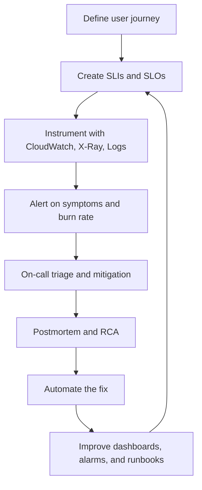
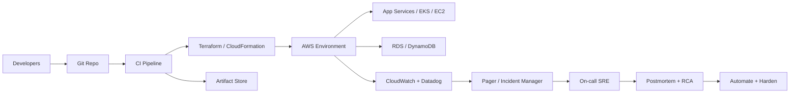
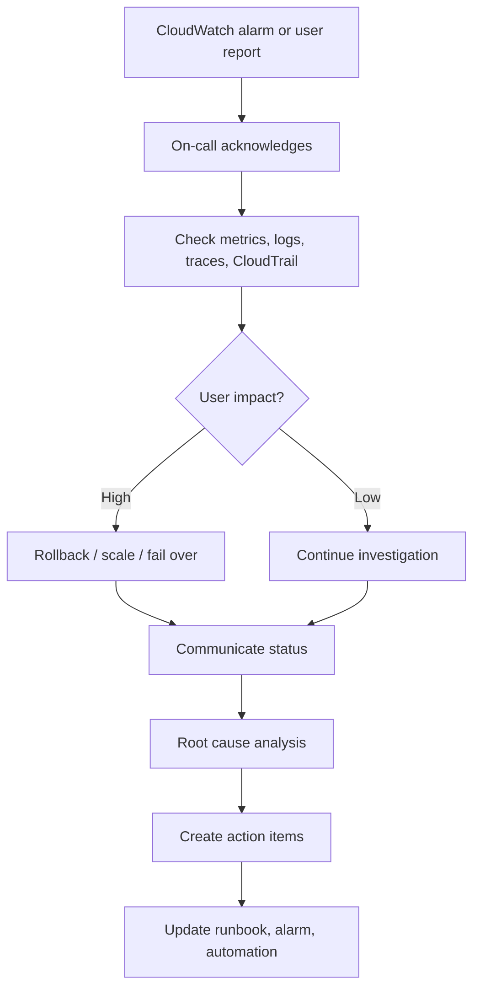

# AWS SRE Operating Model

> Reference sources: AWS Well-Architected Framework, AWS operational best practices, Google SRE concepts, industry incident-management guidance

---

## What is this document?

This guide translates common SRE responsibilities and qualifications into an **AWS-first operating model**. It focuses on how SRE teams:
- define and protect SLOs,
- automate operations in AWS,
- improve reliability and observability,
- handle incidents and postmortems,
- and run safe environments for production systems.

It is written for teams that operate cloud-hosted services on AWS, with Azure references only when useful for multi-cloud awareness.

---

## Why is it important?

- AWS workloads fail in predictable ways: capacity limits, IAM misconfiguration, bad deployments, network issues, and dependency outages.
- SRE gives teams a repeatable way to keep services reliable without slowing delivery.
- A strong operating model reduces manual toil, shortens incident response time, and improves platform resilience.
- Clear workflows help teams know what to do in dev, staging, and production environments.
- The same model also helps during cloud migration and architecture reviews.

---

## SRE Responsibilities Mapped to AWS

### 1. Maintain SLOs for cloud-hosted systems

**Goal:** Track user-visible reliability and keep services within acceptable risk.

**AWS services and tools:**
- **Amazon CloudWatch** for metrics, logs, and alarms
- **AWS X-Ray** or OpenTelemetry for traces
- **AWS Application Load Balancer** metrics for request health
- **Amazon Route 53 Health Checks** for endpoint availability
- **AWS CloudWatch Synthetics** for synthetic checks

**Typical workflow:**
1. Identify the user journey that matters most.
2. Define SLIs such as availability, latency, and error rate.
3. Set SLO targets, for example 99.9% successful requests over 30 days.
4. Create alarms that reflect error-budget burn and customer impact.
5. Review the SLO monthly and tune thresholds.

**Example SLI set:**
- Availability: successful requests / total requests
- Latency: p95 or p99 request duration
- Error rate: 5xx responses or failed job runs
- Freshness: data available within expected time window

---

### 2. Design and implement automation for AWS and Azure environments

**Goal:** Reduce toil and standardize safe operations.

**AWS-first automation stack:**
- **Terraform** for infrastructure as code
- **AWS CloudFormation** when native templates are preferred
- **AWS Systems Manager Automation** for operational runbooks
- **AWS Lambda** for event-driven remediation
- **AWS CodePipeline / CodeBuild / CodeDeploy** for CI/CD
- **GitHub Actions** or **Azure DevOps** if the organization standardizes elsewhere

**Workflow:**
1. Capture repeated manual work.
2. Turn the manual steps into code or automation.
3. Add approval gates for risky actions.
4. Test automation in staging.
5. Promote to production with rollback and logging.

---

### 3. Partner with development teams to improve reliability, observability, and release velocity

**Goal:** Make reliability a shared engineering outcome.

**AWS collaboration points:**
- Add CloudWatch dashboards to application repositories.
- Build deployment health checks into pipelines.
- Use feature flags and canary releases for risky changes.
- Set platform standards for logging, metrics, and tracing.

**Common output:**
- service dashboards,
- alarm policies,
- deployment runbooks,
- rollback steps,
- and standard SLO definitions.

---

### 4. Participate in on-call rotations, incident response, postmortems, and RCA

**Goal:** Resolve incidents quickly and improve the system after every event.

**AWS tools:**
- CloudWatch alarms and dashboards
- AWS Health Dashboard
- AWS Systems Manager Incident Manager
- AWS CloudTrail for audit evidence
- AWS Config for configuration drift

**Workflow:**
1. Alarm fires or users report impact.
2. On-call acknowledges and starts triage.
3. Check logs, metrics, recent deploys, and AWS service health.
4. Mitigate first, analyze second.
5. Write a blameless postmortem.
6. Track follow-up actions to completion.

---

### 5. Advocate for strong engineering practices for scalable services

**Goal:** Build services that can survive growth and failure.

**AWS best-practice areas:**
- Multi-AZ and multi-region design
- Stateless application tiers where possible
- Managed services instead of self-managed when practical
- IAM least privilege and role separation
- Secrets Manager or Parameter Store for secrets
- KMS for encryption at rest

---

### 6. Enable cloud migration and operational readiness

**Goal:** Ensure services are production-ready before and after migration.

**AWS migration readiness checks:**
- Inventory dependencies and network paths.
- Review identity, access, and encryption requirements.
- Confirm observability coverage.
- Validate failover and backup restoration.
- Load test and observe saturation behavior.

**Observability stack during migration:**
- **CloudWatch dashboards** for platform and app metrics
- **CloudWatch Logs** for centralized logging
- **Datadog** integrated with CloudWatch where used by the org
- **X-Ray / OpenTelemetry** for traces
- **SNS / PagerDuty / Opsgenie** for alert routing

---

### 7. Drive continuous learning across multi-cloud technologies

**Goal:** Be effective in AWS while understanding Azure equivalents.

**AWS to Azure mapping examples:**
- EC2 → Azure Virtual Machines
- S3 → Azure Blob Storage
- RDS → Azure SQL / Azure Database services
- IAM → Microsoft Entra ID + Azure RBAC
- VPC → Azure Virtual Network
- Lambda → Azure Functions
- CloudWatch → Azure Monitor
- Systems Manager → Azure Automation / Arc tools

---

## Minimum Qualifications Mapped to Daily Work

### Scripting: Shell and Python
Use scripting to:
- query AWS APIs,
- automate remediation,
- parse logs,
- and validate environment health.

**Examples:**
- Shell: alarm triage scripts, deployment checks
- Python: boto3 automation, report generation, event correlation

### Infrastructure as Code
Use Terraform or CloudFormation to manage:
- VPCs, subnets, routing, security groups
- IAM roles and policies
- EKS clusters and node groups
- RDS, S3, Lambda, CloudWatch alarms
- DNS and load balancers

### AWS service familiarity
The most relevant SRE services are:
- **EC2** for compute
- **S3** for object storage and backups
- **RDS** for managed relational databases
- **IAM** for identity and permissions
- **VPC** for network isolation
- **Lambda** for automation and event-driven tasks

### Docker and Kubernetes
- Use Docker for container packaging.
- Use EKS for managed Kubernetes operations.
- Monitor node health, pod health, ingress, and cluster autoscaling.

### Observability tools
- CloudWatch for core AWS visibility
- Datadog for cross-system correlation
- CloudTrail for API-level audit trails
- X-Ray/OpenTelemetry for distributed tracing

### CI/CD pipelines
- Build, test, scan, deploy
- Promote from dev to staging to prod
- Include rollback, approvals, and change tracking

### Incident response and postmortems
- Triage rapidly
- Communicate clearly
- Document root cause and follow-up actions

### Git workflows
- Use pull requests, reviews, and protected branches
- Keep infra and app changes traceable
- Tag releases and maintain rollback references

---

## Preferred Qualifications Mapped to AWS Practice

### AWS Well-Architected Framework
Design and review systems against the pillars:
- Operational Excellence
- Security
- Reliability
- Performance Efficiency
- Cost Optimization
- Sustainability

### Cloud security guidelines
Typical controls:
- IAM least privilege
- KMS encryption
- Secrets Manager rotation
- Security groups and network segmentation
- GuardDuty / Security Hub / Config for governance

### Cloud-native databases
- **Amazon RDS** for relational use cases
- **Amazon DynamoDB** for key-value and low-latency workloads
- Backup, failover, and restoration testing are mandatory

### DevOps and cloud-native architecture
- Canary deployments
- Blue-green releases
- Feature flags
- Immutable infrastructure
- Policy-as-code and guardrails

---

## AWS SRE Workflow

### Detailed operating loop

1. **Define the service objective**
   - Pick the customer journey that matters most.
   - Decide what “good” looks like.

2. **Instrument the environment**
   - Emit metrics from app, infrastructure, and database layers.
   - Centralize logs and traces.

3. **Create actionable alerts**
   - Alert on symptoms, not noise.
   - Use thresholds and burn-rate signals.

4. **Respond and stabilize**
   - Mitigate quickly.
   - Use rollback, scaling, failover, or feature flags.

5. **Learn and automate**
   - Document root cause.
   - Add tests, dashboards, runbooks, or automation to prevent repeat incidents.

---

## How to Do This in an AWS Environment

### 1. Environment layout

A practical AWS SRE environment usually includes:
- **Dev**: fast feedback, permissive experimentation
- **Staging**: production-like validation
- **Prod**: strict access, strong monitoring, change control
- **Shared tooling account**: CI/CD, observability, logs, and security tooling

### 2. Network foundation

Typical AWS foundation:
- One or more **VPCs** per environment or workload domain
- Public and private subnets
- Internet Gateway for public workloads
- NAT Gateway for private outbound access
- Security groups for instance-level controls
- NACLs when subnet-level controls are required

### 3. Identity and access

Recommended approach:
- Use IAM roles instead of long-lived users.
- Prefer federation and SSO for humans.
- Give CI/CD pipelines scoped roles.
- Separate admin, deployment, and read-only permissions.
- Use break-glass access only for emergencies.

### 4. Compute and orchestration

Common patterns:
- **EC2** for VM-based services and legacy workloads
- **EKS** for containerized platforms
- **Lambda** for automation and event handlers
- **Auto Scaling Groups** for stateless compute

### 5. Storage and data

Use the managed service best suited to the workload:
- **S3** for artifacts, backups, logs, and static assets
- **EBS** for instance-attached storage
- **RDS** for transactional databases
- **DynamoDB** for key-value workloads

### 6. Observability

A baseline AWS observability stack:
- CloudWatch metrics and alarms
- CloudWatch Logs for centralized logs
- Datadog for service views and correlation
- X-Ray or OpenTelemetry for traces
- CloudTrail for auditing

### 7. Delivery pipelines

A healthy pipeline should:
1. Build and test on every change.
2. Scan artifacts and dependencies.
3. Deploy to dev or staging first.
4. Run smoke tests.
5. Gate prod with approvals and checks.
6. Roll back automatically or manually if health degrades.

### 8. Incident readiness

Prepare before the incident:
- Dashboards for top services
- Alarm routing and escalation
- Runbooks for common failure modes
- Access to logs, metrics, and tracing
- A rollback or failover path

---

## Reference Architecture for an AWS SRE Platform

---

## Incident Response Workflow in AWS

### Triage checklist
- Was there a recent deploy?
- Did CPU, memory, or latency spike?
- Did IAM, DNS, or networking change?
- Did RDS, S3, or another dependency degrade?
- Is this an AWS service issue or application issue?

---

## Operating in Dev, Staging, and Prod

### Dev
- Allow faster iteration.
- Use lower-cost resources.
- Permit broader experimentation.
- Keep visibility and authentication in place.

### Staging
- Mirror production shape as closely as practical.
- Validate alarms, dashboards, and rollback.
- Run load tests and failover drills.

### Production
- Enforce least privilege.
- Use approvals for risky changes.
- Monitor every critical path.
- Keep backups and recovery tested.

---

## Example AWS SRE Checklist

### Before change
- [ ] SLO impact understood
- [ ] Terraform plan reviewed
- [ ] Rollback path documented
- [ ] Dashboards and alarms ready
- [ ] Change window communicated

### During change
- [ ] Metrics stable
- [ ] Logs clean
- [ ] No alert storms
- [ ] On-call available

### After change
- [ ] Latency and error rate normal
- [ ] No new incidents
- [ ] Post-change validation complete
- [ ] Any findings added to runbook

---

## Common AWS SRE Tools by Use Case

| Use case | AWS tools |
|---|---|
| Metrics and alerts | CloudWatch, Datadog |
| Logs | CloudWatch Logs, S3 |
| Traces | X-Ray, OpenTelemetry |
| Incidents | Systems Manager Incident Manager, SNS |
| Identity | IAM, IAM Identity Center |
| Networking | VPC, Route 53, Security Groups |
| Compute | EC2, EKS, Lambda |
| Databases | RDS, DynamoDB |
| IaC | Terraform, CloudFormation |
| Deployment | CodePipeline, CodeBuild, CodeDeploy |

---

## Public vs AWS Equivalent Thinking for Multi-Cloud

Even if AWS is the main environment, it helps to map concepts:
- IAM concepts transfer to Azure RBAC and Entra ID.
- CloudWatch concepts transfer to Azure Monitor.
- VPC concepts transfer to Azure Virtual Network.
- EKS concepts transfer to AKS.

This keeps the team effective during migration or hybrid operations.

---

## Summary

An AWS-focused SRE function is about:
- protecting SLOs,
- automating routine operations,
- designing safe environments,
- responding well to incidents,
- and continuously improving the platform.

If you can consistently observe the service, automate the repetitive work, and reduce recovery time, you are practicing SRE well.
