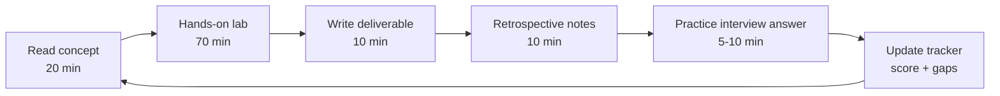
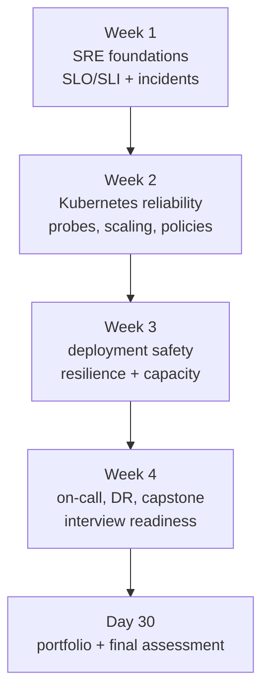
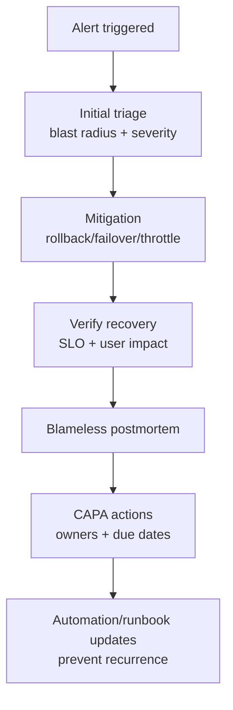

# 30-Day SRE Learning Plan (Extensive, End-to-End)

> Goal: become interview-ready and production-ready in 30 days with daily hands-on practice.

---

## How to Use This Plan

Each day includes:
- **Concept focus**
- **Hands-on tasks**
- **Deliverable**
- **Success criteria**
- **Interview practice prompt**

Daily cadence (suggested):
- 20 min theory
- 70 min implementation/lab
- 20 min notes + retrospective

---

## Learning Workflows (Visual)

### 1) Daily Learning Loop

### 2) Weekly Progression Workflow

### 3) Capstone Incident Workflow

---

## Week 1 (Days 1–7): SRE Foundations + Reliability Thinking

### Day 1 — SRE Fundamentals, Toil, and Reliability Mindset
- Concept focus:
  - What SRE is and is not
  - Toil vs engineering work
  - Reliability as a product feature
- Hands-on:
  - Read your SRE basics docs
  - Write a one-page reliability charter for a streaming service
- Deliverable:
  - `reliability-charter.md` (goals, principles, non-goals)
- Success criteria:
  - Clear distinction between Ops, DevOps, SRE
- Interview prompt:
  - "How do you reduce toil without creating operational risk?"

### Day 2 — SLIs, SLOs, and Error Budgets
- Concept focus:
  - SLI categories: availability, latency, correctness, durability
  - SLO math and error-budget burn
- Hands-on:
  - Define 5 SLIs for live streaming + VOD
  - Set monthly SLOs and budget policies
- Deliverable:
  - `slo-catalog.md`
- Success criteria:
  - Every SLO has measurement source + ownership
- Interview prompt:
  - "What if product wants faster releases but budget is exhausted?"

### Day 3 — Monitoring Principles (Golden Signals + RED/USE)
- Concept focus:
  - Four golden signals
  - RED and USE methods
  - Alerting philosophy: actionable + urgent + specific
- Hands-on:
  - Build metric map for API, fanout, transcoder, cache
- Deliverable:
  - `observability-map.md`
- Success criteria:
  - Every critical path has at least one SLI-backed alert
- Interview prompt:
  - "How do you detect silent failures?"

### Day 4 — Alert Design and Noise Reduction
- Concept focus:
  - Paging vs ticket alerts
  - Burn-rate alerts (fast + slow windows)
- Hands-on:
  - Draft alert rules for high latency + error spikes
- Deliverable:
  - `alert-policy.md`
- Success criteria:
  - Alerts include owner, runbook link, rollback condition
- Interview prompt:
  - "How do you reduce alert fatigue in on-call?"

### Day 5 — Incident Management Lifecycle
- Concept focus:
  - Incident roles: IC, comms, ops lead
  - Severity matrix and escalation model
- Hands-on:
  - Create incident timeline template and communication templates
- Deliverable:
  - `incident-kit.md`
- Success criteria:
  - 15-minute response structure defined
- Interview prompt:
  - "Walk through your first 10 minutes in Sev-1."

### Day 6 — Blameless Postmortems and CAPA
- Concept focus:
  - Root cause vs contributing factors
  - Corrective and preventive actions
- Hands-on:
  - Run a mock postmortem from a fictional outage
- Deliverable:
  - `postmortem-sample.md`
- Success criteria:
  - Action items are measurable with owners and due dates
- Interview prompt:
  - "How do you prevent repeated incidents?"

### Day 7 — Week 1 Review + Assessment
- Hands-on:
  - 90-minute recap
  - Solve 3 scenario questions
- Deliverable:
  - `week1-review.md`
- Success criteria:
  - Can explain SLO, burn rate, incident response without notes

---

## Week 2 (Days 8–14): Kubernetes Reliability Operations

### Day 8 — K8s Core Reliability Constructs
- Focus:
  - Deployments, StatefulSets, DaemonSets, Jobs
  - Readiness/liveness/startup probes
- Hands-on:
  - Tune probe strategies for API and worker services
- Deliverable:
  - `k8s-probe-strategy.md`
- Interview prompt:
  - "When should readiness fail but liveness pass?"

### Day 9 — Scheduling and Resilience
- Focus:
  - Affinity/anti-affinity, topology spread, taints/tolerations
- Hands-on:
  - Design zone-failure-safe pod placement
- Deliverable:
  - `zone-resilience-design.md`
- Interview prompt:
  - "How do you survive single-zone failure?"

### Day 10 — Autoscaling Deep Dive
- Focus:
  - HPA/VPA/cluster autoscaler/Karpenter interactions
- Hands-on:
  - Draft autoscaling policy for burst traffic
- Deliverable:
  - `autoscaling-policy.md`
- Interview prompt:
  - "How do you prevent HPA thrashing?"

### Day 11 — Real-Time Scaling Observability
- Focus:
  - Scaling lag pipeline (metric → decision → scheduling → ready)
- Hands-on:
  - Build dashboard spec for current vs desired replicas
- Deliverable:
  - `hpa-monitoring-dashboard-spec.md`
- Interview prompt:
  - "Where does scaling latency usually come from?"

### Day 12 — Network Policies Fundamentals
- Focus:
  - Ingress/egress, selectors, default-deny model
  - AND/OR selector logic traps
- Hands-on:
  - Create namespace isolation + explicit allow paths
- Deliverable:
  - `network-policy-baseline.md`
- Interview prompt:
  - "Why does DNS break after deny-all egress?"

### Day 13 — Advanced K8s Failure Modes
- Focus:
  - CrashLoopBackOff, ImagePullBackOff, unschedulable pods
- Hands-on:
  - Run troubleshooting drills from your K8s repo labs
- Deliverable:
  - `k8s-failure-playbook.md`
- Interview prompt:
  - "How do you triage CrashLoopBackOff quickly?"

### Day 14 — Week 2 Review + Practical Check
- Hands-on:
  - 2-hour K8s reliability simulation
- Deliverable:
  - `week2-review.md`
- Success criteria:
  - Resolve probe + scaling + policy issues with a clear runbook

---

## Week 3 (Days 15–21): Production Safety, Deployments, and Architecture Reliability

### Day 15 — Progressive Delivery
- Focus:
  - Canary, blue/green, rolling updates, shadow traffic
- Hands-on:
  - Define promotion/rollback gates
- Deliverable:
  - `progressive-delivery-policy.md`
- Interview prompt:
  - "When do you prefer canary over blue/green?"

### Day 16 — Rollback Engineering
- Focus:
  - Automated rollback triggers
  - Error-budget-aware release controls
- Hands-on:
  - Create rollback decision matrix
- Deliverable:
  - `rollback-matrix.md`
- Interview prompt:
  - "What metrics trigger immediate rollback?"

### Day 17 — Resilience Patterns
- Focus:
  - Timeout, retry, backoff, jitter, circuit breaker, bulkheads
- Hands-on:
  - Add pattern mapping per service dependency
- Deliverable:
  - `resilience-pattern-map.md`
- Interview prompt:
  - "How do retries cause outages?"

### Day 18 — Capacity Planning and Forecasting
- Focus:
  - Demand forecasts, P95/P99 headroom, event-based prewarming
- Hands-on:
  - Create 3 traffic scenarios (normal, spike, mega-event)
- Deliverable:
  - `capacity-forecast-model.md`
- Interview prompt:
  - "How much headroom is enough?"

### Day 19 — Cost vs Reliability Tradeoffs
- Focus:
  - Right-sizing, SLO tiers, workload prioritization
- Hands-on:
  - Build service tier matrix (P0/P1/P2)
- Deliverable:
  - `reliability-cost-tradeoffs.md`
- Interview prompt:
  - "How do you cut cost without harming reliability?"

### Day 20 — Service Mesh Reliability
- Focus:
  - Istio/Envoy routing, retries/timeouts, mTLS operational pitfalls
- Hands-on:
  - Define live vs VOD traffic policy profile
- Deliverable:
  - `mesh-routing-slo-policy.md`
- Interview prompt:
  - "How to avoid retry storms in service mesh?"

### Day 21 — Week 3 Review + Design Interview Drill
- Hands-on:
  - 90-minute system design with reliability constraints
- Deliverable:
  - `week3-review.md`

---

## Week 4 (Days 22–30): On-call Mastery, Security Reliability, DR, and Interview Readiness

### Day 22 — On-Call Excellence
- Focus:
  - Rotation health, handoffs, escalation clarity
- Hands-on:
  - Build an on-call operating guide
- Deliverable:
  - `oncall-operating-guide.md`
- Interview prompt:
  - "How do you make on-call sustainable?"

### Day 23 — Runbook Engineering
- Focus:
  - Standard runbook format: triggers, diagnostics, mitigation, rollback
- Hands-on:
  - Create 3 runbooks (latency spike, dependency outage, cert expiry)
- Deliverable:
  - `runbook-pack.md`
- Interview prompt:
  - "What makes a runbook actionable at 3AM?"

### Day 24 — Security + Reliability Integration
- Focus:
  - Least privilege, secrets rotation, policy-as-code
- Hands-on:
  - Add reliability checks to security controls
- Deliverable:
  - `secure-reliability-checklist.md`
- Interview prompt:
  - "How can security changes impact reliability?"

### Day 25 — Disaster Recovery and Business Continuity
- Focus:
  - RTO/RPO, backup validation, failover plans
- Hands-on:
  - Draft DR runbook for regional outage
- Deliverable:
  - `dr-failover-plan.md`
- Interview prompt:
  - "How do you validate DR beyond documentation?"

### Day 26 — Game Days and Chaos Engineering
- Focus:
  - Fault injection with guardrails
  - Learning loops and safe blast radius
- Hands-on:
  - Design 3 game-day experiments
- Deliverable:
  - `gameday-experiments.md`
- Interview prompt:
  - "How do you run chaos safely in production-like systems?"

### Day 27 — End-to-End Incident Simulation (Capstone Part 1)
- Focus:
  - Multi-symptom outage with Kubernetes + network + app layer
- Hands-on:
  - Full incident command simulation (timeline + comms + mitigation)
- Deliverable:
  - `capstone-incident-sim.md`

### Day 28 — Postmortem + Reliability Program Review (Capstone Part 2)
- Focus:
  - Post-incident analysis and program improvements
- Hands-on:
  - Postmortem + quarterly reliability roadmap draft
- Deliverable:
  - `capstone-postmortem-and-roadmap.md`

### Day 29 — Interview Day (Scenario + Leadership)
- Focus:
  - 6 hard scenario questions
  - Communication and tradeoff reasoning
- Hands-on:
  - Mock interview and self-review
- Deliverable:
  - `interview-answer-bank.md`

### Day 30 — Final Assessment + Portfolio Packaging
- Focus:
  - Consolidation and evidence of skills
- Hands-on:
  - Compile portfolio with SLO docs, runbooks, incident simulation, and policy designs
- Deliverable:
  - `sre-portfolio.md`
- Success criteria:
  - Can articulate end-to-end SRE strategy from metrics to incident to prevention

---

## Weekly Milestones

- **End of Week 1**: SLO and incident fundamentals mastered
- **End of Week 2**: Kubernetes reliability operations confident
- **End of Week 3**: Deployment safety and architecture resilience solid
- **End of Week 4**: On-call/DR/capstone/interview ready

---

## Daily Scoring (Quick)

Score each day from 1–5:
- Concept understanding
- Hands-on completion
- Documentation quality
- Incident reasoning quality
- Interview clarity

Target average by Day 30: **≥ 4.0/5**

---

## Capstone Definition of Done

By Day 30 you should have:
- SLI/SLO catalog for a production-like service
- Alert policy with burn-rate strategy
- 5+ practical runbooks
- 1 full incident simulation + postmortem
- Kubernetes + NetworkPolicy troubleshooting set
- DR + failover plan
- Interview answer bank for senior SRE scenarios

---

## Optional Advanced Extensions (Post Day-30)

- Multi-cluster reliability governance
- Reliability scorecards per team
- Reliability budget planning with finance
- Policy automation and drift detection
- Reliability architecture review board playbook
