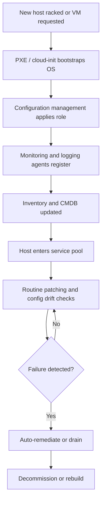

# 01. Linux Systems Administration at Scale

> Operating thousands of bare metal and virtual machines reliably, with consistent configuration, monitoring, patching, and recovery.

## What it is

Running and operating large Linux fleets where manual administration is no longer possible. Every machine must be installed, configured, monitored, patched, and decommissioned through automation and observability.

## Why it matters

- One engineer cannot SSH into thousands of machines. Everything must be templated and observable.
- Consistency across fleet eliminates "snowflake" servers and reduces incident causes.
- Recovery time depends on how fast a host can be rebuilt or replaced from automation, not on tribal knowledge.

## Core capabilities

- **Provisioning:** PXE, kickstart, cloud-init, MAAS, Foreman/Katello, or vendor BMC tooling.
- **Configuration management:** Chef, Ansible, Puppet, or Salt to enforce the desired state.
- **Identity and access:** Centralized auth (LDAP/AD/Kerberos/SSSD), short-lived SSH certificates, sudo policies in code.
- **Patching:** Coordinated kernel and package updates with maintenance windows and rolling restarts.
- **Monitoring agents:** Node exporter, Telegraf, Datadog or vendor agents deployed and managed centrally.
- **Inventory:** Source of truth for hosts, racks, roles, and lifecycle state.

## Workflow

## Practical steps

- Define **roles** (e.g., `web`, `storage-node`, `compute`) and pin each host to a role.
- Treat the OS image as a versioned artifact, not a snowflake build.
- Capture **golden images** for fast rebuilds; rebuild rather than repair when possible.
- Periodically run config-drift detection (`chef-client --why-run`, `ansible --check`, or Puppet noop).
- Apply patches in waves: canary hosts → small fraction → fleet, with health checks between waves.
- Track host lifecycle states: `provisioning`, `in-service`, `draining`, `failed`, `decommissioned`.

## What good looks like

- Any host can be replaced in minutes by running the pipeline against a fresh machine.
- Drift is measured and tracked; no manual edits in production.
- Patch cycles are predictable and audited.
- Inventory is the source of truth for paging, capacity, and security scans.

## Anti-patterns

- Logging into a host to fix a problem without writing the fix into config management.
- Manual hostfile edits.
- Long-running hosts with years of uncontrolled changes ("pet" servers).
- No inventory of which host runs which role.
