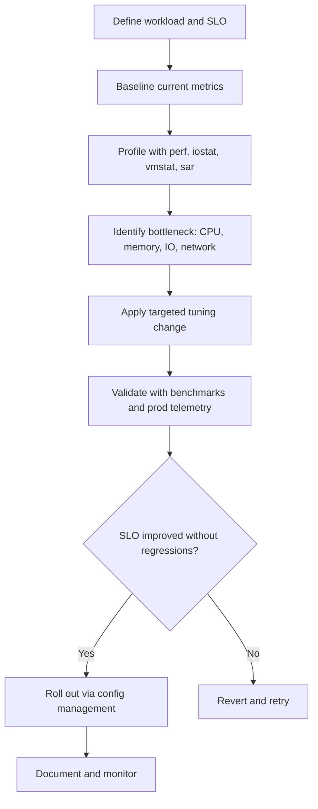

# 02. Linux Performance Tuning (Kernel, Filesystems, Storage)

> Tuning kernel parameters, filesystems, and storage subsystems so Linux delivers maximum throughput and lowest latency for the workload.

## What it is

Systematic adjustment of Linux subsystems to fit the workload, especially for I/O-intensive systems like clustered object storage. It covers CPU scheduling, memory, the block layer, filesystems, and the network stack.

## Why it matters

- Default settings target a balanced general-purpose workload; storage and high-throughput systems need different defaults.
- Small tuning wins compound across thousands of nodes.
- Tail latency for storage operations directly affects SLOs.

## Areas of tuning

### CPU and scheduling
- CPU governor (`performance` vs `powersave`).
- CPU pinning for latency-sensitive threads.
- IRQ affinity to spread interrupts across cores.

### Memory and VM
- `vm.swappiness`, `vm.dirty_ratio`, `vm.dirty_background_ratio` for write behavior.
- `transparent_hugepage` setting based on workload.
- NUMA placement (`numactl`, `numastat`).

### Block layer and storage
- I/O scheduler choice: `mq-deadline`, `bfq`, `none` (for NVMe).
- Queue depth and `nr_requests` tuning.
- Read-ahead settings (`blockdev --setra`).
- Multipath configuration for SAN.

### Filesystems
- **XFS** for large files and parallel I/O (common with object storage).
- **ext4** for general-purpose.
- **ZFS** for integrity, snapshots, and compression.
- Mount options: `noatime`, `nodiratime`, `discard` vs scheduled `fstrim`, journaling mode.

### Network stack
- `net.core.rmem_max`, `net.core.wmem_max`, TCP buffer sizes.
- `net.ipv4.tcp_*` tuning (congestion control like BBR).
- Enable jumbo frames where supported by the network.
- NIC ring buffers and offload features (`ethtool -G`, `-K`).

## Workflow

## Practical steps

- Always measure before tuning. **Baseline** with `sar`, `iostat`, `vmstat`, `pidstat`, `mpstat`, `perf`.
- Change **one knob at a time** and re-measure.
- Roll out tuning via configuration management, not ad-hoc on hosts.
- Document the workload assumption next to every non-default setting.
- Re-test after kernel upgrades; defaults change between major versions.

## Tools to know

- `perf`, `bpftrace`, `eBPF` for deep profiling.
- `iostat -xz 1`, `iotop`, `blktrace` for storage.
- `numastat`, `numactl --hardware` for NUMA.
- `ethtool`, `ss -ti`, `nstat` for network.
- `tuned` and `tuned-adm` profiles (Red Hat family) as a starting point.

## What good looks like

- Tuning is reproducible, version-controlled, and applied uniformly.
- Every non-default value has a reason recorded.
- Benchmarks are repeatable and stored.
- The fleet shows predictable tail latency under load.

## Anti-patterns

- Copying tuning blogs without measuring first.
- Editing `/etc/sysctl.conf` by hand on individual hosts.
- Tuning that improves micro-benchmarks but hurts real workload latency.
