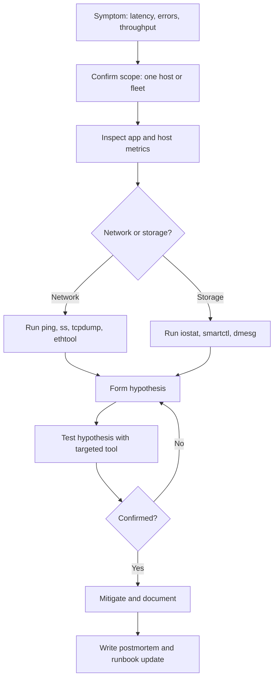
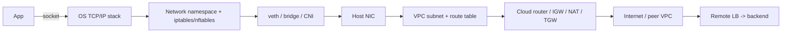
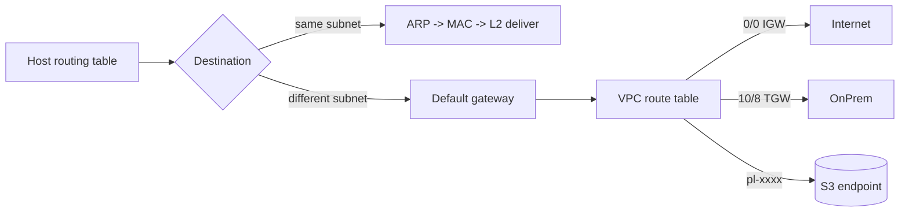
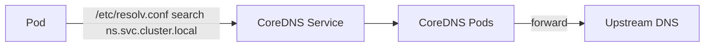
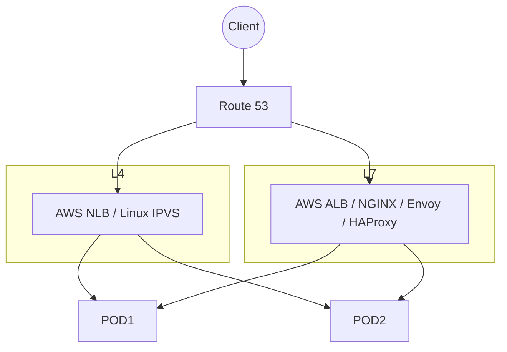

# 03. Network and Storage Troubleshooting

> Deep-dive troubleshooting of complex network and storage issues using classic Unix tooling such as `tcpdump`, `iperf`, `iostat`, and custom monitors, to maintain SLAs and SLOs.

## What it is

The skill of taking a vague symptom ("storage is slow", "API errors are up", "replication lag") and drilling down to a specific cause using layered diagnostic tools.

## Why it matters

- Most production incidents involve either the network or the storage path.
- Cloud abstractions hide details, but the underlying problems are still Linux problems.
- A good operator can isolate fault domains within minutes, not hours.

## The investigation mindset

1. Start from the **user-visible symptom** (latency, error rate, throughput).
2. Walk down the stack: app → host → kernel → device → network → peer.
3. **Compare** healthy vs unhealthy hosts.
4. Capture evidence before mitigation, so the postmortem has data.
5. Form one hypothesis at a time and test it.

## Network troubleshooting

### Tools
- `ping`, `traceroute`, `mtr` for reachability and path.
- `ss -tnp`, `netstat -s` for sockets and protocol counters.
- `tcpdump -i <iface> -nn -s 0 -w capture.pcap` for packet capture.
- `iperf3` for bandwidth tests between hosts.
- `ethtool -S <iface>` for NIC counters (drops, errors, pause frames).
- `nstat`, `ip -s link`, `tc -s qdisc` for queues and shaping.

### Common patterns
- **Packet loss** → check NIC error counters, switch logs, MTU mismatches.
- **High latency, low loss** → buffer bloat, congestion, slow peer.
- **Retransmits high** → look at TCP `retrans`, network policy drops, asymmetric routes.
- **Async DNS failures** → check resolver, `nscd`/`systemd-resolved`, conntrack table size.

## Storage troubleshooting

### Tools
- `iostat -xz 1` for device-level IOPS, throughput, await, queue depth.
- `iotop` to see which process is doing I/O.
- `blktrace` and `btt` for deep block I/O analysis.
- `dmesg`, `/var/log/messages` for kernel and driver errors.
- `smartctl` for disk SMART data.
- `multipath -ll` for SAN multipath state.
- `nfsstat`, `nfsiostat` for NFS.
- `ceph -s`, `ceph osd df` for Ceph clusters.

### Common patterns
- **High await with low %util** → queue depth issue or contention.
- **Slow disk, growing reallocated sectors** → failing drive, replace.
- **Filesystem ENOSPC despite free blocks** → inode exhaustion (`df -i`).
- **NFS stalls** → server health, network path, mount options.

## Workflow



## Practical steps

- Keep a **prebuilt diagnostics bundle** script that runs `iostat`, `vmstat`, `ss`, `netstat`, `dmesg` and captures output to a tarball during incidents.
- Capture **pcap** early on the suspect host before mitigation kills the symptom.
- Use **`bpftrace`** one-liners for ad hoc kernel-level visibility (e.g., latency histograms).
- Build **custom monitors** for signals that off-the-shelf agents miss (e.g., per-OSD latency, replication lag).
- Validate every fix by comparing before/after metrics.

## What good looks like

- A defined incident playbook for "slow storage" and "network degradation".
- Engineers reach for the right tool within minutes.
- Captures are preserved for postmortems.
- Fixes are encoded into runbooks and config management.

## Anti-patterns

- Rebooting hosts before capturing data.
- Looking only at app logs and not host-level counters.
- Using only graphical dashboards; missing the deeper kernel-level signals.


---

## Platform networking deep dive — DNS, IP, routing, load balancing

> Sections above focus on host-level troubleshooting. This section adds the **platform/network design** knowledge a Platform SRE needs across DNS, routing, and load balancers — covering the JD requirements: *DNS, IP addressing, routing, load balancing, connectivity troubleshooting.*

### 1. The stack a packet actually traverses



Every `connection refused` / `timeout` lives in one of those layers. Triage walks down methodically.

### 2. IP & subnetting cheat sheet

| Concept | Practical meaning |
| --- | --- |
| `/16` | 65 536 addresses — typical VPC |
| `/24` | 256 addresses — typical subnet |
| `/27` | 32 addresses — careful in EKS (pods consume VPC IPs) |
| RFC 1918 | `10/8`, `172.16/12`, `192.168/16` — private |
| Link-local | `169.254/16` — AWS IMDS at `169.254.169.254` |
| CGNAT | `100.64/10` — EKS control-plane in some configs |

Fast math:

```bash
python3 -c 'import ipaddress; [print(s) for s in ipaddress.ip_network("10.0.0.0/16").subnets(new_prefix=24)]' | head
ipcalc 10.0.10.0/24
```

EKS gotcha: AWS VPC CNI assigns **one VPC IP per pod**. Plan `/24` subnets or enable prefix delegation.

### 3. Routing — what tells the packet where to go



```bash
ip route                 # main routing table
ip rule                  # policy routes
ip route get 1.1.1.1     # what the kernel would do
ip neigh                 # ARP/ND cache
aws ec2 describe-route-tables --filters Name=association.subnet-id,Values=subnet-0abc \
  --query 'RouteTables[].Routes[].[DestinationCidrBlock,GatewayId,NatGatewayId,TransitGatewayId]' --output table
```

### 4. DNS — most common cause of "weird" outages

```mermaid
flowchart TD
    A[App: getaddrinfo] --> B[nsswitch.conf]
    B --> C{cache hit?}
    C -- yes --> D[Return]
    C -- no --> E[/etc/resolv.conf]
    E --> F[systemd-resolved / dnsmasq]
    F --> G[Recursive resolver]
    G --> H[Auth NS]
```

Tools that earn their keep:

```bash
dig +trace example.com              # full delegation chain
dig +short A api.example.com
dig @8.8.8.8 example.com A          # bypass local resolver
host -v api.example.com
getent hosts api.example.com        # what NSS actually returns
resolvectl status                   # systemd-resolved per-link
```

Failure modes:

| Symptom | Cause |
| --- | --- |
| `dig` works, app fails | Wrong NSS order, hosts override, or app uses its own resolver |
| Intermittent NXDOMAIN | Split-horizon resolver cache |
| 5-second pauses | IPv6 AAAA timing out — try `single-request-reopen` |
| `Name or service not known` in container | Missing `/etc/resolv.conf` |
| EKS pods can't resolve | CoreDNS Pods unhealthy, NetworkPolicy blocking UDP/53 |

Kubernetes DNS (CoreDNS) workflow:



```bash
kubectl exec -it api-xxx -- sh -c 'cat /etc/resolv.conf; nslookup payments-db'
kubectl -n kube-system get cm coredns -o yaml
kubectl -n kube-system logs deploy/coredns | tail
```

### 5. Load balancing — L4 vs L7



| Use | Pick |
| --- | --- |
| TLS termination, HTTP routing | L7 (ALB / NGINX / Envoy) |
| TCP/UDP, low latency, static IP | L4 (NLB / IPVS) |
| Path-based ingress to many services | L7 ingress in K8s |
| Multi-region failover | Route 53 health checks |
| Session affinity | Cookie (L7) > Source-IP (L4); prefer stateless |

Health-check rules:

- **Liveness** endpoint = cheap, no downstream deps.
- **Readiness** = exercises deps so LB stops sending traffic when broken.
- **Drain on shutdown**: `preStop` sleep + SIGTERM handler so in-flight requests finish.

### 6. The six-step connectivity triage script

```bash
TARGET=api.example.com
PORT=443

# 1 DNS
dig +short $TARGET A AAAA
getent hosts $TARGET

# 2 L3
ping -c 3 $TARGET
mtr -rwzc 30 $TARGET

# 3 L4
nc -vz $TARGET $PORT
ss -tanp | head

# 4 TLS
echo | openssl s_client -connect $TARGET:$PORT -servername $TARGET 2>/dev/null \
  | openssl x509 -noout -subject -issuer -dates

# 5 HTTP timing
curl -w 'dns=%{time_namelookup} connect=%{time_connect} ssl=%{time_appconnect} ttfb=%{time_starttransfer} total=%{time_total}\n' \
     -o /dev/null -s https://$TARGET/

# 6 Capture for offline analysis
sudo tcpdump -ni any host $TARGET and port $PORT -w /tmp/svc.pcap
```

AWS Reachability Analyzer (production-grade cloud path inspection):

```bash
aws ec2 create-network-insights-path \
  --source eni-aaa --destination eni-bbb \
  --protocol TCP --destination-port 443
aws ec2 start-network-insights-analysis --network-insights-path-id nip-xxx
```

VPC Flow Logs in Athena:

```sql
SELECT srcaddr, dstaddr, dstport, action, count(*) AS hits
FROM   vpc_flow_logs
WHERE  account_id = '111111111111' AND date >= current_date - interval '1' day
GROUP  BY srcaddr, dstaddr, dstport, action
ORDER  BY hits DESC LIMIT 20;
```

### 7. What good looks like (networking)

- Subnet plan documented; `/27` surprises caught before EKS hits IP exhaustion.
- Every service has **DNS + LB + cert + dashboard** created by template.
- On-call runs the 6-step triage in < 5 minutes from muscle memory.
- VPC Flow Logs + DNS query logs ship to Splunk for forensics.
- NetworkPolicies in every namespace; no default allow.

### 8. Anti-patterns (networking)

- TTLs of 60 s on everything — DNS server pressure + cost.
- `0.0.0.0/0` SG rules "for now" that live for 3 years.
- Liveness probe calls the database — slow query restarts every pod.
- Single NAT gateway in one AZ.
- Cross-AZ chatter doubling the bill.

### 9. References (networking)

- TCP/IP Illustrated (Stevens)
- RFC 793 (TCP), RFC 1035 (DNS), RFC 8200 (IPv6) — [rfc-editor.org](https://www.rfc-editor.org/)
- AWS VPC docs — [docs.aws.amazon.com/vpc](https://docs.aws.amazon.com/vpc/latest/userguide/)
- AWS Reachability Analyzer — [docs.aws.amazon.com/vpc/latest/reachability](https://docs.aws.amazon.com/vpc/latest/reachability/what-is-reachability-analyzer.html)
- Kubernetes networking — [kubernetes.io/docs/concepts/services-networking](https://kubernetes.io/docs/concepts/services-networking/)
- Brendan Gregg — [brendangregg.com/linuxperf.html](https://www.brendangregg.com/linuxperf.html)
