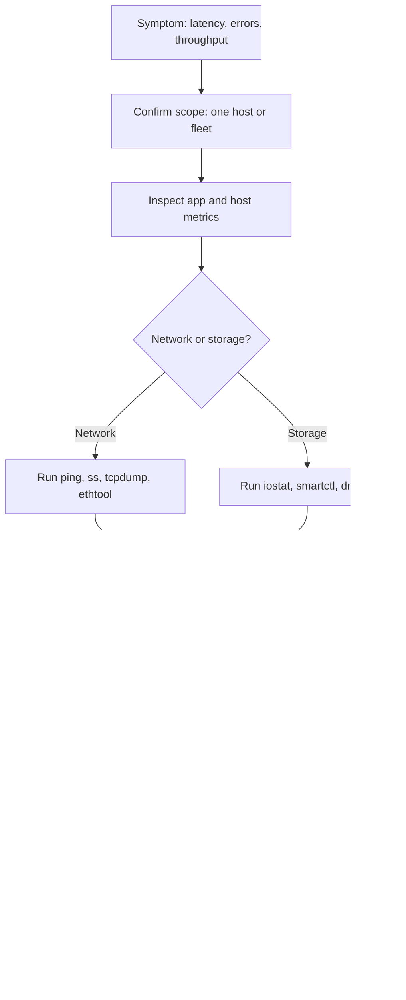

# 03. Network and Storage Troubleshooting

> Deep-dive troubleshooting of complex network and storage issues using classic Unix tooling such as `tcpdump`, `iperf`, `iostat`, and custom monitors, to maintain SLAs and SLOs.

## What it is

The skill of taking a vague symptom ("storage is slow", "API errors are up", "replication lag") and drilling down to a specific cause using layered diagnostic tools.

## Why it matters

- Most production incidents involve either the network or the storage path.
- Cloud abstractions hide details, but the underlying problems are still Linux problems.
- A good operator can isolate fault domains within minutes, not hours.

## The investigation mindset

1. Start from the **user-visible symptom** (latency, error rate, throughput).
2. Walk down the stack: app → host → kernel → device → network → peer.
3. **Compare** healthy vs unhealthy hosts.
4. Capture evidence before mitigation, so the postmortem has data.
5. Form one hypothesis at a time and test it.

## Network troubleshooting

### Tools
- `ping`, `traceroute`, `mtr` for reachability and path.
- `ss -tnp`, `netstat -s` for sockets and protocol counters.
- `tcpdump -i <iface> -nn -s 0 -w capture.pcap` for packet capture.
- `iperf3` for bandwidth tests between hosts.
- `ethtool -S <iface>` for NIC counters (drops, errors, pause frames).
- `nstat`, `ip -s link`, `tc -s qdisc` for queues and shaping.

### Common patterns
- **Packet loss** → check NIC error counters, switch logs, MTU mismatches.
- **High latency, low loss** → buffer bloat, congestion, slow peer.
- **Retransmits high** → look at TCP `retrans`, network policy drops, asymmetric routes.
- **Async DNS failures** → check resolver, `nscd`/`systemd-resolved`, conntrack table size.

## Storage troubleshooting

### Tools
- `iostat -xz 1` for device-level IOPS, throughput, await, queue depth.
- `iotop` to see which process is doing I/O.
- `blktrace` and `btt` for deep block I/O analysis.
- `dmesg`, `/var/log/messages` for kernel and driver errors.
- `smartctl` for disk SMART data.
- `multipath -ll` for SAN multipath state.
- `nfsstat`, `nfsiostat` for NFS.
- `ceph -s`, `ceph osd df` for Ceph clusters.

### Common patterns
- **High await with low %util** → queue depth issue or contention.
- **Slow disk, growing reallocated sectors** → failing drive, replace.
- **Filesystem ENOSPC despite free blocks** → inode exhaustion (`df -i`).
- **NFS stalls** → server health, network path, mount options.

## Workflow

## Practical steps

- Keep a **prebuilt diagnostics bundle** script that runs `iostat`, `vmstat`, `ss`, `netstat`, `dmesg` and captures output to a tarball during incidents.
- Capture **pcap** early on the suspect host before mitigation kills the symptom.
- Use **`bpftrace`** one-liners for ad hoc kernel-level visibility (e.g., latency histograms).
- Build **custom monitors** for signals that off-the-shelf agents miss (e.g., per-OSD latency, replication lag).
- Validate every fix by comparing before/after metrics.

## What good looks like

- A defined incident playbook for "slow storage" and "network degradation".
- Engineers reach for the right tool within minutes.
- Captures are preserved for postmortems.
- Fixes are encoded into runbooks and config management.

## Anti-patterns

- Rebooting hosts before capturing data.
- Looking only at app logs and not host-level counters.
- Using only graphical dashboards; missing the deeper kernel-level signals.
