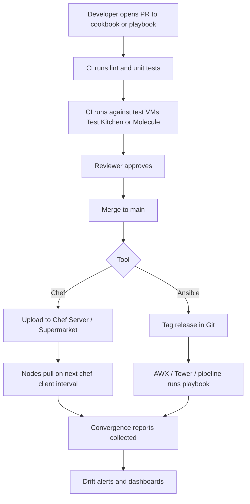

# 04. Configuration Management with Chef and Ansible

> Automating configuration of Linux fleets using **Chef** (pull-based) and **Ansible** (push-based / agentless), with deploy-via-IaaS practices.

## What it is

Codifying the **desired state** of every host (packages, users, files, services, kernel params) so that the same code produces the same host every time. Both Chef and Ansible solve this problem in slightly different ways.

## Why it matters

- Eliminates manual SSH and tribal knowledge.
- Provides reviewable, version-controlled change history.
- Enables fast onboarding of new hosts and rapid recovery.
- Required for any fleet beyond a handful of hosts.

## Chef vs Ansible at a glance

| Aspect | Chef | Ansible |
|--------|------|---------|
| Language | Ruby DSL (recipes, cookbooks) | YAML (playbooks, roles) |
| Mode | Pull (chef-client on node) | Push (control node over SSH) |
| Agent | Chef client on each node | Agentless |
| State | Convergent via runs | Convergent via tasks |
| Strength | Long-lived nodes, complex internal logic | Quick rollout, ad hoc tasks, simple syntax |
| Inventory | Chef Server | Dynamic or static inventory files |

Both tools are **idempotent** when used correctly.

## Chef concepts

- **Resource:** a unit of desired state (e.g., `package`, `service`, `file`).
- **Recipe:** an ordered list of resources.
- **Cookbook:** a package of recipes, attributes, and templates.
- **Role / policyfile:** what set of recipes a node should run.
- **Node attributes:** per-node configuration, often merged with role defaults.
- **Run list:** the recipes a node executes per `chef-client` run.

## Ansible concepts

- **Module:** unit of work (e.g., `apt`, `service`, `file`).
- **Task:** a call to a module.
- **Playbook:** ordered tasks against hosts.
- **Role:** reusable bundle of tasks, vars, templates, handlers.
- **Inventory:** the list of target hosts and groups.
- **Handlers:** triggered actions (e.g., restart service on file change).

## Workflow

## Practical steps

- Treat configuration repos like application code: PRs, CI, tests, semantic versioning.
- Use **Test Kitchen** (Chef) or **Molecule** (Ansible) to test changes in containers/VMs before merge.
- Enforce **idempotency**: running twice should not change state the second time.
- Separate **data** (per-environment variables) from **code** (logic) using attributes, data bags, group_vars, or host_vars.
- Store secrets in a vault: Chef Vault, Ansible Vault, or external (Vault, AWS Secrets Manager).
- Run **convergence reports**: which nodes succeeded, which drifted.
- Roll out changes in waves with canary nodes first.

## What good looks like

- Every change to a fleet is a reviewed PR.
- Drift is detected automatically.
- Engineers don't SSH to fix problems; they fix the cookbook or playbook.
- Failed runs are alerted on, not silently ignored.

## Anti-patterns

- Inline shell commands instead of proper resources/modules.
- Non-idempotent tasks (always reporting "changed").
- Secrets in plaintext in Git.
- Running playbooks straight from a laptop without review.
