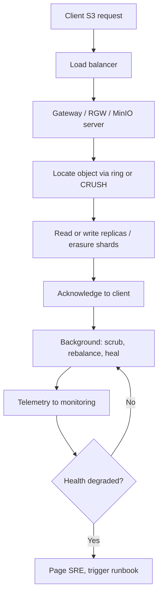

# 05. Clustered Object Storage Operations

> Operating large clustered object storage systems (Ceph, MinIO, Swift, vendor systems) at scale on Linux hardware, public cloud, or both.

## What it is

An object store exposes a flat namespace of objects (with metadata) accessed over an HTTP API (typically S3-compatible). Clustered object stores spread data and metadata across many nodes for **scale**, **durability**, and **availability**.

## Why it matters

- Object storage backs backups, archives, AI/ML datasets, media, logs, and analytics lakes.
- SLAs are usually built around durability (e.g., 11 nines) and availability.
- Failures are routine at scale; the system must self-heal.

## Common architectures

- **Ceph RADOS** with RGW for S3-compatible object access. Uses CRUSH to map objects to OSDs.
- **MinIO** with erasure coding, S3-compatible, simple to operate.
- **OpenStack Swift** ring-based architecture.
- **Vendor object storage** (NetApp StorageGRID, IBM COS, Dell ECS, etc.) which apply similar concepts.
- **Cloud-managed** (S3, Azure Blob, GCS) where AWS/Azure/GCP operate the storage and customers focus on usage patterns.

## Key concepts

- **Replication vs erasure coding:** replication is faster and simpler; erasure coding (e.g., 4+2, 8+3) gives better storage efficiency for cold data.
- **Buckets and namespaces:** logical grouping with quotas, lifecycle, and access policies.
- **Consistency:** modern object stores generally offer strong read-after-write for new objects.
- **Lifecycle policies:** automatic transition between storage tiers (hot → warm → cold → delete).
- **Bucket policies / IAM:** who can read or write what.

## Operations cycle

- **Provisioning:** add nodes/disks, rebalance.
- **Health monitoring:** OSD up/in counts, PG states, latency, replication lag.
- **Capacity management:** track used vs free, anticipate growth.
- **Repair and recovery:** failed disks, failed nodes, PG repair.
- **Upgrades:** rolling upgrades, version compatibility, downtime windows.
- **Performance tuning:** see [02-linux-performance-tuning.md](02-linux-performance-tuning.md).

## Workflow

## Practical steps

- Spread nodes across **failure domains** (racks, AZs, regions). Configure the placement algorithm accordingly.
- Define **SLOs** for availability and read/write latency at p50/p95/p99.
- Always have a tested **disk replacement runbook**.
- Validate **end-to-end checksums** to catch silent data corruption.
- Test **disaster recovery**: bucket-level restore, region failover, cross-cluster replication.
- Use **lifecycle policies** to control cost.
- Monitor **per-bucket** and **per-tenant** patterns; noisy tenants need rate limits.

## What good looks like

- Cluster heals from disk and node failures without paging humans.
- Capacity and performance dashboards are accurate.
- Upgrades are routine and rolling.
- Customers and apps see consistent S3 semantics.

## Anti-patterns

- Single failure domain.
- No scrub schedule; silent corruption goes undetected.
- Manual disk replacement procedures without runbooks.
- Letting clusters run beyond 80-85% full; performance degrades and recovery becomes risky.
