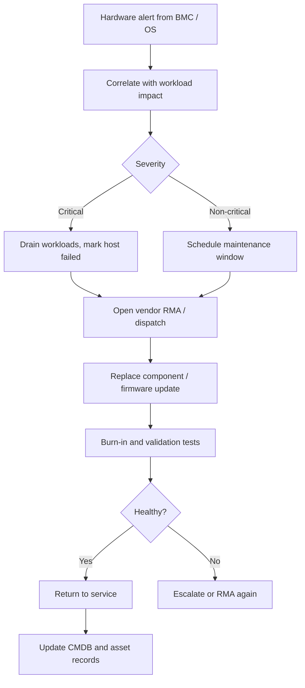

# 06. Hardware Troubleshooting and Lifecycle

> Operating physical servers at scale: BMC/IPMI access, firmware, disk failures, memory errors, NIC and power issues, and clean lifecycle from rack to retirement.

## What it is

The set of practices for keeping bare metal servers healthy across a fleet, identifying failing components early, replacing them safely, and decommissioning hardware at end of life. Even cloud-heavy organizations care about this if they run their own colocation or hybrid infrastructure.

## Why it matters

- Hardware **will** fail. At scale, failures are routine.
- Catching failures early prevents data loss and customer impact.
- Lifecycle management controls capital cost, warranty coverage, and security risk.

## Core components and signals

- **Disks (HDD / SSD / NVMe)**
  - SMART attributes: reallocated sectors, pending sectors, read error rate.
  - SSD wear leveling and remaining life.
  - `smartctl -a /dev/sdX`, vendor tools.
- **Memory**
  - ECC error counts in `dmesg` and `mcelog` / `rasdaemon`.
  - Patrol scrubbing and DIMM replacement.
- **CPU**
  - Machine Check Exceptions (MCE).
  - Thermal throttling.
- **NIC and cables**
  - `ethtool -S` errors, CRC errors, link flaps.
  - SFP / cable replacement.
- **Power and cooling**
  - PSU redundancy alarms.
  - Inlet temperature, fan failures.

## Out-of-band management

- **BMC / iDRAC / iLO / IPMI / Redfish** provide remote console, power control, sensor data, and firmware updates.
- Build automation around the **Redfish API** for fleet-wide hardware operations.
- Keep BMC firmware patched and on an isolated management network.

## Workflow

## Lifecycle phases

1. **Procurement and burn-in:** validate every new server before production.
2. **Provisioning:** PXE/cloud-init, configuration management, role assignment.
3. **Operations:** monitoring, patching, performance tuning.
4. **Maintenance:** disk swap, memory replacement, firmware updates.
5. **Decommission:** secure data wipe, asset disposal, warranty handover.

## Practical steps

- Track **every host** in a CMDB with serial number, rack, role, age, warranty end date.
- Run **periodic SMART scans** and aggregate disk failure predictions.
- Use vendor **out-of-band APIs (Redfish)** for fleet-wide firmware and inventory.
- Standardize on **server SKUs** to simplify spares and tooling.
- Automate **drain procedures** so workloads move off failing hosts safely.
- Validate replacements with a **burn-in test** (memtest, fio, iperf) before returning to service.
- Securely wipe and inventory disks at decommission to meet data handling requirements.

## What good looks like

- Disk failures are detected before they cause customer impact.
- Replacements are routine, with vendor SLAs tracked.
- Hardware inventory is always current.
- Decommissioned hardware is documented and securely disposed of.

## Anti-patterns

- Reacting only after a disk has fully failed and triggered data loss.
- BMC credentials shared and unrotated.
- No standardized burn-in for new or repaired hardware.
- Unknown or stale CMDB; spending time hunting for assets during incidents.
