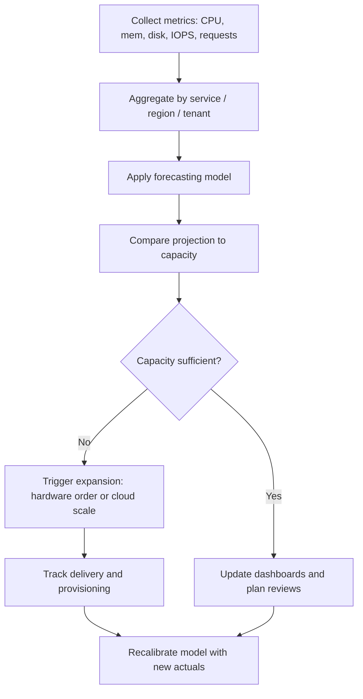

# 07. Capacity Planning and Growth Forecasting

> Tracking the operating environment, forecasting both organic and surge-based growth, and ensuring there is always enough headroom to meet SLOs.

## What it is

Capacity planning is the process of measuring current usage, modeling future demand, and provisioning resources (compute, storage, network) ahead of need. Forecasting splits into:

- **Organic growth:** steady, predictable increase based on customer base or traffic trends.
- **Surge / event-based growth:** large spikes from launches, campaigns, data ingestion events, or migrations.

## Why it matters

- Running out of capacity is a self-inflicted outage.
- Over-provisioning wastes budget and slows the business.
- For storage especially, ordering hardware and racking it takes weeks; you must forecast far enough ahead.

## Inputs to capacity models

- Historical usage metrics (CPU, memory, disk, IOPS, throughput, request rate).
- SLO targets and required headroom (e.g., never exceed 70% steady-state).
- Business roadmap: new customers, regions, products.
- Hardware lead times.
- Per-resource limits: switch ports, rack power, cooling, cloud quotas.

## Forecasting approaches

- **Linear extrapolation:** fit a line to historical growth, project forward.
- **Seasonal models:** add weekly/monthly/annual seasonality (Prophet, Holt-Winters).
- **Per-tenant modeling:** track largest customers separately to anticipate surges.
- **Scenario modeling:** best, expected, worst case; size for worst plus buffer.

## Headroom strategy

- Keep a target **utilization ceiling** (e.g., 70% on storage and CPU at steady state).
- Define **lead time buffer** equal to procurement plus provisioning time.
- Maintain a **surge buffer** for unexpected events; this is separate from organic growth.

## Workflow

## Practical steps

- Build a **capacity dashboard** per service: current usage, ceiling, projected exhaustion date.
- Review capacity **monthly** with engineering and quarterly with leadership.
- Tie capacity events into **change management**: every large rollout adds a capacity check.
- Detect **anomalies** in growth rate; investigate sudden jumps quickly.
- Validate your model against **actuals** every cycle; throw out models that drift.

## Tooling examples

- Prometheus + Grafana for telemetry and dashboards.
- CloudWatch Metric Insights or Datadog for cloud-side data.
- Python + pandas + Prophet/statsmodels for custom forecasting.
- Vendor capacity tools for storage clusters (Ceph `df`, MinIO admin info, etc.).
- Internal spreadsheets backed by exported data for executive reviews.

## What good looks like

- No surprise capacity outages.
- Procurement and cloud quotas are requested early.
- Each service has a known exhaustion runway (e.g., "120 days of headroom").
- Forecasts are reviewed and corrected over time.

## Anti-patterns

- Reacting to "disk full" alerts instead of forecasting them.
- Forecasting only at the aggregate level and missing per-tenant surges.
- No alignment between capacity team and product launch plans.
- Treating capacity as a one-time spreadsheet exercise rather than continuous.
