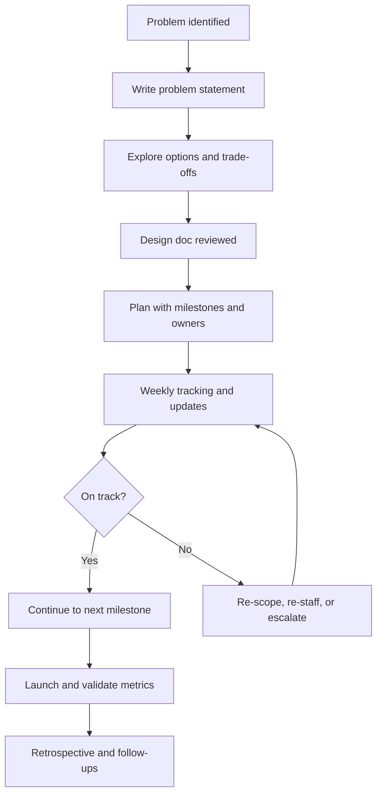

# 08. Technical Leadership and Project Management for SRE

> Leading technical teams, driving cross-team projects, and representing engineering both vertically (to leadership) and horizontally (to peer teams).

## What it is

The non-coding side of senior SRE work: setting direction, managing project timelines, escalating issues, coaching others, and raising the technical bar of the team. Even individual contributors are expected to demonstrate this once they reach senior or staff levels.

## Why it matters

- Most production reliability problems are people, process, and coordination problems wearing a tech disguise.
- Senior engineers multiply their impact by enabling others.
- Projects without clear leadership slip, miss dependencies, or build the wrong thing.

## Core responsibilities

- **Setting technical direction** for a team or project: write design docs, drive consensus, make trade-off decisions.
- **Project management:** scope, plan, schedule, track, communicate. Identify dependencies and risks early.
- **Stakeholder communication:** translate technical work into business outcomes for leadership; translate business priorities into engineering plans for the team.
- **Escalation:** raise blockers and risks early, with clear options.
- **Mentoring and uplift:** coach engineers, run brown-bag sessions, share best practices.
- **Representation:** speak for the team in cross-team forums, incident reviews, architecture councils.

## Project lifecycle

1. **Define the problem.** Write a one-page problem statement with goals, non-goals, and success metrics.
2. **Explore options.** Capture alternatives and trade-offs.
3. **Design.** Produce a design doc reviewed by peers.
4. **Plan.** Break into milestones with owners and dates.
5. **Execute.** Track progress weekly. Update stakeholders.
6. **Launch.** Validate against success metrics.
7. **Retrospect.** Capture what worked, what did not, and follow-ups.

## Workflow

## Communication patterns

- **Weekly status update:** progress, risks, next steps, asks. Short and consistent.
- **Decision log:** what was decided, when, by whom, why. Reduces re-litigation later.
- **Pre-meeting docs:** put context in writing so the meeting is for decisions, not status.
- **Escalations:** state the impact, the options, your recommendation, the decision needed.

## Leading without authority

- Build credibility by **doing technical work well** and **helping others succeed**.
- Use **data** to drive decisions rather than opinions.
- Be the person who **writes the runbook** and **leads the incident review**.
- Share knowledge proactively (lunch and learns, design reviews, code reviews with context).

## What good looks like

- Projects ship on time or are re-scoped with clear communication, not silent slippage.
- Stakeholders know status without asking.
- Risks are surfaced early with options, not as surprises.
- Other engineers feel coached and trust the leader.

## Anti-patterns

- Hoarding context; only the leader knows the plan.
- Surprise slippage announced near the deadline.
- Confusing presence in meetings with leadership; what matters is decisions and outcomes.
- Escalations that present only problems with no proposed options.
