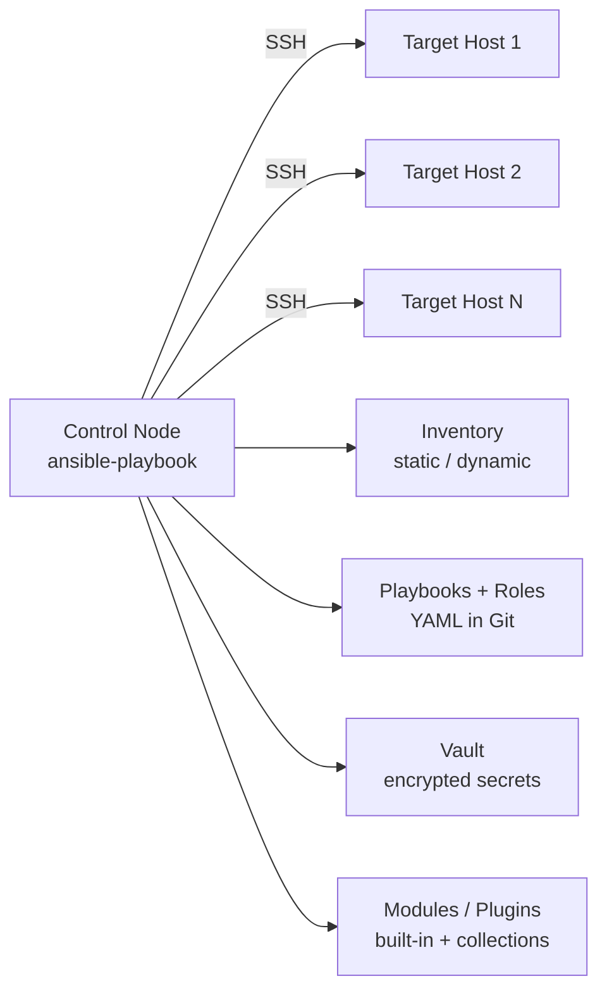

# 01. Ansible Fundamentals

> What Ansible is, how it works, and why it became the default for Linux automation.

## What is Ansible

Ansible is an **open-source IT automation tool** for configuration management, application deployment, orchestration, and provisioning. It uses **YAML** to describe automation jobs and runs them over **SSH** (or WinRM for Windows) without installing an agent on managed hosts.

## Key characteristics

- **Agentless**: no daemon on target hosts; just SSH + Python 3 on the target.
- **Push-based**: the control node connects to targets and runs tasks. No periodic polling.
- **Declarative + procedural**: tasks describe desired state, but they run in order.
- **Idempotent**: well-written tasks produce the same end state on every run.
- **Human-readable**: YAML, not a custom DSL.
- **Extensible**: 5000+ modules, custom modules, plugins, dynamic inventory.

## Architecture



- **Control node**: the machine where you run `ansible` and `ansible-playbook`. Linux/macOS/WSL.
- **Managed nodes**: the targets. Need only SSH access and Python.
- **Inventory**: list of managed nodes, grouped by role/environment.
- **Modules**: units of work (e.g., `apt`, `service`, `file`).
- **Playbooks**: YAML files containing ordered tasks to run on inventory groups.
- **Plugins**: extend Ansible (connection, lookup, filter, callback, inventory).
- **Collections**: bundles of related modules, roles, and plugins.

## How a play runs

1. You run `ansible-playbook -i inventory site.yml`.
2. Ansible parses inventory, vars, and playbook.
3. For each play:
   - Resolves the host pattern against inventory.
   - Gathers **facts** (system info) from each host, unless disabled.
   - Runs tasks in order, in parallel across hosts (default 5 forks).
4. Each task:
   - Renders templates and variables.
   - Ships a small Python script (the module) to the target over SSH.
   - Executes it, returns JSON results.
5. Results determine `ok`, `changed`, `failed`, or `skipped` status.
6. At the end of the play, **handlers** run if any task notified them.

## Push vs pull comparison

| Aspect | Ansible (push) | Chef / Puppet (pull) |
|--------|----------------|----------------------|
| Agent | None | Yes (chef-client / puppet agent) |
| Trigger | Operator or CI runs playbook | Agent runs on schedule |
| Network | Control node → targets | Targets → server |
| Quick changes | Easy (run a playbook now) | Wait for next cycle |
| Long-term drift control | Needs scheduled runs (AWX, cron) | Built-in (continuous convergence) |
| Best for | Orchestration, ad-hoc tasks, ephemeral hosts | Long-lived hosts needing continuous enforcement |

Both can work. Many shops use Ansible for **orchestration and changes** and a pull tool (or AWX) for **continuous enforcement**.

## Idempotency in practice

A task is **idempotent** if running it twice produces the same end state and reports **no change** the second time.

Good (idempotent):

```yaml
- name: Ensure nginx is installed
  ansible.builtin.package:
    name: nginx
    state: present
```

Bad (not idempotent):

```yaml
- name: Install nginx
  ansible.builtin.shell: apt-get install -y nginx
```

The second task always reports `changed: true` and may break if the package is already present.

## When to use Ansible

Great fit:
- Configuring Linux servers (packages, services, users, files).
- Deploying applications.
- Orchestrating multi-step changes across hosts (rolling restarts, multi-tier deploys).
- Network device automation.
- Cloud resource provisioning when paired with cloud modules.

Less ideal:
- Continuous, low-latency state enforcement on millions of nodes (consider pull-based tools).
- Real-time event-driven automation (use event-driven tools or Ansible Rulebook).

## What good looks like

- Playbooks live in Git with PRs and CI.
- Tasks are idempotent.
- Common patterns live in **roles** or **collections**, not copy-pasted.
- Secrets are in **Ansible Vault** or an external secret store.
- Production runs through a controlled platform (AWX / Tower / pipeline), not a laptop.

## Anti-patterns

- `shell` and `command` modules everywhere instead of real modules.
- Hardcoded IPs and passwords in playbooks.
- One giant playbook with hundreds of unrelated tasks.
- Running production playbooks from random laptops.

## Next

Move to [02-installation-setup-inventory.md](02-installation-setup-inventory.md) to install Ansible and set up your first inventory.
