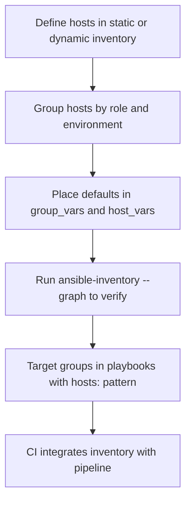

# 02. Installation, Setup, and Inventory

> Get Ansible installed, configure SSH for managed nodes, and learn the inventory model that everything else depends on.

## Installation

### Control node requirements

- Linux, macOS, or WSL.
- Python 3.10+ (current Ansible).
- SSH client.

### Recommended install method: `pipx`

```bash
python3 -m pip install --user pipx
pipx ensurepath
pipx install --include-deps ansible
ansible --version
```

### Alternative: distro package

```bash
# Debian/Ubuntu
sudo apt update && sudo apt install -y ansible

# RHEL/Rocky/Alma
sudo dnf install -y ansible
```

### Ansible vs ansible-core

- `ansible-core`: just the engine and built-in modules.
- `ansible`: `ansible-core` + a curated set of community collections.
- Most learners want `ansible`. Engineers building images often pin `ansible-core` and install just the collections they need.

## Managed node requirements

- SSH server running and reachable.
- Python 3 installed (most modules) or compatible Python 2.7 on very old systems.
- A user with sudo privileges if you need to change system state.

## SSH setup

Use SSH **keys**, not passwords:

```bash
ssh-keygen -t ed25519 -C "ansible-control"
ssh-copy-id deploy@host1.example.com
ssh deploy@host1.example.com   # confirm key-based login works
```

For sudo without a password, configure on the target:

```
# /etc/sudoers.d/deploy
deploy ALL=(ALL) NOPASSWD: ALL
```

In production, use SSH certificates from a CA (HashiCorp Vault, Teleport, OpenSSH CA) instead of long-lived static keys.

## First test

Static inventory file `hosts.ini`:

```ini
[web]
web1.example.com
web2.example.com

[db]
db1.example.com

[all:vars]
ansible_user=deploy
ansible_python_interpreter=/usr/bin/python3
```

Run:

```bash
ansible -i hosts.ini all -m ping
```

Expected output: each host returns `pong`.

## Inventory deep dive

Ansible inventory is the **source of truth** for which hosts exist and how they are grouped.

### Static inventory

INI format (`hosts.ini`):

```ini
[web]
web[1:3].example.com   # web1, web2, web3

[db]
db1.example.com

[prod:children]
web
db

[prod:vars]
env=prod
```

YAML format (`hosts.yml`):

```yaml
all:
  children:
    web:
      hosts:
        web1.example.com:
        web2.example.com:
    db:
      hosts:
        db1.example.com:
    prod:
      children:
        web:
        db:
      vars:
        env: prod
```

### Group variables and host variables

Directory layout:

```
inventory/
├── hosts.yml
├── group_vars/
│   ├── all.yml          # vars for every host
│   ├── web.yml          # vars for [web]
│   └── prod.yml         # vars for [prod]
└── host_vars/
    └── web1.example.com.yml
```

Variable precedence (simplified, lower wins less):
1. `all` defaults
2. Group vars (more specific group wins)
3. Host vars
4. Playbook vars
5. Command-line `-e` extra vars (highest)

### Dynamic inventory

Inventory plugins fetch hosts from a real source so you don't have to maintain a static list.

Examples:
- `amazon.aws.aws_ec2` — pulls EC2 instances.
- `azure.azcollection.azure_rm` — pulls Azure VMs.
- `community.vmware.vmware_vm_inventory` — pulls VMs from vCenter.
- `community.general.proxmox` — pulls Proxmox VMs.

Example `inventory_aws_ec2.yml`:

```yaml
plugin: amazon.aws.aws_ec2
regions:
  - us-east-1
keyed_groups:
  - prefix: tag
    key: tags
filters:
  instance-state-name: running
```

Run:

```bash
ansible-inventory -i inventory_aws_ec2.yml --graph
ansible -i inventory_aws_ec2.yml tag_role_web -m ping
```

### Workflow



## `ansible.cfg`

Project-level config lives in `./ansible.cfg`. A solid starter:

```ini
[defaults]
inventory = ./inventory
roles_path = ./roles
collections_path = ./collections
host_key_checking = False     # for ephemeral lab hosts only
forks = 20
stdout_callback = yaml
retry_files_enabled = False
interpreter_python = auto_silent

[ssh_connection]
pipelining = True
control_path = /tmp/ansible-%%h-%%p-%%r
```

For production, leave `host_key_checking` enabled and pre-populate `known_hosts`.

## What good looks like

- Inventory is in Git or generated dynamically from a trusted source.
- Group vars and host vars separate **data from logic**.
- SSH access uses keys or certs, not passwords.
- A single `ansible -m ping` command verifies your fleet end-to-end.

## Anti-patterns

- One flat host file with hundreds of entries and no groups.
- Hardcoded credentials in inventory.
- Disabling host key checking in production.
- Inventory in three places (Excel, wiki, code) with drift.

## Next

Move to [03-adhoc-commands-modules.md](03-adhoc-commands-modules.md) to start running real work.
