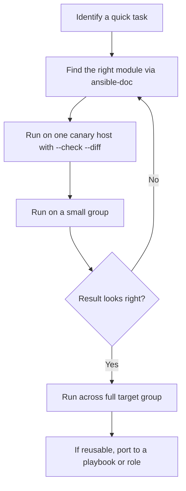

# 03. Ad-hoc Commands and Modules

> Run quick one-off tasks across the fleet using `ansible` and the module library.

## What ad-hoc commands are for

Ad-hoc commands are one-liners that run a **single module** against an inventory pattern. Use them for:

- Quick fact checks (uptime, disk usage, OS version).
- Emergency actions (restart a service across a fleet).
- Validating SSH and Python on new hosts.
- Learning what each module does before you put it in a playbook.

They are not a substitute for playbooks. For anything you'll do more than once, write a playbook.

## Syntax

```bash
ansible <pattern> -i <inventory> -m <module> -a "<args>" [options]
```

- `<pattern>`: which hosts to target. `all`, group name, host name, intersections.
- `-m`: module name.
- `-a`: module arguments.
- `-b`: become root (sudo).
- `-K`: ask for sudo password.

## Targeting patterns

```bash
ansible all -m ping                    # every host
ansible web -m ping                    # group "web"
ansible 'web:db' -m ping               # union
ansible 'web:&prod' -m ping            # intersection
ansible 'all:!db' -m ping              # exclusion
ansible web[0:2] -m ping               # first 3 in group
ansible '~^web\d+' -m ping             # regex
```

## Common ad-hoc examples

```bash
# Check connectivity
ansible all -m ping

# Gather a fact
ansible all -m setup -a "filter=ansible_distribution*"

# Disk usage
ansible all -m shell -a "df -h /"

# Free memory
ansible all -m command -a "free -h"

# Install a package (needs sudo)
ansible web -b -m apt -a "name=nginx state=present update_cache=yes"

# Restart a service
ansible web -b -m service -a "name=nginx state=restarted"

# Copy a file
ansible web -b -m copy -a "src=./nginx.conf dest=/etc/nginx/nginx.conf mode=0644"

# Create a user
ansible all -b -m user -a "name=deploy shell=/bin/bash state=present"

# Reboot (use carefully)
ansible web -b -m reboot
```

`command` vs `shell`:
- `command` runs without a shell. No pipes, redirects, env expansion.
- `shell` runs through `/bin/sh`. Use only when you need shell features.
- Prefer real modules over both whenever possible.

## Modules: the unit of work

A module is a small Python program that Ansible ships to the target, runs, and parses the JSON result of. Each module:

- Has a **name** like `ansible.builtin.package`.
- Lives in a **collection** (built-in or community).
- Returns `changed`, `failed`, and module-specific data.
- Should be **idempotent**.

### Where to find modules

- Browse: <https://docs.ansible.com/ansible/latest/collections/index_module.html>
- From CLI: `ansible-doc -l` (list), `ansible-doc <module>` (full docs).

### Fully qualified collection names (FQCN)

Modern Ansible uses FQCN: `ansible.builtin.copy` instead of just `copy`. Always use FQCN in playbooks for clarity and forward compatibility.

## Essential modules every Linux engineer should know

| Category | Module | What it does |
|---|---|---|
| Connectivity | `ansible.builtin.ping` | Verify SSH + Python work |
| Facts | `ansible.builtin.setup` | Gather system facts |
| Packages | `ansible.builtin.package` | Install/remove packages (auto-detects apt/yum/dnf) |
| Services | `ansible.builtin.service`, `ansible.builtin.systemd_service` | Start/stop/restart/enable services |
| Files | `ansible.builtin.copy`, `ansible.builtin.template`, `ansible.builtin.file` | Manage files, perms, symlinks |
| Lines in files | `ansible.builtin.lineinfile`, `ansible.builtin.blockinfile` | Edit configs surgically |
| Users/Groups | `ansible.builtin.user`, `ansible.builtin.group` | Manage local users/groups |
| Cron | `ansible.builtin.cron` | Manage cron entries |
| Git | `ansible.builtin.git` | Clone/checkout repos |
| URLs | `ansible.builtin.get_url`, `ansible.builtin.uri` | Download files, call HTTP APIs |
| Archive | `ansible.builtin.unarchive` | Extract tarballs/zips |
| Mounts | `ansible.posix.mount` | Manage `/etc/fstab` and mounts |
| Firewall | `ansible.posix.firewalld`, `community.general.ufw` | Manage host firewall |
| Shell escape | `ansible.builtin.command`, `ansible.builtin.shell` | Last-resort raw commands |

## Module documentation lookup

```bash
ansible-doc ansible.builtin.user            # full docs
ansible-doc -s ansible.builtin.user         # short playbook snippet
ansible-doc -l | grep -i nginx              # search
```

## Output and tuning

- Default callback prints one line per host. Use `-v`, `-vv`, `-vvv` for more detail.
- `--check` runs in dry-run mode (no changes applied) for modules that support it.
- `--diff` shows what would change for file-modifying modules.
- `-f 20` runs 20 parallel forks (useful on large fleets).

```bash
ansible web -b -m copy -a "src=nginx.conf dest=/etc/nginx/nginx.conf" --check --diff
```

## Workflow



## What good looks like

- Use real modules over `shell`/`command` whenever possible.
- Use FQCN module names.
- Test with `--check --diff` before applying.
- Anything you do more than once becomes a playbook.

## Anti-patterns

- `ansible all -m shell -a "..."` for things a real module would handle.
- Skipping `--check` and applying changes blindly.
- Running unbounded `ansible all` commands during peak hours.

## Next

Move to [04-playbooks-deep-dive.md](04-playbooks-deep-dive.md) to learn the real unit of Ansible work.
